### 3.3 Stereometry

#### 3.3.1 Lines and Planes in Space

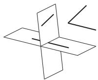  
Figure 3.47

1. Two Lines Two lines in the same plane have either one or no common point. In the second case they are parallel. If there is no plane such that it contains both lines, they are skew lines. The angle between two skew lines is defined by the angle between two lines parallel to them and passing through a common point (Fig. 3.47). The distance between two skew lines is defined by the segment which is perpendicular to both of them. (There is always a unique transversal line which is perpendicular to both skew lines and intersects them, too.)

2. Two Planes Two planes intersect each other in a line or they have no common point. In this second case they are parallel. If two planes are perpendicular to the same line or if both are parallel to every intersecting pair of lines in the other, the planes are parallel.

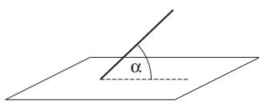  
Figure 3.48

3. Line and Plane A line can be incident to a plane, it can have one or no common point with the plane. In this last case it is parallel to the plane. The angle between a line and a plane is measured by the angle between the line and its orthogonal projection on the plane (Fig. 3.48). If this projection is only a point, i.e., if the line is perpendicular to two diferent intersecting lines in the plane, then the line is perpendicular or orthogonal to the plane.

#### 3.3.2 Edge, Corner, Solid Angle

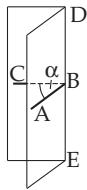  
Figure 3.49

1. Edge or dihedral angle is a figure formed by two infinite half-planes starting at the same line (Fig.3.49). In everyday terminology the word edge is used for the intersection line of the two half-planes. As a measure of edges, one uses the edge-angle ABC, the angle between two half-lines lying in the half-planes and being perpendicular to the intersection line DE at a point B.

2. Corner or polyhedral angle 0ABCDE (Fig. 3.50) is a figure formed by several planes, the lateral faces, which go through a common point, the vertex 0, and intersect each other at the lines 0A, 0B, . . .

Two lines which bound the same lateral face form a plane angle, while neighboring faces form a dihedral angle.

Polyhedra are equal to each other, i.e., they are congruent, if they are superposable. For this the corresponding elements, i.e., the edges and plane angles at the vertex must be coincident. If the corresponding elements at the vertex are equal, but they have an opposite order of sequence, the corners are not superposable, and they are called symmetric corners, because they can be brought into a symmetric position as shown in Fig. 3.51.

A convex polyhedral angle lies completely on one side of each of its faces.

The sum of the plane angles $A 0 B + B 0 C + \ldots + E 0 A \ ( \mathrm { F i g . ~ 3 . 5 0 } )$ is less than $3 6 0 ^ { \circ }$ for every convex polyhedron.

3. Trihedral Angles are congruent if they coincide in the following elements:

in two faces and the corresponding dihedral angle,

in one face and both dihedral angles belonging to it,

in three corresponding faces in the same order of sequence,

in three corresponding dihedral angles in the same order of sequence.

4. Solid Angle A pencil of rays starting from the same point (and intersecting a closed curve) forms a solid angle in space (Fig. 3.52). It is denoted by Ω and calculated by the equality

$$
\Omega = { \frac { S } { r ^ { 2 } } } .\tag{3.115a}
$$

Here S means the piece of the spherical surface cut out by the solid angle from a sphere whose radius is r, and whose center is at the vertex of the solid angle. The unit of solid angle is the steradian (sr) (see also p. 1055):

$$
\mathrm { 1 s r = \frac { 1 m ^ { 2 } } { 1 m ^ { 2 } } , }\tag{3.115b}
$$

i.e., a solid angle of 1 sr cuts out a surface area of $1 \mathrm { m ^ { 2 } }$ of the unit sphere $( r = 1 \mathrm { m } )$

A: The full solid angle is $\Omega = 4 \pi r ^ { 2 } / r ^ { 2 } = 4 \pi$

B: A cone with a vertex angle (also called an apex angle) $\alpha = 1 2 0 ^ { \circ }$ defines(determines) a solid angle $\Omega = 2 \pi r ^ { 2 } ( 1 - \cos ( \alpha / 2 ) ) / r ^ { 2 } = \bar { \pi }$ , where the formula for a spherical cap (3.163)has been used.

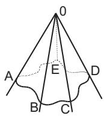  
Figure 3.50

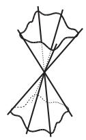  
Figure 3.51

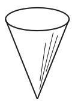  
Figure 3.52

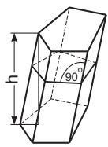  
Figure 3.53  
3.3.3 Polyeder or Polyhedron

In this paragraph the following notations are used : V volume, S total surface, M lateral area, h altitude, $A _ { G }$ base area.

1. Polyhedron is a solid bounded by plane polygons.

2. Prism (Fig. 3.53) is a polyhedron with two congruent bases, and having parallelograms as additional faces. A right prism has edges perpendicular to the base, a regular prism is a right prism with a regular polygon as the base. For the prism

$$
V = A _ { G } h ,\tag{3.116}
$$

$$
M = p l ,\tag{3.117}
$$

$$
{ \cal S } = M + 2 A _ { G } .\tag{3.118}
$$

holds. Here $p$ is the perimeter of the section perpendicular to the edges, and l is the length of the edges. If the edges are still parallel to each other but the bases are not, the lateral faces are trapezoids. If the bases of a triangular prism are not parallel to each other, its volume can be calculated by the formula (Fig. 3.54):

$$
V = { \frac { ( a + b + c ) Q } { 3 } } ,\tag{3.119}
$$

where Q is a perpendicular cut, a, b, and c are the lengths of the parallel edges. If the bases of the prism are not parallel, then its volume is

$$
V = l Q ,\tag{3.120}
$$

where l is the length of the line segment $\overline { { B C } }$ connecting the centers of gravity of the bases, and Q is the cross-cut perpendicular to this line.

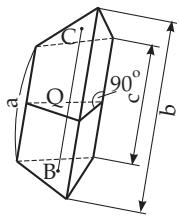  
Figure 3.54

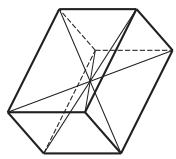  
Figure 3.55

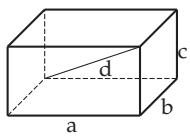  
Figure 3.56

3. Parallelepiped is a prism with parallelograms as bases (Fig. 3.55), i.e., it is bounded by six parallelograms. In a parallelepiped all the four body diagonals intersect each other at the same point, the midpoint, and halve each other.

4. Rectangular Parallelepiped or block is a right parallelepiped with rectangles as bases. In a block (Fig. 3.56) the body diagonals have the same length. If a, b, and c are the edge lengths of the block and d is the length of the diagonal, then

$$
d ^ { 2 } = a ^ { 2 } + b ^ { 2 } + c ^ { 2 } ,\tag{3.121}
$$

$$
V = a b c ,
$$

(3.122)

$$
S = 2 ( a b + b c + c a ) .\tag{3.123}
$$

5. Cube (or regular hexahedron) is a block with equal edge lengths: $a = b = c$

$$
d ^ { 2 } = 3 a ^ { 2 } ,
$$

(3.124)

$$
V = a ^ { 3 } ,
$$

(3.125)

$$
S = 6 a ^ { 2 } .\tag{3.126}
$$

6. Pyramid (Fig. 3.57) is a polyhedron whose base is a polygon and its lateral faces are triangles with a common point, the vertex. A pyramid is called right if the foot of the perpendicular from the vertex to the base $A _ { G }$ is at the midpoint of the base. It is called regular if it is right and the base is a regular polygon (Fig. 3.58), and n faced if the base is an n gon. Together with the base the pyramid has $( n + 1 )$ faces. For the volume

$$
V = { \frac { A _ { G } h } { 3 } }\tag{3.127}
$$

holds. For the lateral area of the regular pyramid

$$
M = { \frac { 1 } { 2 } } p h _ { s }\tag{3.128}
$$

holds with $p$ as the perimeter of the base and $h _ { s }$ as the altitude of a face.

7. Frustum of a Pyramid or truncated pyramid is a pyramid whose vertex is cut away by a plane parallel to the base (Fig. 3.57, Fig. 3.59). Denoting by S0 the altitude of the pyramid, i.e., the perpendicular from the vertex to the base, then

$$
{ \frac { \overline { { S A } } _ { 1 } } { A _ { 1 } A } } = { \frac { \overline { { S B } } _ { 1 } } { \overline { { B _ { 1 } B } } } } = { \frac { \overline { { S C } } _ { 1 } } { \overline { { C _ { 1 } C } } } } = \ldots = { \frac { \overline { { S 0 } } _ { 1 } } { \overline { { 0 _ { 1 } 0 } } } } ,\tag{3.129}
$$

$$
{ \frac { \mathrm { A r e a ~ } A B C D E F } { \mathrm { A r e a ~ } A _ { 1 } B _ { 1 } C _ { 1 } D _ { 1 } E _ { 1 } F _ { 1 } } } = \biggl ( { \frac { \overline { { S 0 } } } { \overline { { S 0 } } _ { 1 } } } \biggr ) ^ { 2 } .\tag{3.130}
$$

holds. If $A _ { D }$ and $A _ { G }$ are the upper and lower bases, resp., h is the altitude of the truncated pyramid, i.e., the distance between the bases, and $a _ { D }$ and $a _ { G }$ are corresponding sides of the bases, then

$$
V = \frac { 1 } { 3 } h \left[ A _ { G } + A _ { D } + \sqrt { A _ { G } A _ { D } } \right] = \frac { 1 } { 3 } h A _ { G } \left[ 1 + \frac { a _ { D } } { a _ { G } } + \left( \frac { a _ { D } } { a _ { G } } \right) ^ { 2 } \right] .\tag{3.131}
$$

The lateral surface of a regular truncated pyramid is

$$
M = \frac { p _ { D } + p _ { G } } { 2 } h _ { s } ,\tag{3.132}
$$

where $p _ { D }$ and $p _ { G }$ are the perimeters of the bases, and $h _ { s }$ is the altitude of the faces.

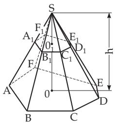  
Figure 3.57

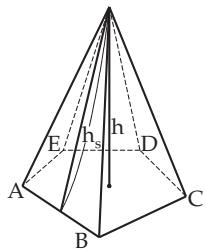  
Figure 3.58

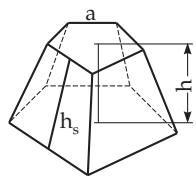  
Figure 3.59

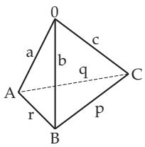  
Figure 3.60

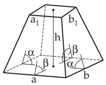  
Figure 3.61

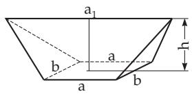  
Figure 3.62

8. Tetrahedron is a triangular pyramid (Fig. 3.60). With the notation   
0A = a, 0B = b, 0C = c, CA = q, BC = p and ${ \overline { { A B } } } = r$ the following holds:

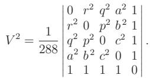

(3.133)

9. Obelisk is a polyhedron whose lateral faces are all trapezoids. In the special case in Fig. 3.61 the bases are rectangles, the opposite edges have the same inclination to the base but they do not have a common point. If a, b and $a _ { 1 } , b _ { 1 }$ are the sides of the bases of the obelisk and h is the altitude of it, then:

$$
V = { \frac { h } { 6 } } \left[ \left( 2 a + a _ { 1 } \right) b + \left( 2 a _ { 1 } + a \right) b _ { 1 } \right] = { \frac { h } { 6 } } \left[ a b + \left( a + a _ { 1 } \right) \left( b + b _ { 1 } \right) + a _ { 1 } b _ { 1 } \right] .\tag{3.134}
$$

10. Wedge is a polyhedron whose base is a rectangle, its lateral faces are two opposite isosceles triangles and two isosceles trapezoids (Fig. 3.62). For the volume holds

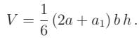

(3.135)

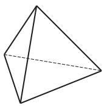  
a)

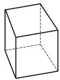  
b)

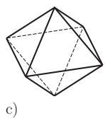

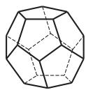  
d)  
Figure 3.63

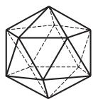  
e)

11. Regular Polyeder have congruent regular polyeders as faces and congruent regular corners. The five possible regular polyheders are represented in Fig. 3.63; Table 3.7 shows the corresponding data.

12. Euler’s Theorem on Polyeders If e is the number of vertices, f is the number of faces, and k is the number of edges of a convex polyhedron then

$$
e - k + f = 2 .
$$

Examples are given in Table 3.7.

(3.136)

Table 3.7 Regular polyeders with edge length a
<table><tr><td rowspan="2">Name</td><td rowspan="2">Number and form of faces</td><td colspan="2">Number of</td><td rowspan="2">Total area  $S / a ^ { 2 }$ </td><td rowspan="2">Volume  $V / a ^ { 3 }$ </td></tr><tr><td>Edges</td><td>Corners</td></tr><tr><td>Tetrahedron</td><td>4 triangles</td><td>6</td><td>4</td><td> ${ \sqrt { 3 } } = 1 . 7 3 2 1$ </td><td> ${ \frac { \sqrt { 2 } } { 1 2 } } = 0 . 1 1 7 9$ </td></tr><tr><td>Cube</td><td>6 squares</td><td>12</td><td>8</td><td>6 = 6.0</td><td>1 = 1.0</td></tr><tr><td>Octahedron</td><td>8 triangles</td><td>12</td><td>6</td><td> $2 \sqrt { 3 } = 3 . 4 6 4 1$ </td><td> ${ \frac { \sqrt { 2 } } { 3 } } = 0 . 4 7 1 4$ </td></tr><tr><td>Dodecahedron</td><td>12 pentagons</td><td>30</td><td>20</td><td> $3 { \sqrt { 5 ( 5 + 2 { \sqrt { 5 } } ) } } = 2 0 . 6 4 5 7$ </td><td> ${ \frac { 1 5 + 7 { \sqrt { 5 } } } { A } } = 7 . 6 6 3 1$ </td></tr><tr><td>Icosahedron</td><td>20 triangles</td><td>30</td><td>12</td><td>5√3 = 8.6603</td><td> $\frac { 5 ( 3 + { \sqrt { 5 } } ) } { 1 2 } = 2 . 1 8 1 7$ </td></tr></table>

#### 3.3.3 Polyeder orPolyhedron

#### 3.3.4 Solids Bounded by Curved Surfaces

In this paragraph the following notations are used: V volume, S total surface, M lateral surface, h altitude, $A _ { G }$ base.

1. Cylindrical Surface is a curved surface which can be got by parallel translation of a line, the generating line or generator along a curve, the so-called directing curve (Fig. 3.64).

2. Cylinder is a solid bounded by a cylindrical surface with a closed directing curve, and by two parallel bases cut out from two parallel planes by the cylindrical surface. For every arbitrary cylinder (Fig. 3.65) with the base perimeter $p$ , with the perimeter s of the cut perpendicular to the apothem, whose area is $Q .$ , and with the length l of the apothem the following is valid:

$$
V = A _ { G } h = Q l ,\tag{3.137}
$$

$$
M = p h = s l .\tag{3.138}
$$

3. Right Circular Cylinder has a circle as base, and its apothems are perpendicular to the plane of the circle (Fig. 3.66). With a base radius R

$$
V = \pi R ^ { 2 } h ,
$$

(3.139)

$$
M = 2 \pi R h , \qquad ( 3 . 1 4 0 )
$$

$$
S = 2 \pi R ( R + h ) .\tag{3.141}
$$

4. Obliquely Truncated Cylinder (Fig. 3.67)

$$
V = \pi R ^ { 2 } \frac { h _ { 1 } + h _ { 2 } } { 2 } ,
$$

$$
_ { ( 3 . 1 4 2 ) }
$$

$$
M = \pi R \left( h _ { 1 } + h _ { 2 } \right) ,\tag{3.143}
$$

$$
S = \pi R \left[ h _ { 1 } + h _ { 2 } + R + \sqrt { R ^ { 2 } + \left( \frac { h _ { 2 } - h _ { 1 } } { 2 } \right) ^ { 2 } } \right] .\tag{3.144}
$$

5. Ungula of the Cylinder With the notation of Fig. 3.68 and with $\alpha = \varphi / 2$ in radians

$$
V = { \frac { h } { 3 b } } \left[ a ( 3 R ^ { 2 } - a ^ { 2 } ) + 3 R ^ { 2 } ( b - R ) \alpha \right] = { \frac { h R ^ { 3 } } { b } } \left( \sin \alpha - { \frac { \sin ^ { 3 } \alpha } { 3 } } - \alpha \cos \alpha \right) ,\tag{3.145}
$$

$$
M = \frac { 2 R h } { b } \left[ ( b - R ) \alpha + a \right] ,\tag{3.146}
$$

where the formulas are valid even in the case $b > R , \varphi > \pi$

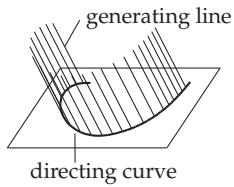  
Figure 3.64

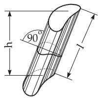  
Figure 3.65

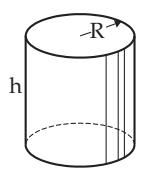  
Figure 3.66

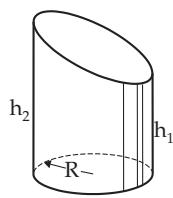  
Figure 3.67

6. Hollow Cylinder With the notation R for the outside radius and r for the inside one, $\delta = R - r$ for the diference of the radii, and $\varrho = \frac { R + r } { 2 }$ for the mean radius (Fig. 3.69)

$$
V = \pi h ( R ^ { 2 } - r ^ { 2 } ) = \pi h \delta ( 2 R - \delta ) = \pi h \delta ( 2 r + \delta ) = 2 \pi h \delta \varrho .\tag{3.147}
$$

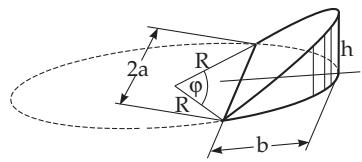  
Figure 3.68

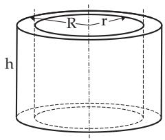  
Figure 3.69

7. Conical Surface arises by moving a line, the generating line, along a curve, the direction curve so that it always goes through a fixed point, the vertex (Fig. 3.70).

8. Cone (Fig. 3.71) is bounded by a conical surface with a closed direction curve and a base cut out from a plane by the surface. For an arbitrary cone

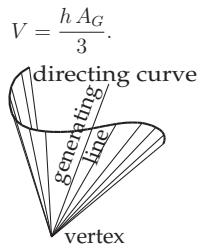  
Figure 3.70

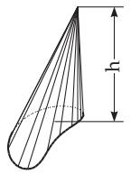

(3.148)

Figure 3.71  
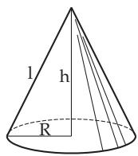  
Figure 3.72

9. Right Circular Cone has a circle as base and its vertex is right above the centre of the circle (Fig. 3.72). With l as the length of the apothem and R as the radius of the base

$$
V = { \frac { 1 } { 3 } } \pi R ^ { 2 } h ,
$$

(3.149)

$$
M = \pi R l = \pi R \sqrt { R ^ { 2 } + h ^ { 2 } } ,\tag{3.150}
$$

$$
S = \pi R ( R + l ) .\tag{3.151}
$$

10. Frustum of Right Cone or Truncated Cone (Fig. 3.73)

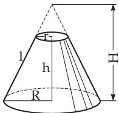  
Figure 3.73

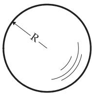  
Figure 3.74

$$
l = { \sqrt { h ^ { 2 } + \left( R - r \right) ^ { 2 } } } ,\tag{3.152}
$$

$$
M = \pi l ( R + r ) ,\tag{3.153}
$$

$$
V = { \frac { \pi h } { 3 } } \left( R ^ { 2 } + r ^ { 2 } + R r \right) ,\tag{3.154}
$$

$$
H = h + { \frac { h r } { R - r } } .\tag{3.155}
$$

11. Conic Sections see 3.5.2.11, p. 206.

12. Sphere (Fig. 3.74) with radius R and diameter $D = 2 R$ . Every plane section of it is a circle. A plane section through the center results in a great circle (see 3.4.1.1, p. 160) with radius R . Only one great circle can be fitted through two surface points of the sphere if they are not the endpoints of the same diameter. The shortest connecting surface curve between two surface points is the arc of the great circle between them (see 3.4.1.1, p. 160).

Formulas for the surface and for the volume of the sphere:

$$
S = 4 \pi R ^ { 2 } \approx 1 2 . 5 7 R ^ { 2 } ,\tag{3.156a}
$$

$$
S = \pi D ^ { 2 } \approx 3 . 1 4 2 D ^ { 2 } ,\tag{3.156b}
$$

$$
S = \sqrt [ 3 ] { 3 6 \pi V ^ { 2 } } \approx 4 . 8 3 6 \sqrt [ 3 ] { V ^ { 2 } } ,\tag{3.156c}
$$

$$
V = { \frac { 4 } { 3 } } \pi R ^ { 3 } \approx 4 . 1 8 9 R ^ { 3 } ,\tag{3.157a}
$$

$$
V = { \frac { \pi D ^ { 3 } } { 6 } } \approx 0 . 5 2 3 6 D ^ { 3 } ,\tag{3.157b}
$$

$$
V = { \frac { 1 } { 6 } } { \sqrt { \frac { S ^ { 3 } } { \pi } } } \approx 0 . 0 9 4 0 3 { \sqrt { S ^ { 3 } } } ,\tag{3.157c}
$$

$$
R = { \frac { 1 } { 2 } } { \sqrt { \frac { S } { \pi } } } \approx 0 . 2 8 2 1 { \sqrt { S } } ,\tag{3.158a}
$$

$$
R = \sqrt [ 3 ] { \frac { 3 V } { 4 \pi } } \approx 0 . 6 2 0 4 \sqrt [ 3 ] { V } .\tag{3.158b}
$$

13. Spherical Sector (Fig. 3.75)

$$
S = \pi R ( 2 h + a ) ,\tag{3.159}
$$

$$
V = { \frac { 2 \pi R ^ { 2 } h } { 3 } } .\tag{3.160}
$$

14. Spherical Cap (Fig. 3.76)

$$
a ^ { 2 } = h ( 2 R - h ) ,\tag{3.161}
$$

$$
V = \frac { 1 } { 6 } \pi h \left( 3 a ^ { 2 } + h ^ { 2 } \right) = \frac { 1 } { 3 } \pi h ^ { 2 } ( 3 R - h ) ,\tag{3.162}
$$

$$
M = 2 \pi R h = \pi \left( a ^ { 2 } + h ^ { 2 } \right) ,\tag{3.163}
$$

$$
S = \pi \left( 2 R h + a ^ { 2 } \right) = \pi \left( h ^ { 2 } + 2 a ^ { 2 } \right) .\tag{3.164}
$$

15. Spherical Layer (Fig. 3.77)

$$
R ^ { 2 } = a ^ { 2 } + \biggl ( \frac { a ^ { 2 } - b ^ { 2 } - h ^ { 2 } } { 2 h } \biggr ) ^ { 2 } ,\tag{3.165}
$$

$$
V = { \frac { 1 } { 6 } } \pi h \left( 3 a ^ { 2 } + 3 b ^ { 2 } + h ^ { 2 } \right) ,\tag{3.166}
$$

$$
M = 2 \pi R h ,\tag{3.167}
$$

$$
S = \pi \left( 2 R h + a ^ { 2 } + b ^ { 2 } \right) .\tag{3.168}
$$

If $V _ { 1 }$ is the volume of a truncated cone written in a spherical layer (Fig. 3.78) and l is the length of its

apothem, then

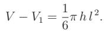

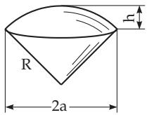

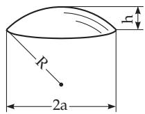  
Figure 3.75

(3.169)

Figure 3.76  
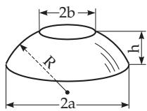  
Figure 3.77

16. Torus (Fig. 3.79) is the solid which can be generated by rotating a circle around an axis which is in the plane of the circle but does not intersect it.

$$
S = 4 \pi ^ { 2 } R r \approx 3 9 . 4 8 R r ,
$$

(3.170a)

$$
S = \pi ^ { 2 } D d \approx 9 . 8 7 0 D d ,\tag{3.170b}
$$

$$
V = 2 \pi ^ { 2 } R r ^ { 2 } \approx 1 9 . 7 4 R r ^ { 2 } ,
$$

(3.171a)

$$
V = { \frac { 1 } { 4 } } \pi ^ { 2 } D d ^ { 2 } \approx 2 . 4 6 7 D d ^ { 2 } .\tag{3.171b}
$$

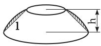

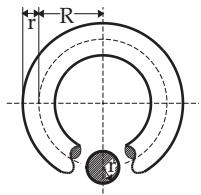

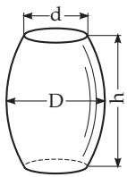  
Figure 3.78  
Figure 3.79  
Figure 3.80

17. Barrel (Fig. 3.80) arises by rotation of a generating curve; a circular barrel by rotation of a circular segment, a parabolic barrel by rotation of a parabolic segment. For the circular barrel the following approximation formulas hold,

$$
V \approx 0 . 2 6 2 h \left( 2 D ^ { 2 } + d ^ { 2 } \right)
$$

$$
( 3 . 1 7 2 \mathrm { a } ) \mathrm { o r } V \approx 0 . 0 8 7 3 h ( 2 D + d ) ^ { 2 } ,\tag{3.172b}
$$

and for the parabolic barrel

$$
V = \frac { \pi h } { 1 5 } \left( 2 D ^ { 2 } + D d + \frac { 3 } { 4 } d ^ { 2 } \right) \approx 0 . 0 5 2 3 6 h \left( 8 D ^ { 2 } + 4 D d + 3 d ^ { 2 } \right) .\tag{3.173}
$$
