#### 3.4.1 Basic Concepts of Geometry on the Sphere

##### 3.4.1.1 Curve, Arc, and Angle on the Sphere

1. Spherical Curves, Great Circle and Small Circle

Curves on the surface of a sphere are called spherical curves. Important spherical curves are great circles and small circles. They are intersection circles of a plane passing through the sphere, the socalled intersecting plane (Fig. 3.81):

If a sphere of radius R is intersected by a plane K at distance h from the center O of the sphere, then for radius r of the intersection circle holds

$$
r = { \sqrt { R ^ { 2 } - h ^ { 2 } } } \quad ( 0 \leq h \leq R ) .\tag{3.174}
$$

For $h = 0$ the intersecting plane goes through the center of the sphere, and r takes the greatest possible value. In this case the intersection circle g in the plane Γ is called a great circle. Every other intersection circle, with $0 < h < R$ is called a small circle, for instance the circle k in Fig. 3.81. For h = R the plane K has only one common point with the sphere. Then it is called a tangent plane.

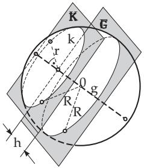  
Figure 3.81

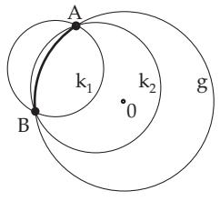  
Figure 3.82

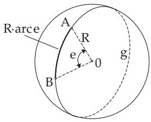  
Figure 3.83

On the Earth the equator and the meridians with their countermeridians – which are their reflections with respect to the Earth’s axis – represent great circles. The parallels of latitude are small circles (see also 3.4.1.2, p. 162).

2. Spherical Distance

Through two points A and B of the surface of the sphere, which are not opposite points, i.e., they are not the endpoints of the same diameter, infinitely many small circles can be drawn, but only one great circle (with the plane of the great circle g). Consider two small circles k , k through A and B and turn them into the plane of the great circle passing through A and B (Fig. 3.82). The great circle has the greatest radius and so the smallest curvature. So the shorter arc of the great circle is the shortest connection between A and B. It is the shortest connection between A and B on the surface of the sphere, and it is called the spherical distance.

3. Geodesic Lines

Geodesic lines are the curves on a surface which are the shortest connections between two points of the surface (see 3.6.3.6, p. 268).

In the plane the straight lines, on the sphere the great circles, are the geodesic lines (see also 3.4.1.2, p. 162).

4. Measurement of the Spherical Distance

The spherical distance of two points can be expressed as a measure of length or as a measure of angle (Fig. 3.83).

1. Spherical Distance as a Measure of Angle is the angle between the radii 0A and 0B measured at the center 0. This angle determines the spherical distance uniquely, and hereafter it is denoted by a lowercase Latin letter. The notation can be given at the center or on the great circle arc.

2. Spherical Distance as a Measure of Length is the length of the great circle arc between A and B. It is denoted by AB (arc AB).

3. Conversions from Measure of Angle into Measure of Length and conversely can be done by the formulas

$$
{ \widehat { A } } { \widehat { B } } { = } { \cal R } \operatorname { a r c } e { = } { \cal R } { \frac { e } { \varrho } } ,\tag{3.175a}
$$

$$
e = \widehat { A B } \ \frac { \varrho } { R } .\tag{3.175b}
$$

Here e denotes the angle given in degrees and arc e denotes the angle in radian (see radian measure 3.1.1.5, p. 131). The conversion factor $\varrho$ is equal to

$$
\varrho = 1 { \mathrm { r a d } } = { \frac { 1 8 0 ^ { \circ } } { \pi } } = 5 7 . 2 9 5 8 ^ { \circ } = 3 4 3 8 ^ { \prime } = 2 0 6 2 6 5 ^ { \prime \prime } .\tag{3.175c}
$$

The determinations of the distance as a measure of length or angle are equivalent but in spherical trigonometry the spherical distances are given mostly as a measure of angle.

A: For spherical calculations on the Earth’s surface usually a sphere is considered with the same volume as the biaxial reference ellipsoid of Krassowski. This radius of the Earth is R = 6371.110 km, and consequently holds $1 ^ { \circ } \triangleq 1 1 1 . 2 \mathrm { k m }$ $1 ^ { \prime } \triangleq 1 8 5 3 . 3  { \mathrm { m } } = 1$ oldseamile. Today 1 seamile = 1852 m.

B: The spherical distance between Dresden and St. Petersburg is $\widehat { A B } = 1 4 3 3$ km or

$$
e = { \frac { 1 4 3 3 \mathrm { k m } } { 6 3 7 1 \mathrm { k m } } } 5 7 . 3 ^ { \circ } = 1 2 . 8 9 ^ { \circ } = 1 2 ^ { \circ } 5 3 ^ { \prime } .
$$

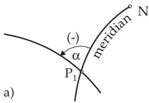

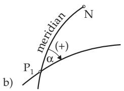  
Figure 3.84

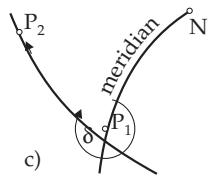

5. Intersection Angle, Course Angle, Azimuth

The intersection angle between spherical curves is the angle between their tangent lines at the intersection point $P _ { 1 }$ . If one of them is a meridian, the intersection angle with the curve segment to the north from $P _ { 1 }$ is called the course angle α in navigation. To distinguish the inclination of the curve to the east or to the west, a sign is to be assigned to the course angle according to Fig. 3.84a,b restricting it to the interval $- 9 0 ^ { \circ } < \alpha \leq 9 0 ^ { \circ }$ . The course angle is an oriented angle, i.e., it has a sign. It is independent of the orientation of the curve – of its sense.

The orientation of the curve from $P _ { 1 }$ to $P _ { 2 } ,$ as in Fig. 3.84c, can be described by the azimuth δ: It is the intersection angle between the northern part of the meridian passing through $P _ { 1 }$ and the curve arc from $P _ { 1 }$ to $P _ { 2 }$ . The azimuth is restricted to the interval $0 ^ { \circ } \leq \delta < 3 6 0 ^ { \circ }$

Remark: In navigation the position coordinates are usually given in sexagesimal degrees; the spherical distances and also the course angles and the azimuth are given in decimal degrees.

##### 3.4.1.2 Special Coordinate Systems

1. Geographical Coordinates

To determine points P on the Earth’s surface geographical coordinates are in use (Fig. 3.85), i.e., spherical coordinates with the radius of the Earth, the geographical longitude λ and the geographical latitude $\varphi .$

To determine the degree of longitude the surface of the Earth is subdivided by half great circles from the north pole to the south pole, by so-called meridians. The zero meridian goes through the observatory of Greenwich. From here one counts the east longitude with the help of 180 meridians and the west longitude with 180 meridians. At the equator they are at a distance of 111 km of each other. East longitudes are given as positive, west longitudes are given as negative values. So $- 1 8 0 ^ { \circ } < \lambda \leq 1 8 0 ^ { \circ }$

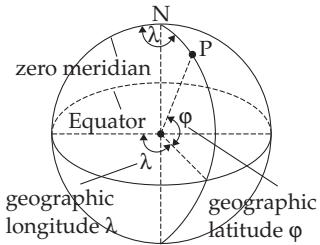  
Figure 3.85

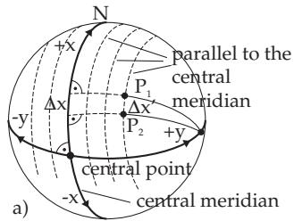

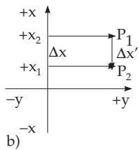  
Figure 3.86

To determine the degree of the latitude the Earth’s surface is divided by small circles parallel to the equator. Starting from the equator 90 degrees of latitude are to be counted to the north, the northings, and 90 southern latitudes. Northings are positive, southern latitudes are negative. $\mathrm { S o - 9 0 ^ { \circ } } \leq \varphi \leq 9 0 ^ { \circ }$

2. Soldner Coordinates

The right-angled Soldner coordinates and Gauss-Kr¨uger coordinates are important in wide surface surveys. To map parts of the curved Earth’s surface onto a right-angled coordinate system in a plane, distance preserving in the ordinate direction, according to Soldner the x-axis is to be placed on a meridian (it is called a central meridian), and the origin at a well-measured center point (Fig. 3.86a). The ordinate y of a point P is the segment between $\bar { P }$ and the foot of the spherical orthogonal (great circle) on the central meridian. The abscissa $x$ of the point $P$ is the segment of a circle between $P$ and the main parallel passing through the center, where the circle is in a parallel plane to the central meridian (Fig. 3.86b).

Transferring the spherical abscissae and ordinates into the plane coordinate system the segment $\Delta x$ is stretched and the directions are distorted. The coeficient ofelongation a in the direction of the abscissa is

$$
a = \frac { \Delta x } { \Delta x ^ { \prime } } = 1 + \frac { y ^ { 2 } } { 2 R ^ { 2 } } , \quad R = 6 3 7 1 \mathrm { k m } .\tag{3.176}
$$

To moderate the stretching, the system may not be extended more than 64 km on both sides of the central meridian. A segment of 1 km length has an elongation of 0.05 m at y = 64 km.

3. Gauss-Kr¨uger Coordinates

In order to map parts of the curved Earth’s surface onto the plane with an angle-preserving (conformal) mapping, at Gauss-Kr¨uger system first a partition into meridian zones is prepared. For Germany these mid-meridians are at $6 ^ { \circ } , 9 ^ { \circ } , 1 2 ^ { \circ }$ , and $1 5 ^ { \circ }$ east longitude (Fig. 3.87a). The origin of every meridian zone is at the intersection point of the mid-meridian and the equator. In the north–south direction the total range is to be considered, in the east–west direction a $1 ^ { \circ } 4 \dot { 0 } ^ { \prime }$ wide strip on both sides. In Germany it amounts ca. 100 km. The overlap is 20, which is here nearly 20 km.

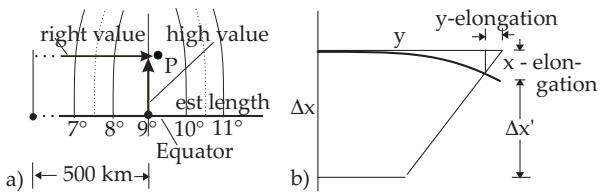  
Figure 3.87

The coeficient of elongation a in the abscissa direction (Fig. 3.87b) is the same as in the Soldner system (3.176). To keep the mapping angle-preserving, the quantity b must be added to the ordinates:

$$
b = \frac { y ^ { 3 } } { 6 R ^ { 2 } } .\tag{3.177}
$$

##### 3.4.1.3 Spherical Lune or Biangle

Suppose there are two planes $\Gamma _ { 1 }$ and $\Gamma _ { 2 }$ passing through the endpoints A and B of a diameter of the sphere and enclosing an angle α (Fig. 3.88) and so defining two great circles ${ \mathrm { g } } _ { 1 }$ and $\mathrm { g _ { 2 } }$ . The part of the surface of the sphere bounded by the halves of the great circles is called a spherical lune or biangle or spherical digon. The sides of the spherical biangle are defined by the spherical distances between A and B on the great circles. Both are $\mathrm { \bar { 1 8 0 ^ { \circ } } }$

As the angles of the biangle one defines the angles between the tangents of the great circles $g _ { 1 }$ and $g _ { 2 }$ at the points A and B. They are the same as the so-called dihedral angle α between the planes $\Gamma _ { 1 }$ and $\Gamma _ { 2 }$ If C and D are the bisecting points of both great circle arcs A and B , the angle α can be expressed as the spherical distance of $C$ and D. The area $A _ { \mathrm { b } }$ of the spherical biangle is proportional to the surface area of the sphere just as the angle α to $3 6 0 ^ { \circ }$ . Therefore the area is

$$
A _ { \mathrm { b } } = \frac { 4 \pi R ^ { 2 } \alpha } { 3 6 0 ^ { \circ } } = \frac { 2 R ^ { 2 } \alpha } { \varrho } = 2 R ^ { 2 } \mathrm { a r c } \alpha
$$

with the conversion factor  as in (3.175c).

(3.178)

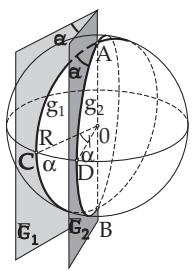  
Figure 3.88

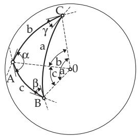  
Figure 3.89

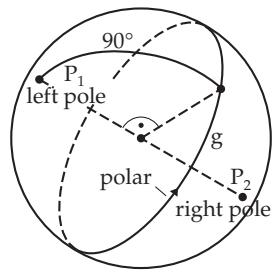  
Figure 3.90

##### 3.4.1.4 Spherical Triangle

Consider three points A, B, and C on the surface of a sphere, not on the same great circle. Connecting every two of them by a great circle yields a spherical triangle ABC (Fig. 3.89).

The sides of the triangle are defined as the spherical distances of the points, i.e., they represent the angles at the center between the radii 0A, 0B, and 0C. They are denoted by a, b, and $c ,$ and hereafter they are given in angle measure, independently of whether they are denoted at the center as angles or on the surface as great circle arcs. The angles of the spherical triangle are the angles between every two planes of the great circles. They are denoted by $\alpha , \beta ,$ and γ.

The order of the notation of the points, sides, and angles of the spherical triangle follows the same scheme as for triangles of the plane. A spherical triangle is called a right-sided triangle if at least one

a)

side is equal to 90◦. There is an analogy with the right-angled triangles of the plane.

##### 3.4.1.5 Polar Triangle

1. Poles and Polar The endpoints of a diameter $P _ { 1 }$ and $P _ { 2 }$ are called poles, and the great circle g being perpendicular to this diameter is called polar (Fig. 3.90). The spherical distance between a pole and any point of the great circle g is $9 0 ^ { \circ }$ . The orientation of the polar is defined arbitrarily: Traversing the polar along the chosen direction there is a left pole to the left and a right pole to the right.

2. Polar Triangle ABC of a given spherical triangle ABC is a spherical triangle such that the vertices of the original triangle are poles for its sides (Fig. 3.91). For every spherical triangle ABC there exists one polar triangle ABC. If the triangle $\tilde { A ^ { \prime } } B ^ { \prime } C ^ { \prime }$ is the polar triangle of the spherical triangle ABC , then the triangle ABC is the polar triangle of the triangle $A ^ { \prime } B ^ { \prime } C ^ { \prime }$ . The angles of a spherical triangle and the corresponding sides of its polar triangle are supplementary angles, and the sides of the spherical triangle and the corresponding angles of its polar triangle are supplementary angles:

$$
a ^ { \prime } = 1 8 0 ^ { \circ } - \alpha , \qquad b ^ { \prime } = 1 8 0 ^ { \circ } - \beta , \qquad c ^ { \prime } = 1 8 0 ^ { \circ } - \gamma ,\tag{3.179a}
$$

$$
\alpha ^ { \prime } = 1 8 0 ^ { \circ } - a , \qquad \beta ^ { \prime } = 1 8 0 ^ { \circ } - b , \qquad \gamma ^ { \prime } = 1 8 0 ^ { \circ } - c .\tag{3.179b}
$$

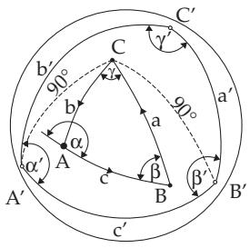  
Figure 3.91

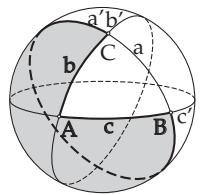

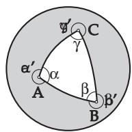  
b)  
Figure 3.92

##### 3.4.1.6 Euler Triangles and Non-Euler Triangles

The vertices A, B, C of a spherical triangle divide every great circle into two, usually diferent parts. Consequently there are several diferent triangles with the same vertices, e.g., also the triangle with sides $a ^ { \prime } , b ,$ c and the shadowed surface in Fig. 3.92a. According to the definition of Euler one should always choose the arc which is smaller than $\mathrm { \dot { 1 } 8 0 ^ { \circ } }$ as a side of the spherical triangle. This corresponds to the definition of the sides as spherical distances between the vertices. Considering this, all spherica triangles of whose sides and angles are less than 180◦ are called Euler triangles, otherwise they are called non-Euler triangles. In Fig. 3.92b there is an Euler triangle and a non-Euler triangle.

##### 3.4.1.7 Trihedral Angle

This is a three-sided solid formed by three edges $s _ { a } , s _ { b } , s _ { c }$ starting at a vertex O (Fig. 3.93a). The angles a, b, c are defined as sides of the trihedral angle, every of them is enclosed by two edges. The regions between two edges are called the faces of the trihedral angle. The angles of the trihedral angle are $\alpha , \beta ,$ and $\gamma ,$ the angles between the faces. If the vertex of a trihedral angle is at the center O of a sphere, it cuts out a spherical triangle of the surface (Fig. 3.93b). The sides and the angles of the spherical triangle and the corresponding trihedral angle are coincident, so every theorem derived for a trihedral angle is valid for the corresponding spherical triangle, and conversely.

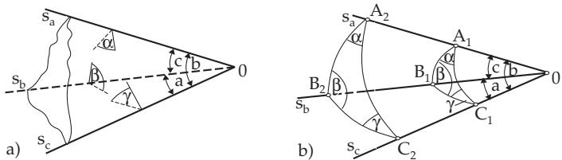  
Figure 3.93
