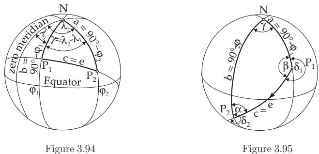

#### 3.4.2 Basic Properties of Spherical Triangles

##### 3.4.2.1 General Statements

For an Euler triangle with sides $a , b , c ,$ , whose opposite angles are $\alpha , \beta , \gamma$ , the following statements are valid:

1. Sum of the Sides The sum of the sides is between $0 ^ { \circ }$ and $3 6 0 ^ { \circ }$

$$
0 ^ { \circ } < a + b + c < 3 6 0 ^ { \circ } .\tag{3.180}
$$

2. Sum of two Sides The sum of two sides is greater than the third one, e.g.,

$$
a + b > c .\tag{3.181}
$$

3. Diference of Two Sides The absolute value of the diference of two sides is smaller than the third one, e.g.,

$$
| a - b | < c .\tag{3.182}
$$

4. Sum of the Angles The sum of the angles is between $1 8 0 ^ { \circ }$ and $5 4 0 ^ { \circ }$

$$
1 8 0 ^ { \circ } < \alpha + \beta + \gamma < 5 4 0 ^ { \circ } .\tag{3.183}
$$

5. Spherical Excess The diference

$$
\epsilon = \alpha + \beta + \gamma - 1 8 0 ^ { \circ }\tag{3.184}
$$

is called the spherical excess.

$$
\alpha + \beta < \gamma + 1 8 0 ^ { \circ } .
$$

$$
1 8 0 ^ { \circ }\tag{3.185}
$$

7. Opposite Sides and Angles Opposite to a greater side there is a greater angle, and conversely. 8. Area The area $A _ { \mathrm { T } }$ of a spherical triangle can be expressed by the spherical excess  and by the radius of the sphere R with the formula

$$
A _ { \mathrm { T } } = \epsilon R ^ { 2 } \cdot \frac { \pi } { 1 8 0 ^ { \circ } } = \frac { R ^ { 2 } \epsilon } { \varrho } = R ^ { 2 } \operatorname { a r c } \epsilon .\tag{3.186a}
$$

Here $\varrho$ is the conversion factor (3.175c). From the theorem of Girard, with $A _ { \mathrm { S } }$ as the surface area of the sphere, holds

$$
A _ { \mathrm { T } } = \frac { A _ { \mathrm { S } } } { 7 2 0 ^ { \circ } } \epsilon .\tag{3.186b}
$$

If the sides are known and not the excess, then  can be calculated by the formula of L’Huilier (3.201).

##### 3.4.2.2 Fundamental Formulas and Applications

The notation for the quantities of this paragraph corresponds to those of Fig. 3.89.

1. Sine Law

$$
{ \frac { \sin a } { \sin b } } = { \frac { \sin \alpha } { \sin \beta } } , \quad ( 3 . 1 8 7 \mathrm { a } ) \qquad { \frac { \sin b } { \sin c } } = { \frac { \sin \beta } { \sin \gamma } } , \quad ( 3 . 1 8 7 \mathrm { b } ) \qquad { \frac { \sin c } { \sin a } } = { \frac { \sin \gamma } { \sin \alpha } } .\tag{3.187c}
$$

The equations from (3.187a) to (3.187c) can also be written as proportions, i.e., in a spherical triangle the sines of the sides are related as the sines of the opposite angles:

$$
{ \frac { \sin a } { \sin \alpha } } = { \frac { \sin b } { \sin \beta } } = { \frac { \sin c } { \sin \gamma } } .\tag{3.187d}
$$

The sine law of spherical trigonometry corresponds to the sine law of plane trigonometry.

2. Cosine Law, or Cosine Law for Sides

$$
\cos a = \cos b \cos c + \sin b \sin c \cos \alpha , ~ ( 3 . 1 8 8 a ) \cos b = \cos c \cos a + \sin c \sin a \cos \beta ,\tag{3.188b}
$$

$$
\cos c = \cos a \cos b + \sin a \sin b \cos \gamma .\tag{3.188c}
$$

The cosine law for sides in spherical trigonometry corresponds to the cosine law of plane trigonometry.   
From the notation one can see that the cosine law contains the three sides of the spherical triangle.

3. Sine-Cosine Law

$$
\sin a \cos \beta = \cos b \sin c - \sin b \cos c \cos \alpha ,\tag{3.189a}
$$

$$
\sin a \cos \gamma = \cos c \sin b - \sin c \cos b \cos \alpha .\tag{3.189b}
$$

One can get four more equations by cyclic change of the quantities (Fig. 3.34).

The sine-cosine law corresponds to the projection rule of plane trigonometry. Because it contains five quantities of the spherical triangle it is not used directly for solving problems of spherical triangles, but it is used for the derivation of further equations.

4. Cosine Law for Angles of a Spherical Triangle

$$
\cos \alpha = - \cos \beta \cos \gamma + \sin \beta \sin \gamma \cos a ,\tag{3.190a}
$$

$$
\cos \beta = - \cos \gamma \cos \alpha + \sin \gamma \sin \alpha \cos b ,\tag{3.190b}
$$

$$
\cos \gamma = - \cos \alpha \cos \beta + \sin \alpha \sin \beta \cos c .\tag{3.190c}
$$

This cosine rule contains the three angles of the spherical triangle and one of the sides. With this law one can easily express an angle by the opposite side with the angles on it, or a side by the angles; consequently every side can be expressed by the angles. Contrary to this, for plane triangles the third angle is calculated from the sum of 180◦.

Remark: It is not possible to determine any side of a plane triangle from the angles, because there are infinitely many similar triangles.

5. Polar Sine-Cosine Law

$$
\sin \alpha \cos b = \cos \beta \sin \gamma + \sin \beta \cos \gamma \cos a ,\tag{3.191a}
$$

$$
\sin \alpha \cos c = \cos \gamma \sin \beta + \sin \gamma \cos \beta \cos a .\tag{3.191b}
$$

Four more equations can be get by cyclic change of the quantities (Fig. 3.34).

Just as for the cosine law for angles, also the polar sine-cosine law is not usually used for direct calculations for spherical triangles, but to derive further formulas.

6. Half-Angle Formulas

To determine an angle of a spherical triangle from the sides one can use the cosine law for sides. The half-angle formulas allow us to calculate the angles by their tangents, similarly to the half-angle formulas of plane trigonometry:

$$
\tan { \frac { \alpha } { 2 } } = { \sqrt { \frac { \sin ( s - b ) \sin ( s - c ) } { \sin s \sin ( s - a ) } } } , ( 3 . 1 9 2 { \mathrm { a } } )
$$

$$
\tan { \frac { \beta } { 2 } } = { \sqrt { \frac { \sin ( s - c ) \sin ( s - a ) } { \sin s \sin ( s - b ) } } } ,\tag{3.192b}
$$

$$
\tan { \frac { \gamma } { 2 } } = { \sqrt { \frac { \sin ( s - a ) \sin ( s - b ) } { \sin s \sin ( s - c ) } } } , \quad ( 3 . 1 9 2 \mathrm { c } ) \quad \qquad s = { \frac { a + b + c } { 2 } } .\tag{3.192d}
$$

If from the three sides of a spherical triangle all the three angles should be determined, then the following calculations are useful:

$$
\tan { \frac { \alpha } { 2 } } = { \frac { k } { \sin ( s - a ) } } ,
$$

(3.193a)

$$
\tan { \frac { \beta } { 2 } } = { \frac { k } { \sin ( s - b ) } } ,\tag{3.193b}
$$

$$
\tan { \frac { \gamma } { 2 } } = { \frac { k } { \sin ( s - c ) } } \quad { \mathrm { w i t h } }\tag{3.193c}
$$

$$
k = { \sqrt { \frac { \sin ( s - a ) \sin ( s - b ) \sin ( s - c ) } { \sin s } } } , \mathrm { ~ } ( 3 . 1 9 3 \mathrm { d } ) \mathrm { ~ } s = { \frac { a + b + c } { 2 } } .\tag{3.193e}
$$

7. Half-Side Formulas

With the half-side formulas it is possible to determine one side or all three sides of a spherical triangle from its three angles:

$$
\cot { \frac { a } { 2 } } = { \sqrt { \frac { \cos ( \sigma - \beta ) \cos ( \sigma - \gamma ) } { - \cos \sigma \cos ( \sigma - \alpha ) } } } , ( 3 . 1 9 4 \mathrm { { a } } )
$$

$$
\cot { \frac { b } { 2 } } = { \sqrt { \frac { \cos ( \sigma - \gamma ) \cos ( \sigma - \alpha ) } { - \cos \sigma \cos ( \sigma - \beta ) } } } ,\tag{3.194b}
$$

$$
\cot { \frac { c } { 2 } } = { \sqrt { \frac { \cos ( \sigma - \alpha ) \cos ( \sigma - \beta ) } { - \cos \sigma \cos ( \sigma - \gamma ) } } } , ( 3 . 1 9 4 \mathrm { c } )
$$

$$
\sigma = { \frac { \alpha + \beta + \gamma } { 2 } } ,\tag{3.194d}
$$

or

$$
\cot { \frac { a } { 2 } } = { \frac { k ^ { \prime } } { \cos ( \sigma - \alpha ) } } ,
$$

(3.195a)

$$
\cot { \frac { b } { 2 } } = { \frac { k ^ { \prime } } { \cos ( \sigma - \beta ) } } ,\tag{3.195b}
$$

$$
\cot { \frac { c } { 2 } } = { \frac { k ^ { \prime } } { \cos ( \sigma - \gamma ) } } \quad \mathrm { w i t h } \quad\tag{3.195c}
$$

$$
k ^ { \prime } = \sqrt { \frac { \cos ( \sigma - \alpha ) \cos ( \sigma - \beta ) \cos ( \sigma - \gamma ) } { - \cos \sigma } } , ~ ( 3 . 1 9 5 \mathrm { d } ) ~ \sigma = \frac { \alpha + \beta + \gamma } { 2 } .\tag{3.195e}
$$

Since for the sum of the angles of a spherical triangle according to (3.183):

$$
1 8 0 ^ { \circ } < 2 \sigma < 5 4 0 ^ { \circ } \quad \mathrm { o r } \quad 9 0 ^ { \circ } < \sigma < 2 7 0 ^ { \circ }\tag{3.196}
$$

holds, cos $\sigma < 0$ must always be valid. Because of the requirements for Euler triangles all the roots are real.

8. Applications of the Fundamental Formulas of Spherical Geometry

With the help of the given fundamental formulas, for instance distances, the azimuth, and course angles on the Earth can be determined.

A: Determine the shortest distance between Dresden $( \lambda _ { 1 } = 1 3 ^ { \circ } 4 6 ^ { \prime } , \varphi _ { 1 } = 5 1 ^ { \circ } 1 6 ^ { \prime } )$ and Alma Ata $( \lambda _ { 2 } = 7 6 ^ { \circ } 5 5 ^ { \prime } , \varphi _ { 2 } = 4 3 ^ { \circ } 1 8 ^ { \prime } )$

Solution: The geographical coordinates $( \lambda _ { 1 } , \varphi _ { 1 } ) , ( \lambda _ { 2 } , \varphi _ { 2 } )$ and the north pole N (Fig. 3.94) result in two sides of the triangle $P _ { 1 } P _ { 2 } N a = 9 0 ^ { \circ } - \varphi _ { 2 }$ and $b = 9 0 ^ { \circ } - \varphi _ { 1 }$ lying on meridians, and also the angle between them $\gamma = \lambda _ { 2 } - \lambda _ { 1 }$ . For $c = e$ it follows from the cosine law (3.188a)

cos c = cos a cos b + sin a sin b cos γ,

$$
\begin{array} { l } { { \cos e = \cos ( 9 0 ^ { \circ } - \varphi _ { 1 } ) \cos ( 9 0 ^ { \circ } - \varphi _ { 2 } ) + \sin ( 9 0 ^ { \circ } - \varphi _ { 1 } ) \sin ( 9 0 ^ { \circ } - \varphi _ { 2 } ) \cos ( \lambda _ { 2 } - \lambda _ { 1 } ) } } \\ { { \qquad = \sin \varphi _ { 1 } \sin \varphi _ { 2 } + \cos \varphi _ { 1 } \cos \varphi _ { 2 } \cos ( \lambda _ { 2 } - \lambda _ { 1 } ) , } } \end{array}\tag{3.197}
$$

i.e., cos $e = 0 . 5 3 4 9 8 + 0 . 2 0 5 6 7 = 0 . 7 4 0 6 5 , e = 4 2 . 2 1 3 ^ { \circ }$ . The great circle segment $\widehat { P _ { 1 } P _ { 2 } }$ has length 4694 km using (3.175a).

B: Calculate the course angles $\delta _ { 1 }$ and $\delta _ { 2 }$ at departure and at arrival, and also the distance in sea miles of a voyage from Bombay $( \lambda _ { 1 } ^ { \cdot } = 7 2 ^ { \circ } 4 8 ^ { \prime } , \varphi _ { 1 } = \bar { 1 } 9 ^ { \circ } 0 0 ^ { \prime } )$ to Dar es Saalam $( \lambda _ { 2 } = 3 9 ^ { \circ } 2 8 ^ { \prime } , \varphi _ { 2 } = - 6 ^ { \circ } 4 9 ^ { \prime } )$ along a great circle.

Solution: The calculation of the two sides $a = 9 0 ^ { \circ } - \varphi _ { 1 } = 7 1 ^ { \circ } 0 0 ^ { \prime } , b = 9 0 ^ { \circ } - \varphi _ { 2 } = 9 6 ^ { \circ } 4 9 ^ { \prime }$ and the enclosed angle $\gamma = \lambda _ { 1 } - \lambda _ { 2 } = 3 3 ^ { \circ } 2 0 ^ { \prime }$ in the spherical triangle $P _ { 1 } P _ { 2 } N$ with the help of the geographical coordinates $( \lambda _ { 1 } , \varphi _ { 1 } ) , ( \lambda _ { 2 } , \varphi _ { 2 } )$ (Fig. 3.95) and the cosine law (3.188c) cos $c = \cos e = \cos a \cos b +$ sin a sin b co $\gamma$ yields $P _ { 1 } P _ { 2 } = e = 4 1 . 7 7 7 ^ { \circ }$ , and because $1 ^ { \prime } \approx 1$ sm follows $\dot { P _ { 1 } } \dot { P } _ { 2 } \approx 2 5 0 7$ sm.

$$
\alpha = \operatorname { a r c c o s } { \frac { \cos a - \cos b \cos c } { \sin b \sin c } } = 5 1 . 2 4 8 ^ { \circ } \quad { \mathrm { a n d } } \quad \beta = \operatorname { a r c c o s } { \frac { \cos b - \cos a \cos c } { \sin a \sin c } } = 1 2 5 . 0 1 8 ^ { \circ } .
$$

Therefore, the results are

$$
\delta _ { 1 } = 3 6 0 ^ { \circ } - \beta = 2 3 4 . 9 8 2 ^ { \circ } \quad \mathrm { a n d } \quad \delta _ { 2 } = 1 8 0 ^ { \circ } + \alpha = 2 3 1 . 2 4 8 ^ { \circ } .
$$

Remark: It makes sense to use the sine law to determine sides and angles only if it is already obvious from the problem that the angles are acute or obtuse.

##### 3.4.2.3 Further Formulas

1. Delambre Equations

Analogously to the Mollweide formulas of plane trigonometry the corresponding formulas of Delambre are valid for spherical triangles:

$$
{ \frac { \cos { \frac { \alpha - \beta } { 2 } } } { \sin { \frac { \gamma } { 2 } } } } = { \frac { \sin { \frac { a + b } { 2 } } } { \sin { \frac { c } { 2 } } } } , ~ ( 3 . 1 9 8 \mathrm { { a } } )
$$

$$
{ \frac { \sin { \frac { \alpha - \beta } { 2 } } } { \cos { \frac { \gamma } { 2 } } } } = { \frac { \sin { \frac { a - b } { 2 } } } { \sin { \frac { c } { 2 } } } } ,\tag{3.198b}
$$

$$
\frac { \cos \frac { \alpha + \beta } { 2 } } { \sin \frac { \gamma } { 2 } } = \frac { \cos \frac { a + b } { 2 } } { \cos \frac { c } { 2 } } ,\tag{3.198c}
$$

$$
{ \frac { \sin { \frac { \alpha + \beta } { 2 } } } { \cos { \frac { \gamma } { 2 } } } } = { \frac { \cos { \frac { a - b } { 2 } } } { \cos { \frac { c } { 2 } } } } .\tag{3.198d}
$$

Since for every equation two more equations exist by cyclic changes, altogether there are 12 Delambre equations.

2. Neper Equations and Tangent Law

$$
\tan { \frac { \alpha - \beta } { 2 } } = { \frac { \sin { \frac { a - b } { 2 } } } { \sin { \frac { a + b } { 2 } } } } \cot { \frac { \gamma } { 2 } } , ( 3 . 1 9 9 \mathrm { { a } } )
$$

$$
\tan { \frac { \alpha + \beta } { 2 } } = { \frac { \cos { \frac { a - b } { 2 } } } { \cos { \frac { a + b } { 2 } } } } \cot { \frac { \gamma } { 2 } } ,\tag{3.199b}
$$

$$
\tan { \frac { a - b } { 2 } } = { \frac { \sin { \frac { \alpha - \beta } { 2 } } } { \sin { \frac { \alpha + \beta } { 2 } } } } \tan { \frac { c } { 2 } } ,
$$

(3.199c)

$$
\tan { \frac { a + b } { 2 } } = { \frac { \cos { \frac { \alpha - \beta } { 2 } } } { \cos { \frac { \alpha + \beta } { 2 } } } } \tan { \frac { c } { 2 } } .\tag{3.199d}
$$

These equations are also called Neper analogies. From these one can derive formulas analogous to the tangent law of plane trigonometry:

$$
{ \frac { \tan { \frac { a - b } { 2 } } } { \tan { \frac { a + b } { 2 } } } } = { \frac { \tan { \frac { \alpha - \beta } { 2 } } } { \tan { \frac { \alpha + \beta } { 2 } } } } ,
$$

(3.200a)

$$
{ \frac { \tan { \frac { b - c } { 2 } } } { \tan { \frac { b + c } { 2 } } } } = { \frac { \tan { \frac { \beta - \gamma } { 2 } } } { \tan { \frac { \beta + \gamma } { 2 } } } } ,\tag{3.200b}
$$

$$
{ \frac { \tan { \frac { c - a } { 2 } } } { \tan { \frac { c + a } { 2 } } } } = { \frac { \tan { \frac { \gamma - \alpha } { 2 } } } { \tan { \frac { \gamma + \alpha } { 2 } } } } .\tag{3.200c}
$$

3. L’Huilier Equations

The area of a spherical triangle can be calculated with the help of the excess  , either from the known angles $\alpha , \beta , \gamma$ according to (3.184), or if the three sides $a , b , c$ are known, with the formulas about the angles from (3.193a) to (3.193e). The L’Huilier equation makes possible the direct calculation of  from the sides:

$$
\tan { \frac { \epsilon } { 4 } } = \sqrt { \tan { \frac { s } { 2 } } \tan { \frac { s - a } { 2 } } \tan { \frac { s - b } { 2 } } \tan { \frac { s - c } { 2 } } } .\tag{3.201}
$$

This equation corresponds to the Heron formula of plane trigonometry.
