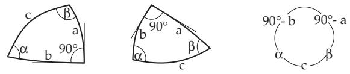
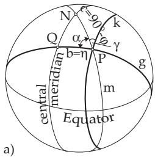
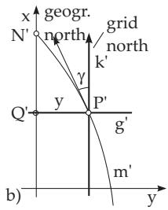
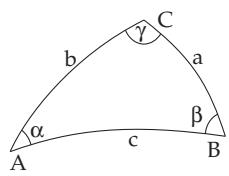

##### 3.4.3.2 Right-Angled Spherical Triangles

1. Special Formulas

In a right-angled spherical triangle at least one of the angles is $9 0 ^ { \circ }$ . The sides and angles are denoted analogously to the plane right-angled triangle. If as in Fig. 3.96 γ is a right angle, the side c is called the hypotenuse, a and b the legs and α and $\beta$ are the leg angles. From the equations from (3.187d) to

  
Figure 3.96  
Figure 3.97

(3.191b) it follows for $\gamma = 9 0 ^ { \circ }$

sin a = sin α sin c, (3.202a)

$$
\sin b = \sin \beta \sin c ,\tag{3.202b}
$$

$$
\cos c = \cos a \cos b ,
$$

(3.202c)

$$
\cos c = \cot \alpha \cot \beta ,\tag{3.202d}
$$

$$
\tan a = \cos \beta \tan c ,\tag{3.202e}
$$

$$
\tan b = \cos \alpha \tan c ,\tag{3.202f}
$$

$$
\tan b = \sin a \tan \beta ,\tag{3.202g}
$$

tan a = sin b tan α,

(3.202h)

cos α = sin β cos a,

(3.202i)

cos β = sin α cos b.

(3.202j)

If in certain problems other sides or angles are given, for instance instead of $\alpha , \beta , \gamma$ the quantities $b , \gamma , \alpha ,$ the necessary equations can be get by cyclic change of these quantities. For calculations in a rightangled spherical triangle one usually starts with three given quantities, the angle $\gamma = 9 0 ^ { \circ }$ and two other quantities. There are six basic problems, which are represented in Table 3.8.

Table 3.8 Defining quantities of a spherical right-angled triangle
<table><tr><td rowspan=1 colspan=1>Basicproblem</td><td rowspan=1 colspan=1>Given definingquantities</td><td rowspan=1 colspan=1>Number of the formula todetermine other quantities</td></tr><tr><td rowspan=1 colspan=1>1.</td><td rowspan=1 colspan=1>Hypotenuse and a leg c, a</td><td rowspan=1 colspan=1>α (3.202a), β (3.202e), b (3.202c)</td></tr><tr><td rowspan=1 colspan=1>2.</td><td rowspan=1 colspan=1>Two legs a, b</td><td rowspan=1 colspan=1>α (3.202h), β (3.202g), c (3.202c</td></tr><tr><td rowspan=1 colspan=1>3.</td><td rowspan=1 colspan=1>Hypotenuse and an angle $c , \alpha$ </td><td rowspan=1 colspan=1>a (3.202a), b (3.202f), β (3.202d)</td></tr><tr><td rowspan=1 colspan=1>4.</td><td rowspan=1 colspan=1>Leg and the angles on it $a , \beta$ </td><td rowspan=1 colspan=1>c (3.202e), b (3.202j), α (3.202i)</td></tr><tr><td rowspan=1 colspan=1>5.</td><td rowspan=1 colspan=1>Leg and the angle opposite to it $a , \alpha$ </td><td rowspan=1 colspan=1>b (3.202h), c (3.202a), β (3.202i)</td></tr><tr><td rowspan=1 colspan=1>6.</td><td rowspan=1 colspan=1>Two angles α, β</td><td rowspan=1 colspan=1>a (3.202i), b (3.202j), c (3.202d)</td></tr></table>

2. Neper Rule

The Neper rule summarizes the equations (3.202a) to (3.202j). If the five determining quantities of a right-angled spherical triangle, not considering the right angle, are arranged along a circle in the same order as they are in the triangle, and if the legs are replaced by their complementary angles $9 0 ^ { \circ } - a ,$ $9 0 ^ { \circ } - b .$ , (Fig. 3.97), then the following is valid:

1. The cosine of every defining quantity is equal to the product of the cotangent values of its neighboring quantities.

2. The cosine of every defining quantity is equal to the product of the sine values of the non-neighboring quantities.

A: cos $\alpha = \cot ( 9 0 ^ { \circ } - b ) \cot c = { \frac { \tan b } { \tan c } } { \mathrm { ~ ( s e e ~ ( 3 . 2 0 2 f ) } }$

B: cos(90◦ a) = sin c sin α = sin a (see (3.202a)).

C: Map the sphere given by a grid, onto a cylinder which contacts the sphere along a meridian, the so-called central meridian. This meridian and the equator form the axis of the Gauss-Kr¨uger system (Fig. 3.98a,b).

  
Figure 3.98

  
Figure 3.99

Solution: A point $P$ of the surface of the sphere will have the corresponding point $P ^ { \prime }$ on the plane. The great circle g passing through the point $P$ perpendicular to the central meridian is mapped into a line $g ^ { \prime }$ perpendicular to the x-axis, and the small circle $k$ passing through $P$ parallel to the given meridian becomes a line $k ^ { \prime }$ parallel to the x-axis (grid meridian). The image of the meridian m through $P$ is not line but a curve $m ^ { \prime }$ (true meridian). The upward direction of the tangent of $m ^ { \prime }$ at $P ^ { \prime }$ gives the geographical north, the upward direction of $k ^ { \prime }$ gives the grid north direction. The angle γ between the two north directions is called the meridian convergence.

In a right-angled spherical triangle $Q P N$ with $c = 9 0 ^ { \circ } - \varphi$ , and $b = \eta$ one gets $\gamma$ from $\alpha = 9 0 ^ { \circ } - \gamma$ The Neper rule yields cos $\alpha = { \frac { \tan b } { \tan c } } \operatorname { o r } \cos ( 9 0 ^ { \circ } - \gamma ) = { \frac { \tan \eta } { \tan ( 9 0 ^ { \circ } - \varphi ) } }$ , sin γ = tan η tan $\varphi$ . Because $\gamma$ and $\eta$ are mostly small, one can consider sin $\gamma \approx \gamma$ , tan $\eta \approx \eta ;$ consequently $\gamma = \eta$ tan $\varphi$ is valid. The length deviation $\gamma$ of this cylinder sketch is pretty small for small distances $\eta ,$ and so one can substitute $\eta = y / R$ , where $y$ is the ordinate of $P .$ This yields $\gamma = ( y / R )$ ) tan $\varphi .$ . The conversion of $\gamma$ from radian into degree measure yields a meridian convergence of $\gamma = 0 . 0 1 8 7 0 6$ or $\gamma = 1 ^ { \circ } 0 4 ^ { \prime } 1 9 ^ { \prime \prime }$ at $\varphi = 5 0 ^ { \circ } , y = 1 0 0$ km.
