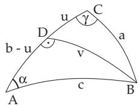
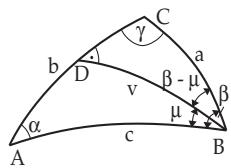
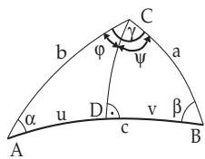
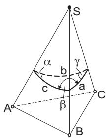
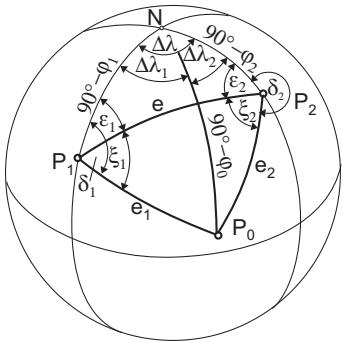

##### 3.4.3.3 Spherical Triangles with Oblique Angles

For three given quantities, there is to be distinguished between six basic problems, just as it was done for right-angled spherical triangles. The notation for the angles is $\alpha , \beta , \gamma$ and $a , b , c$ for the opposite sides (Fig. 3.99).

Tables 3.9, 3.10, 3.11, and 3.12 summarize, which formulas should be used for which defining quantities in the case of the six basic problems. Problems 3, 4, 5, and 6 can also be solved by decomposing the general triangle into two right-angled triangles. To do this for problems 3 and 4 (Fig. 3.100, Fig. 3.101) one can use the spherical perpendicular from B to $A C$ to the point D, and for problems 5 and 6 (Fig. 3.102) from C to AB to the point D.

  
Figure 3.100

  
Figure 3.101

  
Figure 3.102

In the headings of Tables 3.9, 3.10, 3.11, and 3.12 the given sides and angles are denoted by S and $W$ respectively. This means for instance SWS: Two sides and the enclosed angle are given.

Table 3.9 First and second basic problems for spherical oblique triangles
<table><tr><td>First basic problem Given: 3 sides  $a , b , c$ </td><td>SSS</td><td>Second basic problem Given: 3 angles  $\alpha , \beta , \gamma$ </td><td>WWW</td></tr><tr><td>Conditions:  $0 ^ { \circ } < a + b + c < 3 6 0 ^ { \circ } ,$   $a + b > c , \ a + c > b , \ b + c > a .$ </td><td>Conditions:  $\beta + \gamma < 1 8 0 ^ { \circ } + \alpha .$ </td><td> $1 8 0 ^ { \circ } < \alpha + \beta + \gamma < 5 4 0 ^ { \circ } ,$   $\alpha + \beta < 1 8 0 ^ { \circ } + \dot { \gamma } , \alpha + \gamma < 1 8 0 ^ { \circ } + \beta ,$   $\overline { { \mathrm { S o l u t i o n 1 : R e q u i r e d } a . } }$ </td></tr><tr><td>Solution 1: Required α.  $\cos \alpha = { \frac { \cos a - \cos b \cos c } { \sin b \sin c } } \quad { \mathrm { o r } } $   ${ \frac { \alpha } { 2 } } = { \sqrt { \frac { \sin ( s - b ) \sin ( s - c ) } { \sin s \sin ( s - a ) } } }$  tan  $\begin{array} { r l } { s } & { { } = { \frac { { \dot { a } } + b + c } { 2 } } . } \end{array}$ </td><td></td><td> $\cos a = { \frac { \cos \alpha + \cos \beta \cos \gamma } { \sin \beta \sin \gamma } }$  or  $\cot { \frac { a } { 2 } } = \sqrt { \frac { \cos ( \sigma - \beta ) \cos ( \sigma - \gamma ) } { - \cos \sigma \cos ( \sigma - \alpha ) } } ,$ </td></tr><tr><td> $\operatorname { S o l u t i o n 2 : R e q u i r e d } \alpha , \beta , \gamma .$ </td><td></td><td> $\begin{array} { r l } { \sigma } & { { } = { \frac { { \dot { \alpha } } + \beta + \gamma } { 2 } } } \end{array}$   $\operatorname { S o l u t i o n 2 : } \operatorname { R e q u i r e d } a , b , c .$ </td></tr><tr><td></td><td> $\begin{array} { r l } { k } & { { } = { \sqrt { \frac { \sin ( s - a ) \sin ( s - b ) \sin ( s - c ) } { \sin s } } } } \end{array}$ </td><td> $\begin{array} { r l } { k ^ { \prime } } & { = \sqrt { \frac { \cos ( \sigma - \alpha ) \cos ( \sigma - \beta ) \cos ( \sigma - \gamma ) } { - \cos \sigma } } } \end{array}$ </td></tr><tr><td></td><td></td><td></td></tr><tr><td> $\tan { \frac { \alpha } { 2 } } = { \frac { k } { \sin ( { s } - a ) } } , \ \tan { \frac { \beta } { 2 } } = { \frac { k } { \sin ( s - b ) } } ,$   $\tan { \frac { \gamma } { 2 } } = { \frac { k } { \sin ( s - c ) } } .$ </td><td></td><td> $\cot { \frac { a } { 2 } } = { \frac { k ^ { \prime } } { \cos ( \sigma - \alpha ) } } , \cot { \frac { b } { 2 } } = { \frac { k ^ { \prime } } { \cos ( \sigma - \beta ) } } ,$ </td></tr></table>

  
Figure 3.103

A Tetrahedron: A tetrahedron has base ABC and vertex S (Fig. 3.103). The faces ABS and BCS intersect each other at an angle $\beta = 7 4 ^ { \circ } 1 8 ^ { \prime } .$ BCS and CAS at an angle $\gamma = 6 3 ^ { \circ } 4 0 ^ { \prime }$ , and CAS and ABS at $\alpha = 8 0 ^ { \circ } 0 0 ^ { \prime }$ . How big are the angles between every two of the edges AS, BS, and CS?

Solution: From a spherical surface around the vertex S of the pyramid, the trihedral angle (Fig. 3.103) cuts out a spherical triangle with sides $a , b , c .$

The angles between the faces are the angles of the spherical triangle, the angles between the edges, which are searched for, are the sides. The determination of the angles $a , b ,$ c corresponds to the second problem. Solution 2 in Table 3.9 yields:

$\sigma = 1 0 8 ^ { \circ } 5 9 ^ { \prime } , \sigma - \alpha = 2 8 ^ { \circ } 5 9 ^ { \prime } , \sigma - \beta = 3 4 ^ { \circ } 4 1 ^ { \prime } , \sigma - \gamma = 4 5 ^ { \circ } 1 9 ^ { \prime } , k ^ { \prime } =$ 1.246983, cot(a/2) = 1.425514, cot(b/2) = 1.516440, cot(c/2) = 1.773328.

B Radio Bearing: In the case of a radio bearing two fixed stations $P _ { 1 } ( \lambda _ { 1 } , \varphi _ { 1 } )$ and $P _ { 2 } ( \lambda _ { 2 } , \varphi _ { 2 } )$ receive the azimuths $\delta _ { 1 }$ and $\delta _ { 2 }$ via the radio waves emitted by a ship (Fig. 3.104). The task is to determine the geographical coordinates of the position $P _ { 0 }$ of the ship. The problem, known by marines as the shore-to-ship bearing, is an intersection problem on the sphere, and it will be solved similar to the intersection problem in the plane (see 3.2.2.3, p. 148).

1. Calculation in triangle $P _ { 1 } P _ { 2 } N$ : In triangle $P _ { 1 } P _ { 2 } N$ the sides $P _ { 1 } N = 9 0 ^ { \circ } - \varphi _ { 1 } , \ P _ { 2 } N = 9 0 ^ { \circ } - \varphi _ { 2 }$ and the angle <) $P _ { 1 } N P _ { 2 } = \lambda _ { 2 } - \lambda _ { 1 } = \Delta \lambda$ are given. The calculations of the angle $\nless \varepsilon _ { 1 } , \ \varepsilon _ { 2 }$ and the segment $P _ { 1 } P _ { 2 } = e$ correspond to the third basic problem.

Table 3.10 Third basic problem for spherical oblique triangles
<table><tr><td colspan="2">Third basic problem Given: 2 sides and the enclosed angle,  $\mathbf { e . g . } , a , b , \gamma$ </td><td>SWS</td></tr><tr><td colspan="2">Condition: none</td><td></td></tr><tr><td rowspan="3">Solution 1: Required c, or c and α . cos c = cos a cos b + sin a sin b cos γ ,  $\alpha = { \frac { \sin a \sin \gamma } { \sin c } }$  sin α can be in quadrant I. or II. We apply the theorem: Larger angle is opposite to the larger side or checking calculation: α in q. I. cos a − cos b cos  $c \overset { > } { < } 0 \overset { > } {  }$  α in q. II. Solution  $\underline { { 2 \colon } }$  Required α, or α and c. tan u = tan a cos γ  $\mathop { : } \alpha = \frac { \tan \gamma \sin u } { \sin ( b - u ) }$  tan  $c = { \frac { \tan ( b - u ) } { - } }$  tan COS α Solution 3: Required α and (or) β.  $\tan { \frac { \alpha + \beta } { 2 } } = { \frac { \cos { \frac { a - b } { 2 } } } { \cos { \frac { a + b } { 2 } } } } \cot { \frac { \gamma } { 2 } } .$ </td><td> ${ \frac { \alpha - \beta } { 2 } } = { \frac { \sin { \frac { a - b } { 2 } } } { \sin { \frac { a + b } { 2 } } } } \cot { \frac { \gamma } { 2 } }$  tan  $( - 9 0 ^ { \circ } < { \frac { \alpha - \beta } { 2 } } < 9 0 ^ { \circ } )$ </td><td> $\alpha = \frac { \alpha + \beta } { 2 } + \frac { \alpha - \beta } { 2 } , \beta = \frac { \alpha + \beta } { 2 } - \frac { \alpha - \beta } { 2 }$ </td></tr><tr><td>Solution 4: Required α, β, c.  $\tan { \frac { \alpha + \beta } { 2 } } = { \frac { \cos { \frac { a - b } { 2 } } \cos { \frac { \gamma } { 2 } } } { \cos { \frac { a + b } { 2 } } \sin { \frac { \gamma } { 2 } } } } = { \frac { Z } { N } } ,$ </td><td></td></tr><tr><td> $\tan { \frac { \alpha - \beta } { 2 } } = { \frac { \sin { \frac { a - b } { 2 } } \cos { \frac { \gamma } { 2 } } } { \sin { \frac { a + b } { 2 } } \sin { \frac { \gamma } { 2 } } } } = { \frac { Z ^ { \prime } } { N ^ { \prime } } }$   $\alpha = \frac { \alpha + \beta } { 2 } + \frac { \alpha - \beta } { 2 } , \beta = \frac { \alpha + \beta } { 2 } - \frac { \alpha - \beta } { 2 } ,$   $\cos { \frac { c } { 2 } } = { \frac { Z } { \sin { \frac { \alpha + \beta } { 2 } } } }$  sin</td><td> $( - 9 0 ^ { \circ } < { \frac { \alpha + 7 } { 2 } } < 9 0 ^ { \circ } )$   ${ \frac { c } { 2 } } = { \frac { Z ^ { \prime } } { \sin { \frac { \alpha - \beta } { 2 } } } } .$  Checking: Double calculation of  $c$  </td></tr></table>

  
Figure 3.104

2. Calculation in the triangle $P _ { 1 } P _ { 2 } P _ { 0 }$ : Because $\xi _ { 1 } =$ $\delta _ { 1 } - \varepsilon _ { 1 } , \ \xi _ { 2 } = 3 6 0 ^ { \circ } - ( \delta _ { 2 } + \varepsilon _ { 2 } )$ , the side e and the angles lying on it $\xi _ { 1 }$ and $\xi _ { 2 }$ are known in $P _ { 1 } P _ { 0 } P _ { 2 }$ . Calculations of the sides $e _ { 1 }$ and $e _ { 2 }$ correspond to the fourth basic problem, third solution. The coordinates of the point $P _ { 0 }$ can be calculated from the azimuth and the distance from $P _ { 1 }$ or $P _ { 2 }$

3. Calculation in the triangle $N P _ { 1 } P _ { 0 } \colon$ In the triangle $N P _ { 1 } P _ { 0 }$ there are given two sides $N P _ { 1 } = 9 0 ^ { \circ } - \varphi _ { 1 } , \ P _ { 1 } P _ { 0 } =$ $e _ { 1 }$ and the included angle $\delta _ { 1 }$ . The side $N P _ { 0 } = 9 0 ^ { \circ } - \varphi _ { 0 }$ and the angle $\Delta \lambda _ { 1 }$ are calculated according to the third basic problem, first solution. For checking one can calculate in the triangle $N P _ { 0 } P _ { 2 }$ for a second time $N P _ { 0 } = 9 0 ^ { \circ } - \varphi _ { 0 } ,$ and also $\Delta \lambda _ { 2 } .$ Consequently, the longitude $\lambda _ { 0 } = \lambda _ { 1 } + \Delta \lambda _ { 1 } =$ $\lambda _ { 2 } - \Delta \lambda _ { 2 }$ and the latitude $\varphi _ { 0 }$ of the point $P _ { 0 }$ are known.
