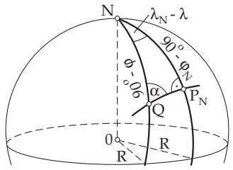
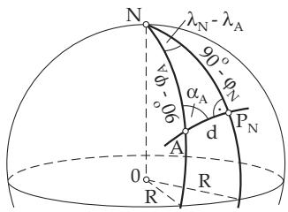
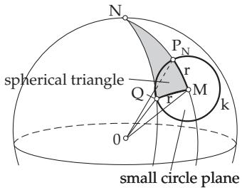
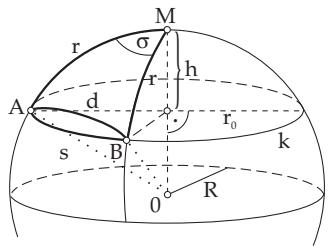
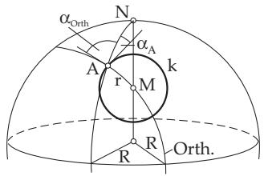
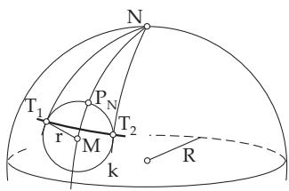
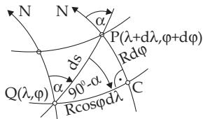
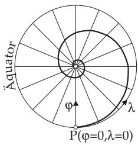

##### 3.4.3.4 Spherical Curves

Spherical trigonometry has a very important application in navigation. One basic problem is to determine the course angle, which gives the optimal route. Other fields of application are geodesic surveys and also robot-movement planning.

Table 3.11 Fourth basic problem for spherical oblique triangles
<table><tr><td colspan="2">Fourth basic problem Given: One side and two adjacent angles,  $\underline { { \mathbf { e . g . } , } } \alpha , \beta , c$ </td><td>WSW</td></tr><tr><td colspan="2">Condition: none Solution 1: Required γ, or γ and a .</td><td></td></tr><tr><td rowspan="8">cos γ = − cos α cos β + sin α sin  $\beta$  sin  $a = { \frac { \sin c \sin \alpha } { \sin \gamma } }$  a can be in quadrant I or II. We ap- ply the theorem: The larger side is in opposite to the larger angle or checking calculation: α in q. I. cos α + cos  $\beta$  COS  $\gamma \overset { > } { < } 0 $  α in q. II. Solution 2: Required  $^ { a , }$  or a and  $\gamma$   $a = { \frac { \tan c \cos \mu } { \cos ( \beta - \mu ) } }$  cot µ = tan α cos c , tan 2  $\gamma = { \frac { \cot ( \beta - \mu ) } { \cos \alpha } }$  tan cOS a Solution 3: Required a and (or) b.  ${ \frac { a + b } { 2 } } = { \frac { \cos { \frac { \alpha - \beta } { 2 } } } { \cos { \frac { \alpha + \beta } { 2 } } } } \tan { \frac { c } { 2 } } ,$  tan  ${ \frac { a - b } { 2 } } = { \frac { \sin { \frac { \alpha - \beta } { 2 } } } { \sin { \frac { \alpha + \beta } { 2 } } } } \tan { \frac { c } { 2 } }$ </td><td>COS  $c$   $( - 9 0 ^ { \circ } < { \frac { a - b } { \mathrm { 2 } } } < 9 0 ^ { \circ } ) ,$   $a = { \frac { a + b } { 2 } } + { \frac { a - b } { 2 } } , b = { \frac { a + b } { 2 } } - { \frac { a - b } { 2 } }$ </td></tr><tr><td>Solution 4: Required  $a , b , \gamma .$ </td></tr><tr><td> $\tan { \frac { a + b } { 2 } } = { \frac { \cos { \frac { \alpha - \beta } { 2 } } \sin { \frac { c } { 2 } } } { \cos { \frac { \alpha + \beta } { 2 } } \cos { \frac { c } { 2 } } } } = { \frac { Z } { N } } ,$ </td></tr><tr><td></td></tr><tr><td> $\tan { \frac { a - b } { 2 } } = { \frac { \sin { \frac { \alpha - \beta } { 2 } } \sin { \frac { \bar { c } } { 2 } } } { \sin { \frac { \alpha + \beta } { 2 } } \cos { \frac { c } { 2 } } } } = { \frac { Z ^ { \prime } } { N ^ { \prime } } }$  a − b (90° &lt;</td></tr></table>

1. Orthodrome

1. Notion The geodesic lines of the surface of the sphere – which are curves, connecting two points A and B by the shortest path – are called orthodromes or great circles (see 3.4.1.1, 3., p. 160).

2. Equation ofthe Orthodrome Moving on an orthodrome – except for meridians and the equator – needs a continuous change of course angle. These orthodromes with position-dependent course angles α can be given uniquely by their point closest to the north pole $P _ { \mathrm { N } } ( \lambda _ { \mathrm { N } } , \varphi _ { \mathrm { N } } )$ , where $\varphi _ { \mathrm { N } } > 0 ^ { \circ }$ holds. The orthodrome has the course angle $\alpha _ { \mathrm { N } } = 9 0 ^ { \circ }$ at the point closest to the north pole. The equation of the orthodrome through $P _ { \mathrm { { N } } }$ and the running point $Q ( \lambda , \varphi )$ , whose relative position to $P _ { \mathrm { { N } } }$ is arbitrary, can be given by the Neper rule (3.4.3.2,2., p. 170) according to Fig. 3.105 as:

tan $\varphi _ { \mathrm { N } } \cos ( \lambda - \lambda _ { \mathrm { N } } ) = \tan \varphi .$

(3.203)

Point Closest to the North Pole: The coordinates of the point closest to the north pole $P _ { \mathrm { N } } ( \lambda _ { \mathrm { N } } , \varphi _ { \mathrm { N } } )$ of an orthodrome with a course angle $\alpha _ { A } \ \left( \alpha _ { A } \neq 0 ^ { \circ } \right)$ at the point $A ( \lambda _ { A } , \varphi _ { A } ) ( \varphi _ { A } \neq 9 \bar { 0 } ^ { \circ } )$ can be calculated by the Neper rule (3.4.3.2,2., p. 170) considering the relative position of $P _ { \mathrm { N } }$ and the sign of $\alpha _ { A }$ according to Fig. 3.106 as:

$$
\varphi _ { \mathrm { N } } = \operatorname { a r c c o s } ( \sin | \alpha _ { A } | \cos \varphi _ { A } ) \quad ( 3 . 2 0 4 \mathrm { a } ) \quad \mathrm { ~ a n d ~ } \quad \lambda _ { \mathrm { N } } = \lambda _ { A } + \operatorname { s i g n } ( \alpha _ { A } ) \left| \operatorname { a r c c o s } \frac { \tan \varphi _ { A } } { \tan \varphi _ { \mathrm { N } } } \right| .\tag{3.204b}
$$

Remark: If a calculated geographical distance λ is not in the domain $- 1 8 0 ^ { \circ } < \lambda \leq 1 8 0 ^ { \circ }$ , then for $\lambda \neq \pm k \cdot 1 8 0 ^ { \circ } ( k \in \mathbb { N } )$ the reduced geographical distance $\lambda _ { \mathrm { r e d } }$ is:

$\lambda _ { \mathrm { { r e d } } } = 2$ arctan $\left( \tan { \frac { \lambda } { 2 } } \right)$

(3.205)

This is called the reduction of the angle in the domain.

Table 3.12 Fifth and sixth basic problems for a spherical oblique triangle
<table><tr><td>Fifth basic problem SSW Given: 2 sides and an angle opposite</td></tr><tr><td>to one of them,  $\mathbf { e . g . } , a , b ,$  α Conditions: See distinction of cases.</td><td colspan="2">Given: 2 angles and a side opposite to one of them,  $\mathbf { e . g . } , a , \alpha , \beta$  Conditions: See distinction of cases.</td></tr><tr><td>Solution: Required is any missing quantity.  $\beta = \frac { \sin b \sin \alpha } { \sin a } \ ;$  sin 2 values  $\beta _ { 1 } , \beta _ { 2 }$  are possible. Let  $\beta _ { 1 }$  be acute and  $\beta _ { 2 } = 1 8 0 ^ { \circ } - \beta _ { 1 }$  obtuse. Distinction of cases:</td><td> $b = \frac { \sin a \sin \beta } { \sin \alpha }$  sin Let  $b _ { 1 }$  be acute and Distinction of cases:</td><td>Solution: Required is any missing quantity. 2 values  $b _ { 1 } , b _ { 2 }$  are possible.  $b _ { 2 } = 1 8 0 ^ { \circ } - \beta _ { 1 }$  obtuse.</td></tr><tr><td> $\frac { \sin b \sin \alpha } { \sin a } > 1$  1. 0 solution.  ${ \frac { \sin b \sin \alpha } { \sin a } } = 1$  2. 1 solution  $\beta = 9 0 ^ { \circ }$  sin 3.  $\frac { \scriptscriptstyle 1 \upsilon \sin \alpha } { \sin a } < 1$  3.1. sin a &gt; sin b :</td><td> $\frac { \sin a \sin \beta } { \sin \alpha } > 1$  1. 0 solution.  ${ \frac { \sin a \sin \beta } { \sin \alpha } } = 1$  2. 1 solution  $b = 9 0 ^ { \circ }$ </td></tr><tr><td>1 solution  $\beta _ { 1 }$ </td><td> $\frac { \sin a \sin \beta } { \sin \alpha } < 1$  3. 3.1.  $\sin \alpha > \sin \beta .$  3.1.1.  $\beta \quad < 9 0 ^ { \circ }$  1 solution  $b _ { 1 }$ </td></tr><tr><td>3.1.1.  $\begin{array} { r l } { b } & { { } < 9 0 ^ { \circ } } \end{array}$  3.1.2.  $b \_ > 9 0 ^ { \circ }$  1 solution  $\beta _ { 2 } .$  3.2. sin  $a < \sin b$   $a < 9 0 ^ { \circ } , \alpha < 9 0 ^ { \circ } \mid 2$  solutions 3.2.1.  $a > 9 0 ^ { \circ } , \alpha > 9 0 ^ { \circ } \left. \right\}$   $\beta _ { 1 } , \beta _ { 2 } .$   $a < 9 0 ^ { \circ } , \alpha > 9 0 ^ { \circ } { \stackrel { . } { \gamma } }$  }0 solution. 3.2.2.  $a > 9 0 ^ { \circ } , \alpha < 9 0 ^ { \circ } \bigg \}$  Further calculations with one angle or with two angles  $\beta$  </td><td>3.1.2.  $\beta \quad > 9 0 ^ { \circ }$  1 solution  $b _ { 2 } .$  3.2. sin  $\alpha < \sin \beta$   $a < 9 0 ^ { \circ } , \alpha < 9 0 ^ { \circ } \mid 2$  solutions 3.2.1.  $a > 9 0 ^ { \circ } , \alpha > 9 0 ^ { \circ } \left. \right\}$   $b _ { 1 } , b _ { 2 } .$   $a < 9 0 ^ { \circ } , \alpha > 9 0 ^ { \circ } { \stackrel { . } { \big ] } }$  3.2.2.  $a > 9 0 ^ { \circ } , \alpha < 9 0 ^ { \circ } \Big \}$  0 solution. Further calculations with one side or with two sides b:</td></tr><tr><td>Method 1: Method 2: tan u = tan b cos α ,  $\tan v = \tan a \cos \beta .$   $\begin{array} { r l r l } { c } & { { } } & { = u + v , } \end{array}$  cot φ = cos b tan α , cot  $\psi = \cos a \tan \beta$  7  $\begin{array} { r l r } { \gamma } & { { } } & { = \varphi + \psi . } \end{array}$ </td><td> $\tan { \frac { c } { 2 } } = \tan { \frac { a + b } { 2 } } { \frac { \cos { \frac { \alpha + \beta } { 2 } } } { \cos { \frac { \alpha - \beta } { 2 } } } } ,$   $\tan { \frac { \gamma } { 2 } } = \cot { \frac { \alpha + \beta } { 2 } } { \frac { \cos { \frac { a - b } { 2 } } } { \sin { \frac { a + b } { 2 } } } }$   $= \tan { \frac { a - b } { 2 } } { \frac { \sin { \frac { \alpha + \beta } { 2 } } } { \sin { \frac { \alpha - \beta } { 2 } } } }$   $= \cot { \frac { \alpha - \beta } { 2 } } { \frac { \sin { \frac { a - b } { 2 } } } { \sin { \frac { a + b } { 2 } } } }$   $\frac { c } { 2 }$   $\frac { \gamma } { 2 }$  Checking: Double calculation of and</td></tr></table>

Intersection Points with the Equator: The intersection points $P _ { \mathrm { E } _ { 1 } } ( \lambda _ { \mathrm { E } _ { 1 } } , 0 ^ { \circ } )$ and $P _ { \mathrm { E } _ { 2 } } ( \lambda _ { \mathrm { E } _ { 2 } } , 0 ^ { \circ } )$ of the orthodrome with the equator can be calculated from (3.203) because tan ϕ cos $( \lambda _ { \mathrm { E } _ { \nu } } - \bar { \lambda } _ { \mathrm { N } } \bar { ) } = 0 \ ( \nu =$ 1, 2) must hold:

$$
\lambda _ { \mathrm { E } _ { \nu } } = \lambda _ { \mathrm { N } } \mp 9 0 ^ { \circ } \qquad ( \nu = 1 , 2 ) .\tag{3.206}
$$

  
Figure 3.105  
Figure 3.106

Remark: In certain cases an angle reduction is needed according to (3.205).

3. Arclength If the orthodrome goes through the points $A ( \lambda _ { A } , \varphi _ { A } )$ and $B ( \lambda _ { B } , \varphi _ { B } )$ , the cosine law for sides yields for the spherical distance d or for the arclength between the two points:

$$
d = \operatorname { a r c c o s } [ \sin \varphi _ { A } \sin \varphi _ { B } + \cos \varphi _ { A } \cos \varphi _ { B } \cos ( \lambda _ { B } - \lambda _ { A } ) ] .\tag{3.207a}
$$

This central angle can be converted into a length considering the radius of the Earth R:

$$
d = \operatorname { a r c c o s } [ \sin \varphi _ { A } \sin \varphi _ { B } + \cos \varphi _ { A } \cos \varphi _ { B } \cos ( \lambda _ { B } - \lambda _ { A } ) ] \cdot { \frac { \pi R } { 1 8 0 ^ { \circ } } } .\tag{3.207b}
$$

4. Course Angle Using the sine and cosine laws for sides to calculate sin $\alpha _ { A }$ and cos $\alpha _ { A }$ , gives the final result for the course angle $\alpha _ { A }$ after division:

$$
\alpha _ { A } = \arctan \frac { \cos \varphi _ { A } \cos \varphi _ { B } \sin ( \lambda _ { B } - \lambda _ { A } ) } { \sin \varphi _ { B } - \sin \varphi _ { A } \cos d } .\tag{3.208}
$$

Remark: With the formulas (3.207a), (3.208), (3.204a) and (3.204b), the coordinates of the point $P _ { \mathrm { { N } } }$ closest to the north pole can be calculated for the orthodrome given by the two points A and B.

5. Intersection Point with a Parallel Circle For the intersection points $X _ { 1 } ( \lambda _ { X _ { 1 } } , \varphi _ { X } )$ and $X _ { 2 } ( \lambda _ { X _ { 2 } }$ $\varphi _ { X } )$ of an orthodrome with the parallel circle $\varphi = \varphi _ { X }$ one gets from (3.203):

$$
\lambda _ { X \nu } = \lambda _ { \mathrm { N } } \mp \operatorname { a r c c o s } \frac { \tan \varphi _ { X } } { \tan \varphi _ { \mathrm { N } } } \quad ( \nu = 1 , 2 ) .\tag{3.209}
$$

From the Neper rule $( 3 . 4 . 3 . 2 , 2 . , \mathrm { ~ p ~ }$ . 170) used for the intersection angles $\alpha _ { X _ { 1 } }$ and $\alpha _ { X _ { 2 } }$ , by which an orthodrome with a point $P _ { \mathrm { N } } ( \lambda _ { \mathrm { N } } , \varphi _ { \mathrm { N } } )$ closest to the north pole intersects the parallel circle $\varphi = \varphi _ { X }$

$$
\left. \alpha _ { X _ { \nu } } \right. = \arcsin { \frac { \cos \varphi _ { \mathrm { \tiny N } } } { \cos \varphi _ { X } } } \qquad ( \nu = 1 , 2 ) .\tag{3.210}
$$

The argument in the arc sine function must be extremal with respect to the variable $\varphi _ { X }$ for the minimal course angle $| \alpha _ { \mathrm { m i n } } |$ . This gives: sin $\varphi _ { X } = 0 \ \Rightarrow \ \varphi _ { X } = 0$ , i.e., the absolute value of the course angle is minimal at the intersection points of the equator:

$$
| \alpha _ { X _ { \mathrm { m i n } } } | = 9 0 ^ { \circ } - \varphi _ { \mathrm { N } } .\tag{3.211}
$$

Remark 1: Solutions of (3.209) exist only for $\vert \varphi _ { X } \vert \leq \varphi _ { \mathrm { N } }$

Remark 2: In certain cases a reduction of the angle is needed according to (3.205).

6. Intersection Point with a Meridian For the intersection point ${ \cal Y } ( \lambda _ { Y } , \varphi _ { Y } )$ of an orthodrome with the meridian $\lambda = \lambda _ { Y }$ according to (3.203) is given by

$$
\varphi _ { Y } = \arctan [ \tan \varphi _ { \mathrm { N } } \cos ( \lambda _ { Y } - \lambda _ { \mathrm { N } } ) ] .\tag{3.212}
$$

2. Small Circle

1. Notion The definition of a small circle on the surface of the sphere must be discussed here in more detail than in 3.4.1.1, p. 160: The small circle is the locus of the points of the surface (of the sphere) at a spherical distance r $( r < 9 0 ^ { \circ } )$ from a point fixed on the surface $M ( \lambda _ { M } , \varphi _ { M } )$ (Fig. 3.107). The spherical center is denoted by $M ; r$ is called the spherical radius ofthe small circle.

The plane of the small circle is the base of a spherical cap with an altitude h (see 3.3.4, p. 158). The spherical center M is above the center of the small circle in the plane of the small circle. In the plane the circle has the planar radius of the small circle $r _ { 0 }$ (Fig. 3.108). Hence, parallel circles are special small circles with $\varphi _ { M } = \pm 9 0 ^ { \circ }$

For $r \to 9 0 ^ { \circ }$ the small circle tends to an orthodrome.

  
Figure 3.107

  
Figure 3.108

2. Equations of Small Circles As defining parameters either M and r can be used or the small circle point $P _ { \mathrm { N } } ( \lambda _ { \mathrm { N } } , \varphi _ { \mathrm { N } } )$ nearest the north pole and r. If the running point on the small circle is $Q ( \lambda , \varphi )$ one gets the equation of the small circle with the cosine law for sides corresponding to Fig. 3.107:

$$
\cos r = \sin \varphi \sin \varphi _ { M } + \cos \varphi \cos \varphi _ { M } \cos ( \lambda - \lambda _ { M } ) .\tag{3.213a}
$$

From here, because of $\varphi _ { M } = \varphi _ { \mathrm { N } } - r$ and $\lambda _ { M } = \lambda _ { \mathrm { N } }$

$$
\cos r = \sin \varphi \sin ( \varphi _ { \mathrm { N } } - r ) + \cos \varphi \cos ( \varphi _ { \mathrm { N } } - r ) \cos ( \lambda - \lambda _ { \mathrm { N } } ) .\tag{3.213b}
$$

A: For $\varphi _ { M } = 9 0 ^ { \circ }$ the parallel circles are obtained from (3.213a), since cos r = sin $\varphi \Rightarrow \sin ( 9 0 ^ { \circ } -$ r) = sin $\varphi \Rightarrow \varphi = \mathrm { c o n s t }$

B: For $r \to 9 0 ^ { \circ }$ follow orthodromes from (3.213b).

3. Arclength The arclength s between two points $A ( \lambda _ { A } , \varphi _ { A } )$ and $B ( \lambda _ { B } , \varphi _ { B } )$ on a small circle k can be calculated corresponding to Fig. 3.108 from the equalities $\frac { s } { \sigma } = \frac { 2 \pi r _ { 0 } } { 3 6 0 ^ { \circ } }$ , cos $d = \cos ^ { 2 } r + \sin ^ { 2 } r$ cos σ and $r _ { 0 } = R \sin r \mathrm { : }$

$$
s = \sin r \operatorname { a r c c o s } \frac { \cos d - \cos ^ { 2 } r } { \sin ^ { 2 } r } \cdot \frac { \pi R } { 1 8 0 ^ { \circ } } .\tag{3.214}
$$

For $r  9 0 ^ { \circ }$ the small circle becomes an orthodrome, and from (3.214) and (3.207b) it follows that $s = d .$

4. Course Angle According to Fig. 3.109 the orthodrome passing through $A ( \lambda _ { A } , \varphi _ { A } )$ and $M ( \lambda _ { M }$ $\varphi _ { M } )$ intersects perpendicularly the small circle with radius r. For the course angle $\alpha _ { \mathrm { O r t h } }$ of the orthodrome after (3.208)

$$
\alpha _ { \mathrm { O r t h } } = \arctan \frac { \cos \varphi _ { A } \cos \varphi _ { M } \sin ( \lambda _ { M } - \lambda _ { A } ) } { \sin \varphi _ { M } - \sin \varphi _ { A } \cos r }\tag{3.215a}
$$

is valid. So, one gets for the required course angle $\alpha _ { A }$ of the small circle at the point A:

$$
\alpha _ { A } = ( | \alpha _ { \mathrm { O r t h } } | - 9 0 ^ { \circ } ) \mathrm { s i g n } ( \alpha _ { \mathrm { O r t h } } ) .\tag{3.215b}
$$

5. Intersection Points with a Parallel Circle For the geographical longitude of the intersection points $X _ { 1 } ( \lambda _ { X _ { 1 } } , \varphi _ { X } )$ and $X _ { 2 } ( \lambda _ { X _ { 2 } } , \varphi _ { X } )$ of the small circle with the parallel circle $\varphi = \varphi _ { X }$ follows from

  
Figure 3.109

  
Figure 3.110

(3.213a):

$$
\lambda _ { X _ { \nu } } = \lambda _ { M } \mp \operatorname { a r c c o s } { \frac { \cos r - \sin \varphi _ { X } \sin \varphi _ { M } } { \cos \varphi _ { X } \cos \varphi _ { M } } } \qquad ( \nu = 1 , 2 ) .\tag{3.216}
$$

Remark: In some cases an angle reduction is needed according to (3.205).

6. Tangential Point The small circle is touched by two meridians, the tangential meridians, at the tangential points $T _ { 1 } ( \lambda _ { T _ { 1 } } , \varphi _ { T } )$ and $T _ { 2 } ( \lambda _ { T _ { 2 } } , \varphi _ { T } )$ (Fig. 3.110). Because for them the argument of the arc cosine in (3.216) must be extremal with respect to the variable $\varphi _ { X }$ , holds:

$$
\varphi _ { T } = \arcsin { \frac { \sin \varphi _ { M } } { \cos r } } , \ ( 3 . 2 1 7 \mathrm { a } ) \lambda _ { T _ { \nu } } = \lambda _ { M } \mp \operatorname { a r c c o s } { \frac { \cos r - \sin \varphi _ { X } \sin \varphi _ { M } } { \cos \varphi _ { X } \cos \varphi _ { M } } } \quad ( \nu = 1 , 2 ) .\tag{3.217b}
$$

Remark: In certain cases an angle reduction is needed according to (3.205).

7. Intersection Points with a Meridian The calculation of the geographical latitudes of the intersection points $Y _ { 1 } ( \lambda _ { Y } , \varphi _ { Y _ { 1 } } )$ and $Y _ { 2 } ( \lambda _ { Y } , \varphi _ { Y _ { 2 } } )$ of the small circle with meridian $\lambda = \lambda _ { Y }$ can be done according to (3.213a) with the equations

$$
\varphi _ { Y _ { \nu } } = \arcsin \frac { - A C \pm B \sqrt { A ^ { 2 } + B ^ { 2 } - C ^ { 2 } } } { A ^ { 2 } + B ^ { 2 } } \qquad ( \nu = 1 , 2 ) ,\tag{3.218a}
$$

where the following notations are used:

$$
A = \sin \varphi _ { M } , \qquad B = \cos \varphi _ { M } \cos ( \lambda _ { Y } - \lambda _ { M } ) , \qquad C = - \cos r .\tag{3.218b}
$$

For $A ^ { 2 } + B ^ { 2 } > C ^ { 2 }$ , in general, there are two diferent solutions, from which one is missing if a pole is on the small circle.

If $A ^ { 2 } + B ^ { 2 } = C ^ { 2 }$ holds and there is no pole on the small circle, then the meridian touches the small circle at a tangential point with geographical latitude $\varphi _ { Y _ { 1 } } = \varphi _ { Y _ { 2 } } = \varphi _ { T }$

  
Figure 3.111

3. Loxodrome

1. Notion A spherical curve, intersecting all meridians with the same course angle, is called a loxodrome or spherical helix. So, parallels $( \alpha = 9 0 ^ { \circ } )$ and meridians $( \alpha = 0 ^ { \circ } )$ are special loxodromes.

2. Equation ofthe Loxodrome Fig. 3.111 shows a loxodrome with course angle α through the running point $Q ( \lambda , \varphi )$ and the infinitesimally close point $\bar { P ( \lambda + d \lambda , \varphi + d \varphi ) }$ . The right-angled spherical triangle $Q C P$ can be considered as a plane triangle because of its small size. Then:

$$
\tan \alpha = { \frac { R \cos \varphi d \lambda } { R d \varphi } } \Rightarrow d \lambda = { \frac { \tan \alpha d \varphi } { \cos \varphi } } .\tag{3.219a}
$$

Considering that the loxodrome must go through the point $A ( \lambda _ { A } , \varphi _ { A } )$ , therefore, the equation of the loxodrome follows by integration:

$$
\lambda - \lambda _ { A } = \tan \alpha \ln { \frac { \tan \left( 4 5 ^ { \circ } + { \frac { \varphi } { 2 } } \right) } { \tan \left( 4 5 ^ { \circ } + { \frac { \varphi _ { A } } { 2 } } \right) } } \cdot { \frac { 1 8 0 ^ { \circ } } { \pi } } \qquad ( \alpha \neq 9 0 ^ { \circ } ) .\tag{3.219b}
$$

In particular if A is the intersection point $P _ { \mathrm { E } } ( \lambda _ { \mathrm { E } } , 0 ^ { \circ } )$ of the loxodrome with the equator, then:

$$
\lambda - \lambda _ { \mathrm { E } } = \tan \alpha \ln \tan \left( 4 5 ^ { \circ } + { \frac { \varphi } { 2 } } \right) \cdot { \frac { 1 8 0 ^ { \circ } } { \pi } } \qquad \left( \alpha \neq 9 0 ^ { \circ } \right) .\tag{3.219c}
$$

Remark: The calculation of λ can be done with (3.224).

3. Arclength From Fig. 3.111 one can find the diferential relation

$$
\cos \alpha = { \frac { R d \varphi } { d s } } \ \Rightarrow \ d s = { \frac { R d \varphi } { \cos \alpha } } .\tag{3.220a}
$$

Integration with respect to $\varphi$ results in the arclength s of the arc segment with the endpoints $A ( \lambda _ { A } , \varphi _ { A } )$ and $\mathbf { \bar { \mathit { B } } } ( \lambda _ { B } , \varphi _ { B } )$

$$
s = { \frac { \left| \varphi _ { B } - \varphi _ { A } \right| } { \cos \alpha } } \cdot { \frac { \pi R } { 1 8 0 ^ { \circ } } } \qquad ( \alpha \neq 9 0 ^ { \circ } ) .\tag{3.220b}
$$

If A is the starting point and B is the endpoint, then from the given values A, α and s can be determined step-by-step first $\varphi _ { B }$ from (3.220b), then $\lambda _ { B }$ from (3.219b).

Approximation Formulas: According to Fig. 3.111, with $Q \ = \ A$ and $P ~ = ~ B$ one can get an approximation for the arclength l with the arithmetical mean of the geographical latitudes with (3.221a) and (3.221b):

$$
\sin \alpha = \frac { \cos \frac { \varphi _ { A } + \varphi _ { B } } { 2 } ( \lambda _ { B } - \lambda _ { A } ) } { l } \cdot \frac { \pi R } { 1 8 0 ^ { \circ } } \cdot ( 3 . 2 2 1 \mathrm { a } ) \qquad l = \frac { \cos \frac { \varphi _ { A } + \varphi _ { B } } { 2 } } { \sin \alpha } ( \lambda _ { B } - \lambda _ { A } ) \cdot \frac { \pi R } { 1 8 0 ^ { \circ } } \cdot \ln \frac { \lambda _ { B } } { 2 } .\tag{3.221b}
$$

4. Course Angle For the course angle α of the loxodrome through the points $A ( \lambda _ { A } , \varphi _ { A } )$ and $B ( \lambda _ { B } , \varphi _ { B } )$ , or through $A ( \lambda _ { A } , \varphi _ { A } )$ and its equator intersection point $P _ { \mathrm { { E } } } ( \lambda _ { \mathrm { { E } } } , 0 ^ { \circ } )$ according to (3.219b) and (3.219c) the following holds:

$$
\begin{array}{c} \alpha = \arctan { \frac { ( \lambda _ { B } - \lambda _ { A } ) } { \tan \left( 4 5 ^ { \circ } + { \frac { \varphi _ { B } } { 2 } } \right) } } \cdot { \frac { \pi } { 1 8 0 ^ { \circ } } } , ( 3 . 2 2 2 \mathrm { a } )  \\ { \ln { \frac { \left( 4 5 ^ { \circ } + { \frac { \varphi _ { B } } { 2 } } \right) } { \tan \left( 4 5 ^ { \circ } + { \frac { \varphi _ { A } } { 2 } } \right) } } \cdot { \frac { \pi } { 1 8 0 ^ { \circ } } } = \arctan { \frac { ( \lambda _ { A } - \lambda _ { \mathrm { E } } ) } { \ln \tan \left( 4 5 ^ { \circ } + { \frac { \varphi _ { A } } { 2 } } \right) } } \cdot { \frac { \pi } { 1 8 0 ^ { \circ } } } . } \end{array}\tag{3.222b}
$$

5. Intersection Point with a Parallel Circle Suppose a loxodrome passes through the point $A ( \lambda _ { A } , \varphi _ { A } )$ with a course angle α. The intersection point $X ( \lambda _ { X } , \varphi _ { X } )$ of the loxodrome with a parallel circle $\varphi = \varphi _ { X }$ is calculated from (3.219b):

$$
\lambda _ { X } = \lambda _ { A } + \tan \alpha \cdot \ln { \frac { \tan \left( 4 5 ^ { \circ } + { \frac { \varphi _ { X } } { 2 } } \right) } { \tan \left( 4 5 ^ { \circ } + { \frac { \varphi _ { A } } { 2 } } \right) } } \cdot { \frac { 1 8 0 ^ { \circ } } { \pi } } \qquad ( \alpha \neq 9 0 ^ { \circ } ) .\tag{3.223}
$$

With (3.223) the intersection point with the equator $P _ { \mathrm { E } } ( \lambda _ { \mathrm { E } } , 0 ^ { \circ } )$ is calculated as

$$
\lambda _ { \mathrm { E } } = \lambda _ { A } - \tan \alpha \cdot \ln \tan \left( 4 5 ^ { \circ } + { \frac { \varphi _ { A } } { 2 } } \right) \cdot { \frac { 1 8 0 ^ { \circ } } { \pi } } \qquad ( \alpha \neq 9 0 ^ { \circ } ) .\tag{3.224}
$$

  
Figure 3.112

Remark: In certain cases an angle reduction is needed according to (3.205).

6. Intersection Point with a Meridian Loxodromes – except parallel circles and meridians – wind in a spiral form around the pole (Fig. 3.112). The infinitely many intersection points ${ Y } _ { \nu } ( \lambda _ { Y } , \dot { \varphi } _ { Y _ { \nu } } )$ $( \nu \in \mathbb { Z } )$ of the loxodrome passing through $A ( \lambda _ { A } , \varphi _ { A } )$ with course angle α with the meridian $\lambda = \lambda _ { Y }$ can be calculated from (3.219b):

$$
\begin{array} { l } { \displaystyle { \varphi _ { Y _ { \nu } } = 2 \arctan \{ \exp [ \frac { \lambda _ { Y } - \lambda _ { A } + \nu \cdot 3 6 0 ^ { \circ } } { \tan \alpha } \cdot \frac { \pi } { 1 8 0 ^ { \circ } } ]  } } \\ { \displaystyle { \qquad \cdot \tan ( 4 5 ^ { \circ } + \frac { \varphi _ { A } } { 2 } ) \} - 9 0 ^ { \circ } \qquad ( \nu \in \mathbb { Z } ) . } } \end{array}\tag{3.225}
$$

If A is the equator intersection point $P _ { \mathrm { E } } ( \lambda _ { \mathrm { E } } , 0 ^ { \circ } )$ of the loxodrome, then simply holds

$$
\varphi _ { Y _ { \nu } } = 2 \arctan \exp \left[ \frac { \lambda _ { Y } - \lambda _ { \mathrm { E } } + \nu \cdot 3 6 0 ^ { \circ } } { \tan \alpha } \cdot \frac { \pi } { 1 8 0 ^ { \circ } } \right] - 9 0 ^ { \circ } \qquad ( \nu \in \mathbb { Z } ) .\tag{3.226}
$$

4. Intersection Points of Spherical Curves

1. Intersection Points of Two Orthodromes Suppose the considered orthodromes have points $P _ { \mathrm { N _ { 1 } } } ( \lambda _ { \mathrm { N _ { 1 } } } , \varphi _ { \mathrm { N _ { 1 } } } )$ and $P _ { \mathrm { N _ { 2 } } } ( \lambda _ { \mathrm { N _ { 2 } } } , \varphi _ { \mathrm { N _ { 2 } } } )$ closest to the north pole, where $P _ { \mathrm { N _ { 1 } } } \neq P _ { \mathrm { N _ { 2 } } }$ holds. Substituting the intersection point $S ( \lambda _ { S } , \varphi _ { S } )$ in both orthodrome equations gives the system of equations:

$$
\tan \varphi _ { \mathrm { N _ { 1 } } } \cos ( \lambda _ { S } - \lambda _ { \mathrm { N _ { 1 } } } ) = \tan \varphi _ { S } , ( 3 . 2 2 7 \mathrm { a } )
$$

$$
\tan \varphi _ { \mathrm { N } _ { 2 } } \cos ( \lambda _ { S } - \lambda _ { \mathrm { N } _ { 2 } } ) = \tan \varphi _ { S } .\tag{3.227b}
$$

Elimination of $\varphi _ { S }$ and using the addition law for the cosine function yields:

$$
\tan \lambda _ { S } = - \frac { \tan \varphi _ { \mathrm { N _ { 1 } } } \cos \lambda _ { \mathrm { N _ { 1 } } } - \tan \varphi _ { \mathrm { N _ { 2 } } } \cos \lambda _ { \mathrm { N _ { 2 } } } } { \tan \varphi _ { \mathrm { N _ { 1 } } } \sin \lambda _ { \mathrm { N _ { 1 } } } - \tan \varphi _ { \mathrm { N _ { 2 } } } \sin \lambda _ { \mathrm { N _ { 2 } } } } .\tag{3.228}
$$

The equation (3.228) has two solutions $\lambda _ { S _ { 1 } }$ and $\lambda _ { S _ { 2 } }$ in the domain $- 1 8 0 ^ { \circ } < \lambda \leq 1 8 0 ^ { \circ }$ of the geographical longitude. The corresponding geographical latitudes can be got from (3.227a):

$$
\varphi _ { S _ { \nu } } = \arctan [ \tan \varphi _ { \mathrm { N _ { 1 } } } \cos ( \lambda _ { S _ { \nu } } - \lambda _ { \mathrm { N _ { 1 } } } ) ] \qquad ( \nu = 1 , 2 ) .\tag{3.229}
$$

The intersection points $S _ { 1 }$ and $S _ { 2 }$ are antipodal points, i.e., they are the mirror images of each other with respect to the centre of the sphere.

2. Intersection Points of Two Loxodromes Suppose the considered loxodromes have equator intersection points $P _ { \mathrm { E } _ { 1 } } ( \lambda _ { \mathrm { E } _ { 1 } } , 0 ^ { \circ } )$ and $P _ { \mathrm { E } _ { 2 } } ( \lambda _ { \mathrm { E } _ { 2 } } , 0 ^ { \circ } )$ and the course angles $\alpha _ { 1 }$ und α2 $( \alpha _ { 1 } \neq \alpha _ { 2 } )$ . Substituting the intersection point $S ( \lambda _ { S } , \varphi _ { S } )$ in both loxodrome equations gives the system of equations:

$$
\lambda _ { S } - \lambda _ { \mathrm { E } _ { 1 } } = \tan \alpha _ { 1 } \cdot \ln \tan \Big ( 4 5 ^ { \circ } + \frac { \varphi _ { S } } { 2 } \Big ) \cdot \frac { 1 8 0 ^ { \circ } } { \pi } \qquad ( \alpha _ { 1 } \neq 9 0 ^ { \circ } ) ,\tag{3.230a}
$$

$$
\lambda _ { S } - \lambda _ { \mathrm { E } _ { 2 } } = \tan \alpha _ { 2 } \cdot \ln \tan \left( 4 5 ^ { \circ } + { \frac { \varphi _ { S } } { 2 } } \right) \cdot { \frac { 1 8 0 ^ { \circ } } { \pi } } \qquad ( \alpha _ { 2 } \neq 9 0 ^ { \circ } ) .\tag{3.230b}
$$

Elimination of $\lambda _ { S }$ and expressing $\varphi _ { S }$ gives an equation with infinitely many solutions:

$$
\varphi _ { S _ { \nu } } = 2 \arctan \exp \left[ { \frac { \lambda _ { \mathrm { E } _ { 1 } } - \lambda _ { E _ { 2 } } + \nu \cdot 3 6 0 ^ { \circ } } { \tan \alpha _ { 2 } - \tan \alpha _ { 1 } } } \cdot { \frac { \pi } { 1 8 0 ^ { \circ } } } \right] - 9 0 ^ { \circ } ( \nu \in \mathbb { Z } ) .\tag{3.231}
$$

The corresponding geographical longitudes $\lambda _ { S _ { \nu } }$ can be found by substituting $\varphi _ { S _ { \nu } }$ in (3.230a):

$$
\lambda _ { S _ { \nu } } = \lambda _ { \mathrm { E } _ { 1 } } + \tan \alpha _ { 1 } \ln \tan \Big ( 4 5 ^ { \circ } + \frac { \varphi _ { S _ { \nu } } } { 2 } \Big ) \cdot \frac { 1 8 0 ^ { \circ } } { \pi } \qquad ( \alpha _ { 1 } \neq 9 0 ^ { \circ } ) , \quad ( \nu \in \mathbb { Z } ) .\tag{3.232}
$$

Remark: In certain cases an angle reduction is needed according to (3.205).
