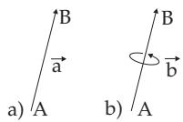
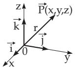
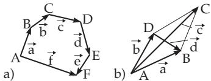

##### 3.5.1.1 Definition of Vectors

1. Scalars and Vectors

Quantities whose values are real numbers are called scalars. Examples are mass, temperature, energy, and work (for scalar invariant see 3.5.1.5, p. 185, 1., p. 214 and 4.3.5.2, p. 288).

Quantities which can be completely described by a magnitude and by a direction in space are called vectors. Examples are power, velocity, acceleration, angular velocity, angular acceleration, and electrical and magnetic force. We represent vectors by directed line segments in space.

In this book the vectors of three-dimensional Euclidean space are denoted by a, and in matrix theory by a (see also 4.1.3, p. 271).

2. Polar and Axial Vectors

Polar vectors represent quantities with magnitude and direction in space, such as speed and acceleration; axial vectors represent quantities with magnitude, direction in space, and direction of rotation, such as angular velocity and angular acceleration. In notation they are distinguished by a polar or by an axial arrow (Fig. 3.113). In mathematical discussion they are treated in the same way.

3. Magnitude or Absolute Value and Direction in Space

For the quantitative description of vectors a or a, as line segments between the initial and endpoint A and B resp., are used the magnitude, i.e., the absolute value a , the length of the line segment, and the direction in space, which is given by a set of angles.

4. Equality of Vectors

Two vectors a and $\vec { \mathbf { b } }$ are equal if their magnitudes are the same, and they have the same direction, i.e., if they are parallel and oriented identically.

Opposite and equal vectors are of the same magnitude, but oppositely directed:

$$
\overrightarrow { A B } = \overrightarrow { \mathbf { a } } , \overrightarrow { B A } = - \overrightarrow { \mathbf { a } } \qquad \mathrm { b u t } \qquad | \overrightarrow { A B } | = | \overrightarrow { B A } | .
$$

Axial vectors have opposite and equal directions of rotation in this case.

(3.233)

  
Figure 3.113

  
Figure 3.114

  
Figure 3.115

5. Free Vectors, Bound or Fixed Vectors, Sliding Vectors

A free vector is considered to be the same, i.e. its properties do not change, if it is translated parallel to itself, so its initial point can be an arbitrary point of the space. If the properties of a vector belong to a certain initial point, it is called a bound or fixed vector. A sliding vector can be translated only along the line it is already in.

6. Special Vectors

a) Unit Vector $\vec { \mathbf { a } } ^ { 0 } = \vec { \mathbf { e } }$ is a vector with length or absolute value equal to 1. With it the vector a can be expressed as a product of the magnitude and of a unit vector having the same direction as a:

$$
\vec { \mathbf { a } } = \vec { \mathbf { e } } | \vec { \mathbf { a } } | .\tag{3.234}
$$

The unit vectors $\vec { \bf i } , \vec { \bf j } , \vec { \bf k }$ or $\vec { \bf e } _ { i } , \vec { \bf e } _ { j } , \vec { \bf e } _ { k }$ (Fig. 3.114) are often used to denote the three coordinate axes in the direction of increasing coordinate values.

In Fig. 3.114 the directions given by the three unit vectors form an orthogonal triple. These unit vectors define an orthogonal coordinate system because for their scalar products

$$
\vec { \bf e _ { i } } \vec { \bf e _ { j } } = \vec { \bf e _ { i } } \vec { \bf e _ { k } } = \vec { \bf e _ { j } } \vec { \bf e _ { k } } = 0\tag{3.235}
$$

is valid. Furthermore also

$$
\vec { \bf e _ { i } } \vec { \bf e _ { i } } = \vec { \bf e _ { j } } \vec { \bf e _ { j } } = \vec { \bf e _ { k } } \vec { \bf e _ { k } } = 1 ,\tag{3.236}
$$

holds, i.e. it is an orthonormal coordinate system. (For more about scalar product see (3.248).)

b) Null Vector $\vec { 0 }$ or zero vector is the vector whose magnitude is equal to 0, i.e., its initial and endpoint coincide, and its direction is not defined.

c) Radius Vector r or position vector of a point P is the vector $\overrightarrow { \mathrm { 0 P } }$ with the initial point at the origin and endpoint at P (Fig. 3.114). In this case the origin is also called a pole or polar point. The point P is defined uniquely by its radius vector.

d) Collinear Vectors are parallel to the same line.

e) Coplanar Vectors are parallel to the same plane. They satisfy the equality (3.260).
