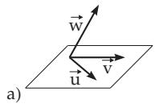
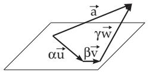
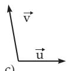
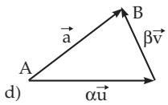

##### 3.5.1.2 Calculation Rules for Vectors

1. Sum of Vectors

a) The Sum of Two Vectors $\stackrel { \longrightarrow } { A B } = \vec { \bf a }$ and $\stackrel { \triangledown } { \vec { A } } \stackrel { \triangledown } { \boldsymbol { D } } = \vec { \mathbf { b } }$ can be represented also as the diagonal of the parallelogram $A B C D ,$ as the vector $A \stackrel { \prime } { C } = \vec { \mathbf { c } }$ in Fig. 3.115b. The most important properties of the sum of two vectors are the commutative law and the triangle inequality:

$$
\vec { \mathbf { a } } + \vec { \mathbf { b } } = \vec { \mathbf { b } } + \vec { \mathbf { a } } , \quad | \vec { \mathbf { a } } + \vec { \mathbf { b } } | \leq | \vec { \mathbf { a } } | + | \vec { \mathbf { b } } | .\tag{3.237a}
$$

b) The Sum of Several Vectors $\vec { \bf a } , \vec { \bf b } , \vec { \bf c } , \ldots , \vec { \bf e }$ is the vector $\vec { \bf f } = \overrightarrow { A F }$ , which closes the broken line composed of the vectors from a to e as in Fig. 3.115a. For n vectors $\vec { \bf a } _ { i } ( i = 1 , 2 , \dots , n )$ holds:

$$
\sum _ { i = 1 } ^ { n } { \vec { \mathbf { a } } } _ { i } = { \vec { \mathbf { f } } } .\tag{3.237b}
$$

Important properties of the sum of several vectors are the commutative law and the associative law of addition. For three vectors holds:

$$
{ \vec { \mathbf { a } } } + { \vec { \mathbf { b } } } + { \vec { \mathbf { c } } } = { \vec { \mathbf { c } } } + { \vec { \mathbf { b } } } + { \vec { \mathbf { a } } } , \quad ( { \vec { \mathbf { a } } } + { \vec { \mathbf { b } } } ) + { \vec { \mathbf { c } } } = { \vec { \mathbf { a } } } + ( { \vec { \mathbf { b } } } + { \vec { \mathbf { c } } } ) .\tag{3.237c}
$$

c) The Diference of Two Vectors $\vec { { \bf a } } - \vec { { \bf b } }$ can be considered as the sum of the vectors a und $- \vec { \mathbf { b } } _ { ; }$ , i.e.,

$$
\vec { \bf a } - \vec { \bf b } = \vec { \bf a } + ( - \vec { \bf b } ) = \vec { \bf d }\tag{3.237d}
$$

which is the other diagonal of the parallelogram (Fig. 3.115b). The most important properties of the diference of two vectors are:

$$
\vec { \mathbf { a } } - \vec { \mathbf { a } } = \vec { \mathbf { 0 } } \qquad \mathrm { ( n u l l ~ v e c t o r ) } , \qquad | \vec { \mathbf { a } } - \vec { \mathbf { b } } | \geq | | \vec { \mathbf { a } } | - | \vec { \mathbf { b } } | | .\tag{3.237e}
$$

b  

  
c  
Figure 3.116

2. Multiplication of a Vector by a Scalar, Linear Combination

The products α a and a α are equal to each other and they are parallel (collinear) to a. The length (absolute value) of the product vector is equal to $| \alpha | | \vec { \mathbf { a } } |$ . For $\alpha > 0$ the product vector has the same

direction as $\vec { \bf { a } } ;$ for $\alpha < 0$ it has the opposite one. The most important properties of the product of vectors by scalars are:

$$
\alpha \vec { \mathbf { a } } = \vec { \mathbf { a } } \alpha , \quad \alpha \beta \vec { \mathbf { a } } = \beta \alpha \vec { \mathbf { a } } , \quad ( \alpha + \beta ) \vec { \mathbf { a } } = \alpha \vec { \mathbf { a } } + \beta \vec { \mathbf { a } } , \quad \alpha ( \vec { \mathbf { a } } + \vec { \mathbf { b } } ) = \alpha \vec { \mathbf { a } } + \alpha \vec { \mathbf { b } } .\tag{3.238a}
$$

The linear combination of the vectors $\vec { \bf a } , \vec { \bf b } , \vec { \bf c } , \ldots , \vec { \bf d }$ with the scalars $\alpha , \beta , \ldots , \delta$ is the vector

$$
\vec { \bf { k } } = \alpha \vec { \bf { a } } + \beta \vec { \bf { b } } + \cdot \cdot \cdot + \delta \vec { \bf { d } } .\tag{3.238b}
$$

3. Decomposition of Vectors

In three-dimensional space every vector $\vec { \mathbf { a } }$ can be decomposed uniquely into a sum of three vectors, which are parallel to the three given non-coplanar vectors u, v, w (Fig. 3.116a,b) :

$$
\vec { \mathbf { a } } = \alpha \vec { \mathbf { u } } + \beta \vec { \mathbf { v } } + \gamma \vec { \mathbf { w } } .\tag{3.239a}
$$

The summands αu, ${ \beta } \vec { \bf v }$ and $\gamma \vec { \bf w }$ are called the components of the decomposition, the scalar factors $\alpha ,$ $\beta$ and $\gamma$ are the coeficients. When all the vectors are parallel to a plane one can write

$$
\vec { \mathbf { a } } = \alpha \vec { \mathbf { u } } + \beta \vec { \mathbf { v } }\tag{3.239b}
$$

with two non-collinear vectors u and v being parallel to the same plane (Fig. 3.116c,d).
