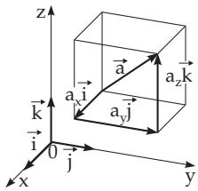

##### 3.5.1.3 Coordinates of a Vector

  
Figure 3.117

1. Cartesian Coordinates According to (3.239a) every vector ${ \overrightarrow { A B } } = $ a can be decomposed uniquely into a sum of vectors parallel to the basis vectors of the coordinate system $\vec { \bf i } , \vec { \bf j } , \vec { \bf k }$ or $\vec { \bf e } _ { i } , \vec { \bf e } _ { j } , \vec { \bf e } _ { k }$

$$
\vec { \mathbf { a } } = a _ { x } \vec { \mathbf { i } } + a _ { y } \vec { \mathbf { j } } + a _ { z } \vec { \mathbf { k } } = a _ { x } \vec { \mathbf { e } } _ { i } + a _ { y } \vec { \mathbf { e } } _ { j } + a _ { z } \vec { \mathbf { e } } _ { k } ,
$$

where the scalars $a _ { x } , a _ { y }$ and $a _ { z }$ are the Cartesian coordinates of the vector a in the system with the unit vectors $\vec { \mathbf { e } } _ { i } , \vec { \mathbf { e } } _ { j }$ and $\vec { \mathbf { e } } _ { k }$ . Also is written

(3.240a)

$$
\vec { \mathbf { a } } = \{ a _ { x } , a _ { y } , a _ { z } \} \quad \mathrm { o r } \quad \vec { \mathbf { a } } ( a _ { x } , a _ { y } , a _ { z } ) .\tag{3.240b}
$$

The three directions defined by the unit vectors form an orthogonal direction triple. The components of a vector are the projections of this vector on the coordinate axes (Fig. 3.117).

The coordinates of a linear combination of several vectors are the same linear combination of the coordinates of these vectors, so the vector equation (3.238b) corresponds to the following coordinate equations:

$$
{ \begin{array} { r l } & { k _ { x } = \alpha a _ { x } + \beta b _ { x } + \cdot \cdot \cdot + \delta d _ { x } , } \\ & { k _ { y } = \alpha a _ { y } + \beta b _ { y } + \cdot \cdot \cdot + \delta d _ { y } , } \\ & { k _ { z } = \alpha a _ { z } + \beta b _ { z } + \cdot \cdot \cdot + \delta d _ { z } . } \end{array} }\tag{3.241}
$$

For the coordinates of the sum and of the diference of two vectors

$$
\vec { \mathbf { c } } = \vec { \mathbf { a } } \pm \vec { \mathbf { b } }\tag{3.242a}
$$

the equalities

$$
c _ { x } = a _ { x } \pm b _ { x } , \quad c _ { y } = a _ { y } \pm b _ { y } , \quad c _ { z } = a _ { z } \pm a _ { z }\tag{3.242b}
$$

are valid. The radius vector $\vec { \bf r }$ of the point $P ( x , y , z )$ has the Cartesian coordinates of this point:

$$
r _ { x } = x , \quad r _ { y } = y , \quad r _ { z } = z ; \quad { \vec { \bf r } } = x { \vec { \bf i } } + y { \vec { \bf j } } + z { \vec { \bf k } } .\tag{3.243}
$$

2. Afine Coordinates are a generalization of Cartesian coordinates with respect to a system of linearly independent but not necessarily orthogonal vectors, i.e., to three non-coplanar basis vectors $\vec { \mathbf { e } } _ { 1 } , \vec { \mathbf { e } } _ { 2 } , \vec { \mathbf { e } } _ { 3 }$ The coeficients are $a ^ { 1 } , a ^ { 2 } , \dot { a ^ { 3 } }$ , where the upper indices are not exponents. Similarly to (3.240a,b) for a holds

$$
\begin{array} { r } { \vec { \mathbf { a } } = a ^ { 1 } \vec { \mathbf { e } } _ { 1 } + a ^ { 2 } \vec { \mathbf { e } } _ { 2 } + a ^ { 3 } \vec { \mathbf { e } } _ { 3 } \qquad \left( 3 . 2 4 4 \mathrm { a } \right) \qquad \mathrm { o r } \quad \vec { \mathbf { a } } = \left\{ a ^ { 1 } , a ^ { 2 } , a ^ { 3 } \right\} \mathrm { o r } \vec { \mathbf { a } } \left( a ^ { 1 } , a ^ { 2 } , a ^ { 3 } \right) . } \end{array}\tag{3.244b}
$$

This notation is especially suitable as the scalars $a ^ { 1 } , a ^ { 2 } , a ^ { 3 }$ are the contravariant coordinates of a vector

(see 3.5.1.8, p. 188). For $\vec { \mathbf { e } } _ { 1 } = \vec { \mathbf { i } } , \vec { \mathbf { e } } _ { 2 } = \vec { \mathbf { j } } , \vec { \mathbf { e } } _ { 3 } = \vec { \mathbf { k } }$ the formulas (3.244a,b) become (3.240a,c). For the linear combination of vectors (3.238b) just as for the sum and diference of two vectors (3.242a,b) in analogy to (3.241) the same coordinate equations are valid:

$$
k ^ { 1 } = \alpha a ^ { 1 } + \beta b ^ { 1 } + \cdot \cdot \cdot + \delta d ^ { 1 } ,
$$

$$
k ^ { 2 } = \alpha a ^ { 2 } + \beta b ^ { 2 } + \cdot \cdot \cdot + \delta d ^ { 2 } ,\tag{3.245}
$$

$$
k ^ { 3 } = \alpha a ^ { 3 } + \beta b ^ { 3 } + \cdot \cdot \cdot + \delta d ^ { 3 } ;
$$

$$
c ^ { 1 } = a ^ { 1 } \pm b ^ { 1 } , \quad c ^ { 2 } = a ^ { 2 } \pm b ^ { 2 } , \quad c ^ { 3 } = a ^ { 3 } \pm b ^ { 3 } .\tag{3.246}
$$
