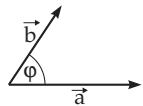
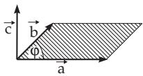

##### 3.5.1.5 Scalar Product and Vector Product

1. Scalar product

The scalar product or dot product of two vectors a and $\vec { \mathbf { b } }$ is defined by the equation

$$
{ \vec { \mathbf { a } } } \cdot { \vec { \mathbf { b } } } = { \vec { \mathbf { a } } } { \vec { \mathbf { b } } } = ( { \vec { \mathbf { a } } } { \vec { \mathbf { b } } } ) = | { \vec { \mathbf { a } } } | | { \vec { \mathbf { b } } } | \cos \varphi ,\tag{3.248}
$$

where $\varphi$ is the angle between a and b considering them with a common initial point (Fig. 3.118). The value of a scalar product is a scalar.

Figure 3.118

Figure 3.119

2. Vector Product

or cross product of the two vectors a and $\vec { \mathbf { b } }$ is a vector $\vec { \mathbf { c } }$ such that it is perpendicular to the vectors $\vec { \mathbf { a } }$ and $\vec { \mathbf { b } } ,$ and in the order a, $\vec { \mathbf { b } } ,$ and $\vec { \mathbf { c } }$ the vectors form a right-hand system (Fig. 3.119): If the vectors have the same initial point, then looking at the plane ofa and $\vec { \mathbf { b } }$ from the endpoint of ${ \vec { \mathbf { c } } } ,$ the shortest rotation of a in the direction of $\vec { \mathbf { b } }$ is counterclockwise. The vectors a, $\vec { \mathbf { b } } ,$ and $\vec { \mathbf { c } }$ have the same arrangement as the thumb, the forefinger, and the middle finger of the right hand. Therefore this is called the right-hand rule. The vector product (3.249a) has the magnitude (3.249b)

$$
\vec { \bf a } \times \vec { \bf b } = [ \vec { \bf a } \vec { \bf b } ] = \vec { \bf c } ,\tag{3.249a}
$$

$$
| \vec { \mathbf { c } } | = | \vec { \mathbf { a } } | | \vec { \mathbf { b } } | \sin \varphi ,\tag{3.249b}
$$

where $\varphi$ is the angle between a and $\vec { \mathbf { b } } .$ . Numerically the length of $\vec { \mathbf { c } }$ is equal to the area of the parallelogram defined by the vectors a and b.

3. Properties of the Products of Vectors

a) The Scalar Product is commutative:

$$
\vec { \bf a } \vec { \bf b } = \vec { \bf b } \vec { \bf a } .\tag{3.250}
$$

b) The Vector Product is anti commutative (changes its sign by interchanging the factors):

$$
\vec { \bf a } \times \vec { \bf b } = - ( \vec { \bf b } \times \vec { \bf a } ) .\tag{3.251}
$$

c) Multiplication by a Scalar Scalars can be factored out:

$$
\alpha ( \vec { \bf a } \vec { \bf b } ) = ( \alpha \vec { \bf a } ) \vec { \bf b } ,
$$

(3.252a)

(3.252b)

d) Associativity The scalar and vector products are not associative:

$$
\vec { \mathbf { a } } ( \vec { \mathbf { b } } \vec { \mathbf { c } } ) \neq ( \vec { \mathbf { a } } \vec { \mathbf { b } } ) \vec { \mathbf { c } } ,
$$

(3.253a)

$$
\vec { \mathbf { a } } \times ( \vec { \mathbf { b } } \times \vec { \mathbf { c } } ) \neq ( \vec { \mathbf { a } } \times \vec { \mathbf { b } } ) \times \vec { \mathbf { c } } .\tag{3.253b}
$$

e) Distributivity The scalar and vector products are distributive over addition:

$$
\vec { \bf a } ( \vec { \bf b } + \vec { \bf c } ) = \vec { \bf a } \vec { \bf b } + \vec { \bf a } \vec { \bf c } ,\tag{3.254a}
$$

$$
{ \vec { \mathbf { a } } } \times ( { \vec { \mathbf { b } } } + { \vec { \mathbf { c } } } ) = { \vec { \mathbf { a } } } \times { \vec { \mathbf { b } } } + { \vec { \mathbf { a } } } \times { \vec { \mathbf { c } } } \quad { \mathrm { a n d } } \quad ( { \vec { \mathbf { b } } } + { \vec { \mathbf { c } } } ) \times { \vec { \mathbf { a } } } = { \vec { \mathbf { b } } } \times { \vec { \mathbf { a } } } + { \vec { \mathbf { c } } } \times { \vec { \mathbf { a } } } ,\tag{3.254b}
$$

f) Orthogonality ofTwo Vectors Two vectors are perpendicular to each other $( \vec { \bf a } \perp \vec { \bf b } )$ if the equality

$$
\vec { \bf a } \vec { \bf b } = 0 \mathrm { ~ \ h o l d s , a n d ~ n e i t h e r { \vec { \bf a } } ~ n o r ~ \vec { \bf b } ~ a r e ~ n u l l ~ v e c t o r s . }\tag{3.255}
$$

g) Collinearity of Two Vectors Two vectors are collinear $( \vec { \bf a } \parallel \vec { \bf b } )$ if the equality

$$
{ \vec { \mathbf { a } } } \times { \vec { \mathbf { b } } } = { \vec { \mathbf { 0 } } } \qquad { \mathrm { h o l d s , a n d ~ n e i t h e r ~ } } { \vec { \mathbf { a } } } { \mathrm { ~ n o r ~ } } { \vec { \mathbf { b } } } { \mathrm { ~ a r e ~ n u l l ~ v e c t o r s . } }\tag{3.256}
$$

h) Multiplication of the same vectors:

$$
{ \vec { \bf a } } { \vec { \bf a } } = { \vec { \bf a } } ^ { 2 } = a ^ { 2 } , \quad { \vec { \bf a } } \times { \vec { \bf a } } = { \vec { \bf 0 } } .\tag{3.257}
$$

i) Linear Combinations of Vectors can be multiplied in the same way as scalar polynomials (because of the distributive property), only one must be careful with the vector product. If interchanging the factors, also the signs are to be changed.

$$
\mathbf { a } : ( 3 \vec { \mathbf { a } } + 5 \vec { \mathbf { b } } - 2 \vec { \mathbf { c } } ) ( \vec { \mathbf { a } } - 2 \vec { \mathbf { b } } - 4 \vec { \mathbf { c } } ) = 3 \vec { \mathbf { a } } ^ { 2 } + 5 \vec { \mathbf { b } } \vec { \mathbf { a } } - 2 \vec { \mathbf { c } } \vec { \mathbf { a } } - 6 \vec { \mathbf { a } } \vec { \mathbf { b } } - 1 0 \vec { \mathbf { b } } ^ { 2 } + 4 \vec { \mathbf { c } } \vec { \mathbf { b } } - 1 2 \vec { \mathbf { a } } \vec { \mathbf { c } } - 2 0 \vec { \mathbf { b } } \vec { \mathbf { c } } + 8 \vec { \mathbf { c } } ^ { 2 }
$$

$$
= 3 { \vec { \mathbf { a } } } ^ { 2 } - 1 0 { \vec { \mathbf { b } } } ^ { 2 } + 8 { \vec { \mathbf { c } } } ^ { 2 } - { \vec { \mathbf { a } } } { \vec { \mathbf { b } } } - 1 4 { \vec { \mathbf { a } } } { \vec { \mathbf { c } } } - 1 6 { \vec { \mathbf { b } } } { \vec { \mathbf { c } } } .
$$

$$
\mathbf { B } : \left( \begin{array} { l l } { 3 \vec { \mathbf { a } } + 5 \vec { \mathbf { b } } - 2 \vec { \mathbf { c } } } \end{array} \right) \times \left( \vec { \mathbf { a } } - 2 \vec { \mathbf { b } } - 4 \vec { \mathbf { c } } \right) = 3 \vec { \mathbf { a } } \times \vec { \mathbf { a } } + 5 \vec { \mathbf { b } } \times \vec { \mathbf { a } } - 2 \vec { \mathbf { c } } \times \vec { \mathbf { a } } - 6 \vec { \mathbf { a } } \times \vec { \mathbf { b } } - 1 0 \vec { \mathbf { b } } \times \vec { \mathbf { b } }
$$

$$
+ \ : \ : 4 \vec { \bf c } \ : \times \vec { \bf b } - 1 2 \vec { \bf a } \times \vec { \bf c } - 2 0 \vec { \bf b } \times \vec { \bf c } + 8 \vec { \bf c } \times \vec { \bf c } = 0 - 5 \vec { \bf a } \times \vec { \bf b } + 2 \vec { \bf a } \times \vec { \bf c } - 6 \vec { \bf a } \times \vec { \bf b } + 0 - 4 \vec { \bf b } \times \vec { \bf c }
$$

$$
{ \begin{array} { r } { - \ 1 2 { \vec { \mathbf { a } } } \times { \vec { \mathbf { c } } } - 2 0 { \vec { \mathbf { b } } } \times { \vec { \mathbf { c } } } + 0 = - 1 1 { \vec { \mathbf { a } } } \times { \vec { \mathbf { b } } } - 1 0 { \vec { \mathbf { a } } } \times { \vec { \mathbf { c } } } - 2 4 { \vec { \mathbf { b } } } \times { \vec { \mathbf { c } } } = 1 1 { \vec { \mathbf { b } } } \times { \vec { \mathbf { a } } } + 1 0 { \vec { \mathbf { c } } } \times { \vec { \mathbf { a } } } + 2 4 { \vec { \mathbf { c } } } \times { \vec { \mathbf { b } } } . } \end{array} }
$$

j) Scalar Invariant is a scalar quantity if it does not change its value under a translation or a rotation of the coordinate system. The scalar product of two vectors is a scalar invariant.

A: The coordinates of a vector $\vec { \bf a } = \{ a _ { 1 } , a _ { 2 } , a _ { 3 } \}$ are not scalar invariants, because in diferent coordinate systems they can have diferent values.

B: The length of a vector a is a scalar invariant, because it has the same value in diferent coordinate systems.

C: Since the scalar product of two vectors is a scalar invariant, the scalar product of a vector by itself is also a scalar invariant, i.e., $\vec { \bf a } \vec { \bf a } = | \vec { \bf a } | ^ { 2 }$ cos $\varphi = | \vec { \mathbf { a } } | ^ { 2 }$ , because $\varphi = 0$
