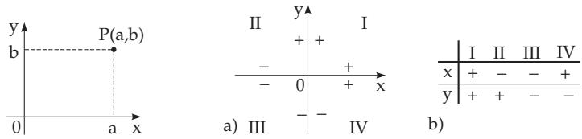
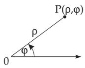
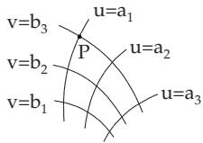
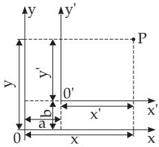
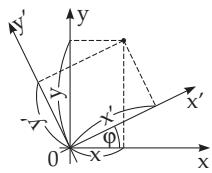

##### 3.5.2.1 Basic Concepts, Coordinate Systems in the Plane

The position of every point P of a plane can be given by an arbitrary coordinate system. The numbers determining the position of the point are called coordinates. Mostly Cartesian coordinates and polar coordinates are in use.

1. Cartesian or Descartes Coordinates

The Cartesian coordinates of a point P are the signed distances of this point, given in a certain measure, from two coordinate axes perpendicular to each other (Fig. 3.120). The intersection point 0 of the coordinate axes is called the origin. The horizontal coordinate axis, usually the x-axis, is usually called the axis of abscissae, the vertical coordinate axis, usually the y-axis, is the axis of ordinates.

  
Figure 3.120  
Figure 3.121

The positive direction is given on these axes: on the x-axis usually to the right, on the y-axis upwards. The coordinates of a point P are positive or negative according to which half-axis the projections of the point fall (Fig. 3.121). The coordinates x and y are called the abscissa and the ordinate of the point P, respectively. The point with abscissa a and ordinate b is denoted by $P ( \boldsymbol { a } , \boldsymbol { b } )$ . The x, y plane is divided into four quadrants I, II, III, and IV by the coordinate axes (Fig. 3.121,a).

2. Polar Coordinates

The polar coordinates of a point $P$ (Fig. 3.122) are the radius $\rho ,$ i.e., the distance of the point from a given point, the pole 0, and the polar angle ϕ, i.e., the angle between the line $0 P$ and a given oriented half-line passing through the pole, the polar axis. The pole is also called the origin. The polar angle is positive if it is measured counterclockwise from the polar axis, otherwise it is negative.

  
Figure 3.122

  
Figure 3.123

3. Curvilinear Coordinate System

This system consists of two one-parameter families of curves in the plane, the family of coordinate curves (Fig. 3.123). Exactly one curve of both families passes through every point of the plane. They intersect each other at this point. The parameters corresponding to this point are its curvilinear coordinates. In Fig. 3.123 the point $P$ has curvilinear coordinates $u = a _ { 1 }$ and $v = b _ { 3 }$ . In the Cartesian coordinate system the coordinate curves are straight lines parallel to the coordinate axes; in the polar coordinate system the coordinate curves are concentric circles with the center at the pole, and half-lines starting at the pole.

  
Figure 3.124

  
Figure 3.125
