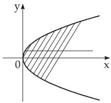
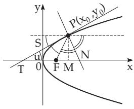
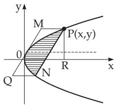

##### 3.5.2.10 Parabola

1. Elements of the Parabola In Fig. 3.164 the x-axis coincides with the axis of the parabola, 0 is the vertex of the parabola, F is the focus of the parabola which is on the x-axis at a distance $p / 2$ from the origin, where p is called the semifocal chord ofthe parabola. The directrix is denoted by $N N ^ { \prime } ;$ it is the line perpendicular to the axis of the parabola and intersects the axis at a distance $p / 2$ from the origin on the opposite side as the focus. So the semifocal chord is equal to half of the length of the chord which is perpendicular to the axis and passes through the focus. The numerical eccentricity of the parabola is equal to 1 (see 3.5.2.11, 4., p. 207).

2. Equation of the Parabola If the origin is the vertex of the parabola and the x-axis is the axis of the parabola with the vertex on the left-hand side, then the normal form ofthe equation ofthe parabola is

$$
y ^ { 2 } = 2 p x .\tag{3.343}
$$

For the equation of the parabola in polar coordinates see 3.5.2.11, 6., p. 208. For a parabola with vertical axis (Fig. 3.165) the equation is

$$
y = a x ^ { 2 } + b x + c .\tag{3.344a}
$$

The parameter of a parabola given in this form is $p = { \frac { 1 } { 2 | a | } } .$

(3.344b)

If $a > 0$ holds, the parabola is open up, for $a < 0$ it is open down. The coordinates of the vertex are

$$
x _ { 0 } = - { \frac { b } { 2 a } } , \quad y _ { 0 } = { \frac { 4 a c - b ^ { 2 } } { 4 a } } .\tag{3.344c}
$$

3. Properties of the Parabola (Definition of the Parabola) The parabola is the locus of points $P ( x , y )$ whose distance from a given point, the focus, is equal to its distance from a given line, the directrix (Fig. 3.164). Here and in the following formulas in Cartesian coordinates the normal form of the equation of the parabola is supposed. Then holds the equation

$$
{ \overline { { P F } } } = { \overline { { P K } } } = x + { \frac { p } { 2 } } ,\tag{3.345}
$$

where $P F$ is the radius vector whose initial point is at the focus and endpoint is a point of the parabola. 4. Diameter of the Parabola is a line which is parallel to the axis of the parabola (Fig. 3.166). A diameter of the parabola halves the chords which are parallel to the tangent line belonging to the endpoint of the diameter (Fig. 3.166). With slope k of the chords the equation of the diameter is

$$
y = { \frac { p } { k } } .\tag{3.346}
$$

  
Figure 3.166

  
Figure 3.167

  
Figure 3.168

5. Tangent of the Parabola (Fig.3.167) The equation of the tangent of the parabola at the point $P ( x _ { 0 } , y _ { 0 } )$ is

$$
y y _ { 0 } = p \left( x + x _ { 0 } \right) .\tag{3.347}
$$

Tangent and normal lines are bisectors of the angles between the radius starting at the focus and the diameter starting at the point of contact. The tangent at the vertex, i.e., the y-axis, halves the segment of the tangent line between the point of contact and its intersection point with the axis of the parabola, the x-axis:

$$
\overline { { T S } } = \overline { { S P } } , \quad \overline { { T 0 } } = \overline { { 0 M } } = x _ { 0 } , \quad \overline { { T F } } = \overline { { F P } } .\tag{3.348}
$$

A line with equation $y = k x + b$ is a tangent line of the parabola if

$$
p = 2 b k .\tag{3.349}
$$

6. Radius ofCurvature ofthe Parabola at the point $P ( x _ { 0 } , y _ { 0 } )$ with $l _ { n }$ as the length of the normal PN (Fig. 3.167) is

$$
R = { \frac { \left( p + 2 x _ { 1 } \right) ^ { 3 / 2 } } { \sqrt { p } } } = { \frac { p } { \sin ^ { 3 } u } } = { \frac { l _ { n } ^ { 3 } } { p ^ { 2 } } }\tag{3.350a}
$$

and at the vertex 0 it is

$$
R = p .\tag{3.350b}
$$

7. Areas in the Parabola (Fig. 3.168)

a) Parabolic Segment P0N:

$$
S _ { \mathrm { 0 P N } } = \frac { 2 } { 3 } S _ { \mathrm { M Q N P } } \quad ( \mathrm { M Q N P ~ i s ~ a ~ p a r a l l e l o g r a m } ) .\tag{3.351a}
$$

b) Area 0PR (Area under the Parabola Curve):

$$
S _ { 0 P R } = \frac { 2 x y } { 3 } .\tag{3.351b}
$$

8. Length of Parabolic Arc from the vertex 0 to the point $P ( x , y )$

$$
\begin{array} { c l c r } { { l _ { 0 P } = \displaystyle \frac { p } { 2 } \left[ \sqrt { \displaystyle \frac { 2 x } { p } \left( 1 + \displaystyle \frac { 2 x } { p } \right) } + \ln \left( \displaystyle \sqrt { \displaystyle \frac { 2 x } { p } } + \sqrt { 1 + \displaystyle \frac { 2 x } { p } } \right) \right] } } \\ { { = - \sqrt { x \left( x + \displaystyle \frac { p } { 2 } \right) } + \displaystyle \frac { p } { 2 } \operatorname { A r s i n h } \sqrt { \displaystyle \frac { 2 x } { p } } . } } \end{array}\tag{3.352a}
$$

(3.352b)

For small values of $\frac { x } { y }$ the following approximation can be used:

$$
l _ { 0 P } \approx y \left[ 1 + \frac { 2 } { 3 } \bigg ( \frac { x } { y } \bigg ) ^ { 2 } - \frac { 2 } { 5 } \bigg ( \frac { x } { y } \bigg ) ^ { 4 } \right] .\tag{3.352c}
$$
