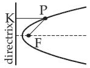

##### 3.5.2.11 Quadratic Curves (Curves of Second Order or Conic Sections)

1. General Equation of Quadratic Curves (Curves of Second Order or Degree) The ellipse, its special case, the circle, the hyperbola, the parabola or two lines as a singular conic section are defined by the general equation of a quadratic curve (curve of second order)

$$
a x ^ { 2 } + 2 b x y + c y ^ { 2 } + 2 d x + 2 e y + f = 0 .\tag{3.353a}
$$

This equation can be reduced to the normal form with the help of the coordinate transformations given in Tables 3.19 and 3.20.

Remark 1: The coeficients in (3.353a) are not the parameters of the special conic sections.

Remark 2: If two coeficients (a and b or b and c) are equal to zero, the required coordinate transformation is reduced to a translation of the coordinate axes.

The equation $c y ^ { 2 } + 2 d x + 2 e y + f = 0$ can be written in the form $\left( y - y _ { 0 } \right) ^ { 2 } = 2 p ( x - x _ { 0 } )$

the equation $a x ^ { 2 } + 2 d x + 2 e y + f = 0$ can be written in the form $\left( x - x _ { 0 } \right) ^ { 2 } = 2 p \left( y - y _ { 0 } \right)$

2. Invariants of Quadratic Curves

are the three quantities

$$
\Delta = \left| \begin{array} { l } { { a \ b \ d } } \\ { { b \ c \ e } } \\ { { d \ e \ f } } \end{array} \right| , \quad \delta = \left| \begin{array} { l } { { a \ b } } \\ { { b \ c } } \end{array} \right| , \quad S = a + c .\tag{3.353b}
$$

They do not change during a rotation of the coordinate system, i.e., if after a coordinate transformation

Table 3.19 Equation of curves of second order. Central curves $( \delta \neq 0 ) ^ { 1 }$
<table><tr><td rowspan=1 colspan=3>Quantities δ and ∆</td><td rowspan=1 colspan=1>Shape of the curve</td></tr><tr><td rowspan=4 colspan=1>Central curves $\delta \neq 0$ </td><td rowspan=2 colspan=1> $\delta > 0$ </td><td rowspan=1 colspan=1> $\Delta \neq 0$ </td><td rowspan=1 colspan=1>Ellipse a) for $\Delta \cdot S < 0 \colon$ real,b) for $\Delta \cdot S > 0 \colon$ imaginary²</td></tr><tr><td rowspan=1 colspan=1> $\Delta = 0$ </td><td rowspan=1 colspan=1>A pair of imaginary2 lines with real common point</td></tr><tr><td rowspan=2 colspan=1> $\delta < 0$ </td><td rowspan=1 colspan=1> $\overline { { \Delta \neq 0 } }$ </td><td rowspan=1 colspan=1>Hyperbola</td></tr><tr><td rowspan=1 colspan=1> $\Delta = 0$ </td><td rowspan=1 colspan=1>A pair of intersecting lines</td></tr><tr><td rowspan=1 colspan=3>Required coordinate transformations</td><td rowspan=1 colspan=1>Normal form of the equationafter the transformation</td></tr><tr><td rowspan=1 colspan=3>1. Translation of the origin to thecenter of the curve, whose coordinates are $x _ { 0 } = \frac { b e - c d } { \delta } , \quad y _ { 0 } = \frac { b d - a e } { \delta } .$ 2. Rotation of the coordinate axes bythe angle α with tan $2 \alpha = { \frac { 2 b } { a - c } } ,$ The sign of sin 2α must coincide withthe sign of 2b. Here the slopeof the new x&#x27;-axis is $k = { \frac { c - a + { \sqrt { \left( c - a \right) ^ { 2 } + 4 b ^ { 2 } } } } { 2 b } }$ </td><td rowspan=1 colspan=1> $a ^ { \prime } { x ^ { \prime } } ^ { 2 } + c ^ { \prime } { y ^ { \prime } } ^ { 2 } + \frac { \Delta } { \delta } = 0$  $a ^ { \prime } = { \frac { a + c + { \sqrt { \left( a - c \right) ^ { 2 } + 4 b ^ { 2 } } } } { 2 } }$  $c ^ { \prime } = { \frac { a + c - { \sqrt { \left( a - c \right) ^ { 2 } + 4 b ^ { 2 } } } } { 2 } }$  $( a ^ { \prime } { \mathrm { a n d } } c ^ { \prime }$ are the roots of the quadraticequation   $u ^ { 2 } - S u + \delta = 0 )$ </td></tr></table>

1 Δ, δ and S are numbers given in (3.353b).  
2 The equation of the curve corresponds to an imaginary curve.  
the equation of the curve has the form

$$
a ^ { \prime } x ^ { \prime } { } ^ { 2 } + 2 b ^ { \prime } x ^ { \prime } y ^ { \prime } + c ^ { \prime } y ^ { \prime } { } ^ { 2 } + 2 d ^ { \prime } x ^ { \prime } + 2 e ^ { \prime } y ^ { \prime } + f ^ { \prime } = 0 ,\tag{3.353c}
$$

then the calculation of these three quantities $\Delta , \delta ,$ , and S with the new constants will yield the same values.

3. Shape of the Quadratic Curves (Conic Sections)

If a right double circular cone is intersected by a plane, the result is a conic section. If the plane does not pass through the vertex of the cone, the result is a hyperbola, a parabola, or an ellipse depending on whether the plane is parallel to two, one, or none of the generators of the cone. If the plane goes through the vertex, the result is a singular conic section with $\Delta = 0$ . As a conic section of a cylinder, i.e., a singular cone whose vertex is at infinity, yield parallel lines. The shape of a conic section can be determined with the help of Tables 3.19 and 3.20.

  
Figure 3.169

4. General Properties of Curves of Second Degree

The locus of every point P (Fig. 3.169) with constant ratio e of the distance to a fixed point F, the focus, and the distance from a given line, the directrix, is a curve of second order with numerical eccentricity e. For $e < 1$ it is an ellipse, for $e = 1$ it is a parabola, for $e > 1$ it is a hyperbola.

Table 3.20 Equations of curves of second order. Parabolic curves $( \delta = 0 )$
<table><tr><td rowspan=1 colspan=2>Quantity δ and ∆</td><td rowspan=1 colspan=1>Shape of the curve</td></tr><tr><td rowspan=2 colspan=1>Parabolic curves1,  $\delta = 0$ </td><td rowspan=1 colspan=1> $\Delta \neq 0$ </td><td rowspan=1 colspan=1>Parabola</td></tr><tr><td rowspan=1 colspan=1> $\Delta = 0$ </td><td rowspan=1 colspan=1>Two lines:Parallel lines for      $\begin{array} { r } { \overline { { d ^ { 2 } - a f > 0 } } , } \end{array}$ Double line for       $d ^ { 2 } - a \dot { f } = 0 ,$  $\mathrm { I m a g i n a r y ^ { 2 } }$ lines for  $d ^ { 2 } - a { \dot { f } } < 0 .$ </td></tr><tr><td rowspan=1 colspan=2>Required coordinate transformation</td><td rowspan=1 colspan=1>Normal form of the equationafter the transformation</td></tr><tr><td rowspan=1 colspan=2> $\Delta \neq 0$ 1. Translation of the origin to the vertex of theparabola whose coordinates $x _ { 0 }$ and y0 are definedby the equations $a x _ { 0 } + b y _ { 0 } + { \frac { a d + b e } { S } } = 0$  and $\left( d + { \frac { d c - b e } { S } } \right) x _ { 0 } + \left( e + { \frac { a e - b d } { S } } \right) y _ { 0 } + f = 0$ 2. Rotation of the coordinate axes by the angle αwith tan $\alpha = - \frac { a } { b }$ ; the sign of sin α must differfrom the sign of a.</td><td rowspan=1 colspan=1> ${ y ^ { \prime } } ^ { 2 } = 2 p x ^ { \prime }$  $p = { \frac { a e - b d } { S { \sqrt { a ^ { 2 } + b ^ { 2 } } } } }$ </td></tr><tr><td rowspan=1 colspan=2> $\Delta = 0$ Rotation of the coordinate axes by the angle αwith tan $\alpha = - \frac { a } { b }$ ; the sign of sin α must differfrom the sign of a.</td><td rowspan=1 colspan=1> $S y ^ { \prime 2 } + 2 { \frac { a d + b e } { \sqrt { a ^ { 2 } + b ^ { 2 } } } } y ^ { \prime } + f = 0$ can be trans-formed into the form $\left( y ^ { \prime } - y _ { 0 } ^ { \prime } \right) \left( y ^ { \prime } - y _ { 1 } ^ { \prime } \right) = 0 .$ </td></tr></table>

1 In the case of $\delta = 0$ it is supposed that none of the coeficients $a , b ,$ c is equal to zero.  
2 The equation of the curve corresponds to an imaginary curve.

5. Determination of a Curve Through Five Points

There is one and only one curve of second degree passing through five given points of a plane. If three of these points are on the same line, then it is a singular or degenerate conic section.

6. Polar Equation of Curves of Second Degree

All curves of second degree can be described by the polar equation

$$
\rho = { \frac { p } { 1 + e \cos \varphi } } ,\tag{3.354}
$$

where $p$ is the semifocal chord and e is the eccentricity. Here the pole is at the focus, while the polar axis is directed from the focus to the closer vertex. For the hyperbola this equation defines only one branch.
