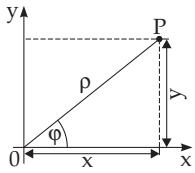
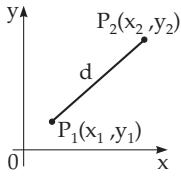
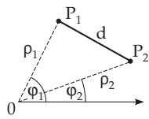

##### 3.5.2.2 Coordinate Transformations

Under transformation of a Cartesian coordinate system into another one, the coordinates change according to certain rules.

1. Parallel Translation of Coordinate Axes

The axis of the abscissae is shifted by $^ { a , }$ , and the axis of the ordinates by b (Fig. 3.124). Suppose a point $P$ has coordinates $x , y$ before the translation, and it has the coordinates $\bar { x ^ { \prime } } , y ^ { \prime }$ after it. The old coordinates of the new origin $0 ^ { \prime }$ are $a , b .$ The relations between the old and the new coordinates are the following:

$$
x = x ^ { \prime } + a , \quad y = y ^ { \prime } + b ,\tag{3.286a}
$$

$$
x ^ { \prime } = x - a , \quad y ^ { \prime } = y - b .\tag{3.286b}
$$

2. Rotation of Coordinate Axes

Rotation by an angle $\varphi$ (Fig. 3.125) yields the following changes in the coordinates:

$$
\begin{array} { l } { { x ^ { \prime } = x \cos \varphi + y \sin \varphi , } } \\ { { y ^ { \prime } = - x \sin \varphi + y \cos \varphi , } } \end{array}\tag{3.287a}
$$

$$
\begin{array} { r } { x = x ^ { \prime } \cos \varphi - y ^ { \prime } \sin \varphi , } \\ { y = x ^ { \prime } \sin \varphi + y ^ { \prime } \cos \varphi . } \end{array}\tag{3.287b}
$$

The coeficient matrix belonging to (3.287a)

$$
\mathbf { D } = { \left( \begin{array} { l l } { \cos \varphi } & { \sin \varphi } \\ { - \sin \varphi } & { \cos \varphi } \end{array} \right) } { \mathrm { ~ w i t h ~ } } { \binom { x ^ { \prime } } { y ^ { \prime } } } = \mathbf { D } { \binom { x } { y } } { \mathrm { ~ a n d ~ } } { \binom { x } { y } } = \mathbf { D } ^ { - 1 } { \binom { x ^ { \prime } } { y ^ { \prime } } } ,\tag{3.287c}
$$

is called the rotation matrix.

In general, the transformation of a cartesian coordinate system into another can be performed in two steps, a translation and a rotation of the coordinate axes.

Remark: With the so-called coordinate transformation considered here the coordinate system is transformed, but the represented object rests in its position. In contrast to this with a so-called geometric transformation the object is transformed, but the coordinate system remains unchanged in its position. In 3.5.4, p. 229 the rotation of an object is described by

$$
\begin{array} { r } { \left( { x } _ { P } ^ { \prime } \right) = { \bf R } \left( { x } _ { P } \right) , } \\ { \left( { y } _ { P } ^ { \prime } \right) = { \bf R } \left( { x } _ { P } \right) } \end{array}\tag{3.288}
$$

where R is the rotation matrix. Between D and R there exists the relation

$$
{ \bf R } = { \bf D } ^ { - 1 }\tag{3.289}
$$

  
Figure 3.126

  
Figure 3.127

  
Figure 3.128

3. Transforming Cartesian Coordinates into Polar Coordinates and Conversely Supposing the origin coincides with the pole and the axis of abscissae coincides with the polar axis (Fig. 3.126), then

$$
x = \rho ( \varphi ) \cos \varphi \quad y = \rho ( \varphi ) \sin \varphi \quad ( - \pi < \varphi \leq \pi , \quad \rho \geq 0 ) ;\tag{3.290a}
$$

$$
\rho = \sqrt { x ^ { 2 } + y ^ { 2 } } , \qquad \mathrm { ( 3 . 2 9 0 b ) }
$$

$$
\varphi = \left\{ \begin{array} { l l } { \arctan \displaystyle \frac { y } { x } + \pi \medskip \ \mathrm { f o r } x < 0 , } \\ { \arctan \displaystyle \frac { y } { x } \ } & { \ \mathrm { f o r } x > 0 , } \\ { \displaystyle \frac { \pi } { 2 } \ u \qquad } & { \ \mathrm { f o r } \ x = 0 \mathrm { ~ a n d ~ } y > 0 , } \\ { - \displaystyle \frac { \pi } { 2 } \ } & { \ \mathrm { f o r } \ x = 0 \mathrm { ~ a n d ~ } y < 0 , } \\ { \mathrm { u n d e f i n e d } } & { \ \mathrm { f o r } \ x = y = 0 . } \end{array} \right.\tag{3.290c}
$$
