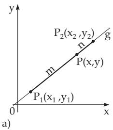
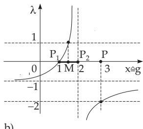
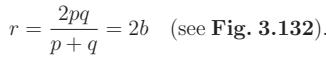
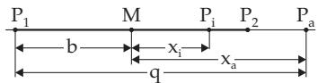
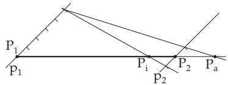
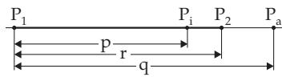
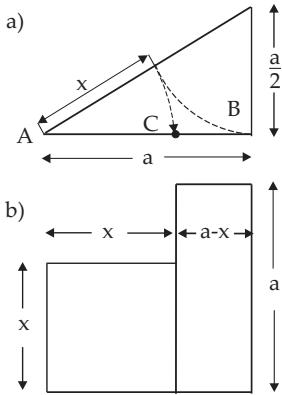

##### 3.5.2.3 Special Notations and Points in the Plane

1. Distance Between Two Points

If the two points given in Cartesian coordinates as $P _ { 1 } \left( x _ { 1 } , y _ { 1 } \right)$ and $P _ { 2 } \left( x _ { 2 } , y _ { 2 } \right) \left( { \bf F i g . 3 . 1 2 7 } \right)$ , then their distance is

$$
d = { \sqrt { \left( x _ { 2 } - x _ { 1 } \right) ^ { 2 } + \left( y _ { 2 } - y _ { 1 } \right) ^ { 2 } } } .\tag{3.291}
$$

If they are given in polar coordinates as $P _ { 1 } \left( \rho _ { 1 } , \varphi _ { 1 } \right)$ and $P _ { 2 } \left( \rho _ { 2 } , \varphi _ { 2 } \right)$ (Fig. 3.128), their distance is

$$
d = \sqrt { \rho _ { 1 } ^ { 2 } + \rho _ { 2 } ^ { 2 } - 2 \rho _ { 1 } \rho _ { 2 } \cos { ( \varphi _ { 2 } - \varphi _ { 1 } ) } } .\tag{3.292}
$$

2. Coordinates of Center of Mass

The coordinates $( x , y )$ of the center of mass of a system of material points $M _ { i } \left( x _ { i } , y _ { i } \right)$ with masses $m _ { i } \ ( i = 1 , 2 , \ldots , n )$ ) are calculated by the following formula:

$$
x = \frac { \sum m _ { i } x _ { i } } { \sum m _ { i } } , \quad y = \frac { \sum m _ { i } y _ { i } } { \sum m _ { i } } .\tag{3.293}
$$

3. Division of a Line Segment

1. Division in a Given Ratio The coordinates of the point $P$ with division ratio ${ \frac { \overline { { P _ { 1 } P } } } { \overline { { P P _ { 2 } } } } } = { \frac { m } { n } } = \lambda$ (Fig. 3.129a) of the line segment $\overline { { P _ { 1 } P _ { 2 } } }$ are calculated by the formulas

$$
x = { \frac { n x _ { 1 } + m x _ { 2 } } { n + m } } = { \frac { x _ { 1 } + \lambda x _ { 2 } } { 1 + \lambda } } , \qquad { \mathrm { ( 3 . 2 9 4 a ) } } \qquad \qquad y = { \frac { n y _ { 1 } + m y _ { 2 } } { n + m } } = { \frac { y _ { 1 } + \lambda y _ { 2 } } { 1 + \lambda } } .\tag{3.294b}
$$

For the midpoint M of the segment $\overline { { P _ { 1 } P _ { 2 } } }$ , because of $\lambda = 1$

$$
x = { \frac { x _ { 1 } + x _ { 2 } } { 2 } } ,
$$

(3.294c)

$$
y = { \frac { y _ { 1 } + y _ { 2 } } { 2 } }\tag{3.294d}
$$

holds. The sign of the segments $\overline { { P _ { 1 } P } }$ and ${ \overline { { P P } } } _ { 2 }$ can be defined. Their signs are positive or negative depending on whether their directions are coincident with $\overline { { P _ { 1 } P _ { 2 } } }$ or not. Then formulas (3.294a,b,c,d) result in a point outside of the segment $\overline { { P _ { 1 } P _ { 2 } } }$ in the case $\lambda < 0$ . This is called an external division.

  
Figure 3.129

If P is inside the segment ${ \overline { { P _ { 1 } P _ { 2 } } } } ,$ it is called an internal division. One defines:

a) λ = 0 if P = P1,

b) $\lambda = \infty \mathrm { i f } P = P _ { 2 }$ and

c) λ = 1 if P is an infinite or improper point of the line $g , { \mathrm { i . e . } }$ , if $\bar { P }$ is infinitely far from $\overline { { P _ { 1 } P _ { 2 } } }$ on $g .$ The shape of λ is shown in Fig. 3.129b.

For a point P, for which $P _ { 2 }$ is the midpoint of the segment $\overline { { P _ { 1 } P } }$

$$
\lambda = \frac { \overline { { P _ { 1 } P } } } { \overline { { P P _ { 2 } } } } = - 2 \mathrm { h o l d s } .
$$

2. Harmonic Division If the internal and external division of a line segment have the same absolute value $| \lambda |$ , it is called harmonic division. Denote by $P _ { i }$ and $P _ { a }$ the points of the internal and external division respectively, and by $\lambda _ { i }$ and $\lambda _ { a }$ the internal and external rates. Then

$$
{ \frac { P _ { 1 } P _ { i } } { P _ { i } P _ { 2 } } } = \lambda _ { i } = { \frac { \overline { { P _ { 1 } P _ { a } } } } { \overline { { P _ { a } P _ { 2 } } } } } = - \lambda _ { a } \qquad \mathrm { ( 3 . 2 9 5 a ) } \qquad \mathrm { o r } \qquad \lambda _ { i } + \lambda _ { a } = 0 .\tag{3.295b}
$$

If M denotes the midpoint of the segment $\overline { { P _ { 1 } P _ { 2 } } }$ at a distance b from $P _ { 1 }$ (Fig. 3.130), and the distances of $P _ { i }$ and $P _ { a }$ from M are denoted by $x _ { i }$ and $x _ { a }$ , then

$$
{ \frac { b + x _ { i } } { b - x _ { i } } } = { \frac { x _ { a } + b } { x _ { i } - b } } \quad { \mathrm { o r } } \quad { \frac { x _ { i } } { b } } = { \frac { b } { x _ { a } } } , \quad { \mathrm { i . e . , } } \quad x _ { i } x _ { a } = b ^ { 2 } .\tag{3.296}
$$

The name harmonic division is in connection with the harmonic mean (see 1.2.5.3, p. 20). In Fig. 3.131 the harmonic division is represented for $\lambda = 5 : 1$ , analogously to Fig. 3.14. The harmonic mean r of

the segments ${ \overline { { P _ { 1 } P _ { i } } } } = p$ and $\overline { { P _ { 1 } P _ { a } } } = q$ according to (3.295a) equals in accordance with (1.67b), p. 20, to r = 2pq = 2b (see Fig. 3.132). (3.297) p + q

  
Figure 3.130

  
Figure 3.131

  
Figure 3.132

3. Golden Section of a segment a is its division into two parts x and $a - x$ such that the part x and the whole segment a have the same ratio as the parts $a - x$ and x:

  
Figure 3.133

$$
{ \frac { x } { a } } = { \frac { a - x } { x } } .\tag{3.298a}
$$

In this case x is the geometric mean of a and $a - x$ (see also golden section in 1.1.1.2, p. 2), and it holds:

$$
x = { \sqrt { a ( a - x ) } } , \qquad ( 3 . 2 9 8 \mathrm { b } ) \ x = { \frac { a ( { \sqrt { 5 } } - 1 ) } { 2 } } \approx 0 . 6 1 8 \cdot a .\tag{3.298c}
$$

The part x of the segment can be geometrically constructed as shown in Fig. 3.133a.

Remark 1: The line segment x is also the length of the side of a regular decagon with circum radius a (see also 3.1.5.3, p. 139).

Remark 2: The following geometrical problem produces also the equation of the golden section: Given a rectangle with the constant side length a and a variable side $a - x$ . To find is the value x so, that the area $a ( a - x )$ of the rectangle is equal to the area $x ^ { 2 }$ of the square (see Fig.3.133b).
