##### 3.5.2.6 Line

1. Equation of the Line

Every equation that is linear in the coordinates is the equation of a line, and conversely, the equation of every line is a linear equation of the coordinates.

1. General Equation of Line

$$
A x + B y + C = 0 \quad ( A , B , C { \mathrm { ~ c o n s t } } ) .\tag{3.302}
$$

For $A = 0 \ ( \mathbf { F i g } . \ \mathbf { 3 . 1 3 5 } )$ the line is parallel to the x-axis, for $B = 0$ it is parallel to the y-axis, for $C = 0$ it passes through the origin.

2. Equation of the Line with Slope (or Angular Coeficient) Every line that is not parallel to the y-axis can be represented by an equation written in the form

$$
y = k x + b \quad ( k , b \mathrm { c o n s t } ) .\tag{3.303}
$$

The quantity k is called the angular coeficient or slope of the line; it is equal to the tangent of the angle between the line and the positive direction of the x-axis (Fig. 3.136). The line cuts out the segment b from the y-axis. Both the tangent and the value of b can be negative, depending on the position of the line.

3. Equation of a Line Passing Through a Given Point The equation of a line which goes through a given point $P _ { 1 } \left( x _ { 1 } , y _ { 1 } \right)$ in a given direction (Fig. 3.137) is

$$
y - y _ { 1 } = k \left( x - x _ { 1 } \right) , \quad \mathrm { w i t h } \quad k = \tan \delta .\tag{3.304}
$$

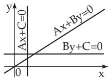  
Figure 3.135

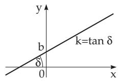

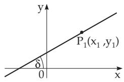  
Figure 3.136  
Figure 3.137

4. Equation of a Line Passing Through Two Given Points If two points of the line $P _ { 1 } \left( x _ { 1 } , y _ { 1 } \right)$ ， $P _ { 2 } \left( x _ { 2 } , y _ { 2 } \right)$ are given (Fig. 3.138), then the equation of the line is

$$
{ \frac { y - y _ { 1 } } { y _ { 2 } - y _ { 1 } } } = { \frac { x - x _ { 1 } } { x _ { 2 } - x _ { 1 } } } .\tag{3.305}
$$

5. Intercept Equation of a Line If a line cuts out the segments a and b from the coordinate axes, considering them with sign, the equation of the line is (Fig. 3.139)

$$
{ \frac { x } { a } } + { \frac { y } { b } } = 1 .\tag{3.306}
$$

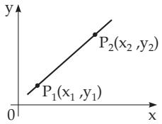  
Figure 3.138

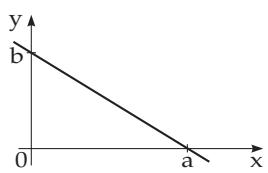  
Figure 3.139

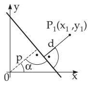  
Figure 3.140

6. Normal Form of the Equation of the Line (Hessian Normal Form) With $p$ as the distance of the line from the origin, and with α as the angle between the x-axis and the normal of the line passing through the origin (Fig. 3.140), with $p > 0$ , and $0 \leq \alpha < 2 \pi$ , the Hessian normal form is

$$
x \cos \alpha + y \sin \alpha - p = 0 .\tag{3.307}
$$

The Hessian normal form can be got from the general equation if multiply (3.302) by the normalizing factor

$$
\mu = \pm \frac { 1 } { \sqrt { A ^ { 2 } + B ^ { 2 } } } .\tag{3.308}
$$

The sign of $\mu$ must be the opposite to that of C in (3.302).

7. Equation of a Line in Polar Coordinates (Fig. 3.141) With $p$ as the distance of the line from the pole (normal segment from the pole to the line), and with α as the angle between the polar axis and the normal to the line passing through the pole, the equation of the line is

$$
\rho = \frac { p } { \cos \left( \varphi - \alpha \right) } .\tag{3.309}
$$

2. Distance of a Point from a Line

The distance d of a point $P _ { 1 } \left( x _ { 1 } , y _ { 1 } \right)$ from a line (Fig. 3.140) can be got by substituting the coordinates of the point into the left-hand side of the Hessian normal form (3.307):

$$
d = x _ { 1 } \cos \alpha + y _ { 1 } \sin \alpha - p .\tag{3.310}
$$

If $P _ { 1 }$ and the origin are on diferent sides of the line, yields $d > 0$ , otherwise $d < 0$

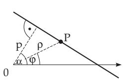  
Figure 3.141

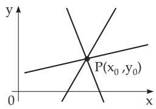  
Figure 3.142

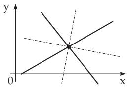  
Figure 3.143

3. Intersection Point of Lines

1. Intersection Point of Two Lines In order to get the coordinates $( x _ { 0 } , y _ { 0 } )$ of the intersection point of two lines the system of equations given by the equations is to be solved. If the lines are given by the equations

$$
A _ { 1 } x + B _ { 1 } y + C _ { 1 } = 0 , \quad A _ { 2 } x + B _ { 2 } y + C _ { 2 } = 0\tag{3.311a}
$$

then the solution is

$$
x _ { 0 } = \frac { \left| \begin{array} { l } { { B _ { 1 } C _ { 1 } } } \\ { { B _ { 2 } C _ { 2 } } } \end{array} \right| } { \left| \begin{array} { l l } { { A _ { 1 } B _ { 1 } } } \\ { { A _ { 2 } B _ { 2 } } } \end{array} \right| } , \quad y _ { 0 } = \frac { \left| \begin{array} { l } { { C _ { 1 } A _ { 1 } } } \\ { { C _ { 2 } A _ { 2 } } } \end{array} \right| } { \left| \begin{array} { l l } { { A _ { 1 } B _ { 1 } } } \\ { { A _ { 2 } B _ { 2 } } } \end{array} \right| } .\tag{3.311b}
$$

If $\left| { \begin{array} { l } { A _ { 1 } \ B _ { 1 } } \\ { A _ { 2 } \ B _ { 2 } } \end{array} } \right| = 0$ holds, the lines are parallel. If ${ \frac { A _ { 1 } } { A _ { 2 } } } = { \frac { B _ { 1 } } { B _ { 2 } } } = { \frac { C _ { 1 } } { C _ { 2 } } }$ holds, the lines are coincident.

2. Pencil of Lines If a third line with equation

$$
A _ { 3 } x + B _ { 3 } y + C _ { 3 } = 0\tag{3.312a}
$$

passes through the intersection point of the first two lines (Fig. 3.142), then the relation

$$
\left| \begin{array} { l } { { A _ { 1 } \ B _ { 1 } \ C _ { 1 } } } \\ { { A _ { 2 } \ B _ { 2 } \ C _ { 2 } } } \\ { { A _ { 3 } \ B _ { 3 } \ C _ { 3 } } } \end{array} \right| = 0\tag{3.312b}
$$

must be satisfied.

The equation

$$
( A _ { 1 } x + B _ { 1 } y + C _ { 1 } ) + \lambda ( A _ { 2 } x + B _ { 2 } y + C _ { 2 } ) = 0 \qquad ( - \infty < \lambda < + \infty )\tag{3.312c}
$$

describes all the lines passing through the intersection point $P _ { 0 } ( x _ { 0 } , y _ { 0 } )$ of the two lines (3.311a). By (3.312c) a pencil oflines is defined with center $P _ { 0 } ( x _ { 0 } , y _ { 0 } )$ . If the equations of the first two lines are given in normal form, then $\lambda = \pm 1$ yields the equations of the bisectrices of the angles at the intersection point (Fig. 3.143).

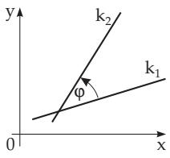  
Figure 3.144

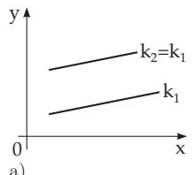  
a)

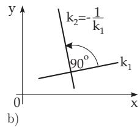  
Figure 3.145

4. Angle Between Two Lines

In Fig. 3.144 there are two intersecting lines. If their equations are given in the general form

$$
A _ { 1 } x + B _ { 1 } y + C _ { 1 } = 0 \quad { \mathrm { a n d } } \quad A _ { 2 } x + B _ { 2 } y + C _ { 2 } = 0 ,\tag{3.313a}
$$

then for the angle $\varphi$ holds

$$
\begin{array} { l l } { \tan \varphi = \displaystyle \frac { A _ { 1 } B _ { 2 } - A _ { 2 } B _ { 1 } } { A _ { 1 } A _ { 2 } + B _ { 1 } B _ { 2 } } , } \\ { \cos \varphi = \displaystyle \frac { A _ { 1 } A _ { 2 } + B _ { 1 } B _ { 2 } } { \sqrt { A _ { 1 } ^ { 2 } + B _ { 1 } ^ { 2 } } \sqrt { A _ { 2 } ^ { 2 } + B _ { 2 } ^ { 2 } } } , \quad \mathrm { ~ ( 3 . 3 1 3 c ) ~ } } \end{array} \qquad \mathrm { s i n } \varphi = \frac { A _ { 1 } B _ { 2 } - A _ { 2 } B _ { 1 } } { \sqrt { A _ { 1 } ^ { 2 } + B _ { 1 } ^ { 2 } } \sqrt { A _ { 2 } ^ { 2 } + B _ { 2 } ^ { 2 } } } .\tag{3.313b}
$$

(3.313d)

With the slopes $k _ { 1 }$ and $k _ { 2 }$ of the intersecting lines holds

$$
\tan \varphi = { \frac { k _ { 2 } - k _ { 1 } } { 1 + k _ { 1 } k _ { 2 } } } ,\tag{3.313e}
$$

$$
\cos \varphi = \frac { 1 + k _ { 1 } k _ { 2 } } { \sqrt { 1 + k _ { 1 } ^ { 2 } } \sqrt { 1 + k _ { 2 } ^ { 2 } } } ,\tag{3.313f}
$$

$$
\sin \varphi = \frac { k _ { 2 } - k _ { 1 } } { \sqrt { 1 + k _ { 1 } ^ { 2 } } \sqrt { 1 + k _ { 2 } ^ { 2 } } } .\tag{3.313g}
$$

Here the angle $\varphi$ is to be considered into the counterclockwise direction from the first line to the second one.

For parallel lines (Fig. 3.145a) the equalities ${ \frac { A _ { 1 } } { A _ { 2 } } } = { \frac { B _ { 1 } } { B _ { 2 } } } \operatorname { o r } k _ { 1 } = k _ { 2 }$ are valid.

For perpendicular (orthogonal) lines (Fig. 3.145b) holds $A _ { 1 } A _ { 2 } + B _ { 1 } B _ { 2 } = 0 { \mathrm { o r } } k _ { 2 } = - 1 / k _ { 1 }$

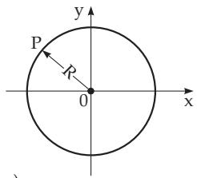  
a)

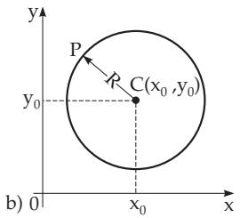  
Figure 3.146

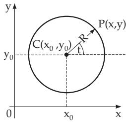  
Figure 3.147
