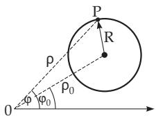
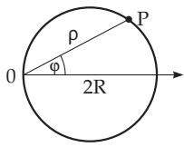
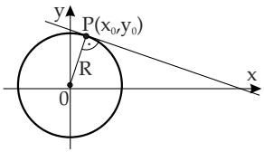

##### 3.5.2.7 Circle

1. Definition of the Circle The locus of points at the same given distance from a given point is called a circle. The given distance is called the radius and the given point is called the center of the circle.

2. Equation of the Circle in Cartesian Coordinates The equation of the circle in Cartesian coordinates when its center is at the origin (Fig. 3.146a) is

$$
x ^ { 2 } + y ^ { 2 } = R ^ { 2 } .\tag{3.314a}
$$

If the center is at the point $C ( x _ { 0 } , y _ { 0 } )$ (Fig. 3.146b), then the equation is

$$
\left( x - x _ { 0 } \right) ^ { 2 } + \left( y - y _ { 0 } \right) ^ { 2 } = R ^ { 2 } .\tag{3.314b}
$$

The general equation of second degree

$$
a x ^ { 2 } + 2 b x y + c y ^ { 2 } + 2 d x + 2 e y + f = 0\tag{3.315a}
$$

is the equation of a circle only if $b = 0$ and $a = c .$ . In this case the equation can always be transformed into the form

$$
x ^ { 2 } + y ^ { 2 } + 2 m x + 2 n y + q = 0 .\tag{3.315b}
$$

For the radius and the coordinates of the center of the circle the following equalities hold

$$
R = { \sqrt { m ^ { 2 } + n ^ { 2 } - q } } ,\tag{3.316a}
$$

$$
x _ { 0 } = - m , \quad y _ { 0 } = - n .\tag{3.316b}
$$

If $q > m ^ { 2 } + n ^ { 2 }$ holds, the equation defines an imaginary curve, if $q = m ^ { 2 } + n ^ { 2 }$ the curve has one single point $P ( x _ { 0 } , y _ { 0 } )$

3. Parametric Representation of the Circle

$$
\begin{array} { r } { x = x _ { 0 } + R \cos t , \quad y = y _ { 0 } + R \sin t , } \end{array}\tag{3.317}
$$

where t is the angle between the moving radius and the positive direction of the x-axis (Fig. 3.147).

  
Figure 3.148

  
Figure 3.149

  
Figure 3.150

4. Equation ofthe Circle in Polar Coordinates in the general case corresponding to Fig. 3.148:

$$
\rho ^ { 2 } - 2 \rho \rho _ { 0 } \cos { ( \varphi - \varphi _ { 0 } ) } + \rho _ { 0 } ^ { 2 } = R ^ { 2 } .\tag{3.318a}
$$

If the center is on the polar axis and the circle goes through the origin (Fig. 3.149) the equation has the form

$$
\rho = 2 R \cos \varphi .\tag{3.318b}
$$

5. Tangent of a Circle The equation of the tangent of a circle, given by (3.314a) at the point $P ( x _ { 0 } , y _ { 0 } )$ (Fig. 3.150) has the form

$$
x x _ { 0 } + y y _ { 0 } = R ^ { 2 } .\tag{3.319}
$$
