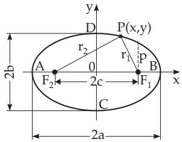
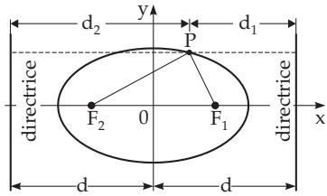
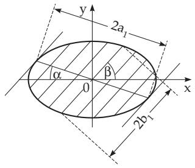
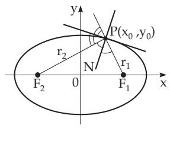
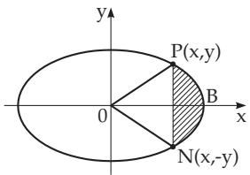

##### 3.5.2.8 Ellipse

1. Elements of the Ellipse In Fig. 3.151, ${ \overline { { A B } } } = 2 a$ is the major axis, $\overline { { C D } } = 2 b$ is the minor axis, A, B, C, D are the vertices, $F _ { 1 } , F _ { 2 }$ are the foci at a distance $c = \sqrt { a ^ { 2 } - b ^ { 2 } }$ on both sides from the midpoint, $e = c / a < 1$ is the numerical eccentricity, and $p = b ^ { 2 } / a$ is the semifocal chord, i.e., the half-length of the chord which is parallel to the minor axis and goes through a focus.

  
Figure 3.151

  
Figure 3.152

2. Equation of the Ellipse If the coordinate axes and the axes of the ellipse are coincident, the equation of the ellipse has the normal form. This equation and the equations in parametric form are

$$
{ \frac { x ^ { 2 } } { a ^ { 2 } } } + { \frac { y ^ { 2 } } { b ^ { 2 } } } = 1 ,
$$

$$
x = a \cos t , \quad y = b \sin t .\tag{3.320b}
$$

For the equation of the ellipse in polar coordinates see 3.5.2.11, 6., p. 208.

3. Definition of the Ellipse, Focal Properties The ellipse is the locus of points for which the sum of the distances from two given points, the foci, is a constant, and equal to $2 a$ . These distances, which are also called the focal radii of the points of the ellipse, can be expressed as a function of the coordinate x from the equalities

$$
r _ { 1 } = \overline { { F _ { 1 } P } } = a - e x , \quad r _ { 2 } = \overline { { F _ { 2 } P } } = a + e x , \quad r _ { 1 } + r _ { 2 } = 2 a .\tag{3.321}
$$

Also here, and in the following formulas in Cartesian coordinates, it is supposed that the ellipse is given in normal form.

4. Directrices of an Ellipse are lines parallel to the minor axis at distance $\textit { d } = \textit { a } / e$ from it (Fig. 3.152). Every point $\bar { P ( x , y ) }$ of the ellipse satisfies the equalities

$$
{ \frac { r _ { 1 } } { d _ { 1 } } } = { \frac { r _ { 2 } } { d _ { 2 } } } = e ,\tag{3.322}
$$

and this property can also be taken as a definition of the ellipse.

5. Diameter of the Ellipse The chords passing through the midpoint of the ellipse are called diameters ofthe ellipse. The midpoint of the ellipse is also the midpoint of the diameter (Fig. 3.153). The locus of the midpoints of all chords parallel to the same diameter is also a diameter; it is called the conjugate diameter of the first one. For k and k as slopes of two conjugate diameters the equality

$$
k k ^ { \prime } = { \frac { - b ^ { 2 } } { a ^ { 2 } } }\tag{3.323}
$$

holds. If $2 a _ { 1 }$ and $2 b _ { 1 }$ are the lengths of two conjugate diameters and α and $\beta$ are the acute angles between the diameters and the major axis, where $k = -$ tan α and $k ^ { \prime } = \tan \beta$ hold, then the Apollonius theorem holds in the form

$$
a _ { 1 } b _ { 1 } \sin { ( \alpha + \beta ) } = a b , \qquad a _ { 1 } ^ { 2 } + b _ { 1 } ^ { 2 } = a ^ { 2 } + b ^ { 2 } .\tag{3.324}
$$

  
Figure 3.153

  
Figure 3.154

  
Figure 3.155

6. Tangent of the Ellipse at the point $P ( x _ { 0 } , y _ { 0 } )$ is given by the equation

$$
{ \frac { x x _ { 0 } } { a ^ { 2 } } } + { \frac { y y _ { 0 } } { b ^ { 2 } } } = 1 .\tag{3.325}
$$

The normal and tangent lines at a point P of the ellipse (Fig. 3.154) are bisectors of the interior and exterior angles of the radii connecting the point P with the foci. The line $A x + B y + C = 0$ is a tangent line of the ellipse if the equation

$$
A ^ { 2 } a ^ { 2 } + B ^ { 2 } b ^ { 2 } - C ^ { 2 } = 0\tag{3.326}
$$

is satisfied.

7. Radius of Curvature of the Ellipse (Fig. 3.154) If u denotes the angle between the tangent line and the radius vector connecting the point of contact $P ( x _ { 0 } , y _ { 0 } )$ with a focus, then the radius of

curvature is

$$
R = a ^ { 2 } b ^ { 2 } \Bigl ( { \frac { x _ { 0 } ^ { 2 } } { a ^ { 4 } } } + { \frac { y _ { 0 } ^ { 2 } } { b ^ { 4 } } } \Bigr ) ^ { \frac { 3 } { 2 } } = { \frac { ( r _ { 1 } r _ { 2 } ) ^ { \frac { 3 } { 2 } } } { a b } } = { \frac { p } { \sin ^ { 3 } u } } .\tag{3.327}
$$

At the vertices A and B (Fig. 3.151) and at C and D the radii are $R _ { A } = R _ { B } = { \frac { b ^ { 2 } } { a } } = p$ and $R _ { C } = { }$ a2   
RD = b .

8. Areas of the Ellipse (Fig. 3.155)

a) Ellipse:

$$
S = \pi a b .\tag{3.328a}
$$

b) Sector of the Ellipse B0P:

c) Segment of the Ellipse PBN:

$$
S _ { \mathrm { B 0 P } } = { \frac { a b } { 2 } } \operatorname { a r c c o s } { \frac { x } { a } } .
$$

(3.328b)

$$
S _ { \mathrm { P B N } } = a b \operatorname { a r c c o s } { \frac { x } { a } } - x y .\tag{3.328c}
$$

9. Arc and Perimeter of the Ellipse The arclength between two points A and B of the ellipse cannot be calculated in an elementary way as for the parabola, but with an incomplete elliptic integral of the second kind $E ( k , \varphi )$ (see 8.2.2.2, 2., p. 502).

The perimeter of the ellipse (see also 8.2.5, 1., 515) can be calculated by a complete elliptic integral of the second kind $E ( e ) = E \left( e , { \frac { \pi } { 2 } } \right)$ with the numerical eccentricity $e = \sqrt { a ^ { 2 } - b ^ { 2 } } / a$ and with $\varphi = \frac { \pi } { 2 }$ (for one quadrant of the perimeter), and it is

$$
L = 4 a E ( k , { \frac { \pi } { 2 } } ) = 4 a \int _ { 0 } ^ { \pi / 2 } \sqrt { 1 - k ^ { 2 } \sin ^ { 2 } \psi } \quad \mathrm { w i t h } \quad k = e = \sqrt { a ^ { 2 } - b ^ { 2 } } / a .\tag{3.329a}
$$

The calculation of $L = 4 a E ( E , \pi / 2 ) = 4 a E ( e )$ can be performed by the help of the following methods: a) Series expansion

$$
L = 4 a E ( e ) = 2 \pi a \left[ 1 - \left( \frac { 1 } { 2 } \right) ^ { 2 } e ^ { 2 } - \left( \frac { 1 \cdot 3 } { 2 \cdot 4 } \right) ^ { 2 } \frac { e ^ { 4 } } { 3 } - \left( \frac { 1 \cdot 3 \cdot 5 } { 2 \cdot 4 \cdot 6 } \right) ^ { 2 } \frac { e ^ { 6 } } { 5 } - \cdots \right] ,\tag{3.329b}
$$

$$
L = \pi ( a + b ) \left[ 1 + { \frac { \lambda ^ { 2 } } { 4 } } + { \frac { \lambda ^ { 4 } } { 6 4 } } + { \frac { \lambda ^ { 6 } } { 2 5 6 } } + { \frac { 2 5 \lambda ^ { 8 } } { 1 6 3 8 4 } } + \cdots \right] \quad { \mathrm { w i t h } } \quad \lambda = { \frac { ( a - b ) } { ( a + b ) } } .\tag{3.329c}
$$

b) Approximate formulas

$$
L \approx \pi \left[ 1 , 5 ( a + b ) - { \sqrt { a b } } \right]
$$

(3.329d)

$$
\mathrm { o r } \quad L \approx \pi ( a + b ) { \frac { 6 4 - 3 \lambda ^ { 4 } } { 6 4 - 1 6 \lambda ^ { 2 } } } .\tag{3.329e}
$$

c) Using table 21.9, p. 1103 for the complete elliptic integral of the second kind.

d) Methods of numeric integration to determine the integral in (3.329a).

For $a = 1 . 5 , b = 1$ one gets the following approximate values for L: according to (3.329e) L 7.9327, according to (3.329e) 7.9327, by the help of table $\mathbf { 2 1 . 9 , \ p }$ . 1103 $L \approx 7 . 9 4$ (see 8.1.4.3, p. 491) and by numeric integration the more exact value $L \approx 7 . 9 3 2 7 2 1$
