##### 3.5.2.9 Hyperbola

1. Elements of the Hyperbola In Fig. 3.156 AB = 2a is the real axis; A, B are the vertices; 0 the midpoint; $F _ { 1 }$ and $F _ { 2 }$ are the foci at a distance $c > a$ from the midpoint on the real axis on both sides; $C D = 2 b = 2 \sqrt { c ^ { 2 } - a ^ { 2 } }$ is the imaginary axis; $p = b ^ { 2 } / a$ the semifocal chord of the hyperbola, i.e., the

half-length of the chord which is perpendicular to the real axis and goes through a focus; $e = c / a > 1$   
is the numerical eccentricity.

2. Equation of the Hyperbola The equation of the hyperbola in normal form, i.e., for coincident x and real axes, and the equations in parametric form are

$$
{ \frac { x ^ { 2 } } { a ^ { 2 } } } - { \frac { y ^ { 2 } } { b ^ { 2 } } } = 1 ,\tag{3.330a}
$$

$$
x = \pm a \cosh t , \ y = b \sinh t \ ( - \infty < t < \infty ) ,\tag{3.330b}
$$

$$
x = \pm \frac { a } { \cos t } , y = b \tan t ( - \frac { \pi } { 2 } < t < \frac { \pi } { 2 } ) .\tag{3.330c}
$$

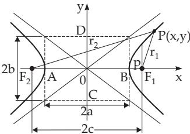  
Figure 3.156

In polar coordinates see 3.5.2.11, 6., p. 208.

3. Definition of the Hyperbola, Focal Properties The hyperbola is the locus of points for which the diference of the distances from two given points, the foci, is a constant 2a. The points for which $r _ { 1 } - r _ { 2 } = 2 a$ belong to one branch of the hyperbola (in Fig. 3.156 on the left), the others with $r _ { 2 } - r _ { 1 } =$ 2a belong to the other branch (in Fig. 3.156 on the right). These distances, also called the focal radii, can be calculated from the formulas

$$
r _ { 1 } = \pm ( e x - a ) ; \quad r _ { 2 } = \pm ( e x + a ) ; \quad r _ { 2 } - r _ { 1 } = \pm 2 a ,\tag{3.331}
$$

where the upper sign is valid for the right branch, the lower one for the left branch. Here and in the following formulas for hyperbolas in Cartesian coordinates it is supposed that the hyperbola is given in normal form.

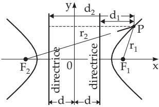  
Figure 3.157

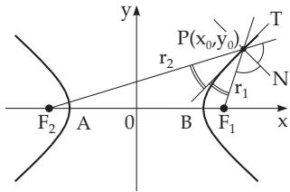  
Figure 3.158

4. Directrices of the Hyperbola are the lines perpendicular to the real axis at a distance $d = a / c$ from the midpoint (Fig. 3.157). Every point of the hyperbola $P ( x , y )$ satisfies the equalities

$$
{ \frac { r _ { 1 } } { d _ { 1 } } } = { \frac { r _ { 2 } } { d _ { 2 } } } = e .\tag{3.332}
$$

5. Tangent of the Hyperbola at the point $P ( x _ { 0 } , y _ { 0 } )$ is given by the equation

$$
{ \frac { x x _ { 0 } } { a _ { 2 } } } - { \frac { y y _ { 0 } } { b _ { 2 } } } = 1 .\tag{3.333}
$$

The normal and tangent lines of the hyperbola at the point P (Fig. 3.158) are bisectors of the interior and exterior angles between the radii connecting the point P with the foci. The line Ax $+ B y + C = 0$ is a tangent line if the equation

$$
A ^ { 2 } a ^ { 2 } - B ^ { 2 } b ^ { 2 } - C ^ { 2 } = 0\tag{3.334}
$$

is satisfied.

6. Asymptotes of the Hyperbola are the lines (Fig. 3.159) approached infinitely closely by the branches of the hyperbola for $x \to \infty$ . (For the definition of asymptotes see 3.6.1.4, p. 252.) The slopes

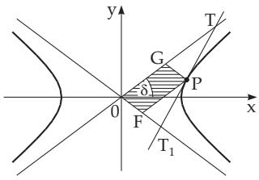

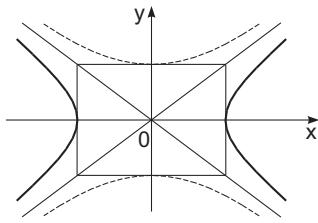  
Figure 3.159  
Figure 3.160

of the asymptotes are $k = \pm \tan \delta = \pm b / a$ . The equations of the asymptotes are

$$
y = \pm \left( { \frac { b } { a } } \right) x .\tag{3.335}
$$

A tangent is intersected by the asymptotes, and they form a segment of the tangent of the hyperbola, i.e., the segment $\overline { { T T } } _ { 1 }$ (Fig. 3.159). The midpoint of the segment of the tangent is the point of contact $P _ { \cdot }$ so ${ \overline { { T P } } } = { \overline { { T _ { 1 } P } } }$ holds. The area of the triangle $T 0 T _ { 1 }$ between the tangent and the asymptotes for any point of contact $P$ is the same, and is

$$
S _ { T O T _ { 1 } } = a b .\tag{3.336}
$$

The area of the parallelogram 0FPG, determined by the asymptotes and two lines parallel to the asymptotes and passing through the point $P ,$ is for any point of contact $P$

$$
{ \cal S } _ { O F P G } = \frac { a b } { 2 } .\tag{3.337}
$$

7. Conjugate Hyperbolas (Fig. 3.160) have the equations

$$
{ \frac { x ^ { 2 } } { a ^ { 2 } } } - { \frac { y ^ { 2 } } { b ^ { 2 } } } = 1 \quad { \mathrm { a n d } } \quad { \frac { y ^ { 2 } } { b ^ { 2 } } } - { \frac { x ^ { 2 } } { a ^ { 2 } } } = 1 ,\tag{3.338}
$$

where the second is represented in Fig. 3.160 by the dotted line. They have the same asymptotes, hence the real axis of one of them is the imaginary axis of the other one and conversely.

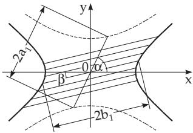  
Figure 3.161

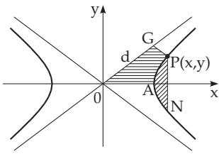  
Figure 3.162

8. Diameters of the Hyperbola (Fig. 3.161) are the chords between the two branches of the hyperbola passing through the midpoint, which is their midpoint too. Two diameters with slopes k and $k ^ { \prime }$ are called conjugate if one of them belongs to a hyperbola and the other one belongs to its conjugate, and $k k ^ { \prime } = b ^ { 2 } / a ^ { 2 }$ holds. The midpoints of the chords parallel to a diameter are on its conjugate diameter (Fig. 3.161). From two conjugate diameters the one with $| k | < b / a$ intersects the hyperbola. If the lengths of two conjugate diameters are $2 a _ { 1 }$ and $2 b _ { 1 }$ , and the acute angles between the diameters and the real axis are α and $\beta < \alpha$ , then the equalities

$$
a _ { 1 } ^ { 2 } - b _ { 1 } ^ { 2 } = a ^ { 2 } - b ^ { 2 } , \quad a b = a _ { 1 } b _ { 1 } \sin ( \alpha - \beta )\tag{3.339}
$$

are valid.

9. Radius of Curvature of the Hyperbola At the point $P ( x _ { 0 } , y _ { 0 } )$ the radius of curvature of the hyperbola is

$$
R = a ^ { 2 } b ^ { 2 } \biggl ( { \frac { x _ { 0 } ^ { 2 } } { a ^ { 4 } } } + { \frac { y _ { 0 } ^ { 2 } } { b ^ { 4 } } } \biggr ) ^ { 3 / 2 } = { \frac { r _ { 1 } { r _ { 2 } } ^ { 3 / 2 } } { a b } } = { \frac { p } { \sin ^ { 3 } u } } ,\tag{3.340a}
$$

where u is the angle between the tangent and the radius vector connecting the point of contact with a focus. At the vertices A and B (Fig. 3.156) the radius of curvature is

$$
R _ { A } = R _ { B } = p = { \frac { b ^ { 2 } } { a } } .\tag{3.340b}
$$

10. Areas in the Hyperbola (Fig. 3.162)

a) Segment APN:

$$
S _ { \mathrm { A P N } } = x y - a b \ln \left( { \frac { x } { a } } + { \frac { y } { b } } \right) = x y - a b \operatorname { A r c o s h } { \frac { x } { a } } .\tag{3.341a}
$$

b) Area 0APG:

$$
S _ { \mathrm { 0 A P G } } = \frac { a b } { 4 } + \frac { a b } { 2 } \ln \frac { 2 d } { c } .\tag{3.341b}
$$

The line segment $\overline { { P G } }$ is parallel to the lower asymptote, c is the focal distance and $d = \overline { { 0 G } }$

11. Arc of the Hyperbola The arclength between two points A and B of the hyperbola cannot be calculated in an elementary way like the parabola, but it can be calculated by an incomplete elliptic integral of the second kind $E ( k , \varphi )$ (see 8.1.4.3,2., p. 502), analogously to the arclength of the ellipse $( \mathrm { s e e 3 . 5 . 2 . 8 , \mathbf { | \mu _ { \mathrm { p . 2 0 1 } } ) } }$

12. Equilateral Hyperbola has axes with the same length $a = b ,$ , so its equation is

$$
x ^ { 2 } - y ^ { 2 } = a ^ { 2 }\tag{3.342a}
$$

The asymptotes of the equilateral hyperbola are the lines $y = \pm x { : }$ ; they are perpendicular to each other. If the asymptotes coincide with the coordinate axes (Fig. 3.163), then the equation is

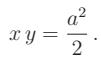

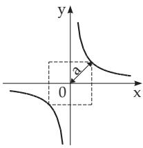

(3.342b)

Figure 3.163  
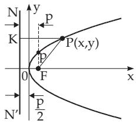  
Figure 3.164

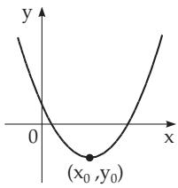  
Figure 3.165
