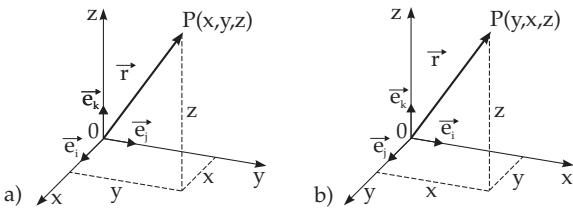
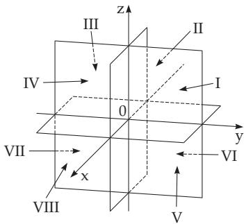

##### 3.5.3.1 Basic Concepts

1. Coordinates and Coordinate Systems

Every point $P$ in space can be determined by a coordinate system. The directions of the coordinate lines are given by the directions of the unit vectors. In Fig. 3.170a the relations of a Cartesian coordinate system are represented. There are to distinguish right-angled and oblique coordinate systems where the unit vectors are perpendicular or oblique to each other. Another important diference is whether it is a right-handed or a left-handed coordinate system.

The most common spatial coordinate systems are the Cartesian coordinate system, the spherical polar coordinate system, and the cylindrical polar coordinate system.

2. Right- and Left-Handed Systems

Depending on the successive order of the positive coordinate directions there are to distinguish right systems and $l e f t$ systems or right-handed and left-handed coordinate systems. A right system has for instance three non-coplanar unit vectors with indices in alphabetical order $\vec { \mathbf { e } } _ { i } , \vec { \mathbf { e } } _ { j } , \vec { \mathbf { e } } _ { k }$ . These vectors form a right-handed system when an observer, looking on the $\vec { \mathbf { e } } _ { i } , \vec { \mathbf { e } } _ { j }$ plane and at the same time into the direction of $\vec { \mathbf { e } } _ { k }$ , can rotate $\vec { \mathbf { e } } _ { i }$ into $\vec { \mathbf { e } } _ { j }$ along the smallest angle, i.e., clockwise; looking from the cusp of the vector $\vec { \mathbf { e } } _ { k }$ into the direction of the $\vec { \bf e } _ { i } , \bar { \vec { \bf e } } _ { j }$ plane he can rotate $\vec { \mathbf { e } } _ { i }$ into $\vec { \mathbf { e } } _ { j }$ counterclockwise. A left system consequently requires the opposite rotation in both cases. The alphabetical order of rotation is represented symbolically in Fig. 3.34, p. 143 where the notations $a , b , c$ are substituted for the indices $i , j , k$

  
Figure 3.170

Right- and left-handed systems can be transformed into each other by interchanging two unit vectors. The interchange of two unit vectors changes its orientation: A right system becomes a left system, and conversely, a left system becomes a right system.

A very important way to interchange vectors is the cyclic permutation, where the orientation remains unchanged. As in Fig. 3.34 the interchange the vectors of a right system by cyclic permutation yields a rotation in a counterclockwise direction, i.e., according to the scheme $( i \stackrel { . } {  } j \stackrel { . } {  } k \stackrel { . } {  } i , j \stackrel { . } {  } k \stackrel { . } {  }$ $i \to j , k \to i \to j \to k )$ . In a left system the interchange of the vectors by cyclic permutation follows a clockwise rotation, i.e., according to the scheme $( i  \tilde { k }  j  i , k  j  i  \hat { k } , j  i  k  j )$

A right system is not superposable on a left system.

The reflection of a right system with respect to the origin is a left system (see 4.3.5.1, p. 288).

A: The Cartesian coordinate system with coordinate axes $x , y , z$ is a right system (Fig. 3.170a).

B: The Cartesian coordinate system with coordinate axes $x , z , y$ is a left system (Fig. 3.170b).

C: From the right system $\vec { \bf e } _ { i } , \vec { \bf e } _ { j } , \vec { \bf e } _ { k }$ one gets the left system $\vec { \bf e } _ { i } , \vec { \bf e } _ { k } , \vec { \bf e } _ { j }$ by interchanging the vectors ej and $\vec { \mathbf { e } } _ { k }$

D: By cyclic permutation follows from the right system $\vec { \bf e } _ { i } , \vec { \bf e } _ { j } , \vec { \bf e } _ { k }$ the right system $\vec { \mathbf { e } } _ { j } , \vec { \mathbf { e } } _ { k } , \vec { \mathbf { e } } _ { i }$ and from this one $\vec { \mathbf { e } } _ { k } , \vec { \mathbf { e } } _ { i } , \vec { \mathbf { e } } _ { j }$ , a right system again.

Table 3.21 Coordinate signs in the octants
<table><tr><td>Octant</td><td>I</td><td>II</td><td>III</td><td>IV</td><td>V</td><td>VI</td><td>VII</td><td>VIII</td></tr><tr><td>x</td><td>十</td><td>一</td><td>一</td><td>十</td><td>十</td><td></td><td>一</td><td>十</td></tr><tr><td>y</td><td>+ +</td><td>十</td><td></td><td>一</td><td>+-</td><td> $^ +$ </td><td>一</td><td>一</td></tr><tr><td>z</td><td></td><td>十</td><td>十</td><td>十</td><td></td><td></td><td>一</td><td>一</td></tr></table>

3. Cartesian Coordinates

  
Figure 3.171

of a point P are its distances from three mutually orthogonal planes in a certain measuring unit, with given signs. They represent the projections of the radius vector r of the point P (see 3.5.1.1, 6., p. 182) onto three mutually perpendicular coordinate axes (Fig. 3.170). The intersection point of the planes O, which is the intersection point of the axes too, is called the origin. The coordinates x, y, and z are called the abscissa, ordinate, and applicate. The written form $P ( a , b , c )$ means that the point P has coordinates $x = a , y = b , z = c$ . The signs of the coordinates are determined by the octant where the point P lies (Fig. 3.171, Table 3.21).

In a right-handed Cartesian coordinate system (Fig. 3.170a) for orthogonal unit vectors given in the order $\vec { \mathbf { e } } _ { i } , \vec { \mathbf { e } } _ { j } , \vec { \mathbf { e } } _ { k }$ the equalities

$$
\vec { \bf e } _ { i } \times \vec { \bf e } _ { j } = \vec { \bf e } _ { k } , \quad \vec { \bf e } _ { j } \times \vec { \bf e } _ { k } = \vec { \bf e } _ { i } , \quad \vec { \bf e } _ { k } \times \vec { \bf e } _ { i } = \vec { \bf e } _ { j } ,\tag{3.355a}
$$

hold, i.e., the right-hand law is valid (see 3.5.1.5, p. 184). The three formulas transform into each other under cyclic permutations of the unit vectors.

In a left-handed Cartesian coordinate system (Fig. 3.170b) the equations

$$
\vec { \bf e } _ { i } \times \vec { \bf e } _ { j } = - \vec { \bf e } _ { k } , \quad \vec { \bf e } _ { j } \times \vec { \bf e } _ { k } = - \vec { \bf e } _ { i } , \quad \vec { \bf e } _ { k } \times \vec { \bf e } _ { i } = - \vec { \bf e } _ { j }\tag{3.355b}
$$

are valid. The negative sign of the vector product arises from the left-handed order of the unit vectors, see Fig. 3.170b, i.e., from their clockwise arrangement.

Notice that in both cases the equations

$$
{ \vec { \mathbf { e } } } _ { i } \times { \vec { \mathbf { e } } } _ { i } = { \vec { \mathbf { e } } } _ { j } \times { \vec { \mathbf { e } } } _ { j } = { \vec { \mathbf { e } } } _ { k } \times { \vec { \mathbf { e } } } _ { k } = { \vec { \mathbf { 0 } } }\tag{3.355c}
$$

are valid. Usually one works with right-handed coordinate systems; the formulas do not depend on this choice. In geodesy usually left-handed coordinate systems are in use (see 3.2.2.1, p. 144).

4. Coordinate Surfaces and Coordinate Curves

Coordinate Surfaces have one constant coordinate. In a Cartesian coordinate system they are planes parallel to the plane of other two coordinate axes. By the three coordinate surfaces $x = 0 , y = 0 $ and $z ~ = ~ 0$ three-dimensional space is divided into eight octants (Fig. 3.171). Coordinate lines or coordinate curves are curves with one changing coordinate while the others are constants. In Cartesian systems they are lines parallel to the coordinate axes. The coordinate surfaces intersect each other in a coordinate line.
