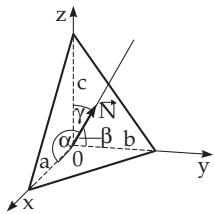
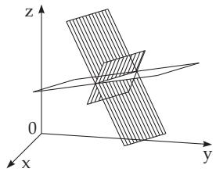
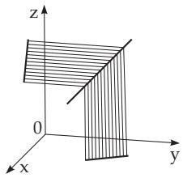

##### 3.5.3.10 Line and Plane in Space

1. Equations of the Plane

Every equation linear in the coordinates defines a plane, and conversely every plane has an equation of first degree.

1. General Equation of the Plane

a) with coordinates: $A x + B y + C z + D = 0 ,$

(3.379a)

b) in vector form:

$$
\vec { \bf r } \vec { \bf N } + D = 0 , { ^ * }\tag{3.379b}
$$

where the vector $\vec { \bf N } ( A , B , C )$ is perpendicular to the plane. In (Fig. 3.181) the intercepts $a , b ,$ and c are shown. The vector $\vec { \bf N }$ is called the normal vector of the plane. Its direction cosines are

$$
\cos \alpha = \frac { A } { \sqrt { A ^ { 2 } + B ^ { 2 } + C ^ { 2 } } } , \cos \beta = \frac { B } { \sqrt { A ^ { 2 } + B ^ { 2 } + C ^ { 2 } } } , \cos \gamma = \frac { C } { \sqrt { A ^ { 2 } + B ^ { 2 } + C ^ { 2 } } } .\tag{3.379c}
$$

If $D = 0$ holds, the plane goes through the origin; for $A = 0 .$ , or $B = 0 .$ , or $C = 0$ the plane is parallel to the x-axis, the y-axis, or the z-axis, respectively. If $A = B = 0 .$ , or $A = C = 0$ , or $\bar { B } = { \cal C } = \bar { 0 }$ , then the plane is parallel to the x, y plane, the $x , z$ plane or the y, z plane, respectively.

2. Hessian Normal Form of the Equation of the Plane

a) with coordinates: x cos $\alpha + y$ cos β + z cos γ  p = 0,

(3.380a)

b) in vector form:

$$
\vec { \bf r } \vec { \bf N } ^ { 0 } - p = 0 ,\tag{3.380b}
$$

where $\vec { \mathbf { N } } ^ { 0 }$ is the unit normal vector of the plane and $p$ is the distance of the plane from the origin. The Hessian normal form arises from the general equation (3.379a) by multiplying by the normalizing factor

$$
\pm \mu = \frac { 1 } { N } = \frac { 1 } { \sqrt { A ^ { 2 } + B ^ { 2 } + C ^ { 2 } } } \qquad \mathrm { w i t h } \ N = | \vec { \bf N } | .\tag{3.380c}
$$

Here the sign of $\mu$ must be chosen opposite to that of D.

3. Intercept Form of the Equation of the Plane With the segments $a , b , c ,$ considering them with signs depending on where the plane intersects the coordinate axes (Fig. 3.181) holds:

$$
{ \frac { x } { a } } + { \frac { y } { b } } + { \frac { z } { c } } = 1 .\tag{3.381}
$$

4. Equation of the Plane Through Three Points If the points are $P _ { 1 } \left( x _ { 1 } , y _ { 1 } , z _ { 1 } \right) , P _ { 2 } \left( x _ { 2 } , y _ { 2 } , z _ { 2 } \right)$ $P _ { 3 } \left( x _ { 3 } , y _ { 3 } , z _ { 3 } \right)$ , then it holds:

a) with coordinates:

$$
\left| { \begin{array} { l l l } { x - x _ { 1 } } & { y - y _ { 1 } } & { z - z _ { 1 } } \\ { x _ { 2 } - x _ { 1 } } & { y _ { 2 } - y _ { 1 } } & { z _ { 2 } - z _ { 1 } } \\ { x _ { 3 } - x _ { 1 } } & { y _ { 3 } - y _ { 1 } } & { z _ { 3 } - z _ { 1 } } \end{array} } \right| = 0 ,\tag{3.382a}
$$

b) in vector form:

$$
\left( { \vec { \bf r } } - { \vec { \bf r } } _ { 1 } \right) \left( { \vec { \bf r } } - { \vec { \bf r } } _ { 2 } \right) \left( { \vec { \bf r } } - { \vec { \bf r } } _ { 3 } \right) = 0 ^ { \dagger } .\tag{3.382b}
$$

5. Equation of a Plane Through Two Points and Parallel to a Line The equation of the plane passing through the two points $P _ { 1 } \left( x _ { 1 } , y _ { 1 } , z _ { 1 } \right) , P _ { 2 } \left( x _ { 2 } , y _ { 2 } , z _ { 2 } \right)$ and being parallel to the line with direction vector $\vec { \bf R } ( l , m , n )$ is the following

a) with coordinates:

$$
\left| { \begin{array} { l } { x - x _ { 1 } y - y _ { 1 } z - z _ { 1 } } \\ { x _ { 2 } - x _ { 1 } y _ { 2 } - y _ { 1 } z _ { 2 } - z _ { 1 } } \\ { l } \end{array} } \right| = 0 ,\tag{3.383a}
$$

b) in vector form:

$$
\left( \vec { \bf r } - \vec { \bf r } _ { 1 } \right) \left( \vec { \bf r } - \vec { \bf r } _ { 2 } \right) \vec { \bf R } = 0 ^ { \dagger } .\tag{3.383b}
$$

6. Equation of a Plane Through a Point and Parallel to Two Lines

If the direction vectors of the lines are $\vec { \bf R } _ { 1 } \left( l _ { 1 } , m _ { 1 } , n _ { 1 } \right)$ and $\vec { \bf R } _ { 2 } \left( l _ { 2 } , m _ { 2 } , n _ { 2 } \right)$ , then it holds:

a) with coordinates:

$$
\left| { \begin{array} { c } { x - x _ { 1 } \ y - y _ { 1 } \ z - z _ { 1 } } \\ { l _ { 1 } \qquad m _ { 1 } \qquad n _ { 1 } } \\ { l _ { 2 } \qquad m _ { 2 } \qquad n _ { 2 } } \end{array} } \right| = 0 ,\tag{3.384a}
$$

b) in vector form:

$$
( \vec { \bf r } - \vec { \bf r } _ { 1 } ) \vec { \bf R } _ { 1 } \vec { \bf R } _ { 2 } = 0 ^ { \dagger } .\tag{3.384b}
$$

7. Equation of a Plane Through a Point and Perpendicular to a Line If the point is $P _ { 1 } \left( x _ { 1 } , y _ { 1 } , z _ { 1 } \right)$ , and the direction vector of the line is $\vec { \bf N } ( A , B , C )$ , then it holds: a) with coordinates: $A \left( x - x _ { 1 } \right) + B \left( y - y _ { 1 } \right) + C \left( z - z _ { 1 } \right) = 0 ,$

(3.385a)

b) in vector form:

$$
( \vec { \bf r } - \vec { \bf r } _ { 1 } ) \vec { \bf N } = 0 . ^ { * }\tag{3.385b}
$$

8. Distance of a Point from a Plane Substituting the coordinates of the point $P ( a , b , c )$ in the Hessian normal form of the equation of the plane (3.380a)

$$
x \cos \alpha + y \cos \beta + z \cos \gamma - p = 0 ,\tag{3.386a}
$$

results in the distance with sign

$$
\delta = a \cos \alpha + b \cos \beta + c \cos \delta - p ,\tag{3.386b}
$$

where $\delta > 0$ , if P and the origin are on diferent sides of the plane; in the opposite case $\delta < 0$ holds.

9. Equation ofa Plane Through the Intersection Line ofTwo Planes The equation of a plane which goes through the intersection line of the planes given by the equations $A _ { 1 } x + B _ { 1 } y + C _ { 1 } z + \bar { D _ { 1 } } = 0$ and $\overset { \_ } { \underset { \_ } { { D } } { { x } } } + \overset { \_ } { \underset { { D } } { { B } } _ { 2 } } y + \overset { \_ } { C } _ { 2 } z + \overset { \_ } { D } _ { 2 } = 0$ is

a) with coordinates: $A _ { 1 } x + B _ { 1 } y + C _ { 1 } z + D _ { 1 } + \lambda \left( A _ { 2 } x + B _ { 2 } y + C _ { 2 } z + D _ { 2 } \right) = 0 .$

(3.387a)

b) in vector form: $\vec { \bf r } \vec { \bf N } _ { 1 } + D _ { 1 } + \lambda ( \vec { \bf r } \vec { \bf N } _ { 2 } + D _ { 2 } ) = 0 .$

(3.387b)

Here λ is a real parameter, so (3.387a) and (3.387b) define a pencil of planes. Fig. 3.182 shows the case with three planes. If λ takes all the values between and + in (3.387a) and (3.387b), so this yields all the planes from the pencil. For $\lambda = \pm 1$ it results in the equations of the planes bisecting the angle between the given planes if their equations are in normal form.

2. Two and More Planes in Space

1. Angle between Two Planes, General Case: The angle $\varphi$ between two planes given by the equations $A _ { 1 } x + B _ { 1 } y + C _ { 1 } z + D _ { 1 } = 0$ and $A _ { 2 } x + B _ { 2 } y + C _ { 2 } z + \bar { D _ { 2 } } = 0$ can be calculated by the formula

$$
\cos \varphi = \frac { A _ { 1 } A _ { 2 } + B _ { 1 } B _ { 2 } + C _ { 1 } C _ { 2 } } { \sqrt { \left( A _ { 1 } ^ { 2 } + B _ { 1 } ^ { 2 } + C _ { 1 } ^ { 2 } \right) \left( A _ { 2 } ^ { 2 } + B _ { 2 } ^ { 2 } + C _ { 2 } ^ { 2 } \right) } } .\tag{3.388a}
$$

If the planes are given by vector equations $\vec { \bf r } \vec { \bf N } _ { 1 } + D _ { 1 } = 0$ and $\vec { \bf r } \vec { \bf N } _ { 2 } + D _ { 2 } = 0$ , then

$$
\cos \varphi = \frac { \vec { \bf N } _ { 1 } \vec { \bf N } _ { 2 } } { N _ { 1 } N _ { 2 } } \quad \mathrm { w i t h } \quad N _ { 1 } = | \vec { \bf N _ { 1 } } | \mathrm { ~ a n d ~ } N _ { 2 } = | \vec { \bf N _ { 2 } } | .\tag{3.388b}
$$

  
Figure 3.181

  
Figure 3.182

  
Figure 3.183

2. Intersection Point of Three Planes: The coordinates of the intersection point of three planes given by the three equations $A _ { 1 } x + B _ { 1 } y + C _ { 1 } z + D _ { 1 } = 0 , A _ { 2 } x + B _ { 2 } y + C _ { 2 } z + D _ { 2 } = 0$ , and $A _ { 3 } x + B _ { 3 } y +$ $\bar { C } _ { 3 } z + \bar { D } _ { 3 } = 0$ , are calculated by the formulas

$$
\bar { x } = \frac { - \Delta { x } } { \Delta } , \quad \bar { y } = \frac { - \Delta { y } } { \Delta } , \quad \bar { z } = \frac { - \Delta { z } } { \Delta } \quad \mathrm { w i t h }\tag{3.389a}
$$

$$
\Delta = { \left| \begin{array} { l l } { A _ { 1 } \ B _ { 1 } \ C _ { 1 } } \\ { A _ { 2 } \ B _ { 2 } \ C _ { 2 } } \\ { A _ { 3 } \ B _ { 3 } \ C _ { 3 } } \end{array} \right| } , \quad \Delta _ { x } = { \left| \begin{array} { l l } { D _ { 1 } \ B _ { 1 } \ C _ { 1 } } \\ { D _ { 2 } \ B _ { 2 } \ C _ { 2 } } \\ { D _ { 3 } \ B _ { 3 } \ C _ { 3 } } \end{array} \right| } , \quad \Delta _ { y } = { \left| \begin{array} { l l } { A _ { 1 } \ D _ { 1 } \ C _ { 1 } } \\ { A _ { 2 } \ D _ { 2 } \ C _ { 2 } } \\ { A _ { 3 } \ D _ { 3 } \ C _ { 3 } } \end{array} \right| } , \quad \Delta _ { z } = { \left| \begin{array} { l l } { A _ { 1 } \ B _ { 1 } \ D _ { 1 } } \\ { A _ { 2 } \ B _ { 2 } \ D _ { 2 } } \\ { A _ { 3 } \ B _ { 3 } \ D _ { 3 } } \end{array} \right| } .\tag{3.389b}
$$

Three planes intersect each other at one point if $\Delta \neq 0$ holds. If $\Delta = 0$ holds and at least one subdeterminant of second order is non-zero, then the planes are parallel to a line; if every subdeterminant of second order is zero, then the planes have a common line.

3. Conditions for Parallelism and Orthogonality of Planes:

a) Conditions for Parallelism: Two planes are parallel if

$$
{ \frac { A _ { 1 } } { A _ { 2 } } } = { \frac { B _ { 1 } } { B _ { 2 } } } = { \frac { C _ { 1 } } { C _ { 2 } } } \qquad { \mathrm { o r } } \qquad { \vec { \bf N _ { 1 } } } \times { \vec { \bf N _ { 2 } } } = { \vec { \bf 0 } } \quad { \mathrm { h o l d s } } .\tag{3.390}
$$

b) Conditions for Orthogonality: Two planes are perpendicular to each other if

$$
A _ { 1 } A _ { 2 } + B _ { 1 } B _ { 2 } + C _ { 1 } C _ { 2 } = 0 \qquad \mathrm { o r } \qquad \vec { \bf N _ { 1 } } \vec { \bf N _ { 2 } } = 0 \quad \mathrm { h o l d s . }\tag{3.391}
$$

4. Intersection Point ofFour Planes: Four planes given by the equations $A _ { 1 } x + B _ { 1 } y + C _ { 1 } z + D _ { 1 } =$ $0 , \quad A _ { 2 } x + B _ { 2 } y + C _ { 2 } z + D _ { 2 } = 0 , \quad A _ { 3 } x + B _ { 3 } y + C _ { 3 } z + \bar { D } _ { 3 } = 0$ , and $A _ { 4 } x + B _ { 4 } y + C _ { 4 } z + D _ { 4 } = 0$ have a common point only if for the determinant

$$
\delta = { \left| \begin{array} { l } { A _ { 1 } \ B _ { 1 } \ C _ { 1 } \ D _ { 1 } } \\ { A _ { 2 } \ B _ { 2 } \ C _ { 2 } \ D _ { 2 } } \\ { A _ { 3 } \ B _ { 3 } \ C _ { 3 } \ D _ { 3 } } \\ { A _ { 4 } \ B _ { 4 } \ C _ { 4 } \ D _ { 4 } } \end{array} \right| } = 0\tag{3.392}
$$

holds. In this case the common point is determined from three equations, the fourth equation is super- fluous; it is a consequence of the others.

5. Distance Between Two Parallel Planes: If two planes are parallel, and they are given by the equations

$$
A x + B y + C z + D _ { 1 } = 0 \qquad { \mathrm { a n d } } \qquad A x + B y + C z + D _ { 2 } = 0 ,\tag{3.393}
$$

then their distance is

$$
d = \frac { | D _ { 1 } - D _ { 2 } | } { \sqrt { A ^ { 2 } + B ^ { 2 } + C ^ { 2 } } } .\tag{3.394}
$$
