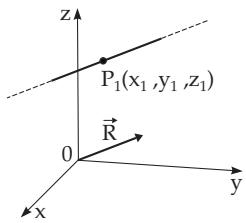
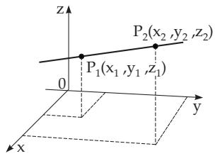
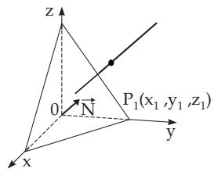

##### 3.5.3.11 Lines in Space

1. Equations of a Line

1. Equation of a Line in Space, General Case Because a line in space can be defined as the intersection of two planes, it can be represented by a system of two linear equations.

$$
A _ { 1 } x + B _ { 1 } y + C _ { 1 } z + D _ { 1 } = 0 , \quad A _ { 2 } x + B _ { 2 } y + C _ { 2 } z + D _ { 2 } = 0 .\tag{3.395a}
$$

b) In vector form:

$$
\begin{array} { r } { \vec { \bf r } \vec { \bf N } _ { 1 } + D _ { 1 } = 0 , \quad \vec { \bf r } \vec { \bf N } _ { 2 } + D _ { 2 } = 0 . } \end{array}\tag{3.395b}
$$

2. Equation of a Line in Two Projecting Planes

The two equations $y = k x + a , \quad z = h x + b$

(3.396)

define a plane each, and these planes go through the line and are perpendicular to the $x , y$ and the $x , z$ planes resp. (Fig. 3.183). They are called projecting planes. This representation cannot be used for lines parallel to the $y , z { \mathrm { p l a n e } }$ , so in this case other projections to other coordinate planes are considered.

The equation (or the system of equations) of a line passing through a point $P _ { 1 } \left( x _ { 1 } , y _ { 1 } , z _ { 1 } \right)$ parallel to a direction vector $\vec { \bf R } ( l , m , n )$ (Fig. 3.184) has the form

a) in component representation and in vector form:

  
Figure 3.184

  
Figure 3.185  
Figure 3.186

$$
{ \frac { x - x _ { 1 } } { l } } = { \frac { y - y _ { 1 } } { m } } = { \frac { z - z _ { 1 } } { n } } ,
$$

$$
( \vec { \bf r } - \vec { \bf r } _ { 1 } ) \times \vec { \bf R } = \vec { \bf 0 } ,\tag{3.397b}
$$

b) in parametric form and vector form:

$$
x = x _ { 1 } + l t , y = y _ { 1 } + m t , z = z _ { 1 } + n t ; ( 3 . 3 9 7 \mathrm { c } )
$$

$$
\vec { \bf r } = \vec { \bf r } _ { 1 } + \vec { \bf R } t ,\tag{3.397d}
$$

where the numbers $x _ { 1 } , y _ { 1 } , z _ { 1 }$ are chosen such that the equations in (3.395a) are satisfied. The representation (3.397a) follows from (3.395a) with

$$
l = \left| \begin{array} { c c } { { B _ { 1 } C _ { 1 } } } \\ { { B _ { 2 } C _ { 2 } } } \end{array} \right| , m = \left| \begin{array} { c c } { { C _ { 1 } A _ { 1 } } } \\ { { C _ { 2 } A _ { 2 } } } \end{array} \right| , n = \left| \begin{array} { c c } { { A _ { 1 } B _ { 1 } } } \\ { { A _ { 2 } B _ { 2 } } } \end{array} \right| ,\tag{3.398a}
$$

or in vector form $\vec { \bf R } = \vec { \bf N } _ { 1 } \times \vec { \bf N } _ { 2 }$

(3.398b)

4. Equation ofa Line Through Two Points The equation ofa line through two points $P _ { 1 } \left( x _ { 1 } , y _ { 1 } , z _ { 1 } \right)$ and $P _ { 2 } \left( x _ { 2 } , y _ { 2 } , z _ { 2 } \right)$ (Fig. 3.185) is

in component form and in vector form:

$$
{ \frac { x - x _ { 1 } } { x _ { 2 } - x _ { 1 } } } = { \frac { y - y _ { 1 } } { y _ { 2 } - y _ { 1 } } } = { \frac { z - z _ { 1 } } { z _ { 2 } - z _ { 1 } } } ,
$$

$$
( \vec { \bf r } - \vec { \bf r } _ { 1 } ) \times ( \vec { \bf r } - \vec { \bf r } _ { 2 } ) = \vec { 0 } ^ { * } .\tag{3.399b}
$$

If for instance $x _ { 1 } = x _ { 2 }$ , the equations in component form are $x = x _ { 2 } , \frac { y - y _ { 1 } } { y _ { 2 } - y _ { 1 } } = \frac { z - z _ { 1 } } { z _ { 2 } - z _ { 1 } }$ . If $x _ { 1 } = x _ { 2 }$ and $y _ { 1 } = y _ { 2 }$ are both valid, the equations in component form are $x = x _ { 2 } , y = y _ { 2 }$

5. Equation of a Line Through a Point and Perpendicular to a Plane The equation of a line passing through the point $P _ { 1 } ( \bar { x } _ { 1 } , y _ { 1 } , z _ { 1 } )$ and being perpendicular to a plane given by the equation $A x + B y + C z + D = 0$ or by $\vec { \bf r } \vec { \bf N } + D = 0$ (Fig. 3.186) is

$$
{ \frac { x - x _ { 1 } } { A } } = { \frac { y - y _ { 1 } } { B } } = { \frac { z - z _ { 1 } } { C } } ,
$$

(3.400a)

$$
( \vec { \bf r } - \vec { \bf r } _ { 1 } ) \times \vec { \bf N } = \vec { \bf 0 } .\tag{3.400b}
$$

If for instance $A = 0$ holds, the equations in component form have a similar form as in the previous case.

2. Distance of a Point from a Line Given in Component Form For the distance d of the point $M ( a , b , c )$ from a line given in the form (3.397a) holds:

$$
d ^ { 2 } = \frac { \left[ \left( a - x _ { 1 } \right) m - \left( b - y _ { 1 } \right) l \right] ^ { 2 } + \left[ \left( b - y _ { 1 } \right) n - \left( c - z _ { 1 } \right) m \right] ^ { 2 } + \left[ \left( c - z _ { 1 } \right) l - \left( a - x _ { 1 } \right) n \right] ^ { 2 } } { l ^ { 2 } + m ^ { 2 } + n ^ { 2 } } .\tag{3.401}
$$

3. Smallest Distance Between Two Lines Given in Component Form

If the lines are given in the form (3.397a), their distance is

$$
d = { \frac { \pm \left| \begin{array} { c c c } { { x _ { 1 } - x _ { 2 } y _ { 1 } - y _ { 2 } z _ { 1 } - z _ { 2 } } } \\ { { l _ { 1 } } } & { { m _ { 1 } } } & { { n _ { 1 } } } \\ { { l _ { 2 } } } & { { m _ { 2 } } } & { { n _ { 2 } } } \end{array} \right| } { \sqrt { \left| \begin{array} { l l } { { l _ { 1 } m _ { 1 } } } \\ { { l _ { 2 } m _ { 2 } } } \end{array} \right| ^ { 2 } + \left| \begin{array} { l l } { { m _ { 1 } n _ { 1 } } } \\ { { m _ { 2 } n _ { 2 } } } \end{array} \right| ^ { 2 } + \left| \begin{array} { l l } { { n _ { 1 } l _ { 1 } } } \\ { { n _ { 2 } l _ { 2 } } } \end{array} \right| ^ { 2 } } } } .\tag{3.402}
$$

If the determinant in the numerator is equal to zero, the lines intersect each other.
