##### 3.5.3.13 Surfaces of Second Order, Equations in Normal Form

1. Central Surfaces

The following equations, which are also called the normal form of the equations of surfaces of second order, can be derived from the general equations of surfaces of second order (see 3.5.3.14, 1., p. 228) by putting the center at the origin. Here the center is the midpoint of the chords passing through it. The coordinate axes are the symmetry axes of the surfaces, so the coordinate planes are also the planes of symmetry.

2. Ellipsoid

With the semi-axes a, b, c (Fig. 3.187) the equation of an ellipsoid is

$$
{ \frac { x ^ { 2 } } { a ^ { 2 } } } + { \frac { y ^ { 2 } } { b ^ { 2 } } } + { \frac { z ^ { 2 } } { c ^ { 2 } } } = 1 .\tag{3.412}
$$

The following special cases are to be distinguished:

a) Compressed Ellipsoid of Revolution (Lens Form): $a = b > c$ (Fig. 3.188).

b) Stretched Ellipsoid of Revolution (Cigar Form): $a = b < c$ (Fig. 3.189).

c) Sphere: $a = b = c$ so that $x ^ { 2 } + y ^ { 2 } + z ^ { 2 } = a ^ { 2 }$ is valid.

The two forms of the ellipsoid of revolution arise by rotating an ellipse in the x, z plane with axes a and c around the z-axis, and one gets a sphere if rotating a circle around any axis. If a plane goes through an ellipsoid, the intersection figure is an ellipse; in a special case it is a circle. The volume of the ellipsoid is

$$
V = { \frac { 4 \pi a b c } { 3 } } .\tag{3.413}
$$

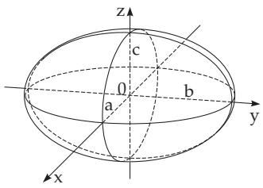  
Figure 3.187

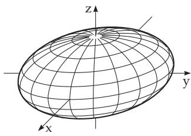  
Figure 3.188

3. Hyperboloid

a) Hyperboloid of One Sheet (Fig. 3.190): With a and $b$ as real and c as imaginary semi-axes the equation is

$$
{ \frac { x ^ { 2 } } { a ^ { 2 } } } + { \frac { y ^ { 2 } } { b ^ { 2 } } } - { \frac { z ^ { 2 } } { c ^ { 2 } } } = 1
$$

(for generator lines see p. 226).

(3.414)

b) Hyperboloid of Two Sheets (Fig. 3.191): With c as real and a, b as imaginary semi-axes the equation is

$$
{ \frac { x ^ { 2 } } { a ^ { 2 } } } + { \frac { y ^ { 2 } } { b ^ { 2 } } } - { \frac { z ^ { 2 } } { c ^ { 2 } } } = - 1 .\tag{3.415}
$$

Intersecting it by a plane parallel to the z-axis results in a hyperbola in the case of both types of hyperboloids. In the case of a hyperboloid of one sheet the intersection can also be two lines intersecting each other. The intersection figures parallel to the x, y plane are ellipses in both cases.

For $a = b$ the hyperboloid can be represented by rotation of a hyperbola with semi-axes a and c around the axis 2c. This is imaginary in the case of a hyperboloid of one sheet, and real in the case of that of two sheets.

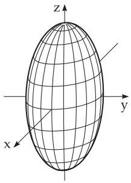  
Figure 3.189

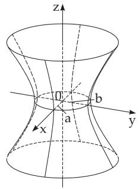  
Figure 3.190

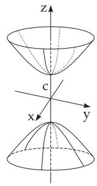  
Figure 3.191

4. Cone (Fig. 3.192)

If the vertex is at the origin, the equation is

$$
{ \frac { x ^ { 2 } } { a ^ { 2 } } } + { \frac { y ^ { 2 } } { b ^ { 2 } } } - { \frac { z ^ { 2 } } { c ^ { 2 } } } = 0 .\tag{3.416}
$$

As a direction curve can be considerd an ellipse with semi-axes a and $b ,$ whose plane is perpendicular to the z-axis at a distance c from the origin. The cone in this representation can be considered as the

asymptotic cone of the surfaces

$$
{ \frac { x ^ { 2 } } { a ^ { 2 } } } + { \frac { y ^ { 2 } } { b ^ { 2 } } } - { \frac { z ^ { 2 } } { c ^ { 2 } } } = \pm 1 ,\tag{3.417}
$$

whose generator lines approach infinitely closely both hyperboloids at infinity (Fig. 3.193). For $a = b$ there is a right circular cone (see 3.3.4, 9., p. 157).

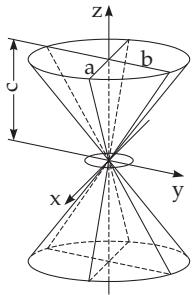  
Figure 3.192

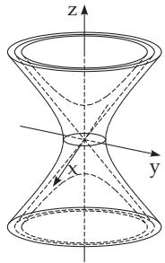  
Figure 3.193

5. Paraboloid

Since a paraboloid has no center, in the following section it is supposed that the vertex is at the origin, the z-axis is its symmetry axis, and the x, z plane and the $y , z$ plane are symmetry planes. a) Elliptic Paraboloid (Fig. 3.194):

$$
z = { \frac { x ^ { 2 } } { a ^ { 2 } } } + { \frac { y ^ { 2 } } { b ^ { 2 } } } .\tag{3.418}
$$

The plane sections parallel to the z-axis result in parabolas as intersection figures; those parallel to the x, y plane result in ellipses.

The volume of a paraboloid which is cut by a plane perpendicular to the z-axis at a distance h from the origin is given as (see also Fig.3.194)

$$
V = \frac { 1 } { 2 } \pi \bar { a } \bar { b } h ,\tag{3.419}
$$

The parameters $\overline { { a } } = a \sqrt { h }$ and $\bar { b } = b \sqrt { h }$ are the half axis of the intersecting ellipse at height h. $\mathrm { S o } .$ (3.419) yields the half of the volume of an elliptic cylinder with the same upper surface and altitude (compare with (3.328a), p. 201).

b) Paraboloid of Revolution: For $a = b$ one gets a paraboloid of revolution. It can be generated by rotating the $z = x ^ { 2 } / a ^ { 2 }$ parabola of the x, z plane around the z-axis.

c) Hyperbolic Paraboloid (Fig. 3.195):

$$
z = { \frac { x ^ { 2 } } { a ^ { 2 } } } - { \frac { y ^ { 2 } } { b ^ { 2 } } } .\tag{3.420}
$$

The intersection figures parallel to the y, z plane or to the $x , z$ plane are parabolas; parallel to the x, y plane they are hyperbolas or two intersecting lines.

6. Rectilinear Generators of a Ruled Surface

These are straight lines lying completely in this surface. Examples are the generators of the surfaces of the cone and cylinder.

a) Hyperboloid of One Sheet (Fig. 3.196):

$$
{ \frac { x ^ { 2 } } { a ^ { 2 } } } + { \frac { y ^ { 2 } } { b ^ { 2 } } } - { \frac { z ^ { 2 } } { c ^ { 2 } } } = 1 .\tag{3.421}
$$

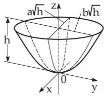

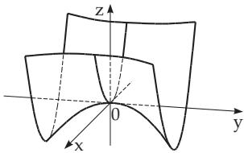  
Figure 3.194  
Figure 3.195

The hyperboloid of one sheet has two families of rectilinear generators with equations

$$
{ \frac { x } { a } } + { \frac { z } { c } } = u \left( 1 + { \frac { y } { b } } \right) , \quad u \left( { \frac { x } { a } } - { \frac { z } { c } } \right) = 1 - { \frac { y } { b } } ;\tag{3.422a}
$$

$$
{ \frac { x } { a } } + { \frac { z } { c } } = v \left( 1 - { \frac { y } { b } } \right) , \quad v \left( { \frac { x } { a } } - { \frac { z } { c } } \right) = 1 + { \frac { y } { b } } ,\tag{3.422b}
$$

where u and v are arbitrary quantities.

b) Hyperbolic Paraboloid (Fig. 3.197):

$$
z = { \frac { x ^ { 2 } } { a ^ { 2 } } } - { \frac { y ^ { 2 } } { b ^ { 2 } } } .\tag{3.423}
$$

The hyperbolic paraboloid also has two families of rectilinear generators with equations

$$
{ \frac { x } { a } } + { \frac { y } { b } } = u , ~ u \left( { \frac { x } { a } } - { \frac { y } { b } } \right) = z ; ~ ( 3 . 4 2 4 \mathrm { { a } } )
$$

$$
{ \frac { x } { a } } - { \frac { y } { b } } = v , v \left( { \frac { x } { a } } + { \frac { y } { b } } \right) = z .\tag{3.424b}
$$

The quantities u and v are again arbitrary values. In both cases, there are two straight lines passing through every point of the surface, one from each family. Only one family of straight lines is denoted in Fig. 3.196 and Fig. 3.197.

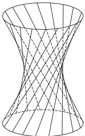  
Figure 3.196

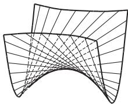  
Figure 3.197

7. Cylinder

a) Elliptic Cylinder (Fig. 3.198): ${ \frac { x ^ { 2 } } { a ^ { 2 } } } + { \frac { y ^ { 2 } } { b ^ { 2 } } } = 1 .$

(3.425)

b) Hyperbolic Cylinder (Fig. 3.199): ${ \frac { x ^ { 2 } } { a ^ { 2 } } } - { \frac { y ^ { 2 } } { b ^ { 2 } } } = 1 .$

(3.426)

c) Parabolic Cylinder (Fig. 3.200): $y ^ { 2 } = 2 p x .$

(3.427)

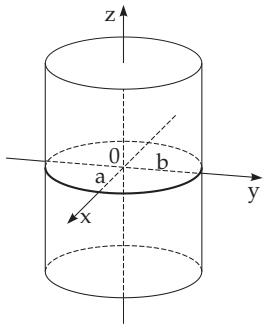  
Figure 3.198

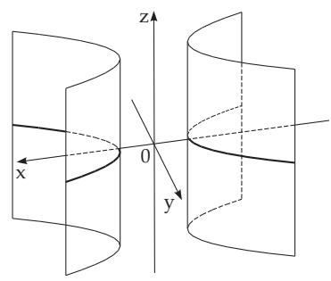  
Figure 3.199

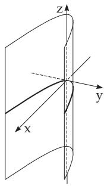  
Figure 3.200
