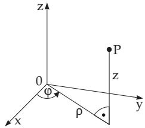
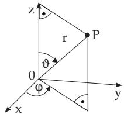
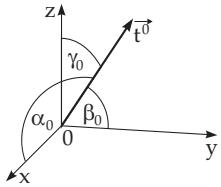
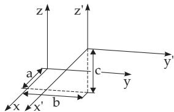

##### 3.5.3.2 Spatial Coordinate Systems

1. Curvilinear Three-Dimensional Coordinate Systems

arise if three families of surfaces are given such that for any point of the space there is exactly one surface from every system passing through it. The position of a point will be given by the parameter values of the surfaces passing through it. The most often used curvilinear coordinate systems are the cylindrical polar and the spherical polar coordinate systems.

2. Cylindrical Polar Coordinates (Fig. 3.172)

the polar coordinates $\rho$ and $\varphi$ of the projection of the point $P$ to the x, y plane and the applicate z of the point ${ \dot { P } } .$

The coordinate surfaces of a cylindrical polar coordinate system are:

The cylinder surfaces with radius $\varrho = \mathrm { c o n s t }$ , and the z-axis as axis of the cylinder,

the half-planes starting from the z-axis, ϕ = const and

the planes being perpendicular to the $z { \mathrm { - a x i s , } } \ z = \mathrm { c o n s t }$

The intersection curves of these coordinate surfaces are the coordinate curves.

The transformation formulas between the Cartesian coordinate system and the cylindrical polar coordinate system are (see also Table 3.22):

$$
x = \varrho \cos \varphi , \quad y = \varrho \sin \varphi , \quad z = z ;\tag{3.356a}
$$

$$
\varrho = \sqrt { x ^ { 2 } + y ^ { 2 } } , \quad \varphi = \arctan \frac { y } { x } = \arcsin \frac { y } { \varrho } \quad \mathrm { f o r } \quad x > 0 .\tag{3.356b}
$$

For the required distinction of cases with respect to $\varphi$ see (3.290c), p. 192.

  
Figure 3.172

  
Figure 3.173

3. Spherical Coordinates or Spherical Polar Coordinates (3.173) contain:

The length r of the radius vector $\vec { \bf r }$ of the point $P$

the angle ϑ between the z-axis and the radius vector $\vec { \bf r }$ and

the angle $\varphi$ between the x-axis and the projection of $\vec { \bf r }$ on the x, y plane.

The positive directions (Fig. 3.173) here are for r from the origin to the point $P ,$ for $\vartheta$ from the z-axis to ${ \vec { \mathbf { r } } } ,$ and for $\varphi$ from the x-axis to the projection of $\vec { \bf r }$ to the x, y plane. With the values $0 \leq r < \infty , 0 \leq$ $\vartheta \leq \pi$ , and $- \pi < \varphi \leq \pi$ every point of space can be described.

Coordinate surfaces are:

Spheres with the origin 0 as center and with radius $r = \mathrm { c o n s t }$ ，

circular cones with $\vartheta = \mathrm { c o n s t }$ , with vertex at the origin, and the z-axis as the axis and

closed half-planes starting at the z-axis with $\varphi = \mathrm { c o n s t }$

The intersection curves of these surfaces are the coordinate curves.

4. Relations between Cartesian, Cylindrical and Spherical Polar Coordinates

The transformation formulas between Cartesian coordinates and spherical polar coordinates (see also Table 3.22) are:

$$
x = r \sin \vartheta \cos \varphi , \quad y = r \sin \vartheta \sin \varphi , \quad z = r \cos \vartheta ,\tag{3.357a}
$$

$$
r = \sqrt { x ^ { 2 } + y ^ { 2 } + z ^ { 2 } } , \quad \vartheta = \arctan \frac { \sqrt { x ^ { 2 } + y ^ { 2 } } } { z } , \quad \varphi = \arctan \frac { y } { x } .\tag{3.357b}
$$

For the required distinction of cases with respect to $\varphi$ see (3.290c), p. 192.

Table 3.22 Relations between Cartesian, cylindrical, and spherical polar coordinates
<table><tr><td>Cartesian coordinates</td><td>Cylindrical polar coordinates</td><td>Spherical polar coordinates</td></tr><tr><td rowspan="2">x = y =</td><td>二  $\varrho \cos \varphi$ </td><td> $= r \sin \vartheta \cos \varphi$ </td></tr><tr><td> $= \varrho \sin \varphi$ </td><td> $= r \sin \vartheta \sin \varphi$ </td></tr><tr><td rowspan="2">z =  $\overline { { { \sqrt { x ^ { 2 } + y ^ { 2 } } } } }$   $\arctan { \frac { y } { x } }$ </td><td>= z</td><td> $= r \cos \vartheta$ </td></tr><tr><td>= 0  $= \varphi$ </td><td> $= r \sin \vartheta$   $= \varphi$ </td></tr><tr><td rowspan="2"> $= z$   $\sqrt { x ^ { 2 } + y ^ { 2 } + z ^ { 2 } }$   $\frac { \sqrt { x ^ { 2 } + y ^ { 2 } } } { x }$ </td><td> $\quad = ~ z$ </td><td> $= r \cos \vartheta$ </td></tr><tr><td> $= \sqrt { \varrho ^ { 2 } + z ^ { 2 } }$   $= \arctan { \frac { \varrho } { z } }$ </td><td>= r</td></tr></table>

5. Direction in Space

A direction in the space can be determined by a unit vector $\vec { \mathbf { t } } ^ { 0 }$ (see 3.5.1.1, 6., p. 181) whose coordinates are the direction cosines, i.e., the cosines of the angles $\alpha _ { 0 } , \beta _ { 0 } , \gamma _ { 0 }$ between the vector and the positive coordinate axes (Fig. 3.174)

$$
l = \cos \alpha _ { 0 } , \quad m = \cos \beta _ { 0 } , \quad n = \cos \gamma _ { 0 } , \quad l ^ { 2 } + m ^ { 2 } + n ^ { 2 } = 1 .\tag{3.358a}
$$

The angle $\varphi$ between two directions given by their direction cosines $l _ { 1 } , m _ { 1 } , n _ { 1 }$ and $l _ { 2 } , m _ { 2 } , n _ { 2 }$ can be calculated by the formula

$$
\cos { \varphi } = l _ { 1 } l _ { 2 } + m _ { 1 } m _ { 2 } + n _ { 1 } n _ { 2 } .\tag{3.358b}
$$

Two directions are perpendicular to each other if

$$
l _ { 1 } l _ { 2 } + m _ { 1 } m _ { 2 } + n _ { 1 } n _ { 2 } = 0 .
$$

(3.358c)

Figure 3.174  
  
Figure 3.175
