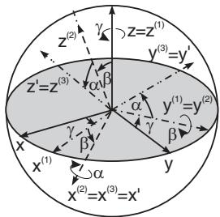

##### 3.5.3.5 Cardan Angles

1. Definition of the Cardan angles

Every rotation of a coordinate system around an arbitrary axis through the origin can be described by three successive rotations around the coordinate axis. The angles of rotation $\alpha , \beta , \gamma$ are called the

  
Figure 3.176

Cardan-angles, if the rotations are performed in the following order (see schematically Fig.3.176):

1. The first rotation is around the z-axis by an angle γ, and results in the $x ^ { ( 1 ) } , y ^ { ( 1 ) } , z ^ { ( 1 ) }$ coordinate system with $z ^ { ( 1 ) } = z$

2. The second rotation is made around the image of the y-axis by the first rotation, i.e. around the $y ^ { ( 1 ) }$ axis by an angle $\beta$ , and results the $x ^ { ( 2 ) } , y ^ { ( 2 ) } , z ^ { ( 2 ) }$ coordinate system with $y ^ { ( 2 ) } = y ^ { ( 1 ) }$

3. The third rotation is made around the image of the x-axis by the second rotation, i.e. around the $x ^ { ( 2 ) }$ -axis by an angle α. It results the finally required $x ^ { \prime } , y ^ { \prime } , z ^ { \prime }$ coordinate system, $x ^ { \prime } = x ^ { ( 3 ) } = x ^ { ( 2 ) }$ $y ^ { \prime } = { y ^ { ( 3 ) } , z ^ { \prime } } = { \overset { \cdot } { z } } { ^ { ( 3 ) } }$

Remark: There are diferent definitions of the Cardan-angles given in the literature.

2. Calculation of the rotation matrix $\mathbf { D _ { C } }$

It follows from the given order of the rotations (3.360a-d) that the rotation matrix ${ \bf D } = { \bf D } _ { C }$ is

$$
\mathbf { D } _ { \mathrm { C } } = \mathbf { D } _ { x } ( \alpha ) \mathbf { D } _ { y } ( \beta ) \mathbf { D } _ { z } ( \gamma ) .\tag{3.363a}
$$

According to the Falk’s schema (Fig. 4.1, 4.2, p. 273) holds

$$
\begin{array} { r l } & { \frac { \mathbf { D } _ { y } ( \hat { \rho } ) } { \mathbf { D } _ { x } ( \alpha ) } \Big | \frac { \mathbf { D } _ { z } ( \gamma ) } { \mathbf { D } _ { y } ( \beta ) \mathbf { D } _ { z } ( \gamma ) } , \mathrm { i . e . } } \\ & { \frac { \mathbf { D } _ { y } ( \hat { \rho } ) \Big | \mathbf { D } _ { y } ( \beta ) \mathbf { D } _ { z } ( \gamma ) } { \mathbf { D } _ { x } ( \alpha ) } , \mathrm { i . e . } } \\ & { \frac { \mathbf { \Phi } } { \mathbf { D } _ { x } ( \alpha ) } \Big | \frac { \cos \gamma \ \sin \gamma \mathbf { \Phi } } { \mathbf { D } _ { x } ( \alpha ) } } \\ & { \frac { \mathbf { \Phi } } { \mathbf { D } _ { y } ( \alpha ) } - \sin \beta \cos \gamma 0 } \\ & { \frac { \cos \beta \ \cos \beta \cos \gamma \cos \beta \sin \gamma - \sin \beta } { \mathbf { D } _ { y } ( \alpha ) \mathbf { D } _ { z } \mathbf { D } _ { y } \mathbf { D } _ { z } } } \\ & { \frac { \sin \beta \ \mathbf { \Phi } } { \mathbf { D } _ { x } ( \alpha ) } \underbrace { \mathbf { \Phi } \cos \alpha \gamma \cos \gamma \cos \beta \cos \beta } _ { \mathbf { D } \cos \beta \cos \gamma \ \quad \cos \beta \mathrm { ~ C o s s ~ } \beta \mathrm { ~ B a n ~ } \gamma } \quad \frac { - \sin \beta } { \mathbf { \Phi } } } \\ & { \frac { \sin \beta \ \cos \beta \ } { \mathbf { D } _ { y } \mathbf { D } _ { z } \mathbf { D } _ { z } \mathbf { D } _ { z } \mathbf { D } _ { z } \mathbf { D } _ { z } \mathbf { D } _ { z } \mathbf { D } _ { z } \mathbf { D } _ { z } \mathbf { D } _ { z } \cos \alpha \cos \gamma \sin \beta \cos \gamma \quad \sin \alpha \alpha \cos \beta } } \\ &  0 \quad \cos \alpha \ \sin \alpha | \quad \sin \alpha \sin \gamma + \cos \alpha \cos \gamma \sin \beta \quad \cos \alpha \cos \beta \sin \gamma \quad \sin \alpha \cos \alpha  \end{array}
$$

$$
\mathbf { D } _ { \mathbf { C } } = { \left( \begin{array} { c c c } { \cos \beta \cos \gamma } & { \cos \beta \sin \gamma } & { - \sin \beta } \\ { - \cos \alpha \sin \gamma + \sin \alpha \cos \gamma \sin \beta } & { \cos \alpha \cos \gamma + \sin \alpha \sin \beta \sin \gamma } & { \sin \alpha \cos \beta } \\ { \sin \alpha \sin \gamma + \cos \alpha \cos \gamma \sin \beta } & { \cos \alpha \sin \beta \sin \gamma - \sin \alpha \cos \gamma } & { \cos \alpha \cos \beta } \end{array} \right) }\tag{3.363c}
$$

3. Direction Cosines as Function of the Cardan angles

Since the rotation matrices D (in (3.362c), p. 213) and $\mathbf { D } _ { \mathrm { C } }$ (in (3.363c)) coincide, the direction cosines can be expressed as functions of the Cardan-angles:

$$
\begin{array} { l l l } { { l _ { 1 } = c _ { 2 } c _ { 3 } , } } & { { m _ { 1 } = c _ { 2 } s _ { 3 } , } } & { { n _ { 1 } = s _ { 2 } ; } } \\ { { l _ { 2 } = - c _ { 1 } s _ { 3 } + s _ { 1 } c _ { 3 } s _ { 2 } , } } & { { m _ { 2 } = c _ { 1 } c _ { 3 } + s _ { 1 } s _ { 2 } s _ { 3 } , } } & { { n _ { 2 } = s _ { 1 } c _ { 2 } ; } } \\ { { l _ { 3 } = s _ { 1 } s _ { 3 } + c _ { 1 } c _ { 3 } s _ { 2 } , } } & { { m _ { 3 } = c _ { 1 } s _ { 2 } s _ { 3 } - s _ { 1 } c _ { 3 } , } } & { { n _ { 3 } = c _ { 1 } c _ { 3 } } } \end{array}\tag{3.364a}
$$

$$
\begin{array} { r l } { \mathrm { w i t h } } & { c _ { 1 } = \cos \alpha , \quad c _ { 2 } = \cos \beta , \quad c _ { 3 } = \cos \gamma , } \\ & { s _ { 1 } = \sin \alpha , \quad s _ { 2 } = \sin \beta , \quad s _ { 3 } = \sin \gamma . } \end{array}\tag{3.364b}
$$
