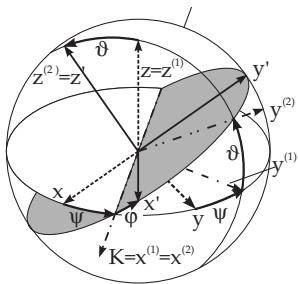

##### 3.5.3.6 Euler’s angles

1. Definition of the Euler angles

The position of the new coordinate system with respect to the old one can be uniquely determined by three angles, introduced by Euler (Fig. 3.177).

  
Figure 3.177

a) The nutation angle $\vartheta$ is the angle between the positive halves of the z- and $z ^ { \prime } -$ axis there is $0 \leq \vartheta < \pi$

b) The precession angle $\psi$ is the angle between the positive direction of the x-axis and the intersection line K of the $x ,$ y plane and the $x ^ { \prime } , y ^ { \prime }$ plane. The positive direction of K is chosen depending on whether the z-axis, the $z ^ { \prime } { \cdot }$ axis and K form a direction triplet with the same orientation as the coordinate axes (see 3.5.1.3, 2., p. 183). The angle $\psi$ is measured from the x-axis to the direction of the $y -$ axis; there is $0 \leq \psi < \pi$

c) The rotation angle $\varphi$ is the angle between the positive halves of the $x ^ { \prime } .$ axis and the intersection line $K ;$ ; there is $0 \leq \varphi < 2 \pi$

Remark: In the literature there are also other definitions in use for the Euler angles.

2. Calculation of the rotation matrix $\mathbf { D _ { E } }$

The transition from coordinate system $x , y , z$ into the coordinate system $x ^ { \prime } , y ^ { \prime } , z ^ { \prime } \left( { \bf A b b . 3 . 1 7 7 } \right)$ can be given by three rotations considering (3.360a-d)) as follows:

1. The first rotation is around the z-axis by angle $\psi _ { ; }$ , and results the coordinate system $x ^ { ( 1 ) } , y ^ { ( 1 ) } , z ^ { ( 1 ) }$ where $z ^ { ( 1 ) } = z ;$

$$
\left( \begin{array} { c } { x ^ { ( 1 ) } } \\ { y ^ { ( 1 ) } } \\ { z ^ { ( 1 ) } } \end{array} \right) = \left( \begin{array} { c c c } { \cos \psi } & { \sin \psi ~ 0 } \\ { - \sin \psi \cos \psi ~ 0 } \\ { 0 } & { 0 } & { 1 } \end{array} \right) \left( \begin{array} { c } { x } \\ { y } \\ { z } \end{array} \right) , \mathrm { i . e . } \underline { { \mathbf { x } } } ^ { ( 1 ) } = \mathbf { D } _ { z } ( \psi ) \underline { { \mathbf { x } } } .\tag{3.365a}
$$

The axis $x ^ { ( 1 ) }$ coincides with the intersection line $\mathrm { K }$

2. The second rotation is around the $x ^ { ( 1 ) }$ -axis by angle $\vartheta ,$ and results the coordinate system $x ^ { ( 2 ) } , y ^ { ( 2 ) } , z ^ { ( 2 ) }$ where $x ^ { ( 2 ) } = x ^ { ( 1 ) }$

$$
\left( \begin{array} { c } { { x ^ { ( 2 ) } } } \\ { { y ^ { ( 2 ) } } } \\ { { z ^ { ( 2 ) } } } \end{array} \right) = \left( \begin{array} { c c c } { { 1 } } & { { 0 } } & { { 0 } } \\ { { \cos { \vartheta } } } & { { \sin { \vartheta } } } \\ { { 0 } } & { { - \sin { \vartheta } } } & { { \cos { \vartheta } } } \end{array} \right) \left( \begin{array} { c } { { x ^ { ( 1 ) } } } \\ { { y ^ { ( 1 ) } } } \\ { { z ^ { ( 1 ) } } } \end{array} \right) , \mathrm { i . e . } \underline { { { \bf x } } } ^ { ( 2 ) } = { \bf D } _ { x } ( \vartheta ) \underline { { { \bf x } } } ^ { ( 1 ) } .\tag{3.365b}
$$

3. The third rotation is around the $z ^ { ( 2 ) }$ -axis by angle $\varphi _ { : }$ , and results the final coordinate system $x ^ { \prime } , y ^ { \prime } , z ^ { \prime }$ where $z ^ { \prime } = z ^ { ( 2 ) }$

$$
\left( \begin{array} { c } { { x ^ { \prime } } } \\ { { y ^ { \prime } } } \\ { { z ^ { \prime } } } \end{array} \right) = \left( \begin{array} { c c c } { { \cos \varphi } } & { { \sin \varphi \ : 0 } } \\ { { - \sin \varphi \ : \cos \varphi \ : 0 } } \\ { { 0 } } & { { 0 } } & { { 1 } } \end{array} \right) \left( \begin{array} { c } { { x ^ { ( 2 ) } } } \\ { { y ^ { ( 2 ) } } } \\ { { z ^ { ( 2 ) } } } \end{array} \right) , \ : \ : \mathrm { i . e . } \ : \ : \underline { { \mathbf { x } } } ^ { \prime } = \mathbf { D } _ { z } ( \varphi ) \underline { { \mathbf { x } } } ^ { ( 2 ) } .\tag{3.365c}
$$

All together for $\mathbf { D } = \mathbf { D } _ { \mathrm { E } }$ in (3.360a) holds:

$$
{ \bf D } _ { \mathrm { E } } = { \bf D } _ { z } ( \varphi ) { \bf D } _ { x } ( \vartheta ) { \bf D } _ { z } ( \psi ) .\tag{3.366a}
$$

Analogous to the calculation of the rotation matrix $\mathbf { D _ { C } }$ using Falk’s schema, here in the form

$$
\frac { \mathbf { D } _ { z } ( \psi ) } { \mathbf { D } _ { x } ( \psi ) \left| \mathbf { D } _ { z } ( \varphi ) \mathbf { D } _ { x } ( \vartheta ) \mathbf { D } _ { z } ( \psi ) \right. } \quad \mathrm { o n e ~ g e t s }\tag{3.366b}
$$

$$
\mathbf { D } _ { \mathrm { E } } = \left( \begin{array} { c c c } { \cos \varphi \cos \psi - \sin \varphi \cos \vartheta \sin \psi } & { \cos \varphi \sin \psi + \sin \varphi \cos \vartheta \cos \psi } & { \sin \varphi \sin \vartheta } \\ { - \sin \varphi \cos \psi - \cos \varphi \cos \vartheta \sin \psi } & { - \sin \varphi \sin \psi + \cos \varphi \cos \vartheta \cos \psi } & { \cos \varphi \sin \vartheta } \\ { \sin \vartheta \sin \psi } & { - \sin \vartheta \cos \psi } & { \cos \vartheta } \end{array} \right)\tag{3.366c}
$$

3. Direction Cosines as Function of the Euler angles

Because of the identity of the rotation matrices D (see (3.362c), p. 213) and $\mathbf { D } _ { \mathrm { E } }$ (see (3.366c) the following formulas for the direction cosines as functions of the Euler angles are valid:

$$
\begin{array} { l l l } { { l _ { 1 } = c _ { 2 } c _ { 3 } - c _ { 1 } s _ { 2 } s _ { 3 } , } } & { { m _ { 1 } = s _ { 2 } c _ { 3 } + c _ { 1 } c _ { 2 } s _ { 3 } , } } & { { n _ { 1 } = s _ { 1 } s _ { 3 } ; } } \\ { { l _ { 2 } = - c _ { 2 } s _ { 3 } - c _ { 1 } s _ { 2 } c _ { 3 } , } } & { { m _ { 2 } = - s _ { 2 } s _ { 3 } + c _ { 1 } c _ { 2 } c _ { 3 } , } } & { { n _ { 2 } = s _ { 1 } c _ { 3 } ; } } \\ { { l _ { 3 } = s _ { 1 } s _ { 2 } , } } & { { m _ { 3 } = - s _ { 1 } c _ { 2 } , } } & { { n _ { 3 } = c _ { 1 } } } \end{array}\tag{3.367a}
$$

$$
\mathrm { w i t h \ } \begin{array} { l } { { c _ { 1 } = \cos \vartheta , \quad c _ { 2 } = \cos \psi , \quad c _ { 3 } = \cos \varphi , } } \\ { { s _ { 1 } = \sin \vartheta , \quad s _ { 2 } = \sin \psi , \quad s _ { 3 } = \sin \varphi . } } \end{array}\tag{3.367b}
$$
