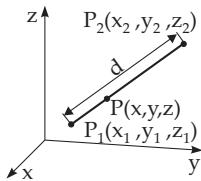
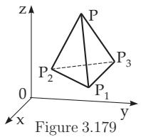

##### 3.5.3.7 Special Quantities in Space

1. Coordinates of the Center of Mass

The coordinates of the center of mass $P ( \bar { x } , \bar { y } , \bar { z } )$ (often called incorrectly the center of gravity) of a system of n material points $P _ { i } ( x _ { i } , y _ { i } , z _ { i } )$ with mass $m _ { i }$ are calculated by the following formulas, where the sum index i changes from 1 to n:

$$
\bar { x } = \frac { \sum m _ { i } x _ { i } } { \sum m _ { i } } , \quad \bar { y } = \frac { \sum m _ { i } y _ { i } } { \sum m _ { i } } , \quad \bar { z } = \frac { \sum m _ { i } z _ { i } } { \sum m _ { i } } .\tag{3.368}
$$

2. Division of a Segment

The coordinates of the point $P ( x , y , z )$ dividing a segment between the points $P _ { 1 } \left( x _ { 1 } , y _ { 1 } , z _ { 1 } \right)$ and $P _ { 2 } \left( x _ { 2 } \right.$ $y _ { 2 } , z _ { 2 } )$ in a given ratio

$$
{ \frac { \overline { { P _ { 1 } { \cal P } } } } { \overline { { { \cal P } } } \overline { { { \cal P } } } _ { 2 } } } = { \frac { m } { n } } = \lambda\tag{3.369a}
$$

are given by the formulas

$$
x = \frac { n x _ { 1 } + m x _ { 2 } } { n + m } = \frac { x _ { 1 } + \lambda x _ { 2 } } { 1 + \lambda } , \mathrm { ( 3 . 3 6 9 b ) } y = \frac { n y _ { 1 } + m y _ { 2 } } { n + m } = \frac { y _ { 1 } + \lambda y _ { 2 } } { 1 + \lambda } ,\tag{3.369c}
$$

$$
z = { \frac { n z _ { 1 } + m z _ { 2 } } { n + m } } = { \frac { z _ { 1 } + \lambda z _ { 2 } } { 1 + \lambda } } .\tag{3.369d}
$$

The midpoint of the segment is given by

$$
x _ { m } = \frac { x _ { 1 } + x _ { 2 } } { 2 } , \quad y _ { m } = \frac { y _ { 1 } + y _ { 2 } } { 2 } , \quad z _ { m } = \frac { z _ { 1 } + z _ { 2 } } { 2 } .\tag{3.369e}
$$

3. Distance Between Two Points

  
Figure 3.178

The distance between the points $P _ { 1 } \left( x _ { 1 } , y _ { 1 } , z _ { 1 } \right)$ and $P _ { 2 } \left( x _ { 2 } , y _ { 2 } , z _ { 2 } \right)$ in Fig. 3.178 is

$$
d = { \sqrt { \left( x _ { 2 } - x _ { 1 } \right) ^ { 2 } + \left( y _ { 2 } - y _ { 1 } \right) ^ { 2 } + \left( z _ { 2 } - z _ { 1 } \right) ^ { 2 } } } .
$$

The direction cosines of the segment between the points can be calculated by the formulas

(3.370a)

$$
\cos \alpha = \frac { x _ { 2 } - x _ { 1 } } { d } , \quad \cos \beta = \frac { y _ { 2 } - y _ { 1 } } { d } , \quad \cos \gamma = \frac { z _ { 2 } - z _ { 1 } } { d } .\tag{3.370b}
$$

4. System of Four Points

Four points $P ( x , y , z ) , P _ { 1 } \left( x _ { 1 } , y _ { 1 } , z _ { 1 } \right) , P _ { 2 } \left( x _ { 2 } , y _ { 2 } , z _ { 2 } \right)$ and $P _ { 3 } \left( x _ { 3 } , y _ { 3 } , z _ { 3 } \right)$ can form a tetrahedron $( \mathbf { F i g . 3 . 1 7 9 } )$ or they are in a plane. The volume of a tetrahedron can be calculated by the formula

$$
V = { \frac { 1 } { 6 } } { \left| \begin{array} { l l l } { x } & { y } & { z } & { 1 } \\ { x _ { 1 } } & { y _ { 1 } } & { z _ { 1 } } & { 1 } \\ { x _ { 2 } } & { y _ { 2 } } & { z _ { 2 } } & { 1 } \\ { x _ { 3 } } & { y _ { 3 } } & { z _ { 3 } } & { 1 } \end{array} \right| } = { \frac { 1 } { 6 } } { \left| \begin{array} { l l l } { x - x _ { 1 } y - y _ { 1 } z - z _ { 1 } } \\ { x - x _ { 2 } y - y _ { 2 } z - z _ { 2 } } \\ { x - x _ { 3 } y - y _ { 3 } z - z _ { 3 } } \end{array} \right| } ,\tag{3.371}
$$

where it has a positive value $V > 0$ if the orientation of the three vectors $\overrightarrow { P P } _ { 1 } , \overrightarrow { P P } _ { 2 } , \overrightarrow { P P } _ { 3 }$ is the same as the coordinate axes (see 3.5.1.3, 2., p. 183). Otherwise it is negative.   
The four points are in the same plane if and only if

$$
{ \left| \begin{array} { l l l } { x } & { y } & { z } \end{array} \right| } { \left| \begin{array} { l } { } \\ { x _ { 1 } y _ { 1 } z _ { 1 } 1 } \\ { x _ { 2 } y _ { 2 } z _ { 2 } 1 } \\ { x _ { 3 } y _ { 3 } z _ { 3 } 1 } \end{array} \right| } = 0 \qquad { \mathrm { h o l d s } } .\tag{3.372}
$$
