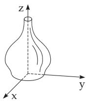

##### 3.5.3.8 Equation of a Surface

Often an equation

$$
F ( x , y , z ) = 0\tag{3.373}
$$

corresponds to a surface with the property that the coordinates of every of its points P satisfy this equation. Conversely, every point whose coordinates satisfy the equation is a point of this surface. The equation (3.373) is called the equation of this surface. If there is no real point in the space satisfying equation (3.373), then there is no real surface.

1. The Equation of a Cylindrical Surface (see 3.3.4, p. 156) whose generating lines are parallel to the x-axis contains no x coordinate: $F ( y , z ) = 0$ . Similarly, the equations of the cylindrical surfaces with generating lines parallel to the y- or to the z-axes contain no y or z coordinates: $F ( x , z ) = 0$ or $F ( x , \bar { y } ) = 0$ resp. The equation $F ( x , y ) = 0$ describes the intersection curve between the cylinder and the x, y plane. If the direction cosines, or the proportional quantities l, m, n of the generating line of a cylinder are given, then the equation has the form

$$
F ( n x - l z , n y - m z ) = 0 .\tag{3.374}
$$

2. The Equation ofa Rotationally Symmetric Surface, i.e., a surface which is created by the rotation of a curve $z = f ( x )$ given in the x, z plane around the z-axis (Fig. 3.180), will have the form

$$
z = f \left( { \sqrt { x ^ { 2 } + y ^ { 2 } } } \right) .\tag{3.375}
$$

The equations of rotationally symmetric surfaces can be obtained similarly in the case of other variables as well

The equation of a conical surface, whose vertex is at the origin (see 3.3.4, p. 157), has the form $F ( x , y , z ) \dot { = } 0$ , where F is a homogeneous function of the coordinates (see 2.18.2.5, 4., p. 122), e.g. $F ( x , y , z ) = z - { \sqrt { x ^ { 2 } + y ^ { 2 } } } = 0$ with the degree 1 of homogeneity, i.e. $F ( \lambda x , \lambda y , \lambda z ) = \lambda F ( x , y , z )$

Figure 3.180
