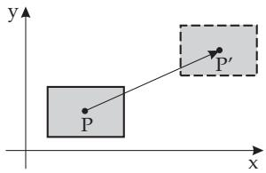
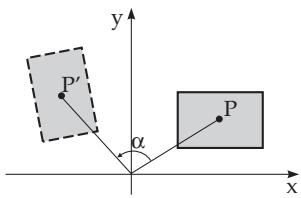
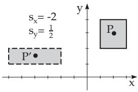
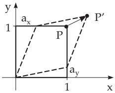

##### 3.5.4.1 Geometric 2D Transformations

1. Translations

Translation of a point $P ,$ given by Cartesian coordinates $x _ { P } , y _ { P }$ , by $t _ { x }$ in the direction of the positive x-axis, and by $t _ { y }$ in the direction of the positive y-axis (Fig.3.201) results the new coordinates of the transformed poin $P ^ { \prime } ( x _ { P } ^ { \prime } , y _ { P } ^ { \prime } )$

$$
x _ { P } ^ { \prime } = x _ { P } + t _ { x } , \qquad y _ { P } ^ { \prime } = y _ { P } + t _ { y } .\tag{3.430}
$$

If the coordinates are described as column vectors, then the formulas for the new coordinates of the transformation and the reversal are

$$
\left( { x _ { P } ^ { \prime } } \atop { y _ { P } ^ { \prime } } \right) = \left( { x _ { P } \atop y _ { P } } \right) + \left( { t _ { x } \atop t _ { y } } \right) \ : , \ : \ : \ : \mathrm { ( 3 . 4 3 1 a ) }
$$

$$
\begin{array} { r } { \left( \begin{array} { l } { x _ { P } } \\ { y _ { P } } \end{array} \right) = \left( \begin{array} { l } { x _ { P } ^ { \prime } } \\ { y _ { P } ^ { \prime } } \end{array} \right) - \left( \begin{array} { l } { t _ { x } } \\ { t _ { y } } \end{array} \right) . } \end{array}\tag{3.431b}
$$

2. Rotation Around the Origin

At a rotation the object is rotated around the origin by an angle α. If α $> 0 .$ , then the rotation is counterclockwise (Fig.3.202). The mapping of the coordinates of a point $P ( x _ { P } , y _ { P } )$ is described by

  
Figure 3.201

  
Figure 3.202

the relations

$$
x _ { P } ^ { \prime } = x _ { P } \cdot \cos \alpha - y _ { P } \cdot \sin \alpha ~ , \qquad y _ { P } ^ { \prime } = x _ { P } \cdot \sin \alpha + y _ { P } \cdot \cos \alpha .\tag{3.432}
$$

The matrix form of (3.432) is

$$
\left( { x _ { P } ^ { \prime } \atop y _ { P } ^ { \prime } } \right) = \left( \begin{array} { c c } { { \cos \alpha - \sin \alpha } } \\ { { \sin \alpha } } & { { \cos \alpha } } \end{array} \right) \left( { x _ { P } \atop y _ { P } } \right) .\tag{3.433a}
$$

The inverse of this transformation corresponds to a rotation by the angle α:

$$
\binom { x _ { P } } { y _ { P } } = \binom { \cos ( - \alpha ) - \sin ( - \alpha ) } { \sin ( - \alpha ) \quad \cos ( - \alpha ) } \left( { x _ { p } ^ { \prime } } \right) = \left( { \begin{array} { c } { \cos \alpha \sin \alpha } \\ { - \sin \alpha \cos \alpha } \end{array} } \right) \binom { x _ { P } ^ { \prime } } { y _ { P } ^ { \prime } } .\tag{3.433b}
$$

3. Scaling with respect to the Origin

At scaling transformations the coordinates are multiplied by $s _ { x }$ and $s _ { y }$ respectively (Fig.3.203). The transformation of a point $P ( x _ { P } , y _ { P } )$ is given by

$$
x _ { P } ^ { \prime } = s _ { x } \cdot x _ { P } , \qquad y _ { P } ^ { \prime } = s _ { y } \cdot y _ { P } .\tag{3.434}
$$

The matrix forms of this transformation and of its inverse are

$$
\left( { x _ { P } ^ { \prime } \atop y _ { P } ^ { \prime } } \right) = \left( { s _ { x } \atop 0 } \right) \left( { x _ { P } \atop y } \right) , ( 3 . 4 3 5 \mathrm { a } )
$$

$$
\binom { x _ { P } } { y _ { P } } = \binom { 1 / s _ { x } \quad 0 } { 0 \quad 1 / s _ { y } } \binom { x _ { P } ^ { \prime } } { y _ { P } ^ { \prime } } .\tag{3.435b}
$$

Scaling results in a change of the size of the transformed object. A positive multiplier $s _ { x } < 1$ results in contraction of the object in x-direction. Consequently a factor $s _ { x } \ > \ 1$ results in an expansion. A negative factor $s _ { x } < 0$ results in a reflection with respect to the y-axis. The corresponding statements are valid for $s _ { y }$

Scaling transformations in special cases:

Reflection with respect to the x-axis: $s _ { x } = 1 , s _ { y } = - 1$

Reflection with respect to the y-axis: $s _ { x } = - 1 , s _ { y } = 1$

Reflection with respect to the origin: $s _ { x } = s _ { y } = - 1$

4. Shearing

At shear transformation the value of each coordinate is changed proportionally to the other. The formulas of this transformation are:

$$
x _ { P } ^ { \prime } = x _ { P } + a _ { x } \cdot y _ { P } , \qquad y _ { P } ^ { \prime } = y _ { P } + a _ { y } \cdot x _ { P } .\tag{3.436}
$$

The matrix form of this transformation (with notation $m = 1 - a _ { x } a _ { y } )$ is seen in the following:

$$
\left( { \binom { x _ { P } ^ { \prime } } { y _ { P } ^ { \prime } } } \right) = \left( { \begin{array} { l l } { 1 } & { a _ { x } } \\ { a _ { y } } & { 1 } \end{array} } \right) \left( { \begin{array} { l } { x _ { P } } \\ { y _ { P } } \end{array} } \right) ~ , ~ ( 3 . 4 3 7 \mathrm { a } ) ~ \left( { \begin{array} { l } { x _ { P } } \\ { y _ { P } } \end{array} } \right) = \left( { \begin{array} { l l } { 1 / m } & { - a _ { x } / m } \\ { - a _ { y } / m } & { 1 / m } \end{array} } \right) \left( { \begin{array} { l } { x _ { P } ^ { \prime } } \\ { y _ { P } ^ { \prime } } \end{array} } \right) ~ .\tag{3.437b}
$$

Fig.3.204 shows an example for shearing.

5. Properties of Transformations

The transformations introduced above are afine transformations, i.e. the $( x ^ { \prime } , y ^ { \prime } )$ coordinates of a transformed point $P ^ { \prime }$ can be expressed by a system of linear equations of the original coordinates $( x , y )$ of P.

Remark: These transformations keep collinearity and parallelism, i.e. lines are transformed into lines,

  
Figure 3.203

  
Figure 3.204

and the images of parallel lines are parallel lines. Furthermore translation, rotation and reflection are distance- and angle-preserving mappings.
