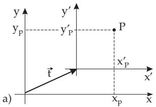
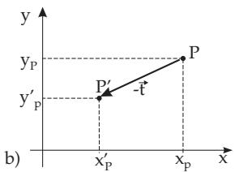

##### 3.5.4.3 Coordinate Transformation

With geometric transformations an object is transformed with respect to a fixed coordinate system. Whereas coordinate transformation gives the relation between the coordinate representations of a fixed object with respect to two diferent coordinate systems.

The relation between the two types of transformations is represented in Fig.3.205. If the coordinate system is shifted by vector $\vec { \bf t } ,$ the coordinates of point $P ( x _ { P } , y _ { P } )$ become $x _ { P } ^ { \prime } = x _ { P } - t _ { x } , y _ { P } ^ { \prime } = y _ { P } - t _ { y } .$ The translation of the coordinate system by the vector $\vec { \mathbf { t } }$ results the same outcome as the translation of point $P \ \mathrm { b y - } { \vec { \mathbf { t } } } .$

The same consequences are valid for rotation and scaling. $\mathrm { S o }$ , the transformation of the coordinate system is equivalent to the reverse transformation of the object.

  
Figure 3.205

The coordinate transformations resulted by a translation, rotation or scaling can be given by $3 \times 3$ transformation matrices T, R and S. Considering the matrices of geometric transformations (3.440)– (3.442) follows:

$$
\overline { { \mathbf { T } } } ( t _ { x } , t _ { y } ) = \mathbf { T } ( - t _ { x } , - t _ { y } ) = \mathbf { T } ^ { - 1 } ( t _ { x } , t _ { y } ) \qquad ( 3 . 4 4 4 ) \qquad \overline { { \mathbf { R } } } ( \alpha ) = \mathbf { R } ( - \alpha ) = \mathbf { R } ^ { - 1 } ( \alpha )\tag{3.445}
$$

$$
\overline { { \mathbf { S } } } ( s _ { x } , s _ { y } ) = \mathbf { S } ( 1 / s _ { x } , 1 / s _ { y } ) = \mathbf { S } ^ { - 1 } ( s _ { x } , s _ { y } )\tag{3.446}
$$

In this way all basic transformations can be described by a $3 \times 3$ transformation matrix $\overline { { \mathbf { M } } }$

$$
\left( \begin{array} { c } { x _ { P } ^ { \prime } } \\ { y _ { P } ^ { \prime } } \\ { 1 } \end{array} \right) = \left( \begin{array} { c c c } { \overline { { m } } _ { 1 1 } \ \overline { { m } } _ { 1 2 } \ \overline { { m } } _ { 1 3 } } \\ { \overline { { m } } _ { 2 1 } \ \overline { { m } } _ { 2 2 } \ \overline { { m } } _ { 2 3 } } \\ { 0 \ \phantom { + } 0 \ 1 } \end{array} \right) \left( \begin{array} { c } { x _ { P } } \\ { y _ { P } } \\ { 1 } \end{array} \right) , \quad \mathrm { i . e . } \ \underline { { x } } _ { \mathrm { P } } ^ { \prime } = \overline { { \mathbf { M } } } \underline { { x } } _ { \mathrm { P } } .\tag{3.447}
$$
