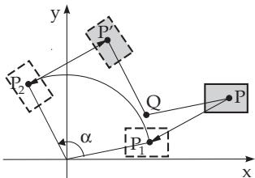
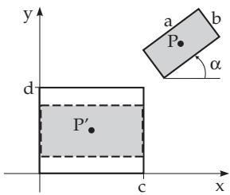

##### 3.5.4.4 Composition of Transformations

Complex geometric transformations can be realized by combining diferent basic transformations. Let a sequence of transformations be given by matrices $\mathbf { M } _ { 1 } , \mathbf { M } _ { 2 } , \dots , \mathbf { M } _ { n } .$ . The consecutive execution of these transformations converts the point $P ( x , y )$ in n steps into $P ^ { \prime } .$ The transformation matrix M resulted by this sequence of mappings is the product of these matrices:

$$
\mathbf { M } = \mathbf { M } _ { n } \cdot \mathbf { M } _ { n - 1 } \cdot \dots \cdot \mathbf { M } _ { 2 } \cdot \mathbf { M } _ { 1 } .\tag{3.448}
$$

Similarly, for the reverse transformation

$$
\mathbf { M } ^ { - 1 } = \mathbf { M } _ { 1 } ^ { - 1 } \cdot \mathbf { M } _ { 2 } ^ { - 1 } \cdot \dots \cdot \mathbf { M } _ { n - 1 } ^ { - 1 } \cdot \mathbf { M } _ { n } ^ { - 1 } .\tag{3.449}
$$

${ \mathrm { S o } } ,$ instead of performing n times basic transformations in a sequence on a point, it is possible to give the matrix of the composite transformation, and to apply it directly.

Every afine transformation can be given as a chain (composition) of translation, rotation and scaling. Even shearing can be given as a rotation $\mathbf { R } ( \alpha )$ , a scaling $\mathbf { \hat { S } } ( s _ { x } , s _ { y } )$ and a further rotation $\mathbf { R } ( \beta )$ applied after each other. The parameters $\alpha , \beta , s _ { x } , s _ { y }$ can be determined so, that $\mathbf { V } ( a , b ) = \mathbf { R } ( \beta ) { \cdot } \mathbf { S } ( s _ { x } , s _ { y } ) { \cdot } \mathbf { \bar { R } } ( \alpha )$ holds.

Calculation of the transformation matrix of a rotation around an arbitrary point $Q ( x _ { q } , y _ { q } )$ by an angle α: The composite transformation is the result of composition of the following basic transformations:

1. Shifting of $Q$ into the origin: $\mathbf { M } _ { 1 } = \mathbf { T } ( - x _ { q } , - y _ { q } )$

2. Rotation around the origin: ${ \bf M } _ { 2 } = { \bf R } ( \dot { \alpha } )$

3. Translation back the origin into $Q \colon \mathbf { M } _ { 3 } = \mathbf { M } _ { 1 } ^ { - 1 } = \mathbf { T } ( x _ { q } , y _ { q } )$ The sequence of the single steps of these transformations see Fig.3.206. Point $P$ is transformed via $P _ { 1 }$ and $P _ { 2 }$ into $P ^ { \prime }$

$$
\mathbf { M } = \mathbf { M } _ { 3 } \cdot \mathbf { M } _ { 2 } \cdot \mathbf { M } _ { 1 } = \mathbf { T } ( x _ { q } , y _ { q } ) \cdot \mathbf { R } ( \alpha ) \cdot \mathbf { T } ( - x _ { q } , - y _ { q } )
$$

  
Figure 3.206

$$
= \left( \begin{array} { l } { 1 \ 0 \ x _ { q } } \\ { 0 \ 1 \ y _ { q } } \\ { 0 \ 0 \ 1 } \end{array} \right) \left( \begin{array} { l l l } { \cos \alpha - \sin \alpha \ 0 } \\ { \sin \alpha \ \cos \alpha } & { 0 } \\ { 0 \ 0 \ 1 } \end{array} \right) \left( \begin{array} { l } { 1 \ 0 - x _ { q } } \\ { 0 \ 1 \ - y _ { q } } \\ { 0 \ 0 \ 1 } \end{array} \right) = \left( \begin{array} { l l l } { \cos \alpha - \sin \alpha } & { x _ { q } \big ( 1 - \cos \alpha \big ) + y _ { q } \sin \alpha } \\ { \sin \alpha \ \cos \alpha } & { y _ { q } \big ( 1 - \cos \alpha \big ) - x _ { q } \sin \alpha } \\ { 0 \ 0 \ 0 } & { 1 } \end{array} \right) \ .
$$

Reflection with respect to a line given by the equation $y = m x + n$

1. Translation of the line to pass through the origin: $\mathbf { M } _ { 1 } = \mathbf { T } ( 0 , - n )$

2. Rotation of the line clockwise until it coincides with the x-axis: $\mathbf { M } _ { 2 } = \mathbf { R } ( - \alpha )$ , with tan $\alpha = m$

3. Reflection with respect to the x-axis: $\mathbf { M } _ { 3 } = \mathbf { S } ( 1 , - 1 )$

4. Rotation back by α: $\mathbf { M } _ { 4 } = \mathbf { M } _ { 2 } ^ { - 1 } = \mathbf { R } ( \alpha )$

5. Translation of the line back into the original position: $\mathbf { M } _ { 5 } = \mathbf { M } _ { 1 } ^ { - 1 } = \mathbf { T } ( 0 , n )$

$$
\begin{array} { l } { { \bf { M } } = { \bf { T } } ( 0 , n ) \cdot { \bf { R } } ( \alpha ) \cdot { \bf { S } } ( 1 , - 1 ) \cdot { \bf { R } } ( - \alpha ) \cdot { \bf { T } } ( 0 , - n ) } \\ { = \left( { \begin{array} { l } { 1 \mathrm { ~ 0 ~ 0 ~ } } \\ { 0 \mathrm { ~ 1 ~ } n } \\ { 0 \mathrm { ~ 0 ~ } 1 } \end{array} } \right) \left( { \begin{array} { l l l } { \cos \alpha - \sin \alpha } & { 0 } \\ { \sin \alpha } & { \cos \alpha } & { 0 } \\ { 0 } & { 0 } & { 1 } \end{array} } \right) \left( { \begin{array} { l l l } { 1 } & { 0 } & { 0 } \\ { 0 } & { - 1 } & { 0 } \\ { 0 } & { 0 } & { 1 } \end{array} } \right) \left( { \begin{array} { l l l } { \cos \alpha } & { \sin \alpha } & { 0 } \\ { - \sin \alpha \cos \alpha } & { 0 } \\ { 0 } & { 0 } & { 1 } \end{array} } \right) \left( { \begin{array} { l l l } { 1 } & { 0 } & { 0 } \\ { 0 } & { 1 } & { - n } \\ { 0 } & { 1 } & { 0 } \end{array} } \right) ~ . } \end{array}
$$

Use of the well known trigonometric relations sin $\alpha = m / \sqrt { m ^ { 2 } + 1 }$ and cos $\alpha = 1 / \sqrt { m ^ { 2 } + 1 }$ results the transformation matrix

$$
\mathbf { M } = \left( \begin{array} { c c c c } { \displaystyle \frac { 1 - m ^ { 2 } } { m ^ { 2 } + 1 } \frac { 2 m } { m ^ { 2 } + 1 } \frac { - 2 m n } { m ^ { 2 } + 1 } } \\ { \displaystyle \frac { 2 m } { m ^ { 2 } + 1 } \frac { m ^ { 2 } - 1 } { m ^ { 2 } + 1 } \frac { 2 n } { m ^ { 2 } + 1 } } \\ { 0 \displaystyle } & { 0 } & { 1 } \end{array} \right) .
$$

Complete centered transformation of a rectangle shape cut with side lengths a and b into a similar one in a window with width c and height d (Fig.3.207). Sequence of the basic transformations:

1. Shifting of $P ( x _ { P } , y _ { P } )$ into the origin: $\mathbf { M } _ { 1 } = \mathbf { T } ( - x _ { P } , - y _ { P } )$

2. Clockwise rotation by an angle α: ${ \mathbf { M } } _ { 2 } = { \mathbf { R } } ( - \dot { \alpha } )$

3. Scaling by factor $s = s _ { x } = s _ { y } = \operatorname* { m i n } ( c / a , d / b ) \colon { \bf M } _ { 3 } = { \bf S } ( s , s )$

4. Shifting of the origin into the center of the window: $\mathbf { M } _ { 4 } \ =$ $\mathbf { T } ( c / 2 , d / 2 )$

$$
\mathbf { M } = \mathbf { T } ( c / 2 , d / 2 ) \cdot \mathbf { S } ( s , s ) \cdot \mathbf { R } ( - \alpha ) \cdot \mathbf { T } ( - x _ { P } , - y _ { P } )
$$

$$
\begin{array} { r l } & { = \left( \begin{array} { c } { 1 0 ~ c / 2 } \\ { 0 ~ 1 ~ d / 2 } \\ { 0 ~ 0 ~ 1 } \end{array} \right) \left( \begin{array} { c } { s ~ 0 ~ 0 } \\ { 0 ~ s ~ 0 } \\ { 0 ~ 0 ~ 1 } \end{array} \right) \left( \begin{array} { c } { \cos \alpha ~ \sin \alpha ~ 0 } \\ { - \sin \alpha ~ \cos \alpha ~ 0 } \\ { 0 ~ 0 ~ 1 } \end{array} \right) \left( \begin{array} { c } { 1 0 ~ { - } x _ { P } } \\ { 0 ~ 1 ~ { - } y _ { P } } \\ { 0 ~ 0 ~ 1 } \end{array} \right) } \\ & { = \left( \begin{array} { c } { s \cos \alpha ~ s \sin \alpha ~ c / 2 { - } s ( x _ { P } \cos \alpha + y _ { P } \sin \alpha ) } \\ { - s \sin \alpha ~ s \cos \alpha ~ d / 2 { - } s ( y _ { P } \cos \alpha - x _ { P } \sin \alpha ) } \\ { 0 ~ 0 ~ 1 } \end{array} \right) . } \end{array}
$$

Figure 3.207
