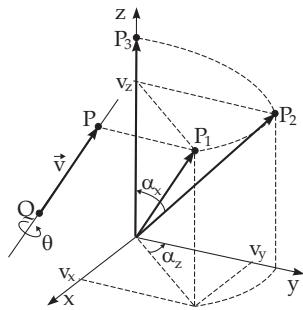
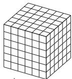
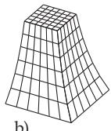
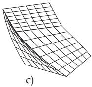
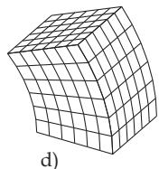
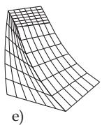

##### 3.5.4.5 3D–Transformations

The mathematical description of geometric transformations and coordinate transformations in the three-dimensional space is based on the same ideas which have been discussed for the two-dimensional case in sections 3.5.4.1–3.5.4.4. Afine transformations of the three-dimensional space are the compositions of basic transformations as: translation, rotation around one of the coordinate axes and scaling with respect to the origin. Using homogeneous coordinates these transformations can be given by 4 4 transformation matrices. As in the two-dimensional case, the composed transformations can be realized by matrix multiplications.

1. Geometric Transformations

The transformation of a point $P ( x _ { P } , y _ { P } , z _ { P } )$ is performed according to the following rule:

$$
\begin{array} { r l } & { \left( \begin{array} { l } { x _ { P } ^ { \prime } } \\ { y _ { P } ^ { \prime } } \\ { z _ { P } ^ { \prime } } \\ { 1 } \end{array} \right) = \left( \begin{array} { l l l } { m _ { 1 1 } \ m _ { 1 2 } \ m _ { 1 3 } \ m _ { 1 4 } } \\ { m _ { 2 1 } \ m _ { 2 2 } \ m _ { 2 3 } \ m _ { 2 4 } } \\ { m _ { 3 1 } \ m _ { 3 2 } \ m _ { 3 3 } \ m _ { 3 4 } } \\ { 0 \ \quad 0 \quad 0 \quad 1 } \end{array} \right) \left( \begin{array} { l } { x _ { P } } \\ { y _ { P } } \\ { z _ { P } } \\ { 1 } \end{array} \right) , \quad \mathrm { i . e . } \ \underline { { x } } _ { \mathrm { P } } { ' } = \mathbf { M } \underline { { x } } _ { \mathrm { P } } . } \end{array}\tag{3.450}
$$

The transformation matrices of the basic transformations are:

$$
\begin{array} { r } { \mathbf { T } ( t _ { x } , t _ { y } , t _ { z } ) = \left( \begin{array} { l l l l } { 1 } & { 0 } & { 0 } & { t _ { x } } \\ { 0 } & { 1 } & { 0 } & { t _ { y } } \\ { 0 } & { 0 } & { 1 } & { t _ { z } } \\ { 0 } & { 0 } & { 0 } & { 1 } \end{array} \right) \ , \quad ( 3 . 4 5 1 ) } \end{array}
$$

$$
\begin{array} { r } { \mathbf { S } ( s _ { x } , s _ { y } , s _ { z } ) = \left( \begin{array} { c c c c } { s _ { x } } & { 0 } & { 0 } & { 0 } \\ { 0 } & { s _ { y } } & { 0 } & { 0 } \\ { 0 } & { 0 } & { s _ { z } } & { 0 } \\ { 0 } & { 0 } & { 0 } & { 1 } \end{array} \right) , } \end{array}\tag{3.452}
$$

$$
\mathbf { R } _ { x } ( \alpha ) = \left( \begin{array} { c c c c } { 1 } & { 0 } & { 0 } & { 0 } \\ { 0 } & { \cos \alpha } & { - \sin \alpha } & { 0 } \\ { 0 } & { \sin \alpha } & { \cos \alpha } & { 0 } \\ { 0 } & { 0 } & { 0 } & { 1 } \end{array} \right) , ( 3 . 4 5 3 )
$$

Scaling with respect to the origin

$$
{ \bf R } _ { y } ( \alpha ) = \left( \begin{array} { c c c c } { { \cos \alpha } } & { { 0 } } & { { \sin \alpha } } & { { 0 } } \\ { { 0 } } & { { 1 } } & { { 0 } } & { { 0 } } \\ { { - \sin \alpha } } & { { 0 } } & { { \cos \alpha } } & { { 0 } } \\ { { 0 } } & { { 0 } } & { { 0 } } & { { 1 } } \end{array} \right) ,\tag{3.454}
$$

Rotation around the x-axis

$$
\mathbf { R } _ { z } ( \alpha ) = \left( \begin{array} { c c c c } { \cos \alpha } & { - \sin \alpha } & { 0 } & { 0 } \\ { \sin \alpha } & { \cos \alpha } & { 0 } & { 0 } \\ { 0 } & { 0 } & { 1 } & { 0 } \\ { 0 } & { 0 } & { 0 } & { 1 } \end{array} \right) , ( 3 . 4 5 5 )
$$

Rotation around the y-axis

$$
\begin{array} { r } { \mathbf { V } _ { x y } ( a _ { x } , a _ { y } ) = \left( \begin{array} { l l l l } { 1 } & { 0 } & { a _ { x } } & { 0 } \\ { 0 } & { 1 } & { a _ { y } } & { 0 } \\ { 0 } & { 0 } & { 1 } & { 0 } \\ { 0 } & { 0 } & { 0 } & { 1 } \end{array} \right) . } \end{array}\tag{3.456}
$$

Rotation around the z-axis

Shearing parallel to the x, y-plane

For a positive α the rotation is counterclockwise looking from the positive half of the coordinate axis to the origin. For reverse transformations the following relations are valid:

$$
\mathbf { T } ^ { - 1 } ( t _ { x } , t _ { y } , t _ { z } ) = \mathbf { T } ( - t _ { x } , - t _ { y } , - t _ { z } ) , \quad \mathbf { S } ^ { - 1 } ( s _ { x } , s _ { y } , s _ { z } ) = \mathbf { S } ( 1 / s _ { x } , 1 / s _ { y } , 1 / s _ { z } ) ,\tag{3.457}
$$

$$
\mathbf { R } _ { x } ^ { - 1 } ( \alpha ) = \mathbf { R } _ { x } ( - \alpha ) , \quad \mathbf { R } _ { y } ^ { - 1 } ( \alpha ) = \mathbf { R } _ { y } ( - \alpha ) , \quad \mathbf { R } _ { z } ^ { - 1 } ( \alpha ) = \mathbf { R } _ { z } ( - \alpha ) .\tag{3.458}
$$

2. Coordinate Transformations

Analogously to the two-dimensional case, the transformations of the coordinate systems have the same efects to the coordinate representations of a point as the reverse geometric transformation (see 3.5.4.3, p. 231). Hence, the matrices of the transformations are:

$$
\begin{array} { r } { \overline { { \mathbf { T } } } ( t _ { x } , t _ { y } , t _ { z } ) = \mathbf { T } ( - t _ { x } , - t _ { y } , - t _ { z } ) = \mathbf { T } ^ { - 1 } ( t _ { x } , t _ { y } , t _ { z } ) , } \end{array}\tag{3.459}
$$

$$
\overline { { \mathbf { R } } } _ { x } ( \alpha _ { x } ) = \mathbf { R } _ { x } ( - \alpha _ { x } ) = \mathbf { R } _ { x } ^ { - 1 } ( \alpha _ { x } ) ,\tag{3.460}
$$

$$
\overline { { \mathbf { R } } } _ { y } ( \alpha _ { y } ) = \mathbf { R } _ { y } ( - \alpha _ { y } ) = \mathbf { R } _ { y } ^ { - 1 } ( \alpha _ { y } ) ,\tag{3.461}
$$

$$
\overline { { \mathbf { R } } } _ { z } ( \alpha _ { z } ) = \mathbf { R } _ { z } ( - \alpha _ { z } ) = \mathbf { R } _ { z } ^ { - 1 } ( \alpha _ { z } ) ,\tag{3.462}
$$

$$
\overline { { \mathbf { S } } } ( s _ { x } , s _ { y } , s _ { z } ) = \mathbf { S } ( 1 / s _ { x } , 1 / s _ { y } , 1 / s _ { z } ) = \mathbf { S } ^ { - 1 } ( s _ { x } , s _ { y } , s _ { z } ) .\tag{3.463}
$$

In practical applications it occurs quite often, that a particular transformation is replaced from a righthanded Cartesian coordinate system into another Cartesian coordinate system. The original one is often called as world coordinate system, the other one is called the local or object coordinate system . If the origin $U ( x _ { u } , y _ { u } , z _ { u } )$ and the unit vectors $\vec { \mathbf { e } } _ { i } = \{ l _ { 1 } , m _ { 1 } , n _ { 1 } \} , \vec { \mathbf { e } } _ { j } = \{ l _ { 2 } , m _ { 2 } , \tilde { n } _ { 2 } \}$ and $\vec { \mathbf { e } } _ { k } = \{ l _ { 3 } , m _ { 3 } , n _ { 3 } \}$ of the local coordinate system are given in the world coordinate system, then the transformation from the world system into the local system and its reverse are given by the matrices

$$
\begin{array} { r } { \overline { { \mathbf { M } } } = \left( \begin{array} { c c c c } { l _ { 1 } } & { m _ { 1 } } & { n _ { 1 } } & { - l _ { 1 } x _ { u } - m _ { 1 } y _ { u } - n _ { 1 } z _ { u } } \\ { l _ { 2 } } & { m _ { 2 } } & { n _ { 2 } } & { - l _ { 2 } x _ { u } - m _ { 2 } y _ { u } - n _ { 2 } z _ { u } } \\ { l _ { 3 } } & { m _ { 3 } } & { n _ { 3 } } & { - l _ { 3 } x _ { u } - m _ { 3 } y _ { u } - n _ { 3 } z _ { u } } \\ { 0 } & { 0 } & { 0 } & { 1 } \end{array} \right) , \quad ( 3 . 4 6 4 ) \quad \overline { { \mathbf { M } } } ^ { - 1 } = \left( \begin{array} { c c c c } { l _ { 1 } } & { l _ { 2 } } & { l _ { 3 } } & { x _ { u } } \\ { m _ { 1 } } & { m _ { 2 } } & { m _ { 3 } } & { y _ { u } } \\ { n _ { 1 } } & { n _ { 2 } } & { n _ { 3 } } & { z _ { u } } \\ { 0 } & { 0 } & { 0 } & { 1 } \end{array} \right) . } \end{array}\tag{3.465}
$$

If a point P has the coordinates $\left( x _ { P } , y _ { P } , z _ { P } \right)$ in the world coordinate system and it has the coordinates $( x _ { P } ^ { \prime } , \bar { y } _ { P } ^ { \prime } , z _ { P } ^ { \prime } )$ in the local system, then the following equalities are valid:

$$
\underline { { x } } _ { P } ^ { \phantom { \dagger } } = \overline { { \mathbf { M } } } \underline { { x } } _ { P } ,
$$

(3.466)

$$
\underline { { x } } _ { P } = \overline { { \mathbf { M } } } ^ { - 1 } \underline { { x } } _ { P } ^ { \phantom { * } } .\tag{3.467}
$$

If $\overline { { \mathbf { M } } } _ { 1 }$ and $\overline { { \mathbf { M } } } _ { 2 }$ denote the matrices of transformations from the world coordinate system into two local coordinate systems, then the transformation between the two local systems are given by the matrices:

$$
\begin{array} { r } { \overline { { \mathbf { M } } } = \overline { { \mathbf { M } } } _ { 1 } \cdot \overline { { \mathbf { M } } } _ { 2 } ^ { - 1 } \qquad \mathrm { a n d } \qquad \overline { { \mathbf { M } } } ^ { - 1 } = \overline { { \mathbf { M } } } _ { 2 } \cdot \overline { { \mathbf { M } } } _ { 1 } ^ { - 1 } . } \end{array}\tag{3.468}
$$

Determination of the matrix of a rotation by an angle $\theta$ around the line passing through the points

$P ( x _ { P } , y _ { P } , z _ { P } )$ and $Q ( x _ { q } , y _ { q } , z _ { q } )$ with direction vector $\begin{array} { r l } { \vec { \mathbf { v } } } & { { } = } \end{array}$ $\{ v _ { x } , v _ { y } , v _ { z } \} \ : = \ : \{ x _ { P } - x _ { q } , y _ { P } - y _ { q } , z _ { P } - z _ { q } \}$ . It is easy to choose $\dot { P }$ and $Q$ in a distance of one unit, so $\vec { \bf v }$ is a unit vector. First the line is transformed into the z-axis of the coordinate system. Then the rotation follows, by an angle θ around the z-axis. Finally it follows the transformation of the line back into the original one. It is represented in Fig.3.208 how the transformation of the spatial line into the z-axis is performed. It consists of the following steps:

1. Q is translated into the origin: $\mathbf { M } _ { 1 } = \mathbf { T } ( - x _ { q } , - y _ { q } , - z _ { q } )$

2. Rotation around the z-axis so that the rotation-axis is mapped into the y, z-plane: $\mathbf { M } _ { 2 } = \mathbf { R } _ { z } ( \alpha _ { z } )$ with cos $\alpha _ { z } = v _ { y } \bigg / \sqrt { v _ { x } ^ { 2 } + v _ { y } ^ { 2 } }$ and sin $\alpha _ { z } = { v _ { x } } \mathord { \left/ { \vphantom { v _ { x } } } \right. \kern - delimiterspace } \sqrt { v _ { x } ^ { 2 } + v _ { y } ^ { 2 } } ,$

Point $P _ { 2 }$ has the coordinates $( 0 , \sqrt { v _ { x } ^ { 2 } + v _ { z } ^ { 2 } } , v _ { z } )$

Figure 3.208

3. Rotation around the x-axis by the angle $\alpha _ { x }$ until the image of the direction vector $\vec { \bf v }$ is on the z-axis: $\mathbf { M } _ { 3 } = \mathbf { R } _ { x } ( \alpha _ { x } )$ , where cos $\alpha _ { x } = v _ { z } / | \vec { \mathbf { v } } |$ and sin $\alpha _ { x } = \sqrt { v _ { x } ^ { 2 } + v _ { y } ^ { 2 } } \big / | \vec { \mathbf { v } } |$ . The point $P _ { 3 }$ has the coordinates $( 0 , 0 , | \vec { \mathbf { v } } | )$

The matrix of transforming the direction vector into the z-axis is with $m = \sqrt { v _ { x } ^ { 2 } + v _ { y } ^ { 2 } }$ and $| \vec { \bf v } | = 1$

$$
\mathbf { M } _ { A } = \mathbf { R } _ { x } ( \alpha _ { x } ) \cdot \mathbf { R } _ { z } ( \alpha _ { z } ) \cdot \mathbf { T } ( - x _ { q } , - y _ { q } , - z _ { q } )
$$

$$
= \left( \begin{array} { l l l l } { 1 } & { 0 } & { 0 } & { 0 } \\ { 0 } & { v _ { z } } & { - m } & { 0 } \\ { 0 } & { m } & { v _ { z } } & { 0 } \\ { 0 } & { 0 } & { 0 } & { 1 } \end{array} \right) \left( \begin{array} { l l l l } { \displaystyle \frac { v _ { y } } { m } } & { \displaystyle \frac { - v _ { x } } { m } } & { 0 } & { 0 } \\ { \displaystyle \frac { v _ { x } } { m } } & { \displaystyle \frac { v _ { y } } { m } } & { 0 } & { 0 } \\ { 0 } & { 0 } & { 1 } & { 0 } \\ { 0 } & { 0 } & { 0 } & { 1 } \end{array} \right) \left( \begin{array} { l l l l } { 1 } & { 0 } & { 0 } & { - x _ { q } } \\ { 0 } & { 1 } & { 0 } & { - y _ { q } } \\ { 0 } & { 0 } & { 1 } & { - z _ { q } } \\ { 0 } & { 0 } & { 0 } & { 1 } \end{array} \right) .
$$

$$
\mathbf { M } _ { A } = \left( \begin{array} { l l l l } { \displaystyle \frac { v _ { y } } { m } } & { \displaystyle \frac { - v _ { x } } { m } } & { 0 } & { \displaystyle \frac { v _ { x } y _ { q } - v _ { y } x _ { q } } { m } } \\ { \displaystyle \frac { v _ { x } v _ { z } } { m } } & { \displaystyle \frac { v _ { y } v _ { z } } { m } } & { - m } & { m z _ { q } - \displaystyle \frac { v _ { x } v _ { z } x _ { q } + v _ { y } v _ { z } y _ { q } } { m } } \\ { v _ { x } } & { v _ { y } } & { v _ { z } } & { - v _ { x } x _ { q } - v _ { y } y _ { q } - v _ { z } z _ { q } } \\ { 0 } & { 0 } & { 0 } & { 1 } \end{array} \right) , \qquad \mathbf { M } _ { A } ^ { - 1 } = \left( \begin{array} { l l l l } { \displaystyle \frac { v _ { y } } { m } } & { \displaystyle \frac { v _ { x } v _ { z } } { m } } & { v _ { x } } & { x _ { q } } \\ { \displaystyle \frac { - v _ { x } } { m } } & { \displaystyle \frac { v _ { y } v _ { z } } { m } } & { v _ { y } } & { y _ { q } } \\ { 0 } & { - m } & { v _ { z } } & { z _ { q } } \\ { 0 } & { 0 } & { 0 } & { 1 } \end{array} \right) .
$$

a)

Comparing $\mathbf { M } _ { A }$ and $\mathbf { M } _ { A } ^ { - 1 }$ with matrices (3.465) and (3.464) shows, that the transformation of the spatial line into the z-axis is identical to a coordinate transformation from the world coordinate system into a local coordinate system where the origin is Q and the z-axis-direction is $\vec { \bf v } .$ In the local system the rotation is made around the z-axis. The matrix of transformation of the complete rotation is given by matrix (3.455)

$$
\begin{array} { r l } & { { \mathbf M } = { \mathbf M } _ { A } ^ { - 1 } \cdot { \mathbf R } _ { z } ( \theta ) \cdot { \mathbf M } _ { A } } \\ & { = \left( \begin{array} { l l l l } { \frac { v _ { y } } { m } } & { \frac { v _ { x } v _ { z } } { m } } & { v _ { x } } & { x _ { q } } \\ { \frac { - v _ { x } } { m } } & { \frac { v _ { y } v _ { z } } { m } } & { v _ { y } } & { y _ { q } } \\ { 0 } & { - m } & { v _ { z } } & { z _ { q } } \\ { 0 } & { 0 } & { 0 } & { 1 } \end{array} \right) \left( \begin{array} { l l l l } { \cos \theta } & { - \sin \theta } & { 0 } & { 0 } \\ { \sin \theta } & { \cos \theta } & { 0 } & { 0 } \\ { 0 } & { 0 } & { 1 } & { 0 } \\ { 0 } & { 0 } & { 0 } & { 1 } \end{array} \right) \left( \begin{array} { l l l l } { \frac { v _ { y } } { m } } & { \frac { - v _ { x } } { m } } & { 0 } & { \frac { v _ { x } y _ { q } - v _ { y } x _ { q } } { m } } \\ { \frac { v _ { x } v _ { z } } { m } } & { \frac { v _ { y } v _ { z } } { m } } & { - m } & { m z _ { q } - \frac { v _ { x } v _ { z } x _ { q } + v _ { y } v _ { z } y _ { q } } { m } } \\ { v _ { x } } & { v _ { y } } & { v _ { z } } & { - v _ { x } x _ { q } - v _ { y } y _ { q } - v _ { z } z _ { q } } \\ { 0 } & { 0 } & { 0 } & { 1 } \end{array} \right) } \end{array}
$$

In section 4.4, p. 289 an alternative method is given to describe rotation transformations by using the properties of quaternions.

  
Figure 3.209

