#### 3.5.5 Planar Projections

There are several methods to visualize three-dimensional objects in a two-dimensional media [3.22]. Among them planar projections are very important. A planar projection is a mapping, where points of a three-dimensional space are assigned to points of a plane. An image point is given as the intersection point of this plane and a ray connecting an observer with the space-point. The plane is called a projection plane or a picture plane, the ray is called projecting ray, and its direction is the direction of the projection .

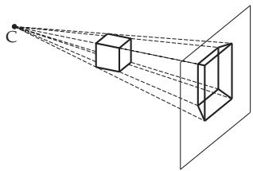  
Figure 3.210

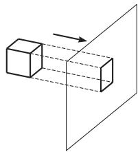  
Figure 3.211

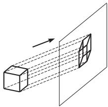  
Figure 3.212

##### 3.5.5.1 Classification of the projections

1. Central Projection

The centralprojection which is called also perspective projection the projecting rays start from a common center point (Fig.3.210). Objects being farther from the center of perspectivity C are represented smaller than the ones being closer to the center. Parallel lines, which are not parallel to the projection plane, become not parallel and they intersect in a so called vanishing point. Perspective projections give a realistic impression of the object for the viewer. But relations of lengths and angles are lost at this mapping.

2. Parallel Projection

At the parallel projection the projecting rays are parallel to each other (Fig.3.211). Line segments, which are not parallel to the projection plane are shortened, and angles are usually distorted.

1. Orthogonal Parallel Projections A parallel projection is an orthogonal projection if the direction of the projecting ray is perpendicular to the picture plane. If furthermore the picture plane is perpendicular to one of the coordinate-axes, then it is an orthographic projection or principal projection, which is well known from industrial designs.

If the direction of projection is not perpendicular to any coordinate-axis, then the orthogonal projection is called an axonometric projection.

2. Oblique Parallel Projections A parallel projection is an oblique projection if the direction of the projecting ray is not parallel to the normal vector of the picture plane (Fig.3.212). Special cases of oblique projections are Cavalier projection and cabinet projection .

Sometimes parallel projections preserve the ratio of sizes, but they seem less realistic than perspective representations.

##### 3.5.5.2 Local or Projection Coordinate System

Defining the direction of the projection plane and the coordinates of the result of a projection in the world coordinate system is not reasonable. It seems to be useful to apply a picture coordinate system whose x, y-plane is identical to the projection plane. This picture system represents the projection from the viewpoint of an observer who is looking perpendicularly to the projection plane.

Let the projection plane be given by a reference point $R ( x _ { r } , y _ { r } , z _ { r } )$ and a unit normalvector n = $\{ n _ { x } , n _ { y } , n _ { z } \}$ . Then the picture coordinate system is defined in the following way. The origin is placed into $\bar { R ( x _ { r } , y _ { r } , z _ { r } ) }$ . Among the coordinate unit vectors $\vec { \mathbf { e } } _ { i } ^ { \prime } , \vec { \mathbf { e } } _ { j } ^ { \prime }$ and $\vec { \mathbf { e } } _ { k } ^ { \prime }$ first $\vec { \mathbf { e } } _ { k } ^ { \prime } = \vec { \mathbf { n } }$ is fixed. An additional information is needed to fix the coordinate vectors $\vec { \mathbf { e } } _ { i } ^ { \prime }$ and $\vec { \mathbf { e } } _ { j } ^ { \prime }$ in the picture plane. An ,,upward” vector u is chosen in the world coordinate system, and its projection into the picture plane defines the vertical direction i.e. the y-direction of the picture system. The normed vector product of u and n defines the vector $\vec { \bf e } _ { i } ^ { \prime } ,$ . Summary:

$$
\vec { \bf e } _ { k } ^ { \prime } = \vec { \bf n } , \qquad \vec { \bf e } _ { i } ^ { \prime } = \frac { \vec { \bf u } \times \vec { \bf n } } { \lVert \vec { \bf u } \times \vec { \bf n } \rVert } , \qquad \vec { \bf e } _ { j } ^ { \prime } = \vec { \bf e } _ { k } ^ { \prime } \times \vec { \bf e } _ { i } ^ { \prime } .\tag{3.473}
$$

The transformation matrices of the mapping from the world coordinate system into the picture system and their inverses are given as in (3.464) and (3.465) by substituting the corresponding coordinates of point $R ( x _ { r } , y _ { r } , z _ { r } )$ and vectors $\vec { \bf e } _ { i } ^ { \prime } , \vec { \bf e } _ { j } ^ { \prime }$ and $\vec { \mathbf { e } } _ { k } ^ { \prime }$

##### 3.5.5.3 Principal Projections

The projection is perpendicular to a plane which is perpendicular to one of the coordinate-axes. Depending on the direction of the projection and the viewing direction to the picture plane, the ground plan, the top view or one of the side views is formed on the projection plane.

The matrix form of the orthogonal projection of a point $P ( x _ { \mathrm { P } } , y _ { \mathrm { P } } , z _ { \mathrm { P } } )$ to the projection plane being parallel to the x, y-plane with equation $z = z _ { 0 }$ is

$$
{ \left( \begin{array} { l } { x _ { \mathrm { P } } ^ { \prime } } \\ { y _ { \mathrm { P } } ^ { \prime } } \\ { z _ { \mathrm { P } } ^ { \prime } } \\ { 1 } \end{array} \right) } = { \left( \begin{array} { l l l l } { 1 } & { 0 } & { 0 } & { 0 } \\ { 0 } & { 1 } & { 0 } & { 0 } \\ { 0 } & { 0 } & { 0 } & { z _ { 0 } } \\ { 0 } & { 0 } & { 0 } & { 1 } \end{array} \right) } { \left( \begin{array} { l } { x _ { \mathrm { P } } } \\ { y _ { \mathrm { P } } } \\ { z _ { \mathrm { P } } } \\ { 1 } \end{array} \right) } ~ .\tag{3.474}
$$

In general, the projection plane is chosen $z _ { \mathrm { 0 } } = 0$ . The matrices of projections to the coordinate planes are

$$
\mathbf { P } _ { x } = { \left( \begin{array} { l l l l } { 0 } & { 0 } & { 0 } & { 0 } \\ { 0 } & { 1 } & { 0 } & { 0 } \\ { 0 } & { 0 } & { 1 } & { 0 } \\ { 0 } & { 0 } & { 0 } & { 1 } \end{array} \right) } , \qquad \mathbf { P } _ { y } = { \left( \begin{array} { l l l l } { 1 } & { 0 } & { 0 } & { 0 } \\ { 0 } & { 0 } & { 0 } & { 0 } \\ { 0 } & { 0 } & { 1 } & { 0 } \\ { 0 } & { 0 } & { 0 } & { 1 } \end{array} \right) } , \qquad \mathbf { P } _ { z } = { \left( \begin{array} { l l l l } { 1 } & { 0 } & { 0 } & { 0 } \\ { 0 } & { 1 } & { 0 } & { 0 } \\ { 0 } & { 0 } & { 0 } & { 0 } \\ { 0 } & { 0 } & { 0 } & { 1 } \end{array} \right) } .\tag{3.475}
$$

##### 3.5.5.4 Axonometric Projection

In contrary to the orthographic projection, now the normal-vector $\vec { \bf n } = \{ n _ { x } , n _ { y } , n _ { z } \}$ of the projection plane and the direction of the projection are not parallel to any of the coordinate axes. There are three diferent cases to consider:

Isometric: The angles of n are the same with every coordinate axis. So, for the coordinates of n, $| n _ { x } | = | n _ { y } | = | n _ { z } |$ . The angle between the projected coordinate axes is 120◦. Line segments being

parallel to the coordinate axes have the same distortion factor (Abb.3.213a).

Dimetric: n has the same angle with two of the coordinate axes. In these directions equal distances remain equal. Two of the coordinates of n have the same absolute value (Fig.3.213b).

Trimetric: n has diferent angles with the coordinate axes. Consequently the coordinate axes have diferent distortion factors (Fig.3.213c).

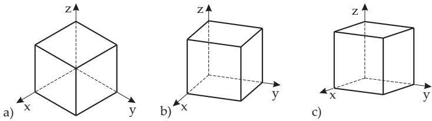  
Figure 3.213

##### 3.5.5.5 Isometric Projection

Consider the case when the projection plane contains the origin of the world coordinate system, and when its normal vector is $\vec { \bf n } = \left\{ \frac { 1 } { \sqrt { 3 } } , \frac { 1 } { \sqrt { 3 } } , \frac { 1 } { \sqrt { 3 } } \right\}$

In order to determine the matrix of projection, a coordinate transformation into the projection coordinate system is combined with a subsequent projection along the $z ^ { \prime } .$ -axis to the $x ^ { \prime } , y ^ { \prime } { \mathrm { - p l a n e } }$ . The definition of the picture coordinate system corresponds to (3.473). The upward vector is chosen as $\vec { \bf u } = \left\{ 0 , 0 , 1 \right\}$ . In this way the z-axis is mapped to the $y ^ { \prime } -$ axis. The unit basis-vectors of the picture coordinate system are:

$$
\vec { \mathbf { e } } _ { i } ^ { \prime } = \frac { \vec { \mathbf { u } } \times \vec { \mathbf { n } } } { \lVert \vec { \mathbf { u } } \times \vec { \mathbf { n } } \rVert } = \left\{ - \frac { 1 } { \sqrt { 2 } } , \frac { 1 } { \sqrt { 2 } } , 0 \right\} , \qquad { \vec { \mathbf { e } } } _ { j } ^ { \prime } = { \vec { \mathbf { e } } } _ { k } ^ { \prime } \times { \vec { \mathbf { e } } } _ { i } ^ { \prime } = \left\{ - \frac { 1 } { \sqrt { 6 } } , - \frac { 1 } { \sqrt { 6 } } , \frac { 2 } { \sqrt { 6 } } \right\} ,
$$

$$
{ \vec { \mathbf { e } } } _ { k } ^ { \prime } = { \vec { \mathbf { n } } } = \left\{ { \frac { 1 } { \sqrt { 3 } } } , { \frac { 1 } { \sqrt { 3 } } } , { \frac { 1 } { \sqrt { 3 } } } \right\} .
$$

The transformation matrices of mapping from the picture system into the world coordinate system and reverses with (3.464) and (3.465) are:

$$
\mathbf { \overline { { M } } _ { A } } = \left( \begin{array} { c c c c } { - \displaystyle \frac { 1 } { \sqrt { 2 } } } & { - \displaystyle \frac { 1 } { \sqrt { 6 } } } & { \displaystyle \frac { 1 } { \sqrt { 3 } } } & { 0 } \\ { \displaystyle \frac { 1 } { \sqrt { 2 } } } & { - \displaystyle \frac { 1 } { \sqrt { 6 } } } & { \displaystyle \frac { 1 } { \sqrt { 3 } } } & { 0 } \\ { 0 } & { \displaystyle \frac { 2 } { \sqrt { 6 } } } & { \displaystyle \frac { 1 } { \sqrt { 3 } } } & { 0 } \\ { 0 } & { 0 } & { 0 } & { 1 } \end{array} \right) , \qquad \mathbf { \overline { { M } } } _ { A } ^ { - 1 } = \mathbf { \overline { { M } } } _ { A } ^ { \mathrm { T } } = \left( \begin{array} { c c c c } { - \displaystyle \frac { 1 } { \sqrt { 2 } } } & { \displaystyle \frac { 1 } { \sqrt { 2 } } } & { 0 } & { 0 } \\ { - \displaystyle \frac { 1 } { \sqrt { 6 } } } & { - \displaystyle \frac { 1 } { \sqrt { 6 } } } & { \displaystyle \frac { 2 } { \sqrt { 6 } } } & { 0 } \\ { \displaystyle \frac { 1 } { \sqrt { 3 } } } & { \displaystyle \frac { 1 } { \sqrt { 3 } } } & { \displaystyle \frac { 1 } { \sqrt { 3 } } } & { 0 } \\ { 0 } & { 0 } & { 0 } & { 1 } \end{array} \right) .\tag{3.476}
$$

Now, in the picture system the orthogonal projection along the $z ^ { \prime } -$ axis is:

$$
\mathbf { P } _ { A } = \mathbf { P } _ { z } \overline { { \mathbf { M } } } _ { A } ^ { - 1 } = \left( \begin{array} { l l l l } { 1 } & { 0 } & { 0 } & { 0 } \\ { 0 } & { 1 } & { 0 } & { 0 } \\ { 0 } & { 0 } & { 0 } & { 0 } \\ { 0 } & { 0 } & { 0 } & { 1 } \end{array} \right) \cdot \left( \begin{array} { l l l l } { - \displaystyle { \frac { 1 } { \sqrt { 2 } } } } & { \displaystyle { \frac { 1 } { \sqrt { 2 } } } } & { 0 } & { 0 } \\ { - \displaystyle { \frac { 1 } { \sqrt { 6 } } } } & { - \displaystyle { \frac { 1 } { \sqrt { 6 } } } } & { \displaystyle { \frac { 2 } { \sqrt { 6 } } } } & { 0 } \\ { \displaystyle { \frac { 1 } { \sqrt { 3 } } } } & { \displaystyle { \frac { 1 } { \sqrt { 3 } } } } & { \displaystyle { \frac { 1 } { \sqrt { 3 } } } } & { 0 } \\ { 0 } & { 0 } & { 0 } & { 1 } \end{array} \right) = \left( \begin{array} { l l l l } { - \displaystyle { \frac { 1 } { \sqrt { 2 } } } } & { \displaystyle { \frac { 1 } { \sqrt { 2 } } } } & { 0 } & { 0 } \\ { - \displaystyle { \frac { 1 } { \sqrt { 6 } } } } & { - \displaystyle { \frac { 1 } { \sqrt { 6 } } } } & { \displaystyle { \frac { 2 } { \sqrt { 6 } } } } & { 0 } \\ { 0 } & { 0 } & { 0 } & { 0 } \\ { 0 } & { 0 } & { 0 } & { 1 } \end{array} \right) .\tag{3.477}
$$

The projection matrix $\mathbf { P } _ { A }$ maps the points from the world coordinate system into the $x ^ { \prime } , y ^ { \prime } { \mathrm { - p l a n e } }$ of the picture system. By multiplication with matrix $\overline { { M } } _ { A }$ one obtains the points in the world coordinate system. The projection-matrix of the complete projection is:

$$
\mathbf { P } = \overline { { \mathbf { M } } } _ { A } \mathbf { P } _ { z } \overline { { \mathbf { M } } } _ { A } ^ { - 1 } = \frac { 1 } { 3 } \left( \begin{array} { c c c c } { 2 - 1 } & { - 1 } & { 0 } \\ { - 1 } & { 2 } & { - 1 } & { 0 } \\ { - 1 } & { - 1 } & { 2 } & { 0 } \\ { 0 } & { 0 } & { 0 } & { 3 } \end{array} \right) .\tag{3.478}
$$

##### 3.5.5.6 Oblique Parallel Projection

At an oblique projection the projecting rays intersect the projection plane in an angle $\beta .$ In Fig.3.214 the oblique projection of point $\mathrm { \bar { \it P } } ( x _ { \mathrm { P } } , y _ { \mathrm { P } } , z _ { \mathrm { P } } )$ is $P ^ { \prime } ( x _ { \mathrm { P } } ^ { \prime } , y _ { \mathrm { P } } ^ { \prime } , z _ { \mathrm { P } } ^ { \prime } )$ and its orthogonal projection is $P _ { 0 } ^ { \prime }$ . L is the length of the projected line segment $\overline { { P _ { 0 } ^ { \prime } P ^ { \prime } } }$ . The projection is characterized by two quantities. $d = { \frac { L } { z } } = { \frac { 1 } { \tan \beta } }$ gives the factor by which the line segment perpendicular to the projection plane is scaled. α is the angle between the x-axis and the projected image of the perpendicular line segment. Then the rule for the coordinates of the whole projection is:

$$
x _ { \mathrm { P } } ^ { \prime } = x _ { \mathrm { P } } - z _ { \mathrm { P } } d \cos \alpha , \quad y _ { \mathrm { P } } ^ { \prime } = y _ { \mathrm { P } } - z _ { \mathrm { P } } d \sin \alpha , \quad z _ { \mathrm { P } } ^ { \prime } = 0 \qquad { \mathrm { o r } }\tag{3.479}
$$

$$
\begin{array} { r } { \left( \begin{array} { c } { x _ { \mathrm { P } } ^ { \prime } } \\ { y _ { \mathrm { P } } ^ { \prime } } \\ { z _ { \mathrm { P } } ^ { \prime } } \\ { 1 } \end{array} \right) = \left( \begin{array} { c c c c } { 1 } & { 0 } & { - d \cos \alpha } & { 0 } \\ { 0 } & { 1 } & { - d \sin \alpha } & { 0 } \\ { 0 } & { 0 } & { 0 } & { 0 } \\ { 0 } & { 0 } & { 0 } & { 1 } \end{array} \right) \left( \begin{array} { c } { x _ { \mathrm { P } } } \\ { y _ { \mathrm { P } } } \\ { z _ { \mathrm { P } } } \\ { 1 } \end{array} \right) . } \end{array}\tag{3.480}
$$

If the projection plane is diferent from the x, y-plane, then a coordinate transformation into the picture system must be done before applying the projection-matrix (see 3.5.5.2, p. 238).

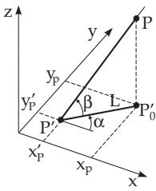  
Figure 3.214

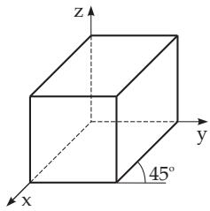  
Figure 3.215

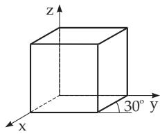  
Figure 3.216

Cavalier projection of the unit cube with $\alpha = 4 5 ^ { \circ }$ and $d = 1$ , i.e. $\beta = 4 5 ^ { \circ }$ . Segments being perpendicular to the projection plane do not become shorter in this case (Fig.3.215). The four vertices not lying in the x, y-plane are put as columns into a matrix. This matrix multiplied by the matrix of the projection will give the coordinates of the projected points:

$$
\left( { \begin{array} { c c c c } { - { \frac { 1 } { { \sqrt { 2 } } } } } & { - { \frac { 1 } { { \sqrt { 2 } } } } } & { 1 - { \frac { 1 } { { \sqrt { 2 } } } } } & { 1 - { \frac { 1 } { { \sqrt { 2 } } } } } \\ { - { \frac { 1 } { { \sqrt { 2 } } } } } & { 1 - { \frac { 1 } { { \sqrt { 2 } } } } } & { - { \frac { 1 } { { \sqrt { 2 } } } } } & { 1 - { \frac { 1 } { { \sqrt { 2 } } } } } \\ { 0 } & { 0 } & { 0 } & { 0 } \\ { 1 } & { 1 } & { 1 } & { 1 } \end{array} } \right) = { \left( \begin{array} { c c c c } { 1 } & { 0 } & { - { \frac { 1 } { { \sqrt { 2 } } } } } & { 0 } \\ { 0 } & { 1 } & { - { \frac { 1 } { { \sqrt { 2 } } } } } & { 0 } \\ { 0 } & { 0 } & { 0 } & { 0 } \\ { 0 } & { 0 } & { 0 } & { 1 } \end{array} \right) } \cdot { \left( \begin{array} { c c c c } { 0 } & { 1 } & { 0 } & { 1 } \\ { 0 } & { 0 } & { 1 } & { 1 } \\ { 1 } & { 1 } & { 1 } \\ { 1 } & { 1 } & { 1 } \end{array} \right) } ~ .
$$

Cabinet projection of the unit cube with $\alpha = 3 0 ^ { \circ } , d = 1 / 2$ , i.e. $\beta = 6 3 . 4 ^ { \circ }$ . The lengths of segments perpendicular to the projection plane are halved (Fig.3.216).

The coordinates of the projections of the four vertices not lying in the x, y-plane are calculated by

$$
\left( { \begin{array} { c c c c } { - { \frac { { \sqrt { 3 } } } { 4 } } } & { 1 - { \frac { { \sqrt { 3 } } } { 4 } } } & { - { \frac { { \sqrt { 3 } } } { 4 } } } & { 1 - { \frac { { \sqrt { 3 } } } { 4 } } } \\ { - { \frac { 1 } { 4 } } } & { - { \frac { 1 } { 4 } } } & { { \frac { 3 } { 4 } } } & { { \frac { 3 } { 4 } } } \\ { 0 } & { 0 } & { 0 } & { 0 } \\ { 1 } & { 1 } & { 1 } & { 1 } \end{array} } \right) = { \left( \begin{array} { c c c c } { 1 } & { 0 } & { - { \frac { { \sqrt { 3 } } } { 4 } } } & { 0 } \\ { 0 } & { 1 } & { - { \frac { 1 } { 4 } } } & { 0 } \\ { 0 } & { 0 } & { 0 } & { 0 } \\ { 0 } & { 0 } & { 0 } & { 1 } \end{array} \right) } \cdot { \left( \begin{array} { c c c c } { 0 } & { 1 } & { 0 } & { 1 } \\ { 0 } & { 0 } & { 1 } & { 1 } \\ { 1 } & { 1 } & { 1 } & { 1 } \\ { 1 } & { 1 } & { 1 } & { 1 } \end{array} \right) } ~ .
$$

##### 3.5.5.7 Perspective Projection

1. Mapping Formulation

The formulation of the mapping of a perspective projection can be given reasonably in the picture coordinate system. The origin is chosen so that the center of projection lies on the z-axis. As it can be seen in Fig.3.217, the relations between the coordinates of a point $P ( x _ { \mathrm { P } } , y _ { \mathrm { P } } , z _ { \mathrm { P } } )$ and its

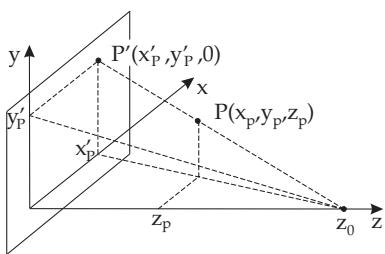  
Figure 3.217

projected image $P ^ { \prime } ( x _ { \mathrm { P } } ^ { \prime } , y _ { \mathrm { P } } ^ { \prime } , z _ { \mathrm { P } } ^ { \prime } )$ can be calculated using equations of the intercept theorems (see 3.1.3.2,5., p. 135):

$$
\begin{array} { l l } { { \displaystyle { \frac { x _ { \mathrm { P } } ^ { \prime } } { x _ { \mathrm { P } } } } = { \frac { z _ { 0 } } { z _ { 0 } - z _ { \mathrm { P } } } } = { \frac { 1 } { 1 - { \frac { z _ { \mathrm { P } } } { z _ { 0 } } } } } , } } & { { { \displaystyle { \frac { y _ { \mathrm { P } } ^ { \prime } } { y _ { \mathrm { P } } } } = { \frac { 1 } { 1 - { \frac { z _ { \mathrm { P } } } { z _ { 0 } } } } } } , } } \\ { { \displaystyle z _ { \mathrm { P } } ^ { \prime } = 0 . } } \end{array}
$$

The relations between the original and the image coordinates are not linear. However using the properties of homogeneous coordinates (see 3.5.4.2, p. 231) the projection rule can be given in the following matrix form:

$$
\left( \begin{array} { c } { x _ { \mathrm { P } } ^ { \prime } } \\ { y _ { \mathrm { P } } ^ { \prime } } \\ { z _ { \mathrm { P } } ^ { \prime } } \\ { 1 } \end{array} \right) = \left( \begin{array} { c } { x _ { \mathrm { P } } } \\ { y _ { \mathrm { P } } } \\ { 0 } \\ { 1 - \frac { z _ { \mathrm { P } } } { z _ { 0 } } } \end{array} \right) = \left( \begin{array} { c c c } { 1 } & { 0 } & { 0 } & { 0 } \\ { 0 } & { 1 } & { 0 } & { 0 } \\ { 0 } & { 0 } & { 0 } & { 0 } \\ { 0 } & { 0 } & { - \frac { 1 } { z _ { 0 } } } & { 1 } \end{array} \right) \left( \begin{array} { c } { x _ { \mathrm { P } } } \\ { y _ { \mathrm { P } } } \\ { z _ { \mathrm { P } } } \\ { 1 } \end{array} \right) .\tag{3.481}
$$

2. Vanishing points

Perspective projections have the property, that parallel lines, which are not parallel to the picture plane, seem to intersect each other in a point. This point is called vanishing point. The vanishing points of lines being parallel to the coordinate axes are called principal points or principal vanishing points. The number of principal points is equal to the number of coordinate axes intersecting the picture plane. In Fig.3.218 there are perspective representations with one, two and three principal points. The principal points coincide with the intersection points of the picture plane and the rays being parallel to the coordinate axes. If the center of projection is $C ( x _ { c } , y _ { c } , z _ { c } )$ , a point of the picture plane is $R ( x _ { r } , y _ { r } , z _ { r } )$ and the normal vector is $\vec { \bf { n } } = \{ n _ { x } , \bar { n _ { y } } , \bar { n _ { z } } \}$ , then the coordinates of the principal points are:

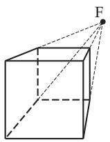  
a)

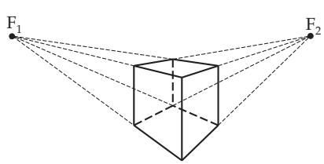  
b)  
Figure 3.218

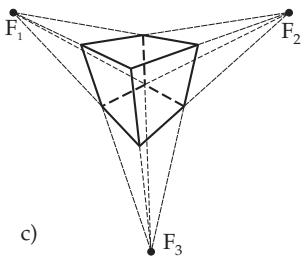

$$
F _ { x } ( x _ { c } + \frac { d } { n _ { x } } , y _ { c } , z _ { c } ) , \quad F _ { y } ( x _ { c } , y _ { c } + \frac { d } { n _ { y } } , z _ { c } ) , \quad F _ { z } ( x _ { c } , y _ { c } , z _ { c } + \frac { d } { n _ { z } } ) \quad \mathrm { w h e r e }\tag{3.482a}
$$

$$
d = ( { \vec { \mathbf { c } } } - { \vec { \mathbf { r } } } ) \cdot { \vec { \mathbf { n } } } = ( x _ { c } - x _ { r } ) n _ { x } + ( y _ { c } - y _ { r } ) n _ { y } + ( z _ { c } - z _ { r } ) n _ { z }\tag{3.482b}
$$

in the case they exist. If a coordinate of the normal vector n is zero, then there is no principal point in that direction.
