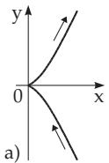
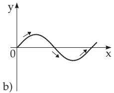
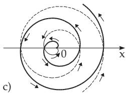

##### 3.6.1.1 Ways to Define a Plane Curve

1. Coordinate Equations

A plane curve can be analytically defined in the following ways.

1. In Cartesian coordinates:

a) Implicit:

$$
F ( x , y ) = 0 ,\tag{3.483}
$$

b) Explicit:

$$
y = f ( x ) ,\tag{3.484}
$$

2. In Parametric Form:

$$
x = x ( t ) , \quad y = y ( t ) .\tag{3.485}
$$

3. In Polar Coordinates: ρ = f(ϕ).

(3.486)

2. Positive Direction on a Curve

If a curve is given in the form (3.485), the positive direction is defined on it in which a point $P \left( x ( t ) , y ( t ) \right)$ of the curve moves for increasing values of the parameter t. If the curve is given in the form (3.484), then the abscissa can be considered as a parameter $( x = x , y = f ( x ) )$ , so the positive direction holds for increasing abscissa. For the form (3.486) the angle can be considered as a parameter $\varphi \left( x = f ( \varphi ) \right.$ cos $\varphi$ $y = f ( \varphi ) \sin \varphi )$ , so the positive direction holds for increasing ϕ, i.e., counterclockwise.

Fig.3.219a, b, c: A: x = t2, y = t3, B: y = sin x, C: $\rho = a \varphi$

  
Figure 3.219
