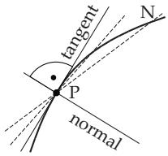
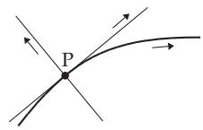
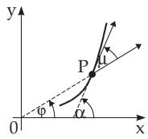
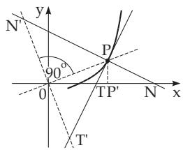
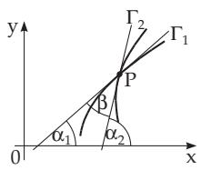
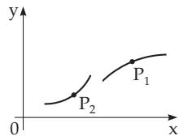
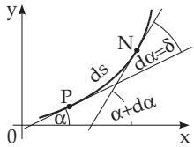
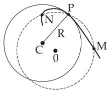
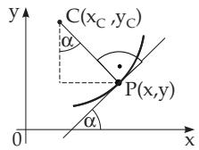
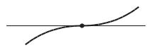

##### 3.6.1.2 Local Elements of a Curve

Depending on whether a changing point P on the curve is given in the form (3.484), (3.485) or (3.486), its position is defined by x, t or ϕ. A point arbitrarily close to $P$ with parameter values $x + d x , t + d t$ or $\varphi + d \varphi$ is denoted here by N.

1. Diferential of Arc

If s denotes the length of the curve from a fixed point A to the point $P ,$ the infinitesimal increment $\Delta s = \widehat { P N }$ can be expressed approximately by the diferential ds of the arc length, the diferential of

arc:

$$
\Delta s \approx d s = \left\{ \begin{array} { l l } { \displaystyle { \sqrt { 1 + \left( \frac { d y } { d x } \right) ^ { 2 } } } d x } & { \quad \mathrm { f o r ~ t h e ~ f o r m ~ } ( 3 . 4 8 4 ) , } \\ { \displaystyle { \sqrt { x ^ { \prime 2 } + y ^ { \prime 2 } } } d t } & { \quad \mathrm { f o r ~ t h e ~ f o r m ~ } ( 3 . 4 8 5 ) , } \\ { \displaystyle { \sqrt { \rho ^ { 2 } + \rho ^ { \prime 2 } } } d \varphi } & { \quad \mathrm { f o r ~ t h e ~ f o r m ~ } ( 3 . 4 8 6 ) . } \end{array} \right.\tag{3.487}
$$

(3.488)

(3.489)

A: $y = \sin x , \ d s = { \sqrt { 1 + \cos ^ { 2 } x } } d x . \ \mathbf { \theta } \mathbf { B } \colon \ x = t ^ { 2 } , \ y = t ^ { 3 } , \ d s = t { \sqrt { 4 + 9 t ^ { 2 } } } d t .$

C: $\rho = a \varphi \ ( a > 0 ) , \quad d s = a \sqrt { 1 + \varphi ^ { 2 } } d \varphi .$

  
Figure 3.220

  
Figure 3.221  
Figure 3.222

2. Tangent and Normal

1. Tangent at a Point P to a Curve is a line in the limiting position of the secants $P N$ for $N  P ;$ the normal is a line through P which is perpendicular to the tangent here (Fig. 3.220).

2. The Equations of the Tangent and the Normal are given in Table 3.26 for the three cases (3.483), (3.484), and (3.485). Here x, y are the coordinates of ${ \overset { \sim } { P } } ,$ and X, Y are the coordinates of the points of the tangent and normal. The values of the derivatives should be calculated at the point $P ,$

Table 3.26 Tangent and normal equations
<table><tr><td>Type of equation</td><td>Equation of the tangent</td><td>Equation of the normal</td></tr><tr><td>(3.483)</td><td> ${ \frac { \partial F } { \partial x } } ( X - x ) + { \frac { \partial F } { \partial y } } ( Y - y ) = 0$ </td><td> $X - x \quad Y - y$   $\overline { { { \frac { \partial F } { \partial x } } } } ^ { = } = \overline { { { \frac { \partial F } { \partial y } } } }$ </td></tr><tr><td>(3.484)</td><td> $Y - y = { \frac { d y } { d x } } ( X - x )$ </td><td> $Y - y = - { \frac { 1 } { \frac { d y } { d x } } } ( X - x )$ </td></tr><tr><td>(3.485)</td><td> ${ \frac { Y - y } { y ^ { \prime } } } = { \frac { X - x } { x ^ { \prime } } }$ </td><td> $x ^ { \prime } ( X - x ) + y ^ { \prime } ( Y - y ) = 0$ </td></tr></table>

Examples for equations of the tangent and normal for the following curves:

A: Circle $x ^ { 2 } + y ^ { 2 } = 2 5$ at the point P(3, 4):

a) Equation of the tangent: $2 x ( { \dot { X } } - x ) + 2 y ( { \dot { Y } } - y ) = 0 { \mathrm { ~ o r ~ } } X x + Y y = 2 5$ considering that the point $\acute { P }$ lies on the circle: $3 { \check { X } } + 4 Y = 2 5$

b) Equation of the normal: ${ \frac { X - x } { 2 x } } = { \frac { Y - y } { 2 y } } \operatorname { o r } Y = { \frac { y } { x } } X$ at the point P: $Y = { \frac { 4 } { 3 } } X$

B: Sine curve y = sin x at the point $0 ( 0 , 0 )$ :

a) Equation of the tangent: $Y - \sin x = \cos x ( X - x )$ or Y = X cos x + sin x x cos x; at the point $( { \dot { 0 } } , 0 ) \colon Y = X$

b) Equation of the normal: $Y - \sin x = - { \frac { 1 } { \cos x } } ( X - x ) \operatorname { o r } Y = - X \sec x + \sin x + x \sec x ;$ at the point $( 0 , 0 ) \colon Y = - X .$

C: Curve with $x = t ^ { 2 } , y = t ^ { 3 }$ at the point P(4, 8), t = 2:

a) Equation of the tangent: ${ \frac { Y - t ^ { 3 } } { 3 t ^ { 2 } } } = { \frac { X - t ^ { 2 } } { 2 t } } \operatorname { o r } Y = { \frac { 3 } { 2 } } t X - { \frac { 1 } { 2 } } t ^ { 3 } ;$ at the point $P \colon Y = - 3 X + 4$ b) Equation of the normal: $2 t \left( X - t ^ { 2 } \right) + 3 t ^ { 2 } \left( Y - t ^ { 3 } \right) = 0 \mathrm { o r } 2 X + 3 t Y = t ^ { 2 } \left( 2 + 3 t ^ { 2 } \right)$ ; at the point $\overset { \triangledown } { P } ( 4 , - 8 ) \colon X - 3 Y = 2 8$

3. Positive Direction of the Tangent and Normal of the Curve If the curve is given in one of the forms (3.484), (3.485), (3.486), the positive directions on the tangent and normal are defined in the following way: The positive direction of the tangent is the same as on the curve at the point of contact, and one gets the positive direction on the normal from the positive direction of the tangent by rotating it counterclockwise around P by an angle of $9 0 ^ { \circ }$ (Fig. 3.221). The tangent and the normal are divided into a positive and a negative half-line by the point $P ,$

4. The Slope of the Tangent can be determined

a) by the angle of slope of the tangent α , between the positive directions of the axis of abscissae and the tangent, or

b) if the curve is given in polar coordinates, by the angle $\mu ,$ between the radius vector OP $( \overline { { O P } } = \rho )$ and the positive direction of the tangent (Fig. 3.222). For the angles α and $\mu$ the following formulas are valid, where ds is calculated according to (3.487)–(3.489):

$$
\tan \alpha = { \frac { d y } { d x } } , \quad \cos \alpha = { \frac { d x } { d s } } , \quad \sin \alpha = { \frac { d y } { d s } } ;\tag{3.490a}
$$

$$
\tan \mu = \frac { \rho } { \frac { d \rho } { d \varphi } } , \quad \cos \mu = \frac { d \rho } { d s } , \quad \sin \mu = \rho \frac { d \varphi } { d s } .\tag{3.490b}
$$

$$
\mathbf { A } \colon \ y = \sin x , \qquad \tan \alpha = \cos x , \qquad \cos \alpha = { \frac { 1 } { \sqrt { 1 + \cos ^ { 2 } x } } } , \qquad \sin \alpha = { \frac { \cos x } { \sqrt { 1 + \cos ^ { 2 } x } } } ;
$$

$$
\mathbf { B } \colon x = t ^ { 2 } , y = t ^ { 3 } , \mathrm { t a n } \alpha = { \frac { 3 t } { 2 } } , \mathrm { c o s } \alpha = { \frac { 2 } { \sqrt { 4 + 9 t ^ { 2 } } } } , \mathrm { s i n } \alpha = { \frac { 3 t } { \sqrt { 4 + 9 t ^ { 2 } } } } ;
$$

C: $\rho = a \varphi ,$

$$
\tan \mu = \varphi ,
$$

$$
\cos \mu = \frac { 1 } { \sqrt { 1 + \varphi ^ { 2 } } } ,
$$

$$
\sin \mu = \frac { \varphi } { \sqrt { 1 + \varphi ^ { 2 } } } .
$$

5. Segments of the Tangent and Normal, Subtangent and Subnormal (Fig. 3.223) a) In Cartesian Coordinates for the definitions in form (3.484), (3.485):

$$
\overline { { P T } } = \left| { \frac { y } { y ^ { \prime } } } { \sqrt { 1 + { y ^ { \prime } } ^ { 2 } } } \right|
$$

$$
( s e g m e n t o f t h e t a n g e n t ) ,\tag{3.491a}
$$

$$
\overline { { P N } } = \left| y \sqrt { 1 + { y ^ { \prime } } ^ { 2 } } \right|
$$

$$
( s e g m e n t o f t h e n o r m a l ) ,\tag{3.491b}
$$

$$
{ \overline { { P ^ { \prime } T } } } = \left| { \frac { y } { y ^ { \prime } } } \right| \quad ( s u b t a n g e n t ) ,
$$

(3.491c)

$$
\overline { { P ^ { \prime } N } } = | y y ^ { \prime } | \quad ( s u b n o r m a l ) .\tag{3.491d}
$$

b) In Polar Coordinates for the definitions in form (3.486):

$$
\overline { { P T ^ { \prime } } } = \left| \frac { \rho } { \rho ^ { \prime } } \sqrt { \rho ^ { 2 } + \rho ^ { \prime 2 } } \right|
$$

$$
( s e g m e n t o f t h e p o l a r t a n g e n t ) ,\tag{3.492a}
$$

$$
\overline { { P N ^ { \prime } } } = \left| \sqrt { \rho ^ { 2 } + \rho ^ { \prime 2 } } \right|
$$

$$
( s e g m e n t o f t h e p o l a r n o r m a l ) ,\tag{3.492b}
$$

(3.493a)

$$
\overline { { O T ^ { \prime } } } = \left| \frac { \rho ^ { 2 } } { \rho ^ { \prime } } \right| \{ p o l a r s u b t a n g e n t ) , \ ( 3 . 4 9 2 \mathrm { c } ) \qquad \overline { { O N ^ { \prime } } } = | \rho ^ { \prime } | \quad ( p o l a r s u b n o r m a l ) .\tag{3.492d}
$$

A: y = cosh x, y = sinh x, $\sqrt { 1 + { y ^ { \prime } } ^ { 2 } } = \cosh x$ ; PT =  cosh x coth x , $\overline { { P N } } = \vert \cosh ^ { 2 } x \vert , \ \overline { { P ^ { \prime } T } } =$ coth x , $\overline { { P ^ { \prime } N } } = |$ sinh x cosh x .

$$
\begin{array} { r l } & { \textbf { B : } \rho = a \varphi \ ( a > 0 ) , \ \rho ^ { \prime } = a , \ \sqrt { \rho ^ { 2 } + \rho ^ { 2 } } = a \sqrt { 1 + \varphi ^ { 2 } } ; \overline { { P T ^ { \prime } } } = \left| a \varphi \sqrt { 1 + \varphi ^ { 2 } } \right| , \ \overline { { P N ^ { \prime } } } = \left| a \sqrt { 1 + \varphi ^ { 2 } } \right| , \ \overline { { O T ^ { \prime } } } = } \\ & { \left| a \varphi ^ { 2 } \right| , \ \overline { { O N ^ { \prime } } } = a . } \end{array}
$$

  
Figure 3.223

  
Figure 3.224

  
Figure 3.225

6. Angle Between Two Curves The angle $\beta$ between two curves $\boldsymbol { { \cal T } } _ { 1 }$ and $\varGamma _ { 2 }$ at their intersection point $P$ is defined as the angle between their tangents at the point $P \left( \mathrm { F i g } . 3 . 2 2 4 \right)$ . By this definition the calculation of the angle $\beta$ has been reduced to the calculation of the angle between two lines with slopes

$$
k _ { 1 } = \tan \alpha _ { 1 } = \left( \frac { d f _ { 1 } } { d x } \right) _ { P } ,
$$

$$
k _ { 2 } = \tan \alpha _ { 2 } = \left( { \frac { d f _ { 2 } } { d x } } \right) _ { P } .\tag{3.493b}
$$

Here $y \ = \ f _ { 1 } ( x )$ is the equation of $\boldsymbol { { \cal T } } _ { 1 }$ and $y \ = \ f _ { 2 } ( x )$ is the equation of $\varGamma _ { 2 } .$ , and the derivatives are calculated at the point $P .$ One gets $\beta$ with the help of the formula

$$
\tan \beta = \tan ( \alpha _ { 1 } - \alpha _ { 2 } ) = \frac { \tan \alpha _ { 2 } - \tan \alpha _ { 1 } } { 1 + \tan \alpha _ { 1 } \tan \alpha _ { 2 } } .\tag{3.494}
$$

Determine the angle between the parabolas $y = { \sqrt { x } }$ and $y = x ^ { 2 }$ at the point $P ( 1 , 1 )$

$$
\tan \alpha _ { 1 } = \left( \frac { d \sqrt { x } } { d x } \right) _ { x = 1 } = \frac { 1 } { 2 } , \quad \tan \alpha _ { 2 } = \left( \frac { d \left( x ^ { 2 } \right) } { d x } \right) _ { x = 1 } = 2 , \quad \tan \beta = \frac { \tan \alpha _ { 2 } - \tan \alpha _ { 1 } } { 1 + \tan \alpha _ { 1 } \tan \alpha _ { 2 } } = \frac { 3 } { 4 } .
$$

3. Convex and Concave Part of a Curve

If a curve is given in the explicit form $y \ = \ f ( x )$ , then a small part containing the point $P$ can be examined if the curve is concave up or down here, except of course if $P$ is an inflection point or a singular point (see 3.6.1.3, p. 249). If the second derivative $f ^ { \prime \prime } ( x ) > 0$ (if it exists), then the curve is concave up, i.e., in the direction of positive y (point $P _ { 2 }$ in $\mathbf { F i g . 3 . 2 2 5 } )$ . If $f ^ { \prime \prime } ( x ) < 0$ holds (point $P _ { 1 } )$ then the curve is concave down. In the case if $\overset { \triangledown } { f ^ { \prime \prime } } ( x ) = 0$ holds, it should be checked if it is an inflection point.

$y = x ^ { 3 } \ ( \mathbf { F i g . 2 . 1 5 6 } ) ; y \prime \prime = 6 x$ , for $x > 0$ the curve is concave up, for $x < 0$ concave down.

4. Curvature and Radius of Curvature

1. Curvature of a Curve The curvature K of a curve at the point P is the limit of the ratio of the angle δ between the positive tangent directions at the points $P$ and N (Fig. 3.226) and the arc length

$\widehat { P N }$ for $\widehat { P N }  0$

$$
K = \operatorname* { l i m } _ { { P N }  0 } \frac { \delta } { P N } .\tag{3.495}
$$

The sign of the curvature K depends on whether the curve bends toward the positive half of the norma $( K > 0 )$ or toward the negative half of it $( K < 0 )$ (see 3.6.1.1, 2., p. 245). In other words the center of curvature for $K > 0$ is on the positive side of the normal, for $K < 0$ it is on the negative side. Sometimes the curvature K is considered only as a positive quantity. Then it is to take the absolute value of the limit above.

2. Radius of Curvature of a Curve The radius of curvature R of a curve at the point $P$ is the reciprocal value of the absolute value of the curvature:

$$
R = { \frac { 1 } { | K | } } .\tag{3.496}
$$

The larger the curvature K is at a point P the smaller the radius of curvature R is.

A: For a circle with radius a the curvature $K = 1 / a$ and the radius of curvature $R = a$ are constant for every point.

B: For a line with $K = 0$ holds $R = \infty$

  
Figure 3.226

3. Formulas for Curvature and Radius of Curvature With the notation $\delta = d \alpha$ and ${ \acute { P } } { \acute { N } } = d s$ (Fig. 3.226) in general

$$
K = \frac { d \alpha } { d s } , \quad R = \left| \frac { d s } { d \alpha } \right| .\tag{3.497}
$$

For the diferent defining formulas of curves in 3.6.1.1, p. 243 the diferent expressions for K and R are:

Definition as in (3.484):

$$
K = { \frac { { \frac { d ^ { 2 } y } { d x ^ { 2 } } } } { \left[ 1 + \left( { \frac { d y } { d x } } \right) ^ { 2 } \right] ^ { 3 / 2 } } } , \qquad R = \left| { \frac { \left[ 1 + \left( { \frac { d y } { d x } } \right) ^ { 2 } \right] ^ { 3 / 2 } } { \displaystyle { \frac { d ^ { 2 } y } { d x ^ { 2 } } } } } \right| ,\tag{3.498}
$$

$$
\mathrm { D e f i n i t i o n ~ a s ~ i n ~ ( 3 . 4 8 5 ) } \colon \ K = { \frac { { \left| \begin{array} { l } { x ^ { \prime } \ y ^ { \prime } } \\ { x ^ { \prime \prime } \ y ^ { \prime \prime } } \end{array} \right| } } { { \left( x ^ { \prime 2 } + y ^ { \prime 2 } \right) } ^ { 3 / 2 } } } , \qquad R = \left| { \frac { { \left( x ^ { \prime 2 } + y ^ { \prime 2 } \right) } ^ { 3 / 2 } } { { \left| \begin{array} { l } { x ^ { \prime } \ y ^ { \prime } } \\ { x ^ { \prime \prime } \ y ^ { \prime \prime } } \end{array} \right| } } } \right| ,\tag{3.499}
$$

Definition as in (3.483):

$$
K = { \frac { \left| F _ { x x } \ F _ { x y } \ F _ { x } \right| } { \left( F _ { y x } \ F _ { y y } \ F _ { y } \right) } } , R = { \frac { \left| \left( F _ { x } \mathrm { } ^ { 2 } + F _ { y } \mathrm { } ^ { 2 } \right) ^ { 3 / 2 } \right| } { \left| F _ { x x } \ F _ { x y } \ F _ { x } \right| } } ,\tag{3.500}
$$

$$
\mathrm { D e f i n i t i o n \ a s \ i n \ ( 3 . 4 8 6 ) } \colon K = \frac { \rho ^ { 2 } + 2 \rho ^ { 2 } - \rho \rho ^ { \prime \prime } } { \left( \rho ^ { 2 } + \rho ^ { \prime 2 } \right) ^ { 3 / 2 } } , \qquad R = \left. \frac { \left( \rho ^ { 2 } + \rho ^ { \prime 2 } \right) ^ { 3 / 2 } } { \rho ^ { 2 } + 2 \rho ^ { \prime 2 } - \rho \rho ^ { \prime \prime } } \right. .\tag{3.501}
$$

$$
{ \bf \delta A } \colon { \boldsymbol { y } } = \cosh x , \quad K = { \frac { 1 } { \cosh ^ { 2 } x } } ;
$$

$$
\overline { { { \bf { B } } } } \colon { \bf { B } } \colon { \bf { \mathit { x } } } = t ^ { 2 } , \quad { \boldsymbol { y } } = t ^ { 3 } , \quad { \boldsymbol { K } } = { \frac { 6 } { t { \left( 4 + 9 t ^ { 2 } \right) } ^ { 3 / 2 } } } ;
$$

C: $y ^ { 2 } - x ^ { 2 } = a ^ { 2 } , \quad K = \frac { a ^ { 2 } } { ( x ^ { 2 } + y ^ { 2 } ) ^ { 3 / 2 } } ;$

$$
\mathrm { \bf ~ D } \colon \rho = a \varphi , \quad K = \frac { 1 } { a } \cdot \frac { \varphi ^ { 2 } + 2 } { ( \varphi ^ { 2 } + 1 ) ^ { 3 / 2 } } .
$$

5. Circle of Curvature and Center of Curvature

1. Circle of Curvature at the point P is the limiting position of the circles passing through P and two points N and M of the curve from its neighborhood, for $N  P$ and $M  P ~ ( \mathrm { F i g . ~ 3 . 2 2 7 } )$ . It goes through the point of the curve and here it has the same first and the same second derivative as the curve. Therefore it fits the curve at the point of contact especially well. It is also called the osculating circle. Its radius is the radius of curvature. It is obvious that it is the reciprocal value of the absolute value of the curvature.

2. Center of Curvature The center C of the circle of curvature is the center of curvature of the point P. It is on the concave side of the curve, and on the normal of the curve.

3. Coordinates of the Center of Curvature The coordinates $( x _ { C } , y _ { C } )$ of the center of curvature for curves with defining equations in 3.6.1.1, p. 243 can be determined from the following formulas.

Definition as in (3.484):

$$
x _ { C } = x - \frac { \displaystyle \frac { d y } { d x } \left[ 1 + \left( \frac { d y } { d x } \right) ^ { 2 } \right] } { \displaystyle \frac { d ^ { 2 } y } { d x ^ { 2 } } } , \qquad y _ { C } = y + \frac { \displaystyle 1 + \left( \frac { d y } { d x } \right) ^ { 2 } } { \displaystyle \frac { d ^ { 2 } y } { d x ^ { 2 } } } .\tag{3.502}
$$

Definition as in (3.485):

$$
x _ { C } = x - \frac { y ^ { \prime } ( x ^ { \prime 2 } + y ^ { \prime 2 } ) } { \left| x ^ { \prime } \ y ^ { \prime } \right| } , \qquad \quad y _ { C } = y + \frac { x ^ { \prime } ( x ^ { \prime 2 } + y ^ { \prime 2 } ) } { \left| x ^ { \prime } \ y ^ { \prime } \right| } .\tag{3.503}
$$

Definition as in (3.486):

$$
x _ { C } = \rho \cos \varphi - \frac { ( \rho ^ { 2 } + \rho ^ { \prime 2 } ) ( \rho \cos \varphi + \rho ^ { \prime } \sin \varphi ) } { \rho ^ { 2 } + 2 \rho ^ { \prime 2 } - \rho \rho ^ { \prime \prime } } ,
$$

$$
y _ { C } = \rho \sin \varphi - \frac { ( \rho ^ { 2 } + \rho ^ { \prime 2 } ) ( \rho \sin \varphi - \rho ^ { \prime } \cos \varphi ) } { \rho ^ { 2 } + 2 \rho ^ { \prime 2 } - \rho \rho ^ { \prime \prime } } .\tag{3.504}
$$

Definition as in (3.483):

$$
x _ { C } = x + \frac { F _ { x } \left( F _ { x } ^ { 2 } + F _ { y } ^ { 2 } \right) } { \left| \begin{array} { l l l } { F _ { x x } ~ F _ { x y } ~ F _ { x } } \\ { F _ { y x } ~ F _ { y y } ~ F _ { y } } \\ { F _ { x } ~ F _ { y } ~ 0 } \end{array} \right| } , ~ y _ { C } = y + \frac { F _ { y } \left( F _ { x } ^ { 2 } + F _ { y } ^ { 2 } \right) } { \left| \begin{array} { l l l } { F _ { x x } ~ F _ { x y } ~ F _ { x } } \\ { F _ { y x } ~ F _ { y y } ~ F _ { y } } \\ { F _ { x } ~ F _ { y } ~ 0 } \end{array} \right| } .\tag{3.505}
$$

These formulas can be transformed into the form

$$
x _ { C } = x - R \sin \alpha , \quad y _ { C } = y + R \cos \alpha \qquad { \mathrm { o r } }\tag{3.506}
$$

$$
x _ { C } = x - R \frac { d y } { d s } , \qquad y _ { C } = y + R \frac { d x } { d s }\tag{3.507}
$$

(Fig. 3.228), where R should be calculated as in (3.498)–(3.501).

  
Figure 3.227

  
Figure 3.228

  
Figure 3.229
