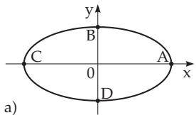
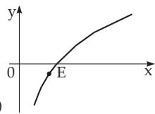
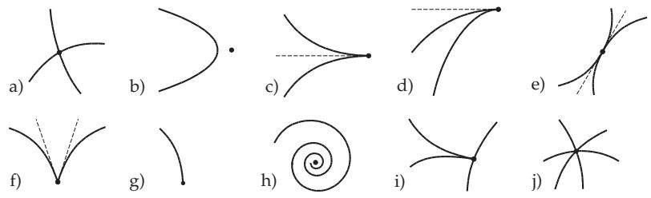

##### 3.6.1.3 Special Points of a Curve

In the following are to be discussed only the points remaining invariant during coordinate transformations. In order to determine maxima and minima see 6.1.5.3, p. 444.

1. Inflection Points and the Rules to Determine Them

Inflection points are the points of the curve where the curvature changes its sign (Fig. 3.229) while a tangent exists. The tangent line at the inflection point intersects the curve, so the curve is on both sides of the line in this neighborhood. At the inflection point $K = 0$ and $R = \infty$ hold.

1. Explicit Form (3.484) of the Curve $y = f ( x )$

a) A Necessary Condition for the existence of an inflection point is the zero value of the second derivative

$$
f ^ { \prime \prime } ( x ) = 0\tag{3.508}
$$

if it exists at the inflection point (for the case of non-existent second derivative see b)). In order to determine the inflection points for existing second derivative all the roots of the equation $f ^ { \prime \prime } ( x ) = 0$ with values $x _ { 1 } , x _ { 2 } , \ldots , x _ { i } , \ldots , x _ { n }$ are to be considered, and to be substituted into the further derivatives. If for a value $x _ { i }$ the first non-zero derivative has odd order, then there is an inflection point here. If the considered point is not an inflection point, because for the first non-disappearing derivative of kth order, k is an even number, then for $f ^ { ( \hat { k } ) } ( x ) ~ < ~ 0$ the curve is concave down; for $f ^ { ( \zeta ) } ( x ) > 0$ it is concave up. If the higher-order derivatives are not be checked, for instance in the case they do not exist, see point b).

b) A Suficient Condition for the existence of an inflection point is the change of the sign of the second derivative $f ^ { \prime \prime } ( x )$ while traversing from the left neighborhood of this point to the right, if also a tangent exists here, of course. So the question, of whether the curve has an inflection point at the point with abscissa $x _ { i } ,$ , can be answered by checking the sign of the second derivative traversing the considered point: If the sign changes during the traverse, there is an inflection point. (Since $x _ { i }$ is a root of the second derivative, the function has a first derivative, and consequently the curve has a tangent.) This method can also be used in the case if $y ^ { \prime \prime } = \infty$ , together with the checking of the existence of a tangent line, e.g. in the case of a vertical tangent line.

$$
\mathbf { A } \colon \ : y = \frac { 1 } { 1 + x ^ { 2 } } , \ : \ : f ^ { \prime \prime } ( x ) = - 2 \frac { 1 - 3 x ^ { 2 } } { ( 1 + x ^ { 2 } ) ^ { 3 } } , \ : \ : x _ { 1 , 2 } = \pm \frac { 1 } { \sqrt { 3 } } , \ : \ : f ^ { \prime \prime } ( x ) = 2 4 x \frac { 1 - x ^ { 2 } } { ( 1 + x ^ { 2 } ) ^ { 4 } } , \ : \ : f ^ { \prime \prime } ( x _ { 1 , 2 } ) \neq 0 .
$$

Inflection points: $A \left( { \frac { 1 } { \sqrt { 3 } } } , { \frac { 3 } { 4 } } \right) , \quad B \left( - { \frac { 1 } { \sqrt { 3 } } } , { \frac { 3 } { 4 } } \right)$

B: $y = x ^ { 4 } , f ^ { \prime \prime } ( x ) = 1 2 x ^ { 2 } , x _ { 1 } = 0 , f ^ { \prime \prime \prime } ( x ) = 2 4 x , f ^ { \prime \prime \prime } ( x _ { 1 } ) = 0 , f ^ { I V } ( x ) = 2 4 x ,$ ; there is no inflection point.

C: $y = x ^ { \frac { 5 } { 3 } } , y ^ { \prime } = { \frac { 5 } { 3 } } x ^ { \frac { 2 } { 3 } } , y ^ { \prime \prime } = { \frac { 1 0 } { 9 } } x ^ { - { \frac { 1 } { 3 } } } .$ ; for $x = 0$ we have $y ^ { \prime \prime } = \infty$

As the value of x changes from negative to positive, the second derivative changes its sign from $^ { 6 , } - \ d ^ { 3 , }$ to $" + "$ , so the curve has an inflection point at $x = 0$

Remark: In practice, if from the shape of the curve the existence of inflection points follows, for instance between a minimum and a maximum with continuous derivatives, then there are to be determined only the points $x _ { i }$ without checking the further derivatives.

2. Other Defining Forms of the Curve The necessary condition (3.508) for the existence of an inflection point in the case of the defining form of the curve (3.484) will have the analytic form for the other defining formulas as follows:

a) Definition in parametric form as in (3.485):

$$
\left| \begin{array} { l } { { x ^ { \prime } y ^ { \prime } } } \\ { { x ^ { \prime \prime } y ^ { \prime \prime } } } \end{array} \right| = 0 .\tag{3.509}
$$

b) Definition in polar coordinates as in (3.486):

$$
\rho ^ { 2 } + 2 \rho ^ { \prime 2 } - \rho \rho ^ { \prime \prime } = 0 .\tag{3.510}
$$

c) Definition in implicit form as in (3.483):

$$
F ( x , y ) = 0 \quad { \mathrm { a n d } } \quad { \left| \begin{array} { l l } { F _ { x x } \ F _ { x y } \ F _ { x } } \\ { F _ { y x } \ F _ { y y } \ F _ { y } } \\ { F _ { x } \ F _ { y } \ 0 } \end{array} \right| } = 0 .\tag{3.511}
$$

In these cases the system of solutions gives the possible coordinates of inflection points.

A: $x = a \left( t - { \frac { 1 } { 2 } } \sin t \right)$ $y = a \left( 1 - { \frac { 1 } { 2 } } \cos t \right)$ (curtated cycloid (Fig. 2.68b), p. 102);

${ \left| \begin{array} { l l } { x ^ { \prime } } & { y ^ { \prime } } \\ { x ^ { \prime \prime } } & { y ^ { \prime \prime } } \end{array} \right| } = { \frac { a ^ { 2 } } { 4 } } { \left| 2 \right. }$ cos t sin $\left. t \right| = \frac { a ^ { 2 } } { 4 } ( 2 \cos t - 1 )$ $; t _ { k } = \frac { 1 } { 2 } ; \quad t _ { k } = \pm \frac { \pi } { 3 } + 2 k \pi \quad ( k = 0 , \pm 1 , \pm 2 , \ldots ) .$ ; cos sin t cos

The curve has an infinite number of inflection points for the parameter values $t _ { k }$

B: $\rho = \frac { 1 } { \sqrt { \varphi } } ; \rho ^ { 2 } + 2 \rho ^ { \prime 2 } - \rho \rho ^ { \prime \prime } = \frac { 1 } { \varphi } + \frac { 1 } { 2 \varphi ^ { 3 } } - \frac { 3 } { 4 \varphi ^ { 3 } } = \frac { 1 } { 4 \varphi ^ { 3 } } ( 4 \varphi ^ { 2 } - 1 )$ . The inflection point is at the angle $\varphi = 1 / 2$

C: $x ^ { 2 } - y ^ { 2 } = a ^ { 2 }$ (hyperbola). $\stackrel { \triangledown } { \left| \begin{array} { l l l } { F _ { x x } \ \cdot \ \cdot \ } \\ { \cdot \ \cdot \ } \\ { \cdot \ \cdot } \end{array} \right| } = \stackrel { \triangledown } { \left| \begin{array} { l l l } { 2 } & { 0 } & { 2 x } \\ { 0 } & { - 2 } & { - 2 y } \\ { 2 x } & { - 2 y } & { 0 } \end{array} \right| } = 8 x ^ { 2 } - 8 y ^ { 2 } .$ The equations $x ^ { 2 } - y ^ { 2 } = a ^ { 2 }$

and $8 ( x ^ { 2 } - y ^ { 2 } ) = 0$ contradict each other, so the hyperbola has no inflection point.

b)  
  
Figure 3.230

2. Vertices

Vertices are the points of the curve where the curvature has a maximum or a minimum. The ellipse has for instance four vertices A, B, C, D, the curve of the logarithm function has one vertex at $E \left( 1 / { \sqrt { 2 } } , - \ln 2 / 2 \right) \left( \mathbf { F i g . 3 . 2 3 0 } \right)$ . The determination of vertices is reduced to the determination of the extreme values of K or, if it is simpler, the extreme values of R. The formulas (3.498)–(3.501) can be used for the calculations.

3. Singular Points

Singular point is a general notion for diferent special points of a curve.

1. Types of Singular Points The points a), b), etc. to j) correspond to the representation in Fig. 3.231.

a) Double Point: At a double point the curve intersects itself (Fig. 3.231a).

b) Isolated Point: An isolated point satisfies the equation of the curve; but it is separated from the curve (Fig. 3.231b).

c), d) Cuspidal point: At a cuspidal point or briefly a cusp the orientation of the curve changes; according to the position of the tangent a cusp of the first kind and a cusp of the second kind (Fig.3.231c,d) can be distinguished.

e) Tacnode or point of osculation: At the tacnode the curve contacts itself (Fig. 3.231e).

f) Corner point: At a corner point the curve suddenly changes its direction but in contrast to a cusp there are two diferent tangents for the two diferent branches of the curve here (Fig.3.231f).

g) Terminal point: At a terminal point the curve terminates (Fig.3.231g).

h) Asymptotic point: In the neighborhood of an asymptotic point the curve usually winds in and out or around infinitely many times, while it approaches itself and the point arbitrarily close (Fig.3.231h). i), j) More Singularities: It is possible that the curve has two or more such singularities at the same point (Fig. 3.231i,j).

  
Figure 3.231

2. Determination of the Tacnode, Corner, Terminal, and Asymptotic Points Singularities of these types occur only on the curves of transcendental functions (see 3.5.2.5, p. 195). The corner point corresponds to a finite jump of the derivative $d y / d x$

Points where the function terminates correspond to the points of discontinuity of the function $y = f ( x )$ with a finite jump or to a direct termination.

Asymptotic points can be determined in the easiest way in the case of curves given in polar coordinates as $\rho = f ( \varphi )$ . If for $\varphi \to \infty \mathrm { o r } \varphi \to - \infty$ the limit is equal to zero (lim $\rho = 0 )$ , i.e., the pole is an asymptotic point.

A: The origin is a corner point for the curve $y = \frac { x } { 1 + e ^ { \frac { 1 } { x } } }$ (Fig. 6.2c) (see 6.1.1, p. 432).

B: The points (1, 0) and (1, 1) are points of discontinuity of the function $y = { \frac { 1 } { 1 + e ^ { { \frac { 1 } { x - 1 } } } } } \left( \mathbf { F i g . 2 . 8 } \right)$ (see 2.1.4.5, p. 106).

C: The logarithmic spiral $\rho = a e ^ { k \varphi }$ (Fig. 2.75) (see 2.14.3, p. 106) has an asymptotic point at the origin.

3. Determination of Multiple Points (Cases from a) to e), and i), and j)) Double points, triple points, etc. are denoted by the general term multiple points. To determine them, one starts with the equation of the curve of the form $F ( x , y ) = 0$ . A point A with coordinates $( x _ { 1 } , y _ { 1 } )$ satisfying the three equations $F = 0 , F _ { x } = 0$ , and $F _ { y } = 0$ is a double point if at least one of the three derivatives of second order $F _ { x x } , F _ { x y }$ , and $F _ { y y }$ does not vanish. Otherwise A is a triple point or a point with higher multiplicity.

The properties of a double point depend on the sign of the Jacobian determinant

$$
\Delta = \left| F _ { x x } ~ F _ { x y } \right| _ { \left( x = x _ { 1 } \atop y = y _ { 1 } \right) } .\tag{3.512}
$$

Case $\Delta < 0 :$ For $\Delta < 0$ the curve intersects itself at the point A; the slopes of the tangents at A are the roots of the equation

$$
F _ { y y } k ^ { 2 } + 2 F _ { x y } k + F _ { x x } = 0 .\tag{3.513}
$$

Case $\Delta > 0 { : }$ For $\Delta > 0 A$ is an isolated point.

$$
\tan \alpha = - \frac { F _ { x y } } { F _ { y y } } .
$$

Case $\Delta = 0 \mathrm { : }$ For $\Delta = 0 \ : A$ is either a cusp or a tacnode; the slope of the tangent is

(3.514)

For more precise investigation about multiple points the origin can be translated to the point A, and rotate so that the x-axis becomes a tangent at A. Then from the form of the equation one can tell if it is a cusp of first or second kind, or if it is a tacnode.

$\mathbf { A } \colon \ F ( x , y ) \equiv ( x ^ { 2 } + y ^ { 2 } ) ^ { 2 } - 2 a ^ { 2 } ( x ^ { 2 } - y ^ { 2 } ) = 0$ (Lemniscate, Fig. ${ \bf 2 . 6 6 , 2 . 1 2 . 6 , p . 1 0 1 ) } ; F _ { x } = 4 x ( x ^ { 2 } +$ $y ^ { 2 } - a ^ { 2 } ) , \ F _ { y } = 4 \dot { y } ( x ^ { 2 } + \dot { y } ^ { 2 } + a ^ { 2 } )$ ; the equation system $F _ { x } = 0 , { \overline { { F _ { y } } } } = 0$ results in the three solutions $( 0 , 0 ) , ( \pm a , \bar { 0 } )$ , from which only the first one satisfies the condition $F = 0$ . Substituting (0, 0) into the second derivatives yields $F _ { x x } \stackrel { \sim } { = } - 4 a ^ { 2 } , F _ { x y } = 0 , F _ { y y } = + 4 a ^ { 2 } ; \Delta = - 1 6 a ^ { 4 } < 0$ , i.e., at the origin the curve intersects itself; the slopes of the tangents are tan α = 1, their equations are $y = \pm x$

B: $F ( x , y ) \equiv x ^ { 3 } + y ^ { 3 } - x ^ { 2 } - y ^ { 2 } = 0 ; F _ { x } = x ( 3 x - 2 ) , F _ { y } = y ( 3 y - 2 )$ ; among the points (0, 0), $( 0 , 2 / 3 ) , \tilde { ( 2 / 3 , 0 ) }$ , and $( 2 / 3 , 2 / 3 )$ only the first one belongs to the curve; there is $\bar { F _ { x x } } = - 2 , F _ { x y } = 0$ $F _ { y y } = - 2 , \Delta = 4 > 0 ,$ , i.e., the origin is an isolated point.

C: $F ( x , y ) \equiv ( y - x ^ { 2 } ) ^ { 2 } - x ^ { 5 } = 0$ . The equations $F _ { x } = 0 , F _ { y } = 0$ result in only one solution (0, 0), it also satisfies the equation $F = 0$ . Furthermore there is $\Delta = 0$ and tan $\alpha = 0$ , so the origin is a cusp of the second kind. This can be seen from the explicit form of the equation $y = x ^ { 2 } ( 1 \pm { \sqrt { x } } )$ . y is not defined for $x < 0$ , while for $0 < x < 1$ both values of y are positive; at the origin the tangent is horizontal.

4. Algebraic Curves of Type $F ( x , y ) = 0 , F ( x , y )$ Polynomial in x and y

If the equation does not contain constant and first-degree terms, then the origin is a double point. The corresponding tangents can be determined by making the sum of the second-degree terms equal.

For the lemniscate (Fig. 2.66, p. 101) at the origin (0, 0) the equations of the tangent $y = \pm x$ follow from $x ^ { 2 } - y ^ { 2 } = 0$

If the equation does not contain second-degree terms as well but contains cubic terms, then the origin is a triple point.
