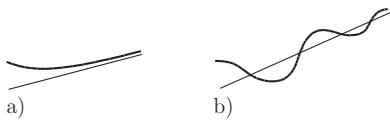

##### 3.6.1.4 Asymptotes of Curves

1. Definition

An asymptote is a straight line to which the curve approaches while it moves away from the origin (Fig. 3.232).

The curve can approach the line from one side (Fig. 3.232a), or it can intersect it again and again (Fig. 3.232b).

  
Figure 3.232

Not every curve which goes infinitely far from the origin (infinite branch of the curve) has an asymptote. For instance the entire part of an improper rational expression is called an asymptotic approximation (see 1.1.7.2, p. 15).

2. Functions Given in Parametric Form $x = x ( t ) , y = y ( t )$

To determine the equation of the asymptote first those values are determined for which $t \to t _ { i }$ yields either $x ( t ) \to \pm \infty { \mathrm { o r } } y ( t ) \to \pm \infty$ (or both).

There are the following cases:

a) $x ( t ) \to \infty$ for $t  t _ { i }$ but $y ( t _ { i } ) = a \neq \infty \colon y = a$ . The asymptote is a horizontal line.

(3.515a)

b) $y ( t ) \to \infty$ for $t  t _ { i }$ but $x ( t _ { i } ) = a \neq \infty \colon x = a$ . The asymptote is a vertical line.

(3.515b)

c) If both y(t) and $x ( t )$ tend to $\pm \infty$ , then the following limits are to be calculated: $k = \operatorname* { l i m } _ { t \to t _ { i } } { \frac { y ( t ) } { x ( t ) } }$ and $b = \operatorname* { l i m } _ { t \to t _ { i } } [ y ( t ) - k x ( t ) ]$ . If both exist, the equation of the asymptote is

$$
y = k x + b .\tag{3.515c}
$$

■ $x = { \frac { m } { \cos t } } , y = n ( \tan t - t ) , t _ { 1 } = { \frac { \pi } { 2 } } , t _ { 2 } = - { \frac { \pi } { 2 } } .$ , etc. Determine the asymptote at $t _ { 1 }$

$$
x ( t _ { 1 } ) = y ( t _ { 1 } ) = \infty , k = \operatorname* { l i m } _ { t \to \pi / 2 } { \frac { n } { m } } ( \sin t - t \cos t ) = { \frac { n } { m } } ,
$$

$$
b ~ = ~ \operatorname* { l i m } _ { t  \pi / 2 } [ n ( \tan t - t ) - { \frac { n } { m } } { \frac { m } { \cos t } } ] ~ = ~ n \operatorname* { l i m } _ { t  \pi / 2 } { \frac { \sin t - t \cos t - 1 } { \cos t } } ~ = ~ - { \frac { n \pi } { 2 } }
$$

(3.515c) gives $y = { \frac { n } { m } } x - { \frac { n \pi } { 2 } }$ . For the second asymptote, etc. one gets similarly $y = - { \frac { n } { m } } x + { \frac { n \pi } { 2 } }$

3. Functions Given in Explicit Form $y = f ( x )$

The vertical asymptotes are at the points of discontinuity where the function $f ( x )$ has an infinite jump (see 2.1.5.3, p. 59); the horizontal and oblique asymptotes have the equation

$$
y = k x + b { \mathrm { ~ w i t h ~ } } k = \operatorname* { l i m } _ { x \to \infty } { \frac { f ( x ) } { x } } , \quad b = \operatorname* { l i m } _ { x \to \infty } [ f ( x ) - k x ] .\tag{3.516}
$$

4. Functions Given in Implicit Polynomial Form $F ( x , y ) = 0$

1. To determine the horizontal and vertical asymptotes one chooses the highest-degree terms with degree m from the polynomial expression in x and y, then one separates them as a function $\varPhi ( x , y )$ and solves, if it is possible, the equation $\varPhi ( x , y ) = 0$ for x and $y \colon$

$$
\varPhi ( x , y ) = 0 \quad \mathrm { y i e l d s } \quad x = \varphi ( y ) , \quad y = \psi ( x ) .\tag{3.517}
$$

The values $y _ { 1 } = a$ for $x \to \infty$ give the horizontal asymptotes $y = a ;$ the values $x _ { 1 } = b$ for $y  \infty$ the vertical ones $x = b ,$ , if the limits exist.

2. To determine the oblique asymptotes the equation of the line $y = k x + b$ is to be substituted into the equation $F ( x , y )$ , then the resulting polynomial is to be ordered according to the powers of x:

$$
F ( x , k x + b ) \equiv f _ { 1 } ( k , b ) x ^ { m } + f _ { 2 } ( k , b ) x ^ { m - 1 } + \cdots .\tag{3.518}
$$

The parameters k and b can be yield, if they exist, from the equations

$$
f _ { 1 } ( k , b ) = 0 , \quad f _ { 2 } ( k , b ) = 0 .\tag{3.519}
$$

$x ^ { 3 } + y ^ { 3 } - 3 a x y = 0$ (Cartesian folium Fig. 2.59, 2.11.3, p. 96). Based on equation $F ( x , k x + b ) \equiv$ $( 1 + k ^ { 3 } ) x ^ { 3 } + 3 ( k ^ { 2 } \bar { b } - k a ) x ^ { 2 } + \cdot \cdot \cdot$ according to (3.519), $f _ { 1 } ( k , b ) = 1 + k ^ { 3 } = 0$ and $\bar { f } _ { 2 } ( k , b ) = \dot { k } ^ { 2 } b - k a \dot { = } 0$ with the solutions $k = - 1 , b = - a$ the equation of the asymptote is $y = - x - a$
