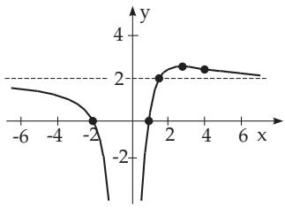
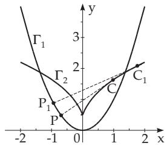
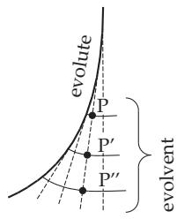

##### 3.6.1.5 General Discussion of a Curve Given by an Equation

Curves given by their equations (3.483)–(3.486) are investigated in order to know their properties and shapes.

1. Construction of a Curve Given by an Explicit Function $y = f ( x )$

a) Determination of the domain (see 2.1.1, p. 48).

b) Determination of the symmetry of the curve with respect to the origin or to the y-axis checking if the function is odd or even (see 2.1.3.4, p. 51).

c) Determination of the behavior of the function at by calculating the limits $\operatorname* { l i m } _ { x \to - \infty } f ( x )$ and $\operatorname* { l i m } _ { x \to + \infty } { f ( x ) }$ (see 2.1.4.7, p. 55).

d) Determination of the points of discontinuity (see 2.1.5.3, p. 59).

e) Determination of the intersection points with the y-axis and with the x-axis calculating f(0) and solving the equation $f ( x ) = 0$

f) Determination of maxima and minima and finding the intervals of monotonicity where the function is increasing or decreasing.

g) Determination of inflection points and the equations of tangents at these points (see 3.6.1.3, p. 249).

With these data the graph of the function can be sketched, and where it is necessary, some values can be calculated to make it more precise.

Sketch the graph of the function $y = { \frac { 2 x ^ { 2 } + 3 x - 4 } { x ^ { 2 } } } ;$

a) The function is defined for all x except $x = 0$

b) There is no symmetry.

c) For $x \to - \infty$ follows $y  2$ , and obviously $y = 2 - 0$ , i.e., approach from below, while $x \to \infty$ also holds $y  2$ , but $y = 2 + 0$ , an approach from above.

d) $x = 0$ is a point of discontinuity such that the function from left and also from right tends to $- \infty ,$ because y is negative for small values of x.

e) Because $f ( 0 ) = - \infty$ holds, there is no intersection point with the y-axis, and from $f ( x ) = 2 x ^ { 2 } +$ $3 \dot { x } - 4 = 0$ the intersection points with the x-axis are at $x _ { 1 } \approx 0 . 8 5$ and $x _ { 2 } \approx - 2 . 3 5$ f) A maximum is at $x = 8 / 3 \approx 2 . 6 6$ and here $y \approx 2 . 5 6$

g) An inflection point is at $x = 4 , y = 2 . 5$ with the slope of the tangent line tan $\alpha = - 1 / 1 6$

h) After sketching the graph of the function based on these data (Fig. 3.233) one can calculate the intersection point of the curve and the asymptote, which is at $x = 4 / 3 \approx 1 . 3 3$ and $y = 2$

2. Construction of a Curve Given by an Implicit Function $F ( x , y ) = 0$

There are no general rules for this case, because depending of the actual form of the function diferent steps can be or cannot be performed. If it is possible, the following steps are recommended:

a) Determination of all the intersection points with the coordinate axes.

b) Determination of the symmetry of the curve, replacing x by x and y by y.

c) Determination of maxima and minima with respect to the x-axis and then interchanging x and y also with respect to the y-axis (see 6.1.5.3, p. 444).

d) Determination ofthe inflection points and the slopes oftangents there (see 3.6.1.3, p. 249).

e) Determination of singular points (see 3.6.1.3, 3., p. 250).

f) Determination of vertices (see 3.6.1.3, 2., p. 250) and the corresponding circles of curvature (see 3.6.1.2, 4., p. 246). It often happens that the curve’s arc can hardly be distinguish from the circular segment of the circle of curvature on a relatively large segment.

g) Determination of the equations of asymptotes (see 3.6.1.4, p. 252) and the position of the curve branches related to the asymptotes.

  
Figure 3.233

  
Figure 3.234

  
Figure 3.235
