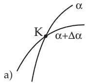
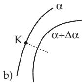
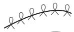
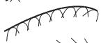
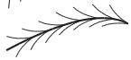
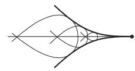

##### 3.6.1.6 Evolutes and Evolvents

1. Evolute

The evolute is a second curve which is the locus of the centers of circles of curvature of the first curve (see 3.6.1.3, 5., p. 248); at the same time it is the envelope of the normals of the first curve (see also

3.6.1.7, p. 255). The parametric form of the evolute can be derived from (3.503) or (3.504) for the center of curvature if $x _ { C }$ and $y _ { C }$ are considered as running coordinates. If it is possible to eliminate the parameter $( x , t \mathrm { o r } \varphi )$ from (3.502), (3.503), (3.504), then the equation of the evolute is obtained in Cartesian coordinates.

Determine the evolute of the parabola $y \ = \ x ^ { 2 } \ ( \mathbf { F i g } . \ 3 . 2 3 4 )$ . From $X \ = \ x - { \frac { 2 x ( 1 + 4 x ^ { 2 } ) } { 2 } } \ =$ $- 4 x ^ { 3 } , \ Y = x ^ { 2 } + { \frac { 1 + 4 x ^ { 2 } } { 2 } } = { \frac { 1 + 6 x ^ { 2 } } { 2 } }$ and considering X and Y as running coordinates the evolute $Y = \frac { 1 } { 2 } + 3 \left( \frac { X } { 4 } \right) ^ { 2 / 3 }$

2. Evolvent or Involute

The evolvent, also called involute, of a curve $\varGamma _ { 2 }$ is a curve $\boldsymbol { { \cal T } } _ { 1 }$ , whose evolute is $\boldsymbol { { \Gamma } } _ { 2 }$ . Here every normal $P C$ of the evolvent is a tangent of the evolute (Fig. 3.234), and the length of arc $C C _ { 1 }$ of the evolute is equal to the increment of the radius of curvature of the evolvent:

$$
\widehat { C C } _ { 1 } = \overline { { P _ { 1 } C } } _ { 1 } - \overline { { P C } } .\tag{3.520}
$$

These properties show that the evolvent $\boldsymbol { { \cal T } } _ { 1 }$ can be regarded as the curve traced by the end of a stretched thread unspooling from $\boldsymbol { { \Gamma } } _ { 2 }$ . A given evolute corresponds to a family of curves, where every curve is determined by the initial length of the thread (Fig. 3.235).

The equation of the evolute is obtained by the integration of a system of diferential equations corresponding to its evolute. For the equation of the evolvent of the circle see 2.14.4, p. 106.

The catenoid is the evolute of the tractrix; the tractrix is the evolvent of the catenoid (see 2.15.1, p. 108).

  
Figure 3.236

a)  
b)  
c)  

  
d)

  
Figure 3.237
