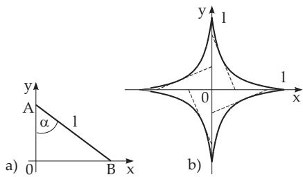

##### 3.6.1.7 Envelope of a Family of Curves

1. Characteristic Point

Consider the one-parameter family of curves with equation

$$
F ( x , y , \alpha ) = 0 .\tag{3.521}
$$

Every two close curves of this family corresponding to the values of parameter α and $\alpha + \Delta \alpha$ have points K ofnearest approach. Such a point is either a point of intersection of the curves $( \alpha )$ and $\left( \alpha + \Delta \alpha \right)$ or a point of the curve (α) whose distance from the curve $( \alpha + \Delta \alpha )$ along the normal is an infinitesimal quantity of higher order than $\Delta \alpha \left( \mathrm { { F i g . 3 . 2 3 6 a , b } } \right)$ . For $\Delta \alpha  0$ the curve $( \alpha + \Delta \alpha )$ tends to the curve (α), where in some cases the point K approaches a limit position, the characteristic point.

2. Geometric Locus of the Characteristic Points of a Family of Curves

Equation (3.521) may represent one or more curves. They are formed by the approaching points or by the boundary points of the family (Fig. 3.237a), or they form an envelope of the family, i.e., a curve which contacts tangentially every curve of the family (Fig. 3.237b). A combination of these two cases is also possible $( \mathbf { F i g . 3 . 2 3 7 c , d } )$

3. Equation of the Envelope

The equation of the envelope can be calculated from (3.521), where α can be eliminated from the following equation system:

$$
F = 0 , \qquad { \frac { \partial F } { \partial \alpha } } = 0 .
$$

Determine the equation of the family of straight lines arising when the ends of a line segment AB with $| A { \tilde { B } } | = l$ are sliding along the coordinate axes (Fig. 3.238a). The equation of the family of curves is ${ \frac { x } { l \sin \alpha } } + { \frac { y } { l \cos \alpha } } = 1$ or $F \equiv x \cos \alpha + y \sin \alpha - l \sin \alpha \cos \alpha = 0 ,$ $\frac { \partial F } { \partial \alpha } = - x \sin \alpha + y \cos \alpha - l \cos ^ { 2 } \alpha + l \sin ^ { 2 } \alpha = 0 .$ Eliminating α gives $x ^ { 2 / 3 } + y ^ { 2 / 3 } = l ^ { 2 / 3 }$ as an en velope, which is an astroid (Fig. 3.238b, see also p. 103).

(3.522)

  
Figure 3.238
