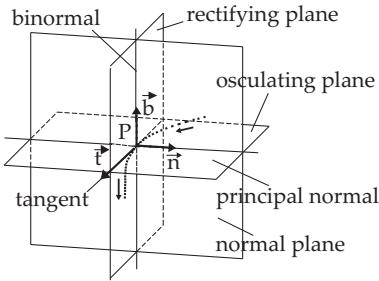
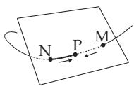
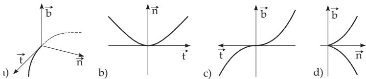
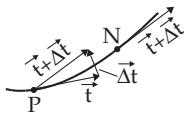
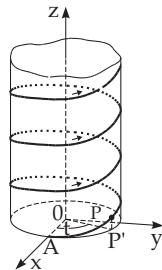
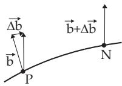

#### 3.6.2 Space Curves

##### 3.6.2.1 Ways to Define a Space Curve

1. Coordinate Equations

To define a space curve there are the following possibilities:

a) Intersection of Two Surfaces: $F ( x , y , z ) = 0 , \quad \varPhi ( x , y , z ) = 0 .$

(3.523)

b) Parametric Form: $\begin{array} { r } { x = x ( t ) , \quad y = y ( t ) , \quad z = z ( t ) . } \end{array}$

(3.524)

with t as an arbitrary parameter; mostly t = x, y or z are used.

c) Parametric Form: $\begin{array} { r } { x = x ( s ) , \quad y = y ( s ) , \quad z = z ( s ) , } \end{array}$

(3.525a)

with the arc length s between a fixed point A and the running point P as the parameter:

$$
s = \int _ { t _ { 0 } } ^ { t } { \sqrt { \left( { \frac { d x } { d t } } \right) ^ { 2 } + \left( { \frac { d y } { d t } } \right) ^ { 2 } + \left( { \frac { d z } { d t } } \right) ^ { 2 } } } d t .\tag{3.525b}
$$

2. Vector Equations

With r as radius vector of an arbitrary point of the curve (see 3.5.1.1, 6., p. 182) the equation (3.524) can be written in the form

$$
{ \vec { \mathbf { r } } } = { \vec { \mathbf { r } } } ( t ) , \quad { \mathrm { w h e r e } } \quad { \vec { \mathbf { r } } } ( t ) = x ( t ) { \vec { \mathbf { i } } } + y ( t ) { \vec { \mathbf { j } } } + z ( t ) { \vec { \mathbf { k } } } ,\tag{3.526}
$$

and (3.525a) in the form

$$
\vec { \bf r } = \vec { \bf r } ( s ) , \quad \mathrm { w h e r e } \quad \vec { \bf r } ( s ) = x ( s ) \vec { \bf i } + y ( s ) \vec { \bf j } + z ( s ) \vec { \bf k } .\tag{3.527}
$$

3. Positive Direction

This is the direction of increasing parameter t for a curve given in the form (3.524) and (3.526); for (3.525a) and (3.527) it is the direction in which the arc length increases.

##### 3.6.2.2 Moving Trihedral

1. Definitions

At every point P of a space curve can be defined three lines and three planes, apart from singular points.   
They intersect each other at the point P, and they are perpendicular to each other (Fig.3.239).

  
Figure 3.239

1. Tangent is the limiting position of the secants PN for $N  { \overset { \sim } { P } }$ (Fig.3.220), p. 244.

2. Normal Plane is a plane perpendicular to the tangent (3.239). Every line passing through the point P and contained by this plane is called a normal of the curve at the point P.

3. Osculating Plane is the limiting position of the planes passing through three neighboring points M, P and N, for $\bar { N } \to \breve { P }$ and $\bar { M }  P$ (Fig.3.240). The tangent line is contained by the osculating plane.

4. Principal Normal is the intersection line of the normal and the osculating plane, i.e., it is the normal contained by the osculating plane.

5. Binormal is the line perpendicular to the osculating plane through the point P.

  
Figure 3.240

6. Rectifying Plane is the plane spanned by the tangent and binormal lines.

The positive directions on the lines (1.), (4.) and (5.) are defined as follows: 7. Moving trihedral The positive directions on the lines tangent, principal normal and binormal are defined as follows:

a) On the tangent line it is given by the positive direction of the curve; the unit tangent vector t has this direction.

b) On the principal normal it is given by the sign of the curvature of the curve, and given by the unit normal vector n.

c) On the binormal it is defined by the unit vector

$$
\vec { \mathbf { b } } = \vec { \mathbf { t } } \times \vec { \mathbf { n } } ,\tag{3.528}
$$

where the three vectors $\vec { \bf t } ,$ n, and $\vec { \mathbf { b } }$ form a right-handed rectangular coordinate system, which is called the moving trihedral.

2. Position of the Curve Related to the Moving Trihedral

For the usual points of the curve the space curve is on one side of the rectifying plane at the point P, and intersects both the normal and osculating planes (Fig.3.241a). The projections of a small segment of the curve at the point P on the three planes have approximately the following shapes:

1. On the osculating plane it is similar to a quadratic parabola (Fig.3.241b).

2. On the rectifying plane it is similar to a cubic parabola (Fig.3.241c).

3. On the normal plane it is similar to a semi cubical parabola (Fig.3.241d).

If the curvature or the torsion of the curve are equal to zero at P or if P is a singular point, i.e., if $x ^ { \prime } ( t ) = y ^ { \prime } ( t ) = z ^ { \prime } ( t ) = 0$ hold, then the curve may have a diferent shape.

  
Figure 3.241

3. Equations of the Elements of the Moving Trihedral

1. The Curve is Defined in the Form (3.523) For the tangent see (3.529), for the normal plane see (3.530):

$$
{ \begin{array} { r } { { \frac { X - x } { \left| { \frac { \partial F } { \partial y } } \ { \frac { \partial F } { \partial z } } \right| } } = { \frac { Y - y } { \left| { \frac { \partial F } { \partial z } } \ { \frac { \partial F } { \partial x } } \right| } } = { \frac { Z - z } { \left| { \frac { \partial F } { \partial x } } \ { \frac { \partial F } { \partial y } } \right| } } . } \\ { { \frac { \partial \phi } { \partial y } } \ { \frac { \partial \phi } { \partial z } } { \bigg | } \ \left| { \frac { \partial \phi } { \partial z } } \ { \frac { \partial \phi } { \partial x } } \right| \ \left| { \frac { \partial \phi } { \partial x } } \ { \frac { \partial \phi } { \partial y } } \right| } \end{array} }\tag{3.529}
$$

$$
\left| { \begin{array} { l l l } { X - x } & { Y - y } & { Z - z } \\ { { \cfrac { \partial F } { \partial x } } } & { { \cfrac { \partial F } { \partial y } } } & { { \cfrac { \partial F } { \partial z } } } \\ { { \cfrac { \partial \phi } { \partial x } } } & { { \cfrac { \partial \phi } { \partial y } } } & { { \cfrac { \partial \phi } { \partial z } } } \end{array} } \right| = 0 .\tag{3.530}
$$

Here x, y, z are the coordinates of the point P of the curve and $X , Y , Z$ are the running coordinates of the tangent or the normal plane; the partial derivatives belong to the point $P$

2. The Curve is Defined in the Form (3.524), (3.526) In Table 3.27 the coordinate and vector equations belonging to the point $P$ are given with $x , y , z$ and also with r. The running coordinates and the radius vector of the running point are denoted by X, Y, Z and $\vec { \bf R }$ . The derivatives with respect to the parameter t refer to the point $P _ { \cdot }$

3. The Curve is Defined in the Form (3.525a, 3.527) If the parameter is the arc length s, for the tangent and binormal, and for the normal and osculating plane the same equations are valid as in case 2, just t must be replaced by s. The equations of the principal normal and the rectifying plane will be simpler (Table 3.28).

##### 3.6.2.3 Curvature and Torsion

1. Curvature of a Curve and Radius of Curvature

The curvature of a curve at the point $P$ is a measure which describes the deviation of the curve from a straight line in the very close neighborhood of

this point. The exact definition is by the help of the tangent vector ${ \vec { \mathbf { t } } } = { \frac { d { \vec { \mathbf { r } } } } { d s } }$ (see Fig.3.242):

$$
K = \underbrace { \operatorname* { l i m } _ { } } _ { P N  0 } \frac { \Delta { \vec { \mathbf { t } } } } { P N } = \frac { d { \vec { \mathbf { t } } } } { d s } .\tag{3.531}
$$

Figure 3.242

1. Radius of Curvature The radius of curvature is the reciprocal value of the absolute value of the curvature:

$$
\rho = { \frac { 1 } { | K | } } .\tag{3.532}
$$

2. Formulas to calculate K and $\rho$ a) If the curve is defined in the form (3.525a):

$$
| K | = \left| { \frac { d ^ { 2 } { \vec { \mathbf { r } } } } { d s ^ { 2 } } } \right| = { \sqrt { x ^ { \prime \prime 2 } + y ^ { \prime \prime 2 } + z ^ { \prime \prime 2 } } } ,\tag{3.533}
$$

where the derivatives are with respect to s.

b) If the curve is defined in the form (3.524):

$$
K ^ { 2 } = { \frac { \left( { \frac { d \vec { \mathbf { r } } } { d t } } \right) ^ { 2 } \left( { \frac { d ^ { 2 } \vec { \mathbf { r } } } { d t ^ { 2 } } } \right) ^ { 2 } - \left( { \frac { d \vec { \mathbf { r } } } { d t } } { \frac { d ^ { 2 } \vec { \mathbf { r } } } { d t ^ { 2 } } } \right) ^ { 2 } } { \left| \left( { \frac { d \vec { \mathbf { r } } } { d t } } \right) ^ { 2 } \right| ^ { 3 } } } = { \frac { ( x ^ { \prime 2 } + y ^ { \prime 2 } + z ^ { \prime 2 } ) ( x ^ { \prime \prime 2 } + y ^ { \prime \prime 2 } + z ^ { \prime \prime 2 } ) - ( x ^ { \prime } x ^ { \prime \prime } + y ^ { \prime } y ^ { \prime \prime } + z ^ { \prime } z ^ { \prime \prime } ) ^ { 2 } } { ( x ^ { \prime 2 } + y ^ { \prime 2 } + z ^ { \prime 2 } ) ^ { 3 } } } .\tag{3.534}
$$

The derivatives are calculated here with respect to t.

Table 3.27 Vector and coordinate equations of accompanying configurations of a space curve
<table><tr><td>Vector equation</td><td colspan="3">Coordinate equation</td></tr><tr><td colspan="3">Tangent:  ${ \vec { \mathbf { R } } } = { \vec { \mathbf { r } } } + \lambda { \frac { d { \vec { \mathbf { r } } } } { d t } }$   ${ \frac { X - x } { x ^ { \prime } } } = { \frac { Y - y } { y ^ { \prime } } } = { \frac { Z - z } { z ^ { \prime } } }$ </td></tr><tr><td colspan="3">Normal plane:  $( { \vec { \bf R } } - { \vec { \bf r } } ) { \frac { d { \vec { \bf r } } } { d t } } = 0$ </td></tr><tr><td colspan="3"> $x ^ { \prime } ( X - x ) + y ^ { \prime } ( Y - y ) + z ^ { \prime } ( Z - z ) = 0$ </td></tr><tr><td colspan="3">Osculating plane:  $( { \vec { \bf R } } - { \vec { \bf r } } ) { \frac { d { \vec { \bf r } } } { d t } } { \frac { d ^ { 2 } { \vec { \bf r } } } { d t ^ { 2 } } } = 0 ^ { 1 }$   $\begin{array} { r l } {  { | \begin{array} { c c } { X - x \ Y - y \ Z - z } \\ { x ^ { \prime } } & { y ^ { \prime } } \\ { x ^ { \prime \prime } } & { y ^ { \prime \prime } } \end{array} | = 0 } } \end{array}$ </td></tr><tr><td colspan="3">Binormal:  ${ \vec { \bf R } } = { \vec { \bf r } } + \lambda \left( { \frac { d { \vec { \bf r } } } { d t } } \times { \frac { d ^ { 2 } { \vec { \bf r } } } { d t ^ { 2 } } } \right)$ </td></tr><tr><td colspan="3"> ${ \frac { X - x } { | { \boldsymbol { y } } ^ { \prime } \ { \boldsymbol { z } } ^ { \prime } | } } = { \frac { Y - y } { | { \boldsymbol { z } } ^ { \prime } \ { \boldsymbol { x } } ^ { \prime } | } } = { \frac { Z - z } { | { \boldsymbol { x } } ^ { \prime } \ { \boldsymbol { y } } ^ { \prime } | } }$  Rectifying plane:</td></tr><tr><td colspan="3"> $( \vec { \bf R } - \vec { \bf r } ) \frac { d \vec { \bf r } } { d t } \left( \frac { d \vec { \bf r } } { d t } \times \frac { d ^ { 2 } \vec { \bf r } } { d t ^ { 2 } } \right) = 0 ^ { 1 }$   $\left| \begin{array} { c c c c } { { X - x } } & { { Y - y } } & { { Z - z } } \\ { { x ^ { \prime } } } & { { y ^ { \prime } } } & { { z ^ { \prime } } } \\ { { l } } & { { m } } & { { n } } \end{array} \right| = 0 ,$  with  $l = y ^ { \prime } z ^ { \prime \prime } - y ^ { \prime \prime } z ^ { \prime } ,$ </td></tr><tr><td colspan="3">m = z′x&quot; − z&quot;x′,  $n = x ^ { \prime } y ^ { \prime \prime } - x ^ { \prime \prime } y ^ { \prime }$  Principal normal:</td></tr><tr><td colspan="3"> ${ \vec { \mathbf { R } } } = { \vec { \mathbf { r } } } + \lambda { \frac { d { \vec { \mathbf { r } } } } { d t } } \times \left( { \frac { d { \vec { \mathbf { r } } } } { d t } } \times { \frac { d ^ { 2 } { \vec { \mathbf { r } } } } { d t ^ { 2 } } } \right)$   $ \frac { X - x } { | { \begin{array} { l } { y ^ { \prime } } { z ^ { \prime } } } } = { \frac { Y - y } { | { z ^ { \prime } } { x ^ { \prime } } | } } = { \frac { Z - z } { | { x ^ { \prime } } { y ^ { \prime } } | } } \end{array}$ </td></tr><tr><td colspan="3">r position vector of the space curve, R position vector of the accomp. configuration 1 For the mixed product of three vectors see 3.5.1.6, p. 185</td></tr></table>

Tabelle 3.28 Vector and coordinate equations of accompanying configurations as functions of the arc length
<table><tr><td rowspan=1 colspan=1>Element of trihedral</td><td rowspan=1 colspan=1>Vector equation</td><td rowspan=1 colspan=1>Coordinate equation</td></tr><tr><td rowspan=1 colspan=1>Principal normalRectifying plane</td><td rowspan=1 colspan=1> $\vec { \bf R } = \vec { \bf r } + \lambda \frac { d ^ { 2 } \vec { \bf r } } { d s ^ { 2 } }$  $( \vec { \bf R } - \vec { \bf r } ) \frac { d ^ { 2 } \vec { \bf r } } { d s ^ { 2 } } = 0$ </td><td rowspan=1 colspan=1> ${ \overline { { \frac { X - x } { x ^ { \prime \prime } } } } } = { \frac { Y - y } { y ^ { \prime \prime } } } = { \frac { Z - z } { z ^ { \prime \prime } } }$  $x ^ { \prime \prime } ( X - x ) + y ^ { \prime \prime } ( Y - y ) + z ^ { \prime \prime } ( Z - z ) = 0$ </td></tr><tr><td rowspan=1 colspan=3>r position vector of the space curve, R position vector of the accomp. configuration</td></tr></table>

3. Helix The equations

$$
x = a \cos t , \quad y = a \sin t , \quad z = b t \quad ( a > 0 , b > 0 )\tag{3.535}
$$

describe a so-called helix (Fig.3.243) as a right screw. If the observer is looking into the positive direction of the z-axis, which is at the same time the axis of the screw, then the screw climbs in a counter-clockwise direction. A helix winding itself in the opposite orientation is called a left screw.

Determine the curvature of the helix (3.535). The parameter t is to be replaced by $s ~ = ~ t \sqrt { a ^ { 2 } + b ^ { 2 } }$ . Then holds $x \ = \ a \cos { \frac { s } { \sqrt { a ^ { 2 } + b ^ { 2 } } } } , \ y \ =$ $a \sin { \frac { s } { \sqrt { a ^ { 2 } + b ^ { 2 } } } } , z = { \frac { b s } { \sqrt { a ^ { 2 } + b ^ { 2 } } } }$ , and according to (3.533), $K = { \frac { a } { a ^ { 2 } + b ^ { 2 } } } , \rho =$ ${ \frac { a ^ { 2 } + b ^ { 2 } } { a } } $ . Both quantities K and $\rho$ are constants.

  
Figure 3.243

Another method, without the parameter transformation in (3.534), produces the same result.

2. Torsion of a Curve and Radius of the Torsion Circe

The torsion of a curve at the point P is a measure which describes the deviation of the curve from a plane curve in the very close neighborhood of this point. The exact definition by the help of the binormal vector b (3.528), p. 257 (see also Fig.3.244) is:

$$
T = \underbrace { \operatorname* { l i m } _ { } } _ { P N  0 } \frac { \Delta \vec { \mathbf { b } } } { \widehat { P N } } = \frac { d \vec { \mathbf { b } } } { d s } .
$$

The radius oftorsion is

$$
\tau = { \frac { 1 } { | T | } } .\tag{3.536}
$$

(3.537)

Figure 3.244

1. Formulas for Calculating T and $\tau$ a) If the curve is defined in the form (3.525a):

$$
T = \rho ^ { 2 } \left( \frac { d \vec { \bf r } } { d s } \frac { d ^ { 2 } \vec { \bf r } } { d s ^ { 2 } } \frac { d ^ { 3 } \vec { \bf r } } { d s ^ { 3 } } \right) ^ { * } = \frac { \left| x ^ { \prime } y ^ { \prime } z ^ { \prime \prime } \right| } { \left( x ^ { \prime \prime 2 } + y ^ { \prime \prime 2 } + z ^ { \prime \prime 2 } \right) } ,\tag{3.538}
$$

where the derivatives are taken with respect to s. b) If the curve is defined in the form (3.524):

$$
T = \rho ^ { 2 } { \frac { { \frac { d { \vec { \mathbf { r } } } } { d t } } { \frac { d ^ { 2 } { \vec { \mathbf { r } } } } { d t ^ { 2 } } } { \frac { d ^ { 3 } { \vec { \mathbf { r } } } } { d t ^ { 3 } } } } { \left| \left( { \frac { d { \vec { \mathbf { r } } } } { d t } } \right) ^ { 2 } \right| ^ { 3 } } } \ = \rho ^ { 2 } { \frac { \left| x ^ { \prime \prime } \ y ^ { \prime \prime } \ z ^ { \prime \prime } \right| } { ( x ^ { \prime \prime } + y ^ { \prime \prime } + z ^ { \prime 2 } ) ^ { 3 } } } ,\tag{3.539}
$$

where $\rho$ should be calculated by (3.532) and (3.533).

The torsion calculated by (3.538), (3.539) can be positive or negative. In the case $T > 0$ an observer standing on the principal normal parallel to the binormal sees that the curve has a right turn; in the case $T < 0$ it has a left turn.

The torsion of a helix is constant. With the notation R for the right screw and L for the left screw

the torsion is

$$
{ \cal T } _ { R } = \left( { \frac { a ^ { 2 } + b ^ { 2 } } { a } } \right) ^ { 2 } { \frac { \left| - a \sin t ~ a \cos t ~ b \right| } { \left[ ( - a \sin t ) ^ { 2 } + ( a \cos t ) ^ { 2 } + b ^ { 2 } \right] ^ { 3 } } } = { \frac { b } { a ^ { 2 } + b ^ { 2 } } } , \quad \tau = { \frac { a ^ { 2 } + b ^ { 2 } } { b } } ; \quad { \cal T } _ { L } = - { \frac { b } { a ^ { 2 } + b ^ { 2 } } } .
$$

3. Frenet Formulas

The derivatives of the vectors $\vec { \bf t } , \vec { \bf n } .$ and $\vec { \mathbf { b } }$ can be expressed by the Frenet formulas:

$$
\frac { d \vec { \bf t } } { d s } = \frac { \vec { \bf n } } { \rho } , \quad \frac { d \vec { \bf n } } { d s } = - \frac { \vec { \bf t } } { \rho } + \frac { \vec { \bf b } } { \tau } , \quad \frac { d \vec { \bf b } } { d s } = - \frac { \vec { \bf n } } { \tau } .\tag{3.540}
$$

Here $\rho$ is the radius of curvature, and $\tau$ is the radius of torsion.

4. Darboux Vector

The Frenet formulas (3.540) can be represented in the clearly arranged form (Darboux formulas)

$$
\frac { d \vec { \mathbf { t } } } { d s } = \vec { \mathbf { d } } \times \vec { \mathbf { t } } , \quad \frac { d \vec { \mathbf { n } } } { d s } = \vec { \mathbf { d } } \times \vec { \mathbf { n } } , \quad \frac { d \vec { \mathbf { b } } } { d s } = \vec { \mathbf { d } } \times \vec { \mathbf { b } } .\tag{3.541}
$$

Here $\vec { \mathbf { d } }$ is the Darboux vector, which has the form

$$
\vec { \mathbf { d } } = \frac { 1 } { \tau } \vec { \mathbf { t } } + \frac { 1 } { \rho } \vec { \mathbf { b } } .\tag{3.542}
$$

Remarks:

1. With the help of the Darboux vector the Frenet formulas can be interpreted in the sense of kinematics (see [3.4]).

2. The modulus of the Darboux vector equals the so-called total curvator λ of a space curve:

$$
\lambda = \sqrt { \frac { 1 } { \rho ^ { 2 } } + \frac { 1 } { \tau ^ { 2 } } } = | \vec { \bf d } | .\tag{3.543}
$$
