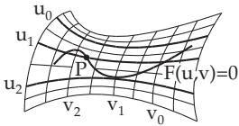
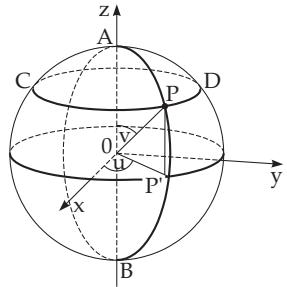
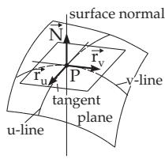
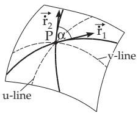
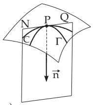
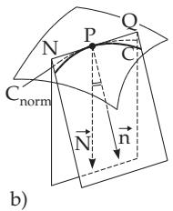
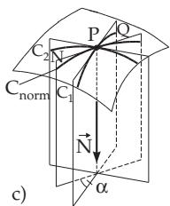
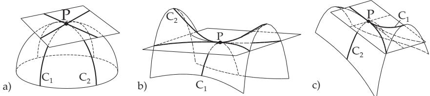
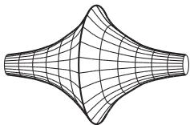

#### 3.6.3 Surfaces

##### 3.6.3.1 Ways to Define a Surface

1. Equation of a Surface

Surfaces can be defined in diferent ways:

a) Implicit Form : $F ( x , y , z ) = 0 .$

(3.544)

b) Explicit Form : z = f(x, y).

(3.545)

$$
\mathrm { ~ c ) ~ { \cal ~ P } a r a m e t r i c { \cal F } o r m : ~ } x = x ( u , v ) , \quad y = y ( u , v ) , \quad z = z ( u , v ) .\tag{3.546}
$$

d) Vector Form :

$$
\vec { \mathbf { r } } = \vec { \mathbf { r } } ( u , v ) \quad \mathrm { w i t h } \quad \vec { \mathbf { r } } = x ( u , v ) \vec { \mathbf { i } } + y ( u , v ) \vec { \mathbf { j } } + z ( u , v ) \vec { \mathbf { k } } .\tag{3.547}
$$

Running the parameters u and v over all allowed values gives the coordinates and the radius vectors of all points of the surface from (3.546) and (3.547). The elimination of the parameters u and v from the parametric form (3.546) (if possible) yields the implicit form (3.544). The explicit form (3.545) is a special case of the parametric form with $u = x$ and $v = y$

The equation of the sphere in Cartesian coordinates, parametric form, and vector form (Fig. 3.246):

$$
x ^ { 2 } + y ^ { 2 } + z ^ { 2 } - a ^ { 2 } = 0 ; \quad ( 3 . 5 4 8 \mathrm { a } ) \qquad x = a \cos u \sin v , y = a \sin u \sin v , z = a \cos v ;\tag{3.548b}
$$

$$
\vec { \bf r } = a ( \cos u \sin v \vec { \bf i } + \sin u \sin v \vec { \bf j } + \cos v \vec { \bf k } ) .\tag{3.548c}
$$

2. Curvilinear Coordinates on a Surface

If a surface is given in the form (3.546) or (3.547), and the values of the parameter u can be changed while the other parameter $v = v _ { 0 }$ is fixed, then the points $\vec { \bf r } ( x , y , z )$ describe a curve $\vec { \bf r } = \vec { \bf r } ( u , v _ { 0 } )$ on the surface. Substituting for v diferent but fixed values $v = v _ { 1 } , v = v _ { 2 } , \ldots , v = v _ { n }$ one after the other, gives a family of curves on the surface. When moving along a curve with $v =$ const only u is changing, this curve is called the u-line $\left( \mathbf { F i g . 3 . 2 4 5 } \right)$ . Analogously one gets another family of curves, the $v { - } l i n e s ,$ by varying v and keeping u = const fixed with $u _ { 1 } , u _ { 2 } , \ldots , u _ { n }$ . In this way a net of coordinate lines is defined on the surface (3.546), where the two fixed numbers $u = u _ { i }$ and $v = v _ { k }$ are the curvilinear or Gauss coordinates of the point P on the surface.

If a surface is given in the form (3.545), the coordinate lines are the intersection curves of the surface with the planes x = const and y = const. With equations in implicit form $F ( u , v ) = 0$ or with the parametric equations $u = u ( t )$ and $v = v ( t )$ of these coordinates, curves on the surfaces can be defined.

In the parametric equations of the sphere $\mathrm { ( 3 . 5 4 8 b , c ) }$ u means the geographical longitude of a point $P ,$ and v means its polar distance. The v lines are here the meridians ${ \check { A } } { \check { P } } { \boldsymbol { B } } ;$ the u lines are the parallel circles CPD (Fig. 3.246).

##### 3.6.3.2 Tangent Plane and Surface Normal

1. Definitions

1. Tangent Plane The precise general mathematical definition of the tangent plane is rather complicated, so here the investigation is to be restricted to the case, when the surface is defined by two parameters. Suppose, for a neighborhood of the point $P ( x , y , z )$ , the mapping $( u , v ) \to { \vec { \mathbf { r } } } ( u , v )$ is invertible, the partial derivatives $\vec { \mathbf { r } } _ { u } = \frac { \partial \vec { \mathbf { r } } } { \partial u }$ and $\vec { \mathbf { r } } _ { v } = \frac { \partial \vec { \mathbf { r } } } { \partial v }$ are continuous, and not parallel to each other. Then $P ( x , y , z )$ is called a regular point of the surface. If P is regular, then the tangents of all curves passing through $P _ { \cdot }$ and having a tangent here, are in the same plane, and this plane is called the tangent plane of the surface at P. If this happens, the partial derivatives $\vec { \mathbf { r } } _ { u } , \vec { \mathbf { r } } _ { v }$ are parallel (or zero) only for certain parametrization of the surface. If they are parallel for every parametrization, the point is called a singular point (see 3., p. 263).

  
Figure 3.245  
Figure 3.246

  
Figure 3.247

2. Surface Normal The line perpendicular to the tangent plane going through the point P is called surface normal at the point P (Fig. 3.247).

3. Normal Vector The tangent plane is spanned by two vectors, by the tangent vectors

$$
\vec { \bf r } _ { u } = \frac { \partial \vec { \bf r } } { \partial u } , \quad \vec { \bf r } _ { v } = \frac { \partial \vec { \bf r } } { \partial v }\tag{3.549a}
$$

of the u- and v-lines. The vector product of the tangent vectors $\vec { \mathbf { r } } _ { u } \times \vec { \mathbf { r } } _ { v }$ is a vector in the direction of the surface normal. Its unit vector

$$
\vec { \bf N } _ { 0 } = \frac { \vec { \bf r } _ { u } \times \vec { \bf r } _ { v } } { \vert \vec { \bf r } _ { u } \times \vec { \bf r } _ { v } \vert }\tag{3.549b}
$$

is called the normal vector. Its direction to one or other side of the surface depends on which variable is the first and which one is the second coordinate among u and v.

2. Equations of the Tangent Plane and the Surface Normal (see Table 3.29)

A: For the sphere with equation (3.548a) is valid:

a) as tangent plane: $2 x ( X - x ) + 2 y ( Y - y ) + 2 z ( Z - z ) = 0 { \mathrm { ~ o r ~ } } x X + y Y + z Z - a ^ { 2 } = 0 ,$

(3.550a)

b) as surface normal: ${ \frac { X - x } { 2 x } } = { \frac { Y - y } { 2 y } } = { \frac { Z - z } { 2 z } } { \mathrm { ~ o r ~ } } { \frac { X } { x } } = { \frac { Y } { y } } = { \frac { Z } { z } } .$

(3.550b)

B: For the sphere with equation (3.548b) is valid:

a) as tangent plane: X cos u sin v + Y sin u sin v + Z cos v = a,

(3.550c)

X Y Z b) as surface normal: cos u sin v sin u sin v cos v

(3.550d)

3. Singular Points of the Surface

If for a point with coordinates $x = x _ { 1 } , y = y _ { 1 } , z = z _ { 1 }$ of the surface with equation (3.544) all the equalities

$$
\frac { \partial F } { \partial x } = 0 , \frac { \partial F } { \partial y } = 0 , \frac { \partial F } { \partial z } = 0 , F ( x , y , z ) = 0\tag{3.551}
$$

are fulfilled, i.e., if every first-order derivative is zero at the point $P ( x _ { 1 } , y _ { 1 } , z _ { 1 } )$ , then this point is called a singular point. All tangents going through here do not form a plane, but a cone of second order with the equation

$$
\begin{array} { c } { { \displaystyle { \frac { \partial ^ { 2 } F } { \partial x ^ { 2 } } ( X - x _ { 1 } ) ^ { 2 } + \frac { \partial ^ { 2 } F } { \partial y ^ { 2 } } ( Y - y _ { 1 } ) ^ { 2 } + \frac { \partial ^ { 2 } F } { \partial z ^ { 2 } } ( Z - z _ { 1 } ) ^ { 2 } + 2 \frac { \partial ^ { 2 } F } { \partial x \partial y } ( X - x _ { 1 } ) ( Y - y _ { 1 } ) } } } \\ { { + \ 2 \frac { \partial ^ { 2 } F } { \partial y \partial z } ( Y - y _ { 1 } ) ( Z - z _ { 1 } ) + 2 \frac { \partial ^ { 2 } F } { \partial z \partial x } ( Z - z _ { 1 } ) ( X - x _ { 1 } ) = 0 , } } \end{array}\tag{3.552}
$$

where the derivatives belong to the point $P ( x _ { 1 } , y _ { 1 } , z _ { 1 } )$ . If also the second derivatives are equal to zero at this point, then there is a more complicated type of singularity. Then the tangents form a cone of third or even higher order.

##### 3.6.3.3 Line Elements of a Surface

1. Diferential of Arc

Consider a surface given in the form (3.546) or (3.547). Let $P ( u , v )$ an arbitrary point and $N ( u + d u , v +$

dv) another one close to $P ,$ both on the surface. The arclength of the arc segment $\widehat { P N }$ on the surface can be approximately calculated by the diferential of an arc or the line element of the surface with the formula

$$
d s ^ { 2 } = E d u ^ { 2 } + 2 F d u d v + G d v ^ { 2 } ,\tag{3.553a}
$$

where the three coeficients

$$
E = { \vec { \mathbf { r } } } _ { u } ^ { 2 } = \left( { \frac { \partial x } { \partial u } } \right) ^ { 2 } + \left( { \frac { \partial y } { \partial u } } \right) ^ { 2 } + \left( { \frac { \partial z } { \partial u } } \right) ^ { 2 } , \quad F = { \vec { \mathbf { r } } } _ { u } { \vec { \mathbf { r } } } _ { v } = { \frac { \partial x } { \partial u } } { \frac { \partial x } { \partial v } } + { \frac { \partial y } { \partial u } } { \frac { \partial y } { \partial v } } + { \frac { \partial z } { \partial u } } { \frac { \partial z } { \partial v } } ,
$$

$$
G = { \vec { \mathbf { r } } } _ { v } ^ { 2 } = \left( { \frac { \partial x } { \partial v } } \right) ^ { 2 } + \left( { \frac { \partial y } { \partial v } } \right) ^ { 2 } + \left( { \frac { \partial z } { \partial v } } \right) ^ { 2 }\tag{3.553b}
$$

are calculated at the point $P .$ . The right-hand side (3.553a) is called the first quadratic fundamental form ofthe surface.

A: For the sphere given in the form (3.548c) clearly

$$
E = a ^ { 2 } \sin ^ { 2 } v , \quad F = 0 , \quad G = a ^ { 2 } , \quad d s ^ { 2 } = a ^ { 2 } ( s i n ^ { 2 } v d u ^ { 2 } + d v ^ { 2 } ) .\tag{3.554}
$$

B: For a surface given in the form (3.545) clearly

$$
E = 1 + p ^ { 2 } , \quad F = p q , \quad G = 1 + q ^ { 2 } \quad { \mathrm { w i t h } } \quad p = { \frac { \partial z } { \partial x } } , \quad q = { \frac { \partial z } { \partial y } } .\tag{3.555}
$$

Table 3.29 Equations of the tangent plane and surface normal

$$
\overline { { { \frac { \partial F } { \partial x } } ( X - x ) + { \frac { \partial F } { \partial y } } ( Y - y ) } }
$$

$$
+ \frac { \partial F } { \partial z } ( Z - z ) = 0
$$

$$
{ \frac { X - x } { \partial F } } = { \frac { Y - y } { \frac { \partial F } { \partial y } } } = { \frac { Z - z } { \frac { \partial F } { \partial z } } }\tag{3.545}
$$

$$
Z - z = p ( X - x ) + q ( Y - y )
$$

$$
{ \frac { X - x } { p } } = { \frac { Y - y } { q } } = { \frac { Z - z } { - 1 } }\tag{3.546}
$$

$$
\left| \begin{array} { l l l } { { X - x } } & { { Y - y } } & { { Z - z } } \\ { { { \cfrac { \partial x } { \partial u } } } } & { { { \cfrac { \partial y } { \partial u } } } } & { { { \cfrac { \partial z } { \partial u } } } } \\ { { { \cfrac { \partial x } { \partial v } } } } & { { { \cfrac { \partial y } { \partial v } } } } & { { { \cfrac { \partial z } { \partial v } } } } \end{array} \right| = 0
$$

$$
{ \begin{array} { r } { { \frac { X - x } { \left| { \frac { \partial y } { \partial u } } { \frac { \partial z } { \partial u } } \right| } } = { \frac { Y - y } { \left| { \frac { \partial z } { \partial u } } { \frac { \partial x } { \partial u } } \right| } } = { \frac { Z - z } { \left| { \frac { \partial x } { \partial u } } { \frac { \partial y } { \partial u } } \right| } } } \\ { \left| { \frac { \partial y } { \partial v } } ~ { \frac { \partial z } { \partial v } } \right| } \end{array} }\tag{3.547}
$$

$$
( \vec { \bf R } - \vec { \bf r } ) \vec { \bf r _ { 1 } } \vec { \bf r _ { 2 } } = 0 ^ { * 1 } )
$$

$$
\vec { \bf R } = \vec { \bf r } + \lambda ( \vec { \bf r _ { 1 } } \times \vec { \bf r _ { 2 } } )
$$

$$
\mathrm { o r } \quad ( \vec { \bf R } - \vec { \bf r } ) \vec { \bf N } = 0
$$

$$
\mathrm { o r } \quad \vec { \bf R } = \vec { \bf r } + \lambda \vec { \bf N }
$$

In this table $x , y , z$ and r are the coordinates and radius vector of the points P of the curve; $X , Y , Z$ and $\vec { \bf R }$ are the running coordinates and radius vectors of the points of the tangent plane and surface normal in the point $P ;$ furthermore $p = \frac { \partial z } { \partial x } , \quad q = \frac { \partial z } { \partial y }$ and $\vec { \bf N }$ is the normal vector. Besides $\vec { \bf r _ { 1 } } = \frac { \partial \vec { \bf r } } { \partial u } \mathrm { ~ a n d ~ } \vec { \bf r _ { 2 } } = \frac { \partial \vec { \bf r } } { \partial v } ; p = \frac { \partial z } { \partial x } , q = \frac { \partial z } { \partial y }$

$^ { 1 } \mathrm { F o r }$ the mixed product of three vectors see 3.5.1.6, 2., p. 185

2. Measurement on the Surface

1. The Arclength of a surface curve $u = u ( t ) , v = v ( t )$ for $t _ { 0 } \leq t \leq t _ { 1 }$ is calculated by the formula

$$
L = \int _ { t _ { 0 } } ^ { t _ { 1 } } d s = \int _ { t _ { 0 } } ^ { t _ { 1 } } { \sqrt { E \left( { \frac { d u } { d t } } \right) ^ { 2 } + 2 F { \frac { d u } { d t } } { \frac { d v } { d t } } + G \left( { \frac { d v } { d t } } \right) ^ { 2 } } } d t .\tag{3.556}
$$

2. The Angle Between Two Curves $\vec { \bf r } _ { 1 } = \vec { \bf r } ( u _ { 1 } ( t ) , v _ { 1 } ( t ) )$ and $\vec { \bf r } _ { 2 } =$ $\vec { \bf r } ( u _ { 2 } ( t ) , v _ { 2 } ( t ) )$ ) on the surface $\vec { \bf r } = \vec { \bf r } ( u , v )$ is the angle between their tangents with the direction vectors $\vec { \bf \dot { r } } _ { 1 }$ and $\vec { \bf r } _ { 2 } ( { \bf F i g . 3 . 2 4 8 } )$ . It is given by the formula

$$
\begin{array} { r l } & { \cos \alpha = \frac { \vec { \bf r } _ { 1 } \vec { \bf r } _ { 2 } } { \sqrt { \vec { \bf r } _ { 1 } \vec { \bf r } _ { 2 } } ^ { 2 } } } \\ &  \qquad = \frac { E \vec { \bf u } _ { 1 } \vec { \bf u } _ { 2 } ^ { 2 } + F ( \vec { \bf u } _ { 1 } \vec { \bf v } _ { 2 } + \vec { \bf v } _ { 1 } \vec { \bf u } _ { 2 } ) + G \vec { \bf v } _ { 1 } \vec { \bf v } _ { 2 } } { \sqrt { E \vec { \bf u } _ { 1 } ^ { 2 } + 2 F \vec { \bf u } _ { 1 } \vec { \bf v } _ { 1 } + G \vec { \bf v } _ { 1 } ^ { 2 } } \sqrt { E \vec { \bf u } _ { 2 } ^ { 2 } + 2 F \vec { \bf u } _ { 2 } \vec { \bf v } _ { 2 } + G \vec { \bf v } _ { 2 } ^ { 2 } } . } \end{array}
$$

Figure 3.248

(3.557)

Here the coeficients E, F and $G$ are calculated at the point $P$ and $\vec { \dot { \bf u } } _ { 1 } , \vec { \dot { \bf u } } _ { 2 } , \vec { \dot { \bf v } } _ { 1 }$ and $\vec { \dot { \bf v } } _ { 2 }$ represent the first derivatives of $u _ { 1 } ( t ) , u _ { 2 } ( t ) , v _ { 1 } ( t )$ and $v _ { 2 } ( t )$ , calculated for the value of the parameter t at the point $P .$

a)

If the numerator of (3.557) vanishes, the two curves are perpendicular to each other. The condition of orthogonality for the coordinate lines v = const and $u = \mathrm { c o n s t }$ is $F = 0$

3. The Area of a Surface Patch S bounded by an arbitrary curve which is on the surface can be calculated by the double integra

$$
S = \intop _ { ( S ) } d S
$$

$$
\mathrm { ( 3 . 5 5 8 a ) } \qquad \mathrm { w i t h } \quad d S = \sqrt { E G - F ^ { 2 } } d u d v .\tag{3.558b}
$$

dS is called the surface element or element ofarea.

The calculation of length, angle, and area on a surface is possible with (3.556), (3.557), (3.558a,b) if the coeficients $E , F ,$ and G of the first fundamental form are known. So the first quadratic fundamental form defines a metric on the surface.

3. Applicability of Surfaces by Bending

If a surface is deformed by bending, without stretching, compression or tearing, then its metric remains unchanged. In other words, the first quadratic fundamental form is invariant under bendings. Two surfaces having the same first quadratic fundamental form can be rolled onto each other.

  
Figure 3.249

##### 3.6.3.4 Curvature of a Surface

1. Curvatures of Curves on a Surface

If diferent curves $\varGamma$ are drawn through a point P of the surface (Fig. 3.249), their radii of curvature $\rho$ at the point P are related as follows:

1. The Radius of Curvature $\rho$ of a curve Γ at the point $P$ is equal to the radius of curvature of a curve C, which is the intersection of the surface and the osculating plane of the curve $\varGamma$ at the point $P$ (Fig. 3.249a).

2. Meusnier’s Theorem For every plane section curve $C$ of a surface (Fig. 3.249b) the radius of curvature can be calculated by the formula

$$
\rho = R \cos ( \vec { \bf n } , \vec { \bf N } ) .\tag{3.559}
$$

Here R is the radius of curvature of the normal section $C _ { \mathrm { n o r m } }$ , which goes through the same tangent $N Q$ as $C$ and also contains the unit vector $\vec { \bf N }$ of the surface normal; $\nless ( n , N )$ is the angle between the unit vector n of the principal normal section of the curve $C$ and the unit vector $\vec { \bf N }$ of the surface normal. The sign of $\rho$ in (3.559) is positive, if $\vec { \bf N }$ is on the concave side of the curve $C _ { \mathrm { n o r m } }$ and negative otherwise.

3. Euler’s Formula The curvature of a surface for every normal section $C _ { \mathrm { n o r m } }$ at the point $P$ can be calculated by the Euler formula

$$
{ \frac { 1 } { R } } = { \frac { \cos ^ { 2 } \alpha } { R _ { 1 } } } + { \frac { \sin ^ { 2 } \alpha } { R _ { 2 } } } ,\tag{3.560}
$$

where $R _ { 1 }$ and $R _ { 2 }$ are the radii of principal curvatures (see (3.562a)) and $\alpha$ is the angle between the planes of the section $C$ and $C _ { 1 }$ (Fig. 3.249c).

2. Radii of Principal Curvature

The radii of principal curvatures of a surface are the radii with maximum and minimum values. They can be calculated by the principal normal sections $C _ { 1 }$ and $C _ { 2 } \ ( \mathrm { F i g . 3 . 2 4 9 c } )$ . The planes of $C _ { 1 }$ and $\dot { C } _ { 2 }$

are perpendicular to each other, their directions are defined by the value $\frac { d y } { d x }$ which can be calculated from the quadratic equation

$$
[ t p q - s ( 1 + q ^ { 2 } ) ] \left( \frac { d y } { d x } \right) ^ { 2 } + [ t ( 1 + p ^ { 2 } ) - r ( 1 + q ^ { 2 } ) ] \frac { d y } { d x } + [ s ( 1 + p ^ { 2 } ) - r p q ] = 0 ,\tag{3.561}
$$

where the parameters $p , q , r , s , t$ are defined in (3.562b). If the surface is given in the explicit form (3.545), $R _ { 1 }$ and $R _ { 2 }$ are the roots of the quadratic equation

$$
( r t - s ^ { 2 } ) R ^ { 2 } + h [ 2 p q s - ( 1 + p ^ { 2 } ) t - ( 1 + q ^ { 2 } ) r ] R + h ^ { 4 } = 0 ~ \mathrm { w i t h }\tag{3.562a}
$$

$$
p = \frac { \partial z } { \partial x } , q = \frac { \partial z } { \partial y } , r = \frac { \partial ^ { 2 } z } { \partial x ^ { 2 } } , s = \frac { \partial ^ { 2 } z } { \partial x \partial y } , t = \frac { \partial ^ { 2 } z } { \partial y ^ { 2 } } \mathrm { a n d } h = \sqrt { 1 + p ^ { 2 } + q ^ { 2 } } .\tag{3.562b}
$$

The signs of $R , R _ { 1 }$ and $R _ { 2 }$ can be determined by the same rule as in (3.559). If the surface is given in vector form (3.547), then instead of (3.561) and (3.562a) the corresponding equations hold

$$
( G M - F N ) \left( \frac { d v } { d u } \right) ^ { 2 } + ( G L - E N ) \frac { d v } { d u } + ( F L - E M ) = 0 ,\tag{3.563a}
$$

$$
( L N - M ^ { 2 } ) R ^ { 2 } - ( E N - 2 F M + G L ) R + ( E G - F ^ { 2 } ) = 0 ,\tag{3.563b}
$$

with the coeficients L, M, N of the second quadratic fundamental form. They are given by the equalities

$$
L = \vec { \bf r } _ { u u } \vec { \bf R } = \frac { d } { \sqrt { E G - F ^ { 2 } } } , \quad M = \vec { \bf r } _ { u v } \vec { \bf R } = \frac { d ^ { \prime } } { \sqrt { E G - F ^ { 2 } } } , \quad N = \vec { \bf r } _ { v v } \vec { \bf R } = \frac { d ^ { \prime \prime } } { \sqrt { E G - F ^ { 2 } } } .\tag{3.563c}
$$

Here the vectors $\vec { \mathbf { r } } _ { u u } , \vec { \mathbf { r } } _ { u v }$ , and $\vec { \mathbf { r } } _ { v v }$ are the second-order partial derivatives of the radius vector $\vec { \bf r }$ with respect to the parameters u and v. In the numerators there are the determinants

$$
d = \left| \begin{array} { c c } { { \displaystyle \frac { \partial ^ { 2 } x } { \partial u ^ { 2 } } \frac { \partial ^ { 2 } y } { \partial u ^ { 2 } } \frac { \partial ^ { 2 } z } { \partial u ^ { 2 } } } } \\ { { \displaystyle \frac { \partial x } { \partial u } \frac { \partial y } { \partial u } \frac { \partial z } { \partial u } } } \\ { { \displaystyle \frac { \partial x } { \partial v } \frac { \partial y } { \partial v } \frac { \partial z } { \partial v } } } \end{array} \right| , \qquad d ^ { \prime } = \left| \begin{array} { c c } { { \displaystyle \frac { \partial ^ { 2 } x } { \partial u \partial v } \frac { \partial ^ { 2 } y } { \partial u \partial v } \frac { \partial ^ { 2 } z } { \partial u \partial v } } } \\ { { \displaystyle \frac { \partial x } { \partial u } \frac { \partial y } { \partial u } \frac { \partial z } { \partial u } } } \\ { { \displaystyle \frac { \partial x } { \partial v } \frac { \partial y } { \partial v } \frac { \partial z } { \partial v } } } \end{array} \right| , \qquad d ^ { \prime \prime } = \left| \begin{array} { c c } { { \displaystyle \frac { \partial ^ { 2 } x } { \partial v ^ { 2 } } \frac { \partial ^ { 2 } y } { \partial v ^ { 2 } } \frac { \partial ^ { 2 } z } { \partial v ^ { 2 } } } } \\ { { \displaystyle \frac { \partial x } { \partial u } \frac { \partial y } { \partial u } \frac { \partial y } { \partial u } \frac { \partial z } { \partial u } } } \\ { { \displaystyle \frac { \partial x } { \partial v } \frac { \partial y } { \partial v } \frac { \partial z } { \partial v } } } \end{array} \right| .\tag{3.563d}
$$

The expression

$$
L d u ^ { 2 } + 2 M d u d v + N d v ^ { 2 }\tag{3.563e}
$$

is called the second quadratic fundamental form. It contains the curvature properties of the surface. Lines ofcurvature are the curves on the surface which have the direction of the principal normal section at every point. Their equations can be got by integrating (3.561) or (3.563a).

3. Classification of the Points of Surfaces

1. Elliptic and Umbilical Points If at a point P the radii $R _ { 1 }$ and $R _ { 2 }$ of the principal curvatures have the same sign, then every point of the surface is on the same side of the tangent plane in a close neighborhood of this point, and $P$ is called an elliptic point (Fig. 3.250a) on the surface. This fact can be expressed analytically by the relation

$$
L N - M ^ { 2 } > 0 .\tag{3.564a}
$$

  
Figure 3.250

2. Circular or Umbilical Point This is the point P of the surface where the radii of the principal curvatures are equal:

$$
R _ { 1 } = R _ { 2 } .\tag{3.564b}
$$

Then for the normal sections $R = \mathrm { c o n s t }$

3. Hyperbolic Point In the case of diferent signs of the radii $R _ { 1 }$ and $R _ { 2 }$ of the principal curvatures the concave sides of the principal normal sections are in opposite directions. The tangent plane intersects the surface, so the surface has a saddle form in the neighborhood of P. P is called a hyperbolic point (Fig. 3.250b); the analytic mark of this point is the relation

$$
L N - M ^ { 2 } < 0 .\tag{3.564c}
$$

4. Parabolic Point If one of the two radii of principal curvatures $R _ { 1 }$ or $R _ { 2 }$ is equal to $\infty ;$ , then either one of the principal normal sections has an inflection point here, or it is a straight line. At P there is a parabolic point (Fig. 3.250c) of the surface with the analytic mark

$$
L N - M ^ { 2 } = 0 .\tag{3.564d}
$$

All the points of an ellipsoid are elliptic, those of a hyperboloid of one sheet are hyperbolic, and those of a cylinder are parabolic.

4. Curvature of a Surface

Two quantities are used mostly to characterize the curvature of a surface:

1. Mean Curvature of a surface at the point P: $H = \frac { 1 } { 2 } \left( \frac { 1 } { R _ { 1 } } + \frac { 1 } { R _ { 2 } } \right)$

(3.565a)

2. Gauss Curvature of a surface at the point P: $K = \frac { 1 } { R _ { 1 } R _ { 2 } } .$

(3.565b)

A: For the circular cylinder with the radius a these are $H = { \frac { 1 } { 2 a } }$ and $K = 0$

B: For elliptic points $K > 0$ , for hyperbolic points $K < 0$ , and for parabolic points $K = 0$ hold.

3. Calculation of H and K, if the surface is given in the form $z = f ( x , y )$

$$
H = { \frac { r ( 1 + q ^ { 2 } ) - 2 p q s + t ( 1 + p ^ { 2 } ) } { 2 ( 1 + p ^ { 2 } + q ^ { 2 } ) ^ { 3 / 2 } } } , \qquad ( 3 . 5 6 6 \mathrm { a } ) \qquad K = { \frac { r t - s ^ { 2 } } { ( 1 + p ^ { 2 } + q ^ { 2 } ) ^ { 2 } } } .\tag{3.566b}
$$

For the meaning of $p , q , r , s , t$ see (3.562b).

4. Classification of the Surfaces According to their Curvature

1. Minimal Surfaces are surfaces with a zero mean curvature H at every point, i.e., with $R _ { 1 } = - R _ { 2 }$

2. Surfaces of Constant Curvature have a constant Gauss curvature $K = \mathrm { { c o n s t } }$

A: $K > 0$ , for instance the sphere.

B: $K \ < \ 0$ , for instance the pseudosphere (Fig. 3.251), i.e., the surface obtained by rotating the tractrix around the symmetry axis (Fig. 2.79).

##### 3.6.3.5 Ruled Surfaces and Developable Surfaces

1. Ruled Surface

A surface is called a ruled surface if it can be represented by moving a line in space.

2. Developable Surface

If a ruled surface can be developed upon a plane, i.e., rolled out without stretching or contracting any part of it, it is called a developable surface.

Figure 3.251

Not every ruled surface is developable.

Developable surfaces have the following characteristic properties:

a) For all points the Gauss curvature is equal to zero, and

b) if the surface is given in the explicit form $z = f ( x , y )$ the conditions of developability are fulfilled:

$$
\mathrm { a } ) \quad K = 0 , \qquad \mathrm { b } ) \quad r t - s ^ { 2 } = 0 .\tag{3.567}
$$

For the meaning of $r , t ,$ and s see (3.562b).

A: The cone (Fig. 3.192) and cylinder (Fig. 3.198) are developable surfaces.

B: The hyperboloid of one sheet (Fig. 3.196) and hyperbolic paraboloid (Fig. 3.197) are ruled surfaces but they cannot be developed upon a plane.

##### 3.6.3.6 Geodesic Lines on a Surface

1. Concept of Geodesic Line

(see also 3.4.1.1, 3., p. 160). A theoretic curve of the surface can go through every point $P ( u , v )$ of the surface in every direction determined by the diferential quotient $\frac { d v } { d u }$ , and it is called a geodesic line. It has the same role on the surface as the straight line on the plane, and it has the following properties:

1. Geodesic lines are the shortest curves between two points on the surface.

2. If a material point is moving on a surface drawn by another material point on the same surface, and no other forces have influence on it, then it is moving along a geodesic line.

3. If an elastic thread is stretched on a given surface, then it has the shape of a geodesic line.

2. Definition

A geodesic line on a surface is a curve such that its principal normal at every point has the same direction as the surface normal.

On a circular cylinder the geodesic lines are circular helices.

3. Equation of the Geodesic Line

If the surface is given in the explicit form $z = f ( x , y )$ , the diferential equation of the geodesic lines is

$$
( 1 + p ^ { 2 } + q ^ { 2 } ) \frac { d ^ { 2 } y } { d x ^ { 2 } } = p t \left( \frac { d y } { d x } \right) ^ { 3 } + ( 2 p s - q t ) \left( \frac { d y } { d x } \right) ^ { 2 } + ( p r - 2 q s ) \frac { d y } { d x } - q r .\tag{3.568}
$$

If the surface is given in parametric form (3.546), then the diferential equation of the geodesic lines is fairly complicated. For the meaning of $p , q , r , s ,$ and t see (3.562b).
