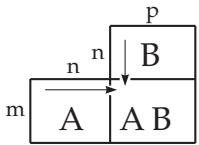
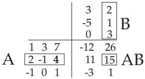

#### 4.1.4 Arithmetical Operations with Matrices

1. Equality of Matrices

Two matrices $\mathbf { A } = \left( a _ { \mu \nu } \right)$ and $\mathbf { B } = \left( b _ { \mu \nu } \right)$ are equal if they have the same size and the corresponding elements are equal:

$$
{ \bf A } = { \bf B } , \quad \mathrm { w h e n } \quad a _ { \mu \nu } = b _ { \mu \nu } \quad \mathrm { f o r } \quad \mu = 1 , \dots , m ; \ \nu = 1 , \dots , n .\tag{4.20}
$$

2. Addition and Subtraction

Matrices can be added or subtracted only if they have the same size. The sum/diference of two matrices is done by adding/subtracting the corresponding elements:

$$
\mathbf { A } \pm \mathbf { B } = ( a _ { \mu \nu } ) \pm ( b _ { \mu \nu } ) = ( a _ { \mu \nu } \pm b _ { \mu \nu } ) .\tag{4.21a}
$$

$$
= { \left( \begin{array} { l l } { 1 } & { 3 7 } \\ { 2 - 1 4 } \end{array} \right) } + { \left( \begin{array} { l l } { 3 - 5 } & { 0 } \\ { 2 } & { 1 } & { 4 } \end{array} \right) } = { \left( \begin{array} { l l } { 4 - 2 } & { 7 } \\ { 4 } & { 0 } & { 8 } \end{array} \right) } .
$$

For the addition of matrices the commutative law and the associative law are valid:

a) Commutative Law: $\mathbf { A } + \mathbf { B } = \mathbf { B } + \mathbf { A }$

(4.21b)

b) Associative Law: $( \mathbf { A } + \mathbf { B } ) + \mathbf { C } = \mathbf { A } + ( \mathbf { B } + \mathbf { C } ) .$

(4.21c)

3. Multiplication of a Matrix by a Number

A matrix A of size $( m , n )$ is multiplied by a real or complex number α by multiplying every element of A by α:

$$
\alpha \mathbf { A } = \alpha ( a _ { \mu \nu } ) = ( \alpha a _ { \mu \nu } ) .\tag{4.22a}
$$

$$
{ \textbf { \em B } } ( { \bf \frac { 1 } { 0 } } { \bf \epsilon } _ { - 1 } ^ { 3 } { \bf \epsilon } _ { 4 } ) = { \left( \begin{array} { l } { 3 { \bf \epsilon } { \bf \epsilon } _ { 9 } { \bf \gamma } _ { 2 1 } } \\ { 0 { \bf \epsilon } { - } 3 { \bf \epsilon } { 1 } 2 } \end{array} \right) } .
$$

From (4.22a) it is obvious that one can factor out a constant multiplier contained by every element of a matrix. For the multiplication of a matrix by a scalar the commutative, associative and distributive laws for multiplication are valid:

a) Commutative Law: $\alpha \mathbf { A } = \mathbf { A } \alpha$

(4.22b)

b) Associative Law: $\alpha ( \beta \mathbf { A } ) = ( \alpha \beta ) \mathbf { A } ;$

(4.22c)

$$
{ \mathrm { ~ c ) ~ D i s t r i b u t i v e ~ L a w : ~ } } \left( \alpha \pm \beta \right) \mathbf { A } = \alpha \mathbf { A } \pm \beta \mathbf { A } ; \quad \alpha ( \mathbf { A } \pm \mathbf { B } ) = \alpha \mathbf { A } \pm \alpha \mathbf { B } .\tag{4.22d}
$$

4. Division of a Matrix by a Number

The division ofa matrix by a scalar $\gamma \neq 0$ is the same as multiplication by $\alpha = 1 / \gamma$

5. Multiplication of Two Matrices

1. The Product A B of two matrices A and B can be calculated only if the number of columns of the factor A on the left-hand side is equal to the number of rows of the factor B on the right-hand side. If A is a matrix of size $( m , n )$ , then the matrix B must have size $( n , p )$ , and the product A B is a matrix $\mathbf { C } = \left( c _ { \mu \lambda } \right)$ of size $( m , p )$ . The element $c _ { \mu \lambda }$ is equal to the scalar product of the μ-th row of the factor A on the left with the λ-th column of the factor B on the right:

$$
\mathbf { A } \mathbf { B } = ( \sum _ { \nu = 1 } ^ { n } a _ { \mu \nu } b _ { \nu \lambda } ) = ( c _ { \mu \lambda } ) = \mathbf { C } \qquad ( \mu = 1 , 2 , \ldots , m ; \ \lambda = 1 , 2 , \ldots , p ) .\tag{4.23}
$$

■ $\mathbf { A } = \left( { \frac { 1 3 7 } { 2 - 1 4 } } \right) , \mathbf { B } = \left( { \begin{array} { c } { 3 } \\ { - 5 } \\ { 0 } \end{array} } { \left| \begin{array} { l } { 2 } \\ { 1 } \\ { 3 } \end{array} \right| } \right)$ . The element $c _ { 2 2 }$ of the product matrix C in accordance with

(4.23) is $c _ { 2 2 } = 2 \cdot 2 - 1 \cdot 1 + 4 \cdot 3 = 1 5$

2. Inequality ofMatrix Products Even if both products A B and B A exist, usually A B = B A, i.e., in general the commutative law for multiplication is not valid. If the equality A B = B A holds, then one says that the matrices A and B are commutable or commute with each other.

3. Falk Scheme Multiplication of matrices $\mathbf { A } \mathbf { B } = \mathbf { C }$ can be performed using the Falk scheme (Fig. 4.1). The element $c _ { \mu \lambda }$ of the product matrix C appears exactly at the intersection point of the μ-th row of A with the λ-th column of B.

Multiplication of the matrices $\mathbf { A } _ { ( 3 , 3 ) }$ and $\mathbf { B } _ { ( 3 , 2 ) }$ is shown in Fig. 4.2 using the Falk scheme.

  
Figure 4.1

  
Figure 4.2

4. Multiplication of the Matrices $\mathbf { K _ { 1 } }$ and $\mathbf { K _ { 2 } }$ with Complex Elements For multiplication of two matrices with complex elements can be used their decompositions into real and imaginary parts according to (4.2b): $\mathbf { K } _ { 1 } = \mathbf { A } _ { 1 } + \mathrm { i } \mathbf { B } _ { 1 } , \ \mathbf { K } _ { 2 } = \mathbf { A } _ { 2 } + \mathrm { i } \mathbf { B } _ { 2 }$ . Here $\mathbf { \bar { A } _ { 1 } } , \mathbf { A _ { 2 } } , \mathbf { B _ { 1 } } , \mathbf { B _ { 2 } }$ are real matrices. After this decomposition, the multiplication results in a sum of matrices whose terms are products of real matrices.

$\mathbf { \partial } ( \mathbf { A } + \mathbf { \partial } \mathbf { i } \mathbf { B } ) ( \mathbf { A } - \mathbf { \partial } \mathbf { i } \mathbf { B } ) = \mathbf { A } ^ { 2 } + \mathbf { B } ^ { 2 } + \mathbf { \partial } \mathbf { i } \left( \mathbf { B A } - \mathbf { A B } \right)$ (Powers of Matrices see 4.1.5,8., p. 276). Of course when multiplying these matrices it must be considered that the commutative law for multiplication is not valid in general, i.e., the matrices A and B do not usually commute with each other.

6. Scalar and Dyadic Product of Two Vectors

If the vectors a and b are considered as one-row and one-column matrices, respectively, then there are two possibilities to multiply them according to the rules of matrix multiplication:

If a has size (1, n) and b has size $( n , 1 )$ then their product has size (1, 1), i.e. it is a number. It is called the scalar product of two vectors. If conversely, a has size (n, 1) and b has size (1, m), then the product has size (n, m), i.e., it is a matrix. This matrix is called the dyadic product of the two vectors.

1. Scalar Product of Two Vectors The scalar product of a row vector $\underline { { \mathbf { a } } } ^ { \mathrm { T } } = ( a _ { 1 } , a _ { 2 } , \ldots , a _ { n } )$ with a column vector $\mathbf { \underline { { b } } } = ( b _ { 1 } , b _ { 2 } , \ldots , b _ { n } ) ^ { \mathrm { T } } -$ both having n elements – is defined as the number

$$
\underline { { \mathbf { a } } } ^ { \mathrm { T } } \underline { { \mathbf { b } } } = \underline { { \mathbf { b } } } ^ { \mathrm { T } } \underline { { \mathbf { a } } } = a _ { 1 } b _ { 1 } + a _ { 2 } b _ { 2 } + \cdot \cdot \cdot \cdot + a _ { n } b _ { n } = \sum _ { \mu = 1 } ^ { n } a _ { \mu } b _ { \mu } .\tag{4.24}
$$

The commutative law for multiplication is not valid for a product of vectors in general, so one must keep the exact order of $\mathbf { a } ^ { \mathrm { T } }$ and b. If the order of multiplication is reversed, then the product ${ \mathbf { b } } { \mathbf { a } } ^ { \mathrm { T } }$ is a dyadic product.

2. Dyadic Product or Tensor Product of Two Vectors The dyadic product of a column vector $\underline { { \mathbf { a } } } = ( \dot { a _ { 1 } } , a _ { 2 } , \dots , a _ { n } ) ^ { \mathrm { T } }$ of dimension n with a row vector $\underline { { \mathbf { b } } } ^ { \mathrm { T } } = ( b _ { 1 } , b _ { 2 } , \ldots , b _ { m } )$ of dimension m is defined as the following matrix:

$$
\underline { { \mathbf { a b } } } ^ { \mathrm { T } } = \left( \begin{array} { c c c c } { a _ { 1 } b _ { 1 } } & { a _ { 1 } b _ { 2 } } & { \cdots } & { a _ { 1 } b _ { m } } \\ { a _ { 2 } b _ { 1 } } & { a _ { 2 } b _ { 2 } } & { \cdots } & { a _ { 2 } b _ { m } } \\ { \vdots } & { \vdots } & { \vdots } & { \vdots } \\ { a _ { n } b _ { 1 } } & { a _ { n } b _ { 2 } } & { \cdots } & { a _ { n } b _ { m } } \end{array} \right)\tag{4.25}
$$

of size $( n , m )$ . Also here the commutative law for multiplication is not valid in general.

3. Hints on the Notion of Vector Products of Two Vectors In the domain of multi-vectors or alternating tensors there is a so-called outer product whose three-dimensional version is the well-

known vector product or cross product (see 3.5.1.5, 2., p. 184 f). In this book the outer product of multi-vectors of higher rank is not discussed.

7. Rank of a Matrix

1. Definition In a matrix A the maximum number r of linearly independent column vectors is equal to the maximum number of linearly independent row vectors. This number r is called the rank of the matrix and it is denoted by rank $( \mathbf { A } ) = r$

2. Statements about the Rank of a Matrix

a) Because in a vector space of dimension m there exist no more than m linearly independent mdimensional row or column vectors (see 5.3.8.2, p. 366), the rank r of a matrix A of size $( m , n )$ cannot be greater, than the smaller of m and n:

$$
\operatorname { r a n k } \left( \mathbf { A } _ { ( m , n ) } \right) = r \leq \operatorname* { m i n } \left( m , n \right) .\tag{4.26a}
$$

b) A square matrix $\mathbf { A } _ { ( n , n ) }$ is called a regular matrix if

rank $( \mathbf { A } _ { ( n , n ) } ) = r = n$

(4.26b)

A square matrix of size $( n , n )$ is regular if and only if its determinant difers from zero, i.e., det $\mathbf A \neq 0$ (see 4.2.2, 3., p. 279). Otherwise it is a singular matrix.

c) Consequently for the rank of a singular square matrix $\mathbf { A } _ { ( n , n ) } , { \mathrm { i . e . } }$ , det $\mathbf A = 0$

$$
\operatorname { r a n k } \left( \mathbf { A } _ { ( n , n ) } \right) = r < n\tag{4.26c}
$$

is valid.

d) The rank of the zero matrix 0 is equal to zero:

$$
\operatorname { r a n k } \left( { \bf 0 } \right) = r = 0 .\tag{4.26d}
$$

e) The rank of the sum and product of matrices satisfies the relations

$$
| \mathrm { r a n k } ( \mathbf { A } ) - \mathrm { r a n k } ( \mathbf { B } ) | \leq \mathrm { r a n k } ( \mathbf { A } + \mathbf { B } ) \leq \mathrm { r a n k } ( \mathbf { A } ) + \mathrm { r a n k } ( \mathbf { B } ) ,\tag{4.26e}
$$

$$
\operatorname { r a n k } ( \mathbf { A } \mathbf { B } ) \leq \operatorname* { m i n } ( \operatorname { r a n k } ( \mathbf { A } ) , \operatorname { r a n k } ( \mathbf { B } ) ) .\tag{4.26f}
$$

3. Rules to Determine the Rank Elementary transformations do not change the rank of matrices. Elementary transformations in this relation are:

a) Interchanging two columns or two rows.

b) Multiplication of a row or column by a number.

c) Addition of a row to another row or a column to an other column.

In order to determine their ranks every matrix can be transformed by appropriate linear combinations of rows into a form such that in the μ-th row $( \mu = 2 , 3 , \ldots , m )$ , at least the first $\mu - 1$ elements are equal to zero (the principle of Gauss algorithm, see 4.5.2.4, p. 312). The number of row vectors diferent from the zero vector in the transformed matrix is equal to the rank r of the matrix.

8. Inverse Matrix

For a regular matrix $\mathbf { A } = \left( a _ { \mu \nu } \right)$ there is always an inverse matrix ${ { \bf A } ^ { - 1 } }$ (with respect to multiplication), i.e., the multiplication of a matrix by its inverse yields the identity matrix:

$$
\mathbf { A } \mathbf { A } ^ { - 1 } = \mathbf { A } ^ { - 1 } \mathbf { A } = \mathbf { I } .\tag{4.27a}
$$

The elements of $\mathbf { A } ^ { - 1 } = ( \beta _ { \mu \nu } )$ are

$$
\beta _ { \mu \nu } = \frac { { \bf A } _ { \nu \mu } } { \operatorname * { d e t } { \bf A } } ,\tag{4.27b}
$$

where $\mathbf { A } _ { \nu \mu }$ is the cofactor belonging to the $a _ { \nu \mu }$ element of the matrix A (see 4.2.1, 1., p. 278). For a practical calculation of $\mathbf { A } ^ { - 1 }$ the method given in 4.2.2, 2., p. 278 should be used. In the case of a matrix of size (2, 2) holds:

$$
\mathbf { A } = { \binom { a \ b } { c \ d } } , \qquad \mathbf { A } ^ { - 1 } = { \frac { 1 } { a d - b c } } { \left( \begin{array} { l l } { d \ - b } \\ { - c } & { a } \end{array} \right) } .\tag{4.28}
$$

Remark: Why not define division among matrices but instead use the inverse for calculations? This is connected to the fact that division cannot be defined uniquely. The solutions of the equations

$$
{ \begin{array} { r l r } { \mathbf { B X _ { 1 } } = \mathbf { A } \quad } & { } & { \mathbf { X _ { 1 } } = \mathbf { B } ^ { - 1 } \mathbf { A } } \\ { \mathbf { X _ { 2 } B } = \mathbf { A } \quad } & { } & { \mathbf { X _ { 2 } } = \mathbf { A B ^ { - 1 } } } \end{array} }\tag{4.29}
$$

are in general diferent.

9. Orthogonal Matrices

If the relation

$$
\mathbf { A } ^ { \mathrm { T } } = \mathbf { A } ^ { - 1 } \qquad { \mathrm { o r } } \qquad \mathbf { A } \mathbf { A } ^ { \mathrm { T } } = \mathbf { A } ^ { \mathrm { T } } \mathbf { A } = \mathbf { I }\tag{4.30}
$$

holds for a square matrix A, then it is called an orthogonal matrix, i.e., the scalar product of a row and the transpose of another one, or the scalar product of the transpose of a column and another one are zero, while the scalar product of a row with its own transpose or of the transpose of a column with itself are equal to one.

Orthogonal matrices have the following properties:

a) The transpose and the inverse of an orthogonal matrix A are also orthogonal; furthermore, the determinant is

$$
\operatorname* { d e t } \mathbf { A } = \pm 1 .\tag{4.31}
$$

b) Products of orthogonal matrices are also orthogonal.

The rotation matrix D, which is used to describe the rotation of a coordinate system, and whose elements are the direction cosines of the new direction of axes (see 3.5.3.3,2. p. 212), is also an orthogonal matrix.

10. Unitary Matrix

If for a matrix A with complex elements

$$
( \mathbf { A } ^ { * } ) ^ { \mathrm { T } } = \mathbf { A } ^ { - 1 } \qquad { \mathrm { o r } } \qquad \mathbf { A } ( \mathbf { A } ^ { * } ) ^ { \mathrm { T } } = ( \mathbf { A } ^ { * } ) ^ { \mathrm { T } } \mathbf { A } = \mathbf { I }\tag{4.32}
$$

holds it is called a unitary matrix. In the real case unitary and orthogonal matrices are the same.
