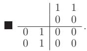

#### 4.1.5 Rules of Calculation for Matrices

The following rules are valid of course only in the case when the operations can be performed, for instance the identity matrix I always has a size corresponding to the requirements of the given operation.

1. Multiplication of a Matrix by the Identity Matrix

is also called the identical transformation:

$$
\mathbf { A I } = \mathbf { I A } = \mathbf { A } .\tag{4.33}
$$

(This does not mean that the commutative law is valid in general, because the sizes of the matrix I on the left- and on the right-hand side may be diferent.)

2. Multiplication of a Square Matrix A by a Scalar Matrix S

or by the identity matrix I is commutative

$$
{ \bf A S } = { \bf S A } = c { \bf A } \quad \mathrm { w i t h ~ { \bf S } ~ g i v e n ~ i n ~ ( 4 . 8 ) } , \quad ( 4 . 3 4 \mathrm { a } )
$$

$$
\mathbf { A I } = \mathbf { I A } = \mathbf { A } .\tag{4.34b}
$$

3. Multiplication of a Matrix A by the Zero Matrix 0

results in the zero matrix:

$$
{ \bf A 0 } = { \bf 0 } , { \bf 0 . } = { \bf 0 } .\tag{4.35}
$$

(The zero matrices above may have diferent sizes.) The converse statement is not true in general, i.e., from AB = 0 it does not follow that A = 0 or $\mathbf { B } = \mathbf { 0 }$

4. Vanishing Product of Two Matrices

The product of two matrices A and B can be the zero matrix even if neither of them is a zero matrix:

$$
\mathbf { A } \mathbf { B } = \mathbf { 0 } { \mathrm { ~ o r ~ } } \mathbf { B } \mathbf { A } = \mathbf { 0 } { \mathrm { ~ o r ~ b o t h , ~ a l t h o u g h ~ } } \mathbf { A } \neq \mathbf { 0 } , \ \mathbf { B } \neq \mathbf { 0 } .
$$

(4.36)

5. Multiplication of Three Matrices

$$
( \mathbf { A } \mathbf { B } ) \mathbf { C } = \mathbf { A } \left( \mathbf { B } \mathbf { C } \right)\tag{4.37}
$$

i.e., the associative law of multiplication is valid.

6. Transposing of a Sum or a Product of Two Matrices

$$
( \mathbf { A } + \mathbf { B } ) ^ { \mathrm { T } } = \mathbf { A } ^ { \mathrm { T } } + \mathbf { B } ^ { \mathrm { T } } , \qquad ( \mathbf { A } \mathbf { B } ) ^ { \mathrm { T } } = \mathbf { B } ^ { \mathrm { T } } \mathbf { A } ^ { \mathrm { T } } , \qquad ( \mathbf { A } ^ { \mathrm { T } } ) ^ { \mathrm { T } } = \mathbf { A } .\tag{4.38a}
$$

For square invertible matrices ${ \bf A } _ { ( n , n ) } \colon$

$$
( \mathbf { A } ^ { \mathrm { T } } ) ^ { - 1 } = ( \mathbf { A } ^ { - 1 } ) ^ { \mathrm { T } }\tag{4.38b}
$$

holds.

7. Inverse of a Product of Two Matrices

$$
( \mathbf { A _ { \lambda } B } ) ^ { - 1 } = \mathbf { B ^ { - 1 } A ^ { - 1 } } .\tag{4.39}
$$

8. Powers of Matrices

$$
\mathbf { A } ^ { p } = \underbrace { \mathbf { A } ~ \mathbf { A } \ldots ~ \mathbf { A } } _ { p { \mathrm { f a c t o r s } } } ~ { \mathrm { w i t h } } ~ p > 0 , { \mathrm { i n t e g e r } } ,\tag{4.40a}
$$

$$
\mathbf { A } ^ { 0 } = \mathbf { I } \qquad \left( \operatorname* { d e t } \mathbf { A } \neq 0 \right) ,\tag{4.40b}
$$

$$
\mathbf { A } ^ { - p } = ( \mathbf { A } ^ { - 1 } ) ^ { p } \quad ( p > 0 , { \mathrm { i n t e g e r } } ; { \operatorname* { d e t } } \mathbf { A } \neq 0 ) ,\tag{4.40c}
$$

$$
\mathbf { A } ^ { p + q } = \mathbf { A } ^ { p } \mathbf { A } ^ { q } \qquad ( p , q { \mathrm { ~ i n t e g e r } } ) .\tag{4.40d}
$$

9. Kronecker Product

The Kronecker product oftwo matrices $\mathbf { A } = \left( a _ { \mu \nu } \right)$ of the type $( m , n )$ and $\mathbf { B } = \left( b _ { \mu \nu } \right)$ of the type $( p , r )$ is defined as the rule

$$
{ \bf A } \otimes { \bf B } = ( a _ { \mu \nu } { \bf B } ) .\tag{4.41}
$$

The result is a new matrix of type $( m \cdot p , n \cdot r )$ , arising from the multiplication of every element of A by the matrix B .

$\mathbf { A } = { \binom { 3 - 5 } { 2 } } \ \mathbf { 3 } \ )$ of type (2, 3), $\mathbf { B } = { \binom { 1 } { 2 } } _ { - 1 } ^ { 3 } \mathbf { ) }$ of type (2, 2).

$$
\mathbf { A } \bigotimes \mathbf { B } = { \left( \begin{array} { l l } { 3 \cdot { \left( \begin{array} { l l } { 1 } & { 3 } \\ { 2 } & { - 1 } \end{array} \right) } } & { - 5 \cdot { \left( \begin{array} { l l } { 1 } & { 3 } \\ { 2 } & { - 1 } \end{array} \right) } } & { 0 \cdot { \left( \begin{array} { l l } { 1 } & { 3 } \\ { 2 } & { - 1 } \end{array} \right) } } \\ { 2 \cdot { \left( \begin{array} { l l } { 1 } & { 3 } \\ { 2 } & { - 1 } \end{array} \right) } } & { 1 \cdot { \left( \begin{array} { l l } { 1 } & { 3 } \\ { 2 } & { - 1 } \end{array} \right) } } & { 3 \cdot { \left( \begin{array} { l l } { 1 } & { 3 } \\ { 2 } & { - 1 } \end{array} \right) } } \end{array} \right) } = { \left( \begin{array} { l l l l l } { 3 } & { 9 } & { - 5 } & { - 1 5 } & { 0 } & { 0 } \\ { 6 } & { - 3 } & { - 1 0 } & { 5 } & { 0 } & { 0 } \\ { 2 } & { 6 } & { 1 } & { 3 } & { 3 } & { 9 } \\ { 4 } & { - 2 } & { 2 } & { - 1 } & { 6 } & { - 3 } \end{array} \right) } ~ ,
$$

gives a matrix of type (4, 6) .

For the transpose and the trace are valid the equalities:

$$
( \mathbf { A } \otimes \mathbf { B } ) ^ { \mathrm { T } } = \mathbf { A } ^ { \mathrm { T } } \otimes \mathbf { B } ^ { \mathrm { T } } ,\tag{4.42}
$$

$$
\operatorname { T r } \left( \mathbf { A } \otimes \mathbf { B } \right) = \operatorname { T r } \left( \mathbf { A } \right) \cdot \operatorname { T r } ( \mathbf { B } ) .\tag{4.43}
$$

10. Diferentiation of a Matrix

If a matrix $\mathbf { A } = \mathbf { A } ( t ) = ( a _ { \mu \nu } ( t ) )$ has diferentiable elements $a _ { \mu \nu } ( t )$ of a parameter t then its derivative with respect to t is given as

$$
\frac { d { \bf A } } { d t } = \left( \frac { d a _ { \mu \nu } ( t ) } { d t } \right) = ( a _ { \mu \nu } ^ { \prime } ( t ) ) .\tag{4.44}
$$
