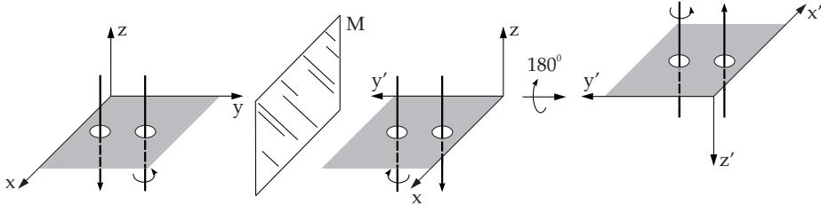

#### 4.3.5 Pseudotensors

The reflection of a tensor plays a special role in physics. Because of their diferent behavior with respect to reflection polar and axial vectors are distinguished (see 3.5.1.1, 2., p. 181), although mathematically they can be handled in the same way. Axial and polar vectors difer from each other in their determination, because axial vectors can be represented by an orientation in addition to length and direction. Axial vectors are also called pseudovectors. Since vectors can be considered as tensors, the genera notion of pseudotensors is introduced.

##### 4.3.5.1 Symmetry with Respect to the Origin

1. Behavior of Tensors under Space Inversion

1. Notion of Space Inversion The reflection of the position coordinates of points in space with respect to the origin is called space inversion or coordinate inversion. In a three-dimensional Cartesian coordinate system space inversion means the change of the sign of the coordinates:

$$
( x , y , z ) \to ( - x , - y , - z ) .\tag{4.99}
$$

By this a right-hand coordinate system becomes a left-hand system. Similar rules are valid for other coordinate systems. In the spherical coordinate system holds:

$$
( r , \vartheta , \varphi )  ( - r , \pi - \vartheta , \varphi + \pi ) .\tag{4.100}
$$

Under this type of reflection the length of the vectors and the angles between them do not change. The transition can be given by a linear transformation.

2. Transformation Matrix According to (4.66), the transformation matrix $\mathbf { A } = \left( a _ { \mu \nu } \right)$ of a linear transformation of three-dimensional space has the following properties in the case of space inversion:

$$
a _ { \mu \nu } = - \delta _ { \mu \nu } , \quad \operatorname * { d e t } { \bf A } = - 1 .\tag{4.101a}
$$

For the components of a tensor of rank n (4.69)

$$
\tilde { t } _ { \mu \nu \cdots \rho } = ( - 1 ) ^ { n } t _ { \mu \nu \cdots \rho }\tag{4.101b}
$$

holds. That is: In the case of point symmetry with respect to the origin a tensor of rank 0 remains a scalar, unchanged; a tensor of rank 1 remains a vector with a change of sign; a tensor of rank 2 remains unchanged, etc.

  
Figure 4.3

2. Geometric Representation

The inversion of space in a three-dimensional Cartesian coordinate system can be realized in two steps (Fig.4.3):

1. By reflection with respect to the coordinate plane, for instance the $x , z { \mathrm { ~ p l a n e } }$ , the coordinate system $x , y , z$ turns into the coordinate system $x , - y , z$ . A right-hand system becomes a left-hand system (see 3.5.3.1,2., p. 209).

2. By a rotation of the system x, y, z around the y-axis by $1 8 0 ^ { \circ }$ we have the complete coordinate system $x , y , z$ reflected with respect to the origin. This coordinate system stays left-handed, as it was after the first step.

Conclusion: Space inversion changes the orientation of a polar vector by 180◦, while an axial vector keeps its orientation.

##### 4.3.5.2 Introduction to the Notion of Pseudotensors

1. Vector Product under Space Inversion Under space inversion two polar vectors a and b are transformed into the vectors a and b, i.e., their components satisfy the transformation formula (4.101b) for tensors of rank 1. However, if considering the vector product $\underline { { \mathbf { c } } } = \underline { { \mathbf { a } } } \times$ b as an example of an axial vector, then one gets $\underline { { \mathbf { c } } } = \underline { { \mathbf { c } } }$ under reflection with respect to the origin. This is a violation of the transformation formula (4.101a) for tensors of rank 1. Therefore the axial vector c is called a pseudovector or generally a pseudotensor.

The vector products $\vec { r } \times \vec { v } , \vec { r } \times \vec { F } , \nabla \times \vec { v } =$ rot $\vec { v }$ with the position vector ${ \vec { r } } ,$ the speed vector ${ \vec { v } } ,$ the power vector $\vec { F }$ and the nabla operator $\nabla$ are examples of axial vectors, which have “false” behavior under reflection.

2. Scalar Product under Space Inversion If using space inversion for a scalar product of a polar and an axial vector, then again there is a case of violation of the transformation formula (4.101b) for tensors of rank 1. Because the result of a scalar product is a scalar, and a scalar should be the same in every coordinate system, here it is a very special scalar, which is called a pseudoscalar. It has the property that it changes its sign under space inversion. Pseudoscalars do not have the rotation invariance property of scalars.

The scalar product of the polar vectors $\vec { r }$ (position vector) and v (speed vector) by the axial vector $\vec { \omega }$ (angular velocity vector) results in the scalars $\vec { r } \cdot \vec { \omega }$ and $\vec { v } \cdot \vec { \omega }$ , which have the “false” behavior under reflection, so they are pseudoscalars.

3. Mixed Product under Space Inversion The mixed product $( \underline { { \mathbf { a } } } \times \underline { { \mathbf { b } } } ) \cdot \underline { { \mathbf { c } } }$ (see 3.5.1.6, 2., p. 185) of polar vectors a , b, and c is a pseudoscalar according to (2.), because the factor $\left( \underline { { \mathbf { a } } } \times \underline { { \mathbf { b } } } \right)$ is an axial vector. The sign of the mixed product changes under space inversion.

4. Pseudovector and Skew-Symmetric Tensor of Rank 2 The tensor product of axial vectors $\mathbf { a } = ( a _ { 1 } , a _ { 2 } , a _ { 3 } ) ^ { \mathrm { T } }$ and $\underline { { \mathbf { b } } } = ( b _ { 1 } , b _ { 2 } , \bar { b _ { 3 } } ) ^ { \mathrm { T } }$ results in a tensor of rank 2 with components $t _ { i j } = a _ { i } b _ { j } ( i , j =$ $1 , 2 , 3 )$ according to (4.74a). Since every tensor of rank 2 can be decomposed into a sum of a symmetric and a skew-symmetric tensor of rank 2, according to (4.81)

$$
t _ { i j } = \frac { 1 } { 2 } \left( a _ { i } b _ { j } + a _ { j } b _ { i } \right) + \frac { 1 } { 2 } \left( a _ { i } b _ { j } - a _ { j } b _ { i } \right) \quad ( i , j = 1 , 2 , 3 )\tag{4.102}
$$

holds. The skew-symmetric part of (4.102) contains exactly the components of the vector product $( \underline { { \mathbf { a } } } \times \underline { { \mathbf { b } } } )$ multiplied by $\textstyle { \frac { 1 } { 2 } }$ , so the axial vector $\underline { { \mathbf { c } } } = ( \underline { { \mathbf { a } } } \times \underline { { \mathbf { b } } } )$ with components $c _ { 1 } , c _ { 2 } , c _ { 3 }$ can be considered as a skew-symmetric tensor of rank 2

$$
C = \underline { { \mathbf { c } } } = \left( \begin{array} { c c c } { 0 } & { c _ { 1 2 } } & { c _ { 1 3 } } \\ { - c _ { 1 2 } } & { 0 } & { c _ { 2 3 } } \\ { - c _ { 1 3 } } & { - c _ { 2 3 } } & { 0 } \end{array} \right)
$$

$$
{ \begin{array} { r l r l } & { ( 4 . 1 0 3 \mathrm { a } ) } & { { \mathrm { ~ w h e r e ~ } } } & & { c _ { 2 3 } = a _ { 2 } b _ { 3 } - a _ { 3 } b _ { 2 } = c _ { 1 } , } \\ & { } & & { c _ { 3 1 } = a _ { 3 } b _ { 1 } - a _ { 1 } b _ { 3 } = c _ { 2 } , } \\ & { } & & { c _ { 1 2 } = a _ { 1 } b _ { 2 } - a _ { 2 } b _ { 1 } = c _ { 3 } , } \end{array} }\tag{4.103b}
$$

whose components satisfy the transformation formula (4.101b) for tensors of rank 2. Consequently every axial vector (pseudovector or pseudotensor of rank 1) $\underline { { \mathbf { c } } } = ( c _ { 1 } , c _ { 2 } , c _ { 3 } ) ^ { \mathrm { T } }$ can be considered as a skew-symmetric tensor C of rank 2:

$$
\pmb { C } = \pm = \left( \begin{array} { c c c } { 0 } & { c _ { 3 } } & { - c _ { 2 } } \\ { - c _ { 3 } } & { 0 } & { c _ { 1 } } \\ { c _ { 2 } } & { - c _ { 1 } } & { 0 } \end{array} \right) .\tag{4.104}
$$

5. Pseudotensors of Rank n The generalization of the notion of pseudoscalar and pseudovector is a pseudotensor of rank $n$ . It has the same property under rotation as a tensor of rank n (rotation matrix D with det D = 1) but it has a ( 1) factor under reflection through the origin. Examples of pseudotensors of higher rank can be found in the literature, e.g., [4.1].
