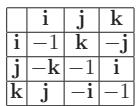
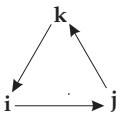

#### 4.4.1 Quaternions

##### 4.4.1.1 Definition and Representation

1. Imaginary Units

Quaternions are generalized complex numbers in the form

$$
w + \mathbf { i } x + \mathbf { j } y + \mathbf { k } z ,\tag{4.106}
$$

where w, x, y, z are real numbers, and the generalized imaginary units are i, j,k, which satisfy the following rules of multiplication:

$$
\mathbf { i } ^ { 2 } = \mathbf { j } ^ { 2 } = \mathbf { k } ^ { 2 } = - 1 , \qquad \mathbf { i } \mathbf { j } = \mathbf { k } = - \mathbf { j } \mathbf { i } , \quad \mathbf { j } \mathbf { k } = \mathbf { i } = - \mathbf { k } \mathbf { j } , \quad \mathbf { k } \mathbf { i } = \mathbf { j } = - \mathbf { i } \mathbf { k } .
$$

  
Multiplication table  
Figure 4.4

(4.107)

The multiplication of the generalized units is shown in the accompanying table of multiplication. Alternatively the multiplication rules can be represented by the cycle shown in Fig.4.4. Multiplication in the direction of an arrow results in a positive sign, opposite to the arrow direction results in a negative sign.

Consequently, the multiplication is not commutative but associative. The four-dimensional Euclidian vector space $\mathbb { R } ^ { 4 }$ provided with quaternion-multiplication is denoted by IH in honour of R.W. Hamilton. Quaternions form an algebra, namely the division ring ofquaternions.

2. Representation of Quaternions

There are diferent representation of quaternions:

as hyper-complex numbers $q = w + \mathbf { i } x + \mathbf { j } y + \mathbf { k } z = q _ { 0 } + \mathbf { q }$ with scalar part $q _ { 0 } = \mathrm { S c } q$ and vector part $\mathbf { q } = \mathrm { V e c } q$

as four dimensional vector $\begin{array} { r } { q = ( w , x , y , z ) ^ { T } = ( q _ { 0 } , \mathbf { q } ) ^ { T } } \end{array}$ consisting of the number $w \in \mathbb { R }$ and the vector $( x , y , z ) ^ { T } \in \mathbb { R } ^ { 3 }$

in trigonometric form $q = r ( \cos \varphi + \underline { { \mathbf { n _ { q } } } } \sin \varphi )$ , where $r = | q | = { \sqrt { w ^ { 2 } + x ^ { 2 } + y ^ { 2 } + z ^ { 2 } } }$ is the length of the four dimensional vector in $\mathbb { R } ^ { 4 }$ , and cos $\varphi = { \frac { w } { | q | } }$ , and $\underline { { \mathbf { n _ { q } } } } = \frac { 1 } { | ( x , y , z ) ^ { T } | } ( x , y , z ) ^ { T } . ~ \underline { { \mathbf { n _ { q } } } }$ is a unit vector in $\mathbb { R } ^ { 3 }$ , depending on q.

Remark: The multiplication rules for quaternions difer from the usually introduced rules in $\mathbb { R } ^ { 3 }$ and

$\mathbb { R } ^ { 4 }$ (see (4.109b), (4.114), (4.115)).

3. Relation between Hyper-complex Number and Trigonometric Form

$$
q = q _ { 0 } + \underline { { \mathbf { q } } } = | q | \left( \frac { q _ { 0 } } { | q | } + \frac { \underline { { \mathbf { q } } } } { | q | } \right) = | q | \left( \frac { q _ { 0 } } { | q | } + \frac { \underline { { \mathbf { q } } } } { | \underline { { \mathbf { q } } } | } \frac { | \underline { { \mathbf { q } } } | } { | q | } \right) = r ( \cos \varphi + \underline { { \mathbf { n } } } _ { \underline { { \mathbf { q } } } } \sin \varphi ) ,\tag{4.108a}
$$

if $| \underline { { \mathbf { q } } } | \neq 0 . \operatorname { I f } | \underline { { \mathbf { q } } } | = 0$ , then there is

$$
q = q _ { 0 } = | q _ { 0 } | \frac { q _ { 0 } } { | q _ { 0 } | } = \left\{ | q _ { 0 } | = | q _ { 0 } | \cos 0 \mathrm { f o r } q _ { 0 } > 0 , \right.\tag{4.108b}
$$

if $q _ { 0 } \neq 0$

4. Pure Quaternions

A pure quaternion has a zero scalar part: $q _ { 0 } = 0$ . The set of pure quaternions is denoted by $\mathbb { H } _ { 0 }$ . It is often useful to identify the pure quaternions q with the geometric vector $\vec { \bf q } \in \mathbb { R } ^ { 3 }$ , i.e.

$$
q = q _ { 0 } + \left\{ \begin{array} { l l } { \underline { { \mathbf { q } } } , } & { \mathrm { i f ~ \underline { { q } } ~ r e p r e s e n t s ~ a ~ p u r e ~ q u a t e r n i o n , } } \\ { \vec { \mathbf { q } } , } & { \mathrm { i f ~ \underline { { q } } ~ i s ~ i n t e r p r e t e d ~ a s ~ a ~ g e o m e t r i c ~ v e c t o r . } } \end{array} \right.\tag{4.109a}
$$

The multiplication rule for p, q $\mathbf { q } \in \mathbb { H } _ { 0 }$ is

$$
\underline { { \mathbf { p } } } \underline { { \mathbf { q } } } = - \vec { \mathbf { p } } \cdot \vec { \mathbf { q } } + \vec { \mathbf { p } } \times \vec { \mathbf { q } } ,\tag{4.109b}
$$

where and denote the dot-product and cross-product in $\mathbb { R } ^ { 3 }$ , respectively. The result of (4.109b) is to interpret as a quaternion.

Let $\nabla = \frac { \partial } { \partial x } \vec { \bf i } + \frac { \partial } { \partial y } \vec { \bf j } + \frac { \partial } { \partial z } \vec { \bf k }$ be the nabla-operator (see 13.2.6.1, p. 715), and let $\vec { \bf v } = v _ { 1 } ( x , y , z ) \vec { \bf i } +$ $v _ { 2 } ( x , y , z ) \vec { \bf j } + v _ { 3 } ( x , y , z ) \vec { \bf k }$ be a vector-field. Here $\vec { \bf i } , \vec { \bf j } ,$ , k are unit-vectors being parallel to the coordinate axes in a Cartesian coordinate system. If and v are interpreted as pure quaternions then according to (4.107) their product is:

$$
\nabla \vec { \bf v } = - \frac { \partial v _ { 1 } } { \partial x } - \frac { \partial v _ { 2 } } { \partial y } - \frac { \partial v _ { 3 } } { \partial z } + \vec { \bf i } \left( \frac { \partial v _ { 3 } } { \partial y } - \frac { \partial v _ { 2 } } { \partial z } \right) + \vec { \bf j } \left( \frac { \partial v _ { 1 } } { \partial z } - \frac { \partial v _ { 3 } } { \partial x } \right) + \vec { \bf k } \left( \frac { \partial v _ { 2 } } { \partial x } - \frac { \partial v _ { 1 } } { \partial y } \right) .
$$

This quaternion can be written in vector interpretation:

$$
\nabla \vec { \bf v } = - \mathrm { d i v } \vec { \bf v } + \mathrm { r o t } \vec { \bf v } ,
$$

but the result should be considered as a quaternion.

5. Unit Quaternions

A quaternion q is a unit quaternion if $| q | = 1$ . The set of unit quaternions is denoted by $\mathbb { H } . \ \mathbb { H } _ { 1 }$ is a so-called multiplicative Lie-group. The set $\mathbb { H } _ { 1 }$ can be identified with the three dimensional sphere $S ^ { 3 } = \{ \underline { { \mathbf { x } } } \in \mathbb { R } ^ { 4 } : | \underline { { \mathbf { x } } } | = 1 \}$

##### 4.4.1.2 Matrix Representation of Quaternions

1. Real Matrices

If the number 1 is identified with the identity matrix

$$
1 \triangleq { \left( \begin{array} { l } { 1 \ 0 \ 0 \ 0 } \\ { 0 \ 1 \ 0 \ 0 } \\ { 0 \ 0 \ 1 \ 0 } \\ { 0 \ 0 \ 0 \ 1 } \end{array} \right) }\tag{4.110a}
$$

furthermore

$$
\mathbf { i } \triangleq { \left( \begin{array} { l l l l } { 0 \ - 1 } & { 0 } & { 0 } \\ { 1 } & { 0 } & { 0 } & { 0 } \\ { 0 } & { 0 } & { 0 } & { 1 } \\ { 0 } & { 0 } & { - 1 } & { 0 } \end{array} \right) } , \quad \mathbf { j } \triangleq { \left( \begin{array} { l l l l } { 0 \ 0 \ - 1 } & { 0 } \\ { 0 \ 0 } & { 0 } & { - 1 } \\ { 1 \ 0 } & { 0 } & { 0 } \\ { 0 \ 1 } & { 0 } & { 0 } \end{array} \right) } , \quad \mathbf { k } \triangleq { \left( \begin{array} { l l l l } { 0 } & { 0 } & { 0 } & { 1 } \\ { 0 } & { 0 } & { - 1 } & { 0 } \\ { 0 } & { 1 } & { 0 } & { 0 } \\ { - 1 \ 0 } & { 0 } & { 0 } \end{array} \right) } ,\tag{4.110b}
$$

then a quaternion $q = w + \mathbf { i } x + \mathbf { j } y + \mathbf { k } z$ can be represented as a matrix

$$
q \triangleq \left( \begin{array} { l l l l } { w } & { - x } & { - y } & { z } \\ { x } & { w } & { - z } & { - y } \\ { y } & { z } & { w } & { x } \\ { - z } & { y } & { - x } & { w } \end{array} \right) .\tag{4.110c}
$$

2. Complex Matrices

Quaternions can be represented by complex matrices:

$$
\mathbf { i } \triangleq { \left( \begin{array} { l l } { 0 } & { - \mathrm { i } } \\ { - \mathrm { i } } & { 0 } \end{array} \right) } , \quad \mathbf { j } \triangleq { \left( \begin{array} { l l } { 0 } & { - 1 } \\ { 1 } & { 0 } \end{array} \right) } , \quad \mathbf { k } \triangleq { \left( \begin{array} { l l } { - \mathrm { i } } & { 0 } \\ { 0 } & { \mathrm { i } } \end{array} \right) } .\tag{4.111a}
$$

So

$$
q = w + \mathbf { i } x + \mathbf { j } y + \mathbf { k } z \triangleq { \left( \begin{array} { l l } { w - \mathrm { i } z } & { - \mathrm { i } x - y } \\ { - \mathrm { i } x + y } & { w + \mathrm { i } z } \end{array} \right) } \ .\tag{4.111b}
$$

Remarks:

1. On the right hand side of equations $\left( 4 . 1 1 1 \mathrm { a } , \mathrm { b } \right)$ i represents the imaginary unit of complex numbers. 2. Matrix representation of quaternions is not unique, i.e. it is possible to give representations diferent from the ones in (4.110b,c) and (4.111a,b).

3. Conjugate and inverse Element

The conjugate of quaternion q = w + ix + jy + kz is the quaternion

$$
{ \bar { q } } = w - \mathbf { i } x - \mathbf { j } y - \mathbf { k } z .\tag{4.112a}
$$

Obviously

$$
| q | ^ { 2 } = q { \bar { q } } = { \bar { q } } q = w ^ { 2 } + x ^ { 2 } + y ^ { 2 } + z ^ { 2 } .\tag{4.112b}
$$

Consequently every quaternion $q \in \mathbb { H } \backslash \{ 0 \}$ has an inverse element

$$
q ^ { - 1 } = \frac { \bar { q } } { | q | ^ { 2 } } .\tag{4.112c}
$$

##### 4.4.1.3 Calculation Rules

1. Addition and Subtraction

Addition and subtraction of two or more quaternions are defined as

$$
{ \begin{array} { r l } & { q _ { 1 } + q _ { 2 } - q _ { 3 } + \ldots } \\ & { = { \bigl ( } w _ { 1 } + \mathbf { i } x _ { 1 } + \mathbf { j } y _ { 1 } + \mathbf { k } z _ { 1 } { \bigr ) } + { \bigl ( } w _ { 2 } + \mathbf { i } x _ { 2 } + \mathbf { j } y _ { 2 } + \mathbf { k } z _ { 2 } { \bigr ) } - { \bigl ( } w _ { 3 } + \mathbf { i } x _ { 3 } + \mathbf { j } y _ { 3 } + \mathbf { k } z _ { 3 } { \bigr ) } + \ldots } \\ & { = { \bigl ( } w _ { 1 } + w _ { 2 } - w _ { 3 } + \ldots { \bigr ) } + \mathbf { i } ( x _ { 1 } + x _ { 2 } - x _ { 3 } + \ldots { \bigr ) } + \mathbf { j } ( y _ { 1 } + y _ { 2 } - y _ { 3 } + \ldots { \bigr ) } } \\ & { \quad + \mathbf { k } ( z _ { 1 } + z _ { 2 } - z _ { 3 } + \ldots { \bigr ) } . } \end{array} }\tag{4.113}
$$

Quaternions are added and subtracted as vectors in $\mathbb { R } ^ { 4 }$ , or as matrices.

2. Multiplication

The multiplication is associative, so

$$
\begin{array} { r l } { q _ { 1 } q _ { 2 } = } & { \big ( \begin{array} { l } { w _ { 1 } + \mathbf { i } x _ { 1 } + \mathbf { j } y _ { 1 } + \mathbf { k } z _ { 1 } \big ) \big ( w _ { 2 } + \mathbf { i } x _ { 2 } + \mathbf { j } y _ { 2 } + \mathbf { k } z _ { 2 } \big ) } \end{array} } \\ & { \qquad = \big ( w _ { 1 } w _ { 2 } - x _ { 1 } x _ { 2 } - y _ { 1 } y _ { 2 } - z _ { 1 } z _ { 2 } \big ) + \mathbf { i } \big ( w _ { 1 } x _ { 2 } + w _ { 2 } x _ { 1 } + y _ { 1 } z _ { 2 } - z _ { 1 } y _ { 2 } \big ) + } \\ & { \qquad + \mathbf { j } \big ( w _ { 1 } y _ { 2 } + w _ { 2 } y _ { 1 } + z _ { 1 } x _ { 2 } - z _ { 2 } x _ { 1 } \big ) + \mathbf { k } \big ( w _ { 1 } z _ { 2 } + w _ { 2 } z _ { 1 } + x _ { 1 } y _ { 2 } - x _ { 2 } y _ { 1 } \big ) . } \end{array}\tag{4.114}
$$

Using the usual vector products in $\mathbb { R } ^ { 3 }$ (see 3.5.1.5, p. 184) it can be written in the form

$$
q _ { 1 } q _ { 2 } = ( q _ { 0 1 } + \underline { { { \bf q } } } _ { 1 } ) ( q _ { 0 2 } + \underline { { { \bf q } } } _ { 2 } ) = q _ { 0 1 } q _ { 0 2 } - \vec { \bf q } _ { 1 } \cdot \vec { \bf q } _ { 2 } + \vec { \bf q } _ { 1 } \times \vec { \bf q } _ { 2 } ,\tag{4.115}
$$

where $\vec { \bf q } _ { 1 } \cdot \vec { \bf q } _ { 2 }$ is the dot-product, and $\vec { \bf q } _ { 1 } \times \vec { \bf q } _ { 2 }$ is the cross-product of the vectors $\vec { \bf q } _ { 1 } , \vec { \bf q } _ { 2 } \in \mathbb { R } ^ { 3 }$ . Next is to identify the $\mathbb { R } ^ { 3 }$ with the space $\mathbb { H } _ { 0 }$ of the pure quaternions.

Remark: Multiplication of quaternions is not commutative!

The product $q _ { 1 } q _ { 2 }$ corresponds to the matrix multiplication of matrix $\mathbf { L } _ { q 1 }$ with vector $q _ { 2 }$ , and it is equal to the product of matrix $\mathbf { R } _ { q _ { 2 } }$ with $q _ { 1 }$ :

$$
q _ { 1 } q _ { 2 } = \mathbf { L } _ { q _ { 1 } } q _ { 2 } = { \left( \begin{array} { l l l l } { w _ { 1 } - x _ { 1 } - y _ { 1 } - z _ { 1 } } \\ { x _ { 1 } } & { w _ { 1 } } & { - z _ { 1 } } & { y _ { 1 } } \\ { y _ { 1 } } & { z _ { 1 } } & { w _ { 1 } } & { - x _ { 1 } } \\ { z _ { 1 } } & { - y _ { 1 } } & { x _ { 1 } } & { w _ { 1 } } \end{array} \right) } { \left( \begin{array} { l } { w _ { 2 } } \\ { x _ { 2 } } \\ { y _ { 2 } } \\ { z _ { 2 } } \end{array} \right) } = \mathbf { R } _ { q _ { 2 } } q _ { 1 } = { \left( \begin{array} { l l l l } { w _ { 2 } - x _ { 2 } - y _ { 2 } - z _ { 2 } } \\ { x _ { 2 } } & { w _ { 2 } } & { z _ { 2 } } & { - y _ { 2 } } \\ { y _ { 2 } } & { - z _ { 2 } } & { w _ { 2 } } & { x _ { 2 } } \\ { z _ { 2 } } & { y _ { 2 } } & { - x _ { 2 } } & { w _ { 2 } } \end{array} \right) } { \left( \begin{array} { l } { w _ { 1 } } \\ { x _ { 1 } } \\ { y _ { 1 } } \\ { z _ { 1 } } \end{array} \right) } .\tag{4.116}
$$

3. Division

The definition of division of two quaternions is based on the multiplication: $q _ { 1 } , q _ { 2 } \in \mathbb { H } , q _ { 2 } \neq 0$

$$
\frac { q _ { 1 } } { q _ { 2 } } : = q _ { 1 } q _ { 2 } ^ { - 1 } = q _ { 1 } \frac { \bar { q } _ { 2 } } { | q _ { 2 } | ^ { 2 } } .\tag{4.117}
$$

The order of the factors is important.

Let $\begin{array} { r } { q _ { 1 } = 1 + \mathbf { j } , q _ { 2 } = \frac { 1 } { \sqrt { 2 } } ( 1 - \mathbf { k } ) } \end{array}$ , then $| q _ { 2 } | = 1 , { \overline { { q } } } _ { 2 } = { \frac { 1 } { \sqrt { 2 } } } ( 1 + { \bf k } ) { \mathrm { a n d s o } }$

$$
{ \frac { q _ { 1 } } { q _ { 2 } } } : = q _ { 1 } { \frac { \overline { { { q } } } _ { 2 } } { | q _ { 2 } | ^ { 2 } } } = { \frac { 1 } { \sqrt { 2 } } } ( 1 + { \bf i } + { \bf j } + { \bf k } ) \neq { \frac { \overline { { { q } } } _ { 2 } } { | q _ { 2 } | ^ { 2 } } } q _ { 1 } = { \frac { 1 } { \sqrt { 2 } } } ( 1 - { \bf i } + { \bf j } + { \bf k } ) .
$$

4. Generalized Moivre Formula

Let $q \in \mathbb { H }$ , whrer $q = q _ { 0 } + \underline { { \mathbf { q } } } = r ( \cos \varphi + \underline { { \mathbf { n } } } _ { \mathbf { q } } \sin \varphi )$ with $r = | q |$ and $\varphi = \operatorname { a r c c o s } { \frac { q _ { 0 } } { \left| q \right| } } , \cos \varphi = { \frac { q _ { 0 } } { \left| q \right| } }$

sin $\varphi = { \frac { | \mathbf { q } | } { | q | } }$ , then for arbitrary $k \in \mathbb N$ :

$$
q ^ { k } = r ^ { k } e ^ { { \frac { \mathbf { n } } { 2 } } } { \mathbf { q } } ^ { k \varphi } = r ^ { k } ( \cos ( k \varphi ) + { \underline { { \mathbf { n } } } } _ { \mathbf { q } } \sin ( k \varphi ) ) .\tag{4.118}
$$

5. Exponential Function

For $q = q _ { 0 } + \underline { { \mathbf { q } } } \in \mathbb { H }$ its exponential expression is defined as

$$
e ^ { q } = \sum _ { k = 0 } ^ { \infty } { \frac { q ^ { k } } { k ! } } = e ^ { q _ { 0 } } ( \cos | \underline { { \mathbf { q } } } | + \underline { { \mathbf { n } } } _ { \underline { { \mathbf { q } } } } \sin | \underline { { \mathbf { q } } } | ) .\tag{4.119}
$$

Properties of the exponential function:

For any $q \in \mathbb { H }$ holds:

$$
e ^ { - q } e ^ { q } = 1 \ : , \ : \ : \ : \ : \ : \ : \ : \ : \ : \ : \ : \ : \ : \ : \ : \ : \ : \ : \ : e ^ { q } \ne 0 \ : , \ : \ : \ : \ : \ : \ : \ : \ : \ : \ : \ : \ : \ : \ : \ : \ : \ : \ : \ : \ : \ : e ^ { q } = e ^ { q _ { 0 } + \mathbf { \scriptsize { \frac { q } { 2 } } } } = e ^ { q _ { 0 } } e ^ { \mathbf { \scriptsize { \frac { q } { 2 } } } } ,\tag{4.120c}
$$

$$
e ^ { { \frac { \mathbf { n } } { \mathbf { q } } } ^ { \pi } } = - 1 , \mathrm { \ e s p e c i a l l y } e ^ { { \mathbf { i } } \pi } = e ^ { { \mathbf { j } } \pi } = e ^ { { \mathbf { k } } \pi } = - 1 .\tag{4.120d}
$$

$$
{ \mathrm { U n i t ~ q u a t e r n i o n ~ } } u { \mathrm { ~ a n d ~ } } \vartheta \in \mathbb { R } : e ^ { \vartheta u } = \cos \vartheta + u \sin \vartheta .\tag{4.120e}
$$

$\operatorname { I f } { q _ { 1 } q _ { 2 } } = q _ { 2 } q _ { 1 }$ then $e ^ { q _ { 1 } + q _ { 2 } } = e ^ { q _ { 1 } } e ^ { q _ { 2 } }$ . But it does not follow from $e ^ { q _ { 1 } + q _ { 2 } } = e ^ { q _ { 1 } } e ^ { q _ { 2 } }$ that $q _ { 1 } q _ { 2 } = q _ { 2 } q _ { 1 }$

Since $( \mathbf { i } \pi ) ( \mathbf { j } \pi ) = \mathbf { k } \pi ^ { 2 } \neq - \mathbf { k } \pi ^ { 2 } = ( \mathbf { j } \pi ) ( \mathbf { i } \pi )$ therefore also holds

$$
e ^ { \mathbf { i } \pi } e ^ { \mathbf { j } \pi } = ( \cos \pi ) ( \cos \pi ) = ( - 1 ) ( - 1 ) = 1 , { \mathrm { ~ b u t ~ } } e ^ { \mathbf { i } \pi + \mathbf { j } \pi } = \left( \cos \left( { \sqrt { 2 } } \pi \right) + { \frac { \mathbf { i } + \mathbf { j } } { \sqrt { 2 } } } \sin \left( { \sqrt { 2 } } \pi \right) \right) \neq 1 .
$$

6. Trigonometric Functions

For $q \in \mathbb { H }$ let

$$
\cos q : = \frac 1 2 \left( e ^ { \frac { \bf n } { 2 } { \bf q } ^ { q } } + e ^ { - \frac { \bf n } { 2 } { \bf q } ^ { q } } \right) , \qquad \sin q : = - \frac { \bf n } { 2 } { \bf q } \left( e ^ { \frac { \bf n } { 2 } { \bf q } ^ { q } } - e ^ { - \frac { \bf n } { 2 } { \bf q } ^ { q } } \right) .\tag{4.121}
$$

cos $q$ is an even function, against which sin q is an odd function.

Addition formula: It is valid for any $q = q _ { 0 } + \underline { { \mathbf { q } } } \in \mathbb { H }$

$$
\cos q = \cos q _ { 0 } \cos { \underline { { \mathbf { q } } } } - \sin q _ { 0 } \sin { \underline { { \mathbf { q } } } } , \quad \sin q = \sin q _ { 0 } \cos { \underline { { \mathbf { q } } } } + \cos q _ { 0 } \sin { \underline { { \mathbf { q } } } } .\tag{4.122}
$$

7. Hyperbolic Functions

For $q \in \mathbb { H }$ let

$$
\cosh q : = { \frac { 1 } { 2 } } \left( e ^ { q } + e ^ { - q } \right) , \qquad \sinh q : = - { \underline { { \bf n _ { q } } } } \left( e ^ { q } - e ^ { - q } \right) .\tag{4.123}
$$

cosh $q$ is an even function, against which sinh q is an odd function.

Addition formula: It is valid for any $q = q _ { 0 } + \mathbf { q } \in \mathbb { H }$

$$
\cosh q = \cosh q _ { 0 } \cos { \underline { { \mathbf { q } } } } - \sinh q _ { 0 } \sinh { \underline { { \mathbf { q } } } } , \sinh q = \sinh q _ { 0 } \cos { \underline { { \mathbf { q } } } } + \cosh q _ { 0 } \sinh { \underline { { \mathbf { q } } } } .\tag{4.124}
$$

8. Logarithmic Function

For $q = q _ { 0 } + \underline { { \mathbf { q } } } = r ( \cos \varphi + \underline { { \mathbf { n } } } _ { \mathbf { q } } \sin \varphi ) \in \mathbb { H }$ and $k \in \mathbb { Z }$ the k-th branch of the logarithmic function is defined as

$$
\log _ { k } q : = \left\{ \begin{array} { l l } { \ln r + { \underline { { \mathbf { n } } } } _ { \underline { { \mathbf { q } } } } ( \varphi + 2 k \pi ) , | { \underline { { \mathbf { q } } } } | \neq 0 \quad \mathrm { o r } \quad | { \underline { { \mathbf { q } } } } | = 0 \mathrm { ~ a n d ~ } q _ { 0 } > 0 , } \\ { \qquad \mathrm { n o t ~ d e f i n e d ~ f o r } \quad | { \underline { { \mathbf { q } } } } | = 0 \quad \mathrm { a n d } \quad q _ { 0 } < 0 . } \end{array} \right.\tag{4.125}
$$

Properties of the logarithmic function:

$$
e ^ { \log _ { k } q } = q { \mathrm { ~ f o r ~ a n y ~ } } q \in \mathbb { H } , { \mathrm { ~ f o r ~ w h i c h ~ l o g } } _ { k } q { \mathrm { ~ i s ~ d e f i n e d } } ,\tag{4.126a}
$$

$$
\log _ { 0 } e ^ { q } = q { \mathrm { ~ f o r ~ a n y ~ } } q \in \mathbb { H } { \mathrm { ~ w i t h ~ } } | \mathbf { \underline { { q } } } | \neq ( 2 l + 1 ) \pi , l \in \mathbb { Z } ,\tag{4.126b}
$$

$$
\log _ { k } 1 = 0 , \quad ( 4 . 1 2 6 \mathrm { c } )
$$

$$
\log _ { 0 } \mathbf { i } = { \frac { \pi } { 2 } } \mathbf { i } , \quad \log _ { 0 } \mathbf { j } = { \frac { \pi } { 2 } } \mathbf { j } , \quad \log _ { 0 } \mathbf { k } = { \frac { \pi } { 2 } } \mathbf { k } .\tag{4.126d}
$$

In the case when log $q _ { 1 }$ and log q or $q _ { 1 }$ and $q _ { 2 }$ commute, then, if k is suitable defined, the following known equality (4.127) holds:

$$
\log ( q _ { 1 } q _ { 2 } ) = \log q _ { 1 } + \log q _ { 2 } .\tag{4.127}
$$

For the unit quaternions $q \in \mathbb { H } _ { 1 }$ holds $| q | = 1$ and $q = \cos \varphi + \underline { { \mathbf { n } } } _ { \mathbf { q } }$ sin $\varphi$ and so

$$
\log q : = \log _ { 0 } q = { \underline { { \mathbf { n _ { q } } } } } \varphi { \mathrm { ~ f o r ~ } } q \neq - 1 ,\tag{4.128}
$$

9. Power function

Let $q \in \mathbb { H }$ and $\alpha \in \mathbb { R }$ , then

$$
q ^ { \alpha } : = e ^ { \alpha \log q } .\tag{4.129}
$$
