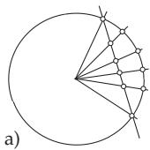
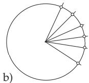
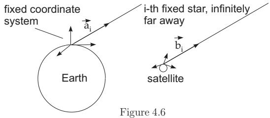

#### 4.4.3 Applications ofQuaternions

##### 4.4.3.1 3D Rotations in Computer Graphics

To describe motion flows interpolation of rotations are used. Since the 3D-rotations can be represented by unit quaternions, algorithms are developed for interpolation of rotations in computer graphics. The easiest idea is to start analogously to the definition of linear interpolation in Euclidian-spaces. Basic algorithms are Lerp, Slerp and Squad.

1. Lerp (linear interpolation)

Let $p , q \in \mathbb { H } _ { 1 }$ and $t \in [ 0 , 1 ]$ , then

$$
\mathrm { L e r p } ( p , q , t ) = p ( 1 - t ) + q t .\tag{4.143}
$$

This is a linear segment in $\mathbb { R } ^ { 4 }$ , connecting $p \in \mathbb { H } _ { 1 } \sim S ^ { 3 } \subset \mathbb { R } ^ { 4 }$ with $q \in \mathbb { H } _ { 1 } \sim S ^ { 3 } \subset \mathbb { R } ^ { 4 }$

This segment is inside of the unit sphere in $\mathbb { R } ^ { 4 }$ , and does not represent any connecting curve on the unit sphere $S ^ { 3 } \sim \mathbb { H } _ { 1 }$

Therefore the rotation is determined by normalizing the found quaternion.

This simple algorithm is almost perfect. The only problem is that after finding the interpolation points on the secant between the given points and normalizing the found quaternions, the resulted unit quaternions are not equidistant quaternions. This problem is solved by the following algorithm.

2. Slerp (Spherical linear interpolation)

Let $p , q \in \mathbb { H } _ { 1 } , \ t \in [ 0 , 1 ]$ and $\varphi \left( 0 < \varphi < \pi \right)$ the angle between p and $q$ . Then

$$
\operatorname { S l e r p } ( p , q , t ) = p ( { \overline { { p } } } q ) ^ { t } = p ^ { 1 - t } q ^ { t } = p \left[ { \frac { \sin ( ( 1 - t ) \varphi ) } { \sin \varphi } } \right] + q \left[ { \frac { \sin ( t \varphi ) } { \sin \varphi } } \right] .\tag{4.144}
$$

  
Figure 4.5

Interpolation along the great circle on the unit sphere $\mathbf { \hat { S } ^ { 3 } } \subset \mathbb { R } ^ { 4 }$ , p and q are connected; The shortest connection is chosen, $- \mathrm { S c } \left( p q \right) =$ $\langle p , q \rangle > 0$ must hold (where , denotes the dot product of p and q in $\mathbb { R } ^ { 4 } )$

In Fig.4.5 the interpolations according to Lerp(a) and Slerp(b) are compared.

$$
{ \mathrm { S l e r p } } ( p , q , t ) = \cos ( t \varphi ) + { \underline { { \mathbf { n } } } } _ { \underline { { \mathbf { q } } } } \sin ( t \varphi ) .
$$

Special case p = 1: Let $p = 1 = ( 1 , 0 , 0 , 0 ) ^ { \mathrm { T } }$ and $q = \cos \varphi + \underline { { \mathbf { n } } } _ { \underline { { \mathbf { q } } } }$ sin $\varphi$ , then

(4.145)

Special case equidistant grids: Let $\psi = { \frac { \varphi } { n } } ,$ , then

$$
q _ { k } : = \mathrm { S l e r p } ( p , q , { \frac { k } { n } } ) = { \frac { 1 } { \sin \varphi } } \left( \sin ( \varphi - k \psi ) p + \sin ( k \psi ) q \right) , \quad k = 0 , 1 , \ldots , n .\tag{4.146}
$$

Interpretation of the Slerp interpolation: To show the equivalence of the two expressions in (4.144) first $Q = p ^ { - 1 } q = { \frac { \overline { { p } } } { | p | ^ { 2 } } } q = \overline { { p } } q$ is calculated. Since $p , q \in \mathbb { H } _ { 1 }$ the scalar part is

$$
Q _ { 0 } = \mathrm { S c } Q = \mathrm { S c } \left( \overline { { { p } } } q \right) = \langle p , q \rangle = \cos \varphi .\tag{4.147}
$$

Since $p = p \cdot 1$ , and $q = p p ^ { - 1 } q = p Q$ , the interpolation between 1 and Q is multiplied by $p$ to keep the interpolation between p and $q$

$$
\begin{array} { l } { { Q ( t ) = \displaystyle \frac { \sin ( ( 1 - t ) \varphi ) } { \sin \varphi } + Q \frac { \sin ( t \varphi ) } { \sin \varphi } = \displaystyle \frac { \sin ( ( 1 - t ) \varphi ) } { \sin \varphi } + \cos \varphi \frac { \sin ( t \varphi ) } { \sin \varphi } + \vec { n } _ { \vec { Q } } \frac { \sin ( t \varphi ) } { \sin \varphi } } } \\ { { \mathrm { } = \displaystyle \frac { \sin \varphi \cos ( t \varphi ) - \sin ( t \varphi ) \cos \varphi + \sin ( t \varphi ) \cos \varphi } { \sin \varphi } + \vec { n } _ { \vec { Q } } \frac { \sin ( t \varphi ) \sin \varphi } { \sin \varphi } } } \\ { { \mathrm { } = \cos ( t \varphi ) + \vec { n } _ { \vec { Q } } \sin ( t \varphi ) = e ^ { t \vec { n } _ { \vec { Q } } \varphi } = e ^ { t \log Q } = Q ^ { t } . } } \end{array}\tag{4.148}
$$

It follows that

$$
q ( t ) = p Q ( t ) = p \frac { \sin ( ( 1 - t ) \varphi ) } { \sin \varphi } + q \frac { \sin ( t \varphi ) } { \sin \varphi } = p Q ^ { t } = p ( p ^ { - 1 } q ) ^ { t } = p ^ { 1 - t } q ^ { t } .\tag{4.149}
$$

3. Squad (spherical and quadrangle)

For $q _ { i } , q _ { i + 1 } \in \mathbb { H } _ { 1 }$ and $t \in [ 0 , 1 ]$ the rule is

$$
\begin{array} { r l } & { \mathrm { S q u a d } ( q _ { i } \ q _ { i + 1 } , \ s _ { i } , \ s _ { i + 1 } , t ) = \mathrm { S l e r p } ( \mathrm { S l e r p } ( q _ { i } , \ q _ { i + 1 } , t ) , \mathrm { S l e r p } ( s _ { i } , \ s _ { i + 1 } , t ) , 2 t ( 1 - t ) ) } \\ & { \qquad \mathrm { w i t h } \quad s _ { i } = q _ { i } \exp \left( - \frac { \log ( q _ { i } ^ { - 1 } q _ { i + 1 } ) + \log ( q _ { i } ^ { - 1 } q _ { i - 1 } ) } { 4 } \right) . } \end{array}\tag{4.150}
$$

The resulted curve is similar to a B´ezier curve, but it keeps the spherical instead of the linear interpolation.

The algorithm produces an interpolation curve for a sequence of quaternions $q _ { 0 } , q _ { 1 } , . . . , q _ { N }$

The expression is not defined in the first and last interval, since $q _ { - 1 }$ is necessary to calculate $s _ { 0 }$ and $q _ { N + 1 }$ to calculate $s _ { N }$ . A possible way out is to choose $s _ { 0 } = q _ { 0 }$ and $s _ { N } = q _ { N }$ , (or to define $q _ { - 1 }$ and $q _ { N + 1 } )$ ). There are additional algorithms based on quaternions: nlerp, log-lerp, islerp, quaternion de Casteljausplines.

##### 4.4.3.2 Interpolation by Rotation matrices

The Slerp-algorithm can be described completely analogously with the help of rotation matrices. The logarithm of a $3 \times 3$ rotation matrix R is needed (i.e. an element of group $\bar { S O } ( 3 ) )$ and it is defined by a group-theoretical context as the skew-symmetric matrix r (i.e. an element of the Lie group so $( 3 ) )$ , for which $e ^ { \mathbf { r } } = \mathbf { R }$ . Then the Slerp-algorithm can be used to interpolate between rotation matrices $\mathbf { R } _ { 0 }$ and ${ \bf R } _ { 1 }$ ,which is described as

$$
\mathbf { R } ( t ) = \mathbf { R } _ { 0 } ( \mathbf { R } _ { 0 } ^ { - 1 } \mathbf { R } _ { 1 } ) ^ { t } = \mathbf { R } _ { 0 } \exp ( t \log ( \mathbf { R } _ { 0 } ^ { - 1 } \mathbf { R } _ { 1 } ) ) .\tag{4.151}
$$

In general it is more simple to use the quaternions based algorithm and to determine ${ \bf R } ( t )$ from $q ( t )$ according to the calculations of the rotation matrix representing the unit quaternion.

##### 4.4.3.3 Stereographic Projection

$\mathrm { ~ I f ~ 1 ~ } \in \mathbb { H } _ { 1 } \sim S ^ { 3 }$ is taken as the North pole of the three dimensional sphere $S ^ { 3 }$ , then unit quaternions or elements of the three dimensional sphere can be mapped by the stereographic projection $\mathbb { H } _ { 1 } \ni q \mapsto$

$( 1 + q ) ( 1 - q ) ^ { - 1 } \in \mathbb { H } _ { 0 } \sim \mathbb { R } ^ { 3 }$ into pure quaternions or into $\mathbb { R } ^ { 3 }$ respectively. The corresponding inverse mapping is

$$
{ \bf R } ^ { 3 } \sim { \bf H } _ { 0 } \ni p \mapsto ( p - 1 ) ( p + 1 ) ^ { - 1 } \in { \bf H } _ { 1 } \sim { \cal S } ^ { 3 } .\tag{4.152}
$$

##### 4.4.3.4 Satellite navigation

The orientation of an artificial satellite circulating around the Earth is to be determined. The fixed stars are considered to be infinitely far away, so their direction with respect to the Earth and the satellite are identical (see Fig.4.6). Any diference in measurements can be deduced from the diferent coordinate systems and so from the relative rotation of the coordinate systems.

Let $\vec { \bf a } _ { i }$ be the unit vector pointing into the direction of the i-th fixed star from in the Earth’s fixed coordinate system, and $\vec { \bf b } _ { i }$ be the unit vector pointing into the direction of the i-th fixed star in the satellite’s fixed coordinate system. The relative rotation of both coordinate systems can be described by a unit quaternion $h \in \mathbb { H } _ { 1 }$

$$
\vec { \bf b } _ { i } = h \vec { \bf a } _ { i } \overline { { h } } .\tag{4.153}
$$

If more fixed stars are considered, and the data are overlapped by measuring errors, then the solution is determined by the least squares method, i.e. as the minimum of (4.154), where h is a unit quaternion and $\underline { { \mathbf { a } } } _ { i } = \vec { \mathbf { a } } _ { i }$ and $\underline { { \mathbf { b } } } _ { i } = \vec { \mathbf { b } } _ { i }$ are unit vectors:

$$
\begin{array} { l } { { \displaystyle Q ^ { 2 } = \sum _ { i = 1 } ^ { n } | \vec { \mathbf { b } } _ { i } - h \vec { \mathbf { a } } _ { i } \vec { h } | ^ { 2 } = \sum _ { i = 1 } ^ { n } ( \vec { \mathbf { b } } _ { i } - h \vec { \mathbf { a } } _ { i } \overline { { h } } ) \cdot ( \vec { \mathbf { b } } _ { i } - h \vec { \mathbf { a } } _ { i } \vec { \mathbf { h } } ) } } \\ { { \displaystyle \ = \sum _ { i = 1 } ^ { n } ( \mathbf { \underline { { b } } } _ { i } - h \mathbf { \underline { { a } } } _ { i } \overline { { h } } ) ( \mathbf { \underline { { b _ { i } - h \mathbf { a } } } _ { i } \overline { { h } } ) } = \sum _ { i = 1 } ^ { n } ( 2 - \mathbf { \underline { { b } } } _ { i } h \mathbf { \underline { { \overline { { a } } } } } _ { i } \overline { { h } } - h \mathbf { \underline { { a } } } _ { i } \overline { { h } } \mathbf { \underline { { b } } } _ { i } ) . } } \end{array}\tag{4.154}
$$

Since the group $\mathbb { H } _ { 1 }$ of the unit quaternions form a Lie group, the critical points of $Q ^ { 2 }$ can be determined by the help of derivative

$$
\partial _ { v } h = \operatorname* { l i m } _ { \vartheta  0 } { \frac { e ^ { \vartheta v } h - h } { \vartheta } } = v h \quad ( v , h { \mathrm { ~ q u a t e r n i o n s , ~ } } \vartheta { \mathrm { ~ r e a l } } )\tag{4.155}
$$

from

$$
\partial _ { v } Q ^ { 2 } = - \sum _ { i = 1 } ^ { n } \Big ( \underline { { \mathbf { b } } } _ { i } \underline { { \mathbf { v } } } h \underline { { \mathbf { \overline { { a } } } } } _ { i } \overline { { h } } + \underline { { \mathbf { b } } } _ { i } h \underline { { \mathbf { \overline { { a } } } } } _ { i } \overline { { ( \underline { { \mathbf { v } } } h ) } } + \underline { { \mathbf { v } } } h \underline { { \mathbf { a } } } _ { i } \overline { { h } } \underline { { \mathbf { \overline { { b } } } } } _ { i } + h \underline { { \mathbf { a } } } _ { i } \overline { { ( \underline { { \mathbf { v } } } h ) } } \underline { { \mathbf { \overline { { b } } } } } _ { i } \Big ) = 0 .\tag{4.156}
$$

Here v , b and $h \mathbf { \underline { { a } } } _ { i } \overline { { h } }$ are pure quaternions, so $\begin{array} { r } { \underline { { \mathbf { \Pi } } } \overline { { \mathbf { v } } } = - \underline { { \mathbf { v } } } . } \end{array}$ , and therefore (4.156) can be simplified:

$$
\partial _ { \underline { { \mathbf { v } } } } Q ^ { 2 } = - 4 \underline { { \mathbf { v } } } \cdot \left( \sum _ { i = 1 } ^ { n } h \vec { \bf a } _ { i } \overline { { h } } \times \underline { { \mathbf { b } } } _ { i } \right) = 0 .\tag{4.157}
$$

Since here $\underline { { \mathbf { v } } }$ is arbitrary, this expression vanishes if

$$
\sum _ { i = 1 } ^ { n } h \vec { \mathbf { a } } _ { i } \overline { { h } } \times \mathbf { \underline { { b } } } _ { i } = \underline { { \mathbf { 0 } } } .\tag{4.158}
$$

Let R be the rotation matrix represented by the unit quaternion h, i.e. h a $\overline { { \mathbf { \Lambda } } } _ { i } \overline { { h } } = \mathbf { R } \vec { \mathbf { a } } _ { i }$ . With the $3 \times 3$

matrix

$$
\mathbf { K } ( \vec { \mathbf { a } } ) = \left( \begin{array} { c c c } { 0 } & { - a _ { z } } & { a _ { y } } \\ { a _ { z } } & { 0 } & { - a _ { x } } \\ { - a _ { y } } & { a _ { x } } & { 0 } \end{array} \right)\tag{4.159}
$$

defined by vector $\vec { \bf a } = ( a _ { x } , a _ { y } , a _ { z } ) \in \mathbb { R } ^ { 3 }$ for any vector $\vec { \bf b } \in \mathbb { R } ^ { 3 }$ one gets:

$$
{ \bf K } ( \vec { \bf a } ) \vec { \bf b } = \vec { \bf a } \times \vec { \bf b } , \qquad { \bf K } ( { \bf K } ( \vec { \bf a } ) \vec { \bf b } ) = \vec { \bf b } \vec { \bf a } ^ { \mathrm { T } } - \vec { \bf a } \vec { \bf b } ^ { \mathrm { T } } .\tag{4.160}
$$

From this relation the critical points of the minimum problems are determined:

$$
\sum _ { i = 1 } ^ { n } \mathbf { K } \left( \mathbf { R } { \vec { \mathbf { a } } } _ { i } \times { \vec { \mathbf { b } } } _ { i } \right) = { \boldsymbol { 0 } } \Longleftrightarrow \sum _ { i = 1 } ^ { n } ( { \vec { \mathbf { b } } } _ { i } { \vec { \mathbf { a } } } _ { i } ^ { \mathrm { T } } \mathbf { R } ^ { \mathrm { T } } - \mathbf { R } { \vec { \mathbf { a } } } _ { i } { \vec { \mathbf { b } } } _ { i } ^ { \mathrm { T } } ) = { \boldsymbol { 0 } } \Longleftrightarrow \mathbf { R } \mathbf { P } = \mathbf { P } ^ { \mathrm { T } } \mathbf { R } ^ { \mathrm { T } }\tag{4.161}
$$

where $\begin{array} { r } { \mathbf { P } = \sum _ { i = 1 } ^ { n } \vec { \mathbf { a } } _ { i } \vec { \mathbf { b } } _ { i } ^ { \mathrm { T } } } \end{array}$ . If P is decomposed into the product $\mathbf { P } = \mathbf { R } _ { p } ^ { \mathrm { T } } \mathbf { S }$ , where matrix $S$ is symmetric and $\mathbf { P } = \mathbf { R } _ { p }$ is a rotation matrix, then from (4.161) follows

$$
\mathbf { R } \mathbf { R } _ { p } ^ { \mathrm { T } } \mathbf { S } = \mathbf { S } \mathbf { R } _ { p } \mathbf { R } ^ { \mathrm { T } } ,\tag{4.162}
$$

and

$$
{ \bf R } = { \bf R } _ { p }\tag{4.163}
$$

is obviously a solution, since in this case $\mathbf R _ { p } \mathbf R _ { p } ^ { \mathrm { T } } \mathbf S = \mathbf S = \mathbf S \mathbf R _ { p } \mathbf R _ { p } ^ { \mathrm { T } }$ , because $\mathbf { R } _ { p } \mathbf { R } _ { p } ^ { \mathrm { T } } = \mathbf { E }$ . However there are three other solutions, namely

$$
{ \bf R } = { \bf R } _ { j } { \bf R } _ { p } \quad ( j = 1 , 2 , 3 ) ,\tag{4.164}
$$

where ${ \bf R } _ { j }$ denotes the rotation by $\pi$ around the j-th eigenvector of S , i.e., there is $\mathbf { R _ { j } S R _ { j } } = \mathbf { S }$ . That ${ \bf R } = { \bf R } _ { j } { \bf R } _ { \nu }$ is a solution of (4.162) which can be seen from ${ \bf R } _ { j } { \bf R } _ { p } { \bf R } _ { p } ^ { \mathrm { T } } { \bf S } = { \bf S } { \bf R } _ { p } { \bf R } _ { p } ^ { \mathrm { T } } { \bf R } _ { j } ^ { \mathrm { T } } \Longleftrightarrow { \bf R } _ { j } { \bf S } =$ $\mathbf { S } \mathbf { R } _ { j } ^ { \mathrm { T } } \Longleftrightarrow \mathbf { R } _ { j } \mathbf { S } \mathbf { R } _ { j } = \mathbf { S }$

The solution for which $Q ^ { 2 }$ is minimal is

$$
\mathbf { R } = \left\{ \begin{array} { l l } { \mathbf { R } _ { p } , \quad \mathrm { f a l l s } \quad \mathrm { d e t } \mathbf { P } > 0 , } \\ { \mathbf { R } _ { j _ { 0 } } \mathbf { R } _ { p } , \mathrm { f a l l s } \quad \mathrm { d e t } \mathbf { P } < 0 , } \end{array} \right.\tag{4.165}
$$

where ${ \bf R } _ { j _ { 0 } }$ is the rotation by π around the eigenvector of $\mathbf { S }$ associated with the eigenvalue of the smallest absolute value.

##### 4.4.3.5 Vector Analysis

If the $\nabla$ operator (see (13.67), 13.2.6.1, p. 715) and a vector $\vec { \bf v }$ (see 13.1.3, p. 704) are identified with $\nabla _ { Q }$ and v in quaternion calculus, i.e.

$$
\nabla _ { Q } = { \mathbf i } \frac { \partial } { \partial x } + { \mathbf j } \frac { \partial } { \partial y } + { \mathbf k } \frac { \partial } { \partial z } ,\tag{4.166}
$$

$$
\underline { { \mathbf { v } } } ( x , y , z ) = v _ { 1 } ( x , y , z ) \mathbf { i } + v _ { 2 } ( x , y , z ) \mathbf { j } + v _ { 3 } ( x , y , z ) \mathbf { k }\tag{4.167}
$$

with i , j , k (according to (4.107), p. 290), then the multiplication rule for quaternions (see (4.109b), p. 291) gives

$$
\nabla _ { Q } \underline { { \mathbf { v } } } = - \nabla \cdot \vec { \mathbf { v } } + \nabla \times \vec { \mathbf { v } } = - \mathrm { d i v } \vec { \mathbf { v } } + \mathrm { r o t } \vec { \mathbf { v } } ,\tag{4.168}
$$

(see also in 4.4.1.1, 4. p. 291).

Substituting

$$
D = { \frac { \partial } { \partial t } } + \mathbf { i } { \frac { \partial } { \partial x } } + \mathbf { j } { \frac { \partial } { \partial y } } + \mathbf { k } { \frac { \partial } { \partial z } } \quad { \mathrm { a n d } }\tag{4.169a}
$$

$$
\begin{array} { c } { { w ( t , x , y , z ) = w _ { 0 } ( t , x , y , z ) + w _ { 1 } ( t , x , y , z ) { \mathbf { i } } + w _ { 2 } ( t , x , y , z ) { \mathbf { j } } + w _ { 3 } ( t , x , y , z ) { \mathbf { k } } } } \\ { { { } } } \\ { { { } = w _ { 0 } ( t , x , y , z ) + { \underline { { { \bf w } } } } ( t , x , y , z ) , } } \end{array}\tag{4.169b}
$$

then

$$
{ \cal D } w = \frac { \partial } { \partial t } w _ { 0 } - \mathrm { d i v } { \bf \underline { { w } } } + \mathrm { r o t } { \bf \underline { { w } } } + \mathrm { g r a d } w _ { 0 } .\tag{4.169c}
$$

Especially, for an arbitrary twice continuously diferentiable function $f ( t , x , y , z )$

$$
\nabla _ { Q } \overline { { \nabla } } _ { Q } f = \overline { { \nabla } } _ { Q } \nabla _ { Q } f = \nabla \nabla f = { \frac { \partial ^ { 2 } f } { \partial x ^ { 2 } } } + { \frac { \partial ^ { 2 } f } { \partial y ^ { 2 } } } + { \frac { \partial ^ { 2 } f } { \partial z ^ { 2 } } } = \Delta _ { 3 } f \quad { \mathrm { u n d } } { \mathrm { } }\tag{4.170a}
$$

$$
\nabla _ { Q } \nabla _ { Q } f = - \nabla \nabla f = - \frac { \partial ^ { 2 } f } { \partial x ^ { 2 } } - \frac { \partial ^ { 2 } f } { \partial y ^ { 2 } } - \frac { \partial ^ { 2 } f } { \partial z ^ { 2 } } = - \Delta _ { 3 } f ,\tag{4.170b}
$$

where $\Delta _ { 3 }$ denotes the Laplace operator in $\mathbb { R } ^ { 3 }$ (see (13.75) in 13.2.6.5, p. 716).

$$
D \overline { { { D } } } f = \overline { { { D } } } D f = \frac { \partial ^ { 2 } f } { \partial t ^ { 2 } } + \frac { \partial ^ { 2 } f } { \partial x ^ { 2 } } + \frac { \partial ^ { 2 } f } { \partial y ^ { 2 } } + \frac { \partial ^ { 2 } f } { \partial z ^ { 2 } } = \Delta _ { 4 } f\tag{4.170c}
$$

where $\Delta _ { 4 }$ denotes the Laplace-operator in $\mathbb { R } ^ { 4 }$ . $\nabla _ { Q } ,$ , just as D is often called the Dirac- or Cauchy-Riemann operator.

##### 4.4.3.6 Normalized Quaternions and Rigid Body Motion

1. Biquaternions

A biquaternion hˇ has the form

$$
\breve { h } = h _ { 0 } + \epsilon h _ { 1 } , \quad \mathrm { w i t h } \quad h _ { 0 } , h _ { 1 } \in \mathbb { H }\tag{4.171}
$$

Here  is the dual unit, that commutes with every quaternion, furthermore $\epsilon ^ { 2 } = 0$ . The multiplication is the usual quaternion multiplication (see 4.115, p. 292).

2. Rigid Body Motion

By the help of unit biquaternions, i.e. biquaternions with

$$
\begin{array} { r } { \check { h } \overline { { \check { h } } } = ( h _ { 0 } + \epsilon h _ { 1 } ) ( \overline { { h } } _ { 0 } + \epsilon \overline { { h } } _ { 1 } ) = 1 \iff \left\{ \begin{array} { l l } { \qquad h _ { 0 } \overline { { h } } _ { 0 } = 1 , } \\ { h _ { 0 } \overline { { h } } _ { 1 } + h _ { 1 } \overline { { h } } _ { 0 } = 0 , } \end{array} \right. } \end{array}\tag{4.172}
$$

rigid-body motion (rotation and translation after each other) can be described in $\mathbb { R } ^ { 3 }$

Table 4.1 Rigid body motions with biquaternions
<table><tr><td rowspan=1 colspan=1>Element</td><td rowspan=1 colspan=1>Representation by</td></tr><tr><td rowspan=1 colspan=1>point $\underline { { \mathbf { p } } } = ( p _ { x } , p _ { y } , p _ { z } )$ in space</td><td rowspan=1 colspan=1> $\overline { { p = 1 + { \underline { { p } } } \epsilon \mathrm { \ w i t h } { \underline { { p } } } = p _ { x } { \bf i } + p _ { y } { \bf j } + p _ { z } { \bf k } } }$ </td></tr><tr><td rowspan=1 colspan=1>rotations</td><td rowspan=1 colspan=1> $r \in \mathbb { H } _ { 1 }$ unit quaternions</td></tr><tr><td rowspan=1 colspan=1>translations $\underline { { \mathbf { t } } } = ( t _ { x } , t _ { y } , t _ { z } )$ </td><td rowspan=1 colspan=1> $1 + { \frac { 1 } { 2 } } \mathbf { \underline { { t } } } \epsilon \operatorname { w i t h } \mathbf { \underline { { t } } } = t _ { x } \mathbf { i } + t _ { y } \mathbf { j } + t _ { z } \mathbf { k }$ </td></tr></table>

The unit biquaternions

$$
\breve { h } = h _ { 0 } + h _ { 1 } \epsilon = \left( 1 + \frac { 1 } { 2 } \underline { { \mathbf { t } } } \epsilon \right) r = r + \frac { 1 } { 2 } \underline { { \mathbf { t } } } r \epsilon , \quad \underline { { \mathbf { t } } } \in \mathbb { H } _ { 0 } , \quad r \in \mathbb { H } _ { 1 } ,\tag{4.173}
$$

give a double covering over the group $\mathbf { S E ( 3 ) }$ of the rigid-body motion in $\mathbb { R } ^ { 3 }$ since $\check { h }$ and $- \tilde { h }$ describe the same rigid-body motion.
