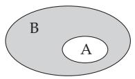
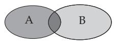
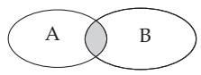
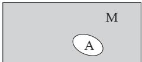
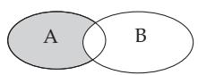
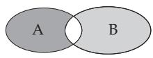
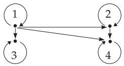
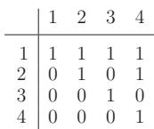
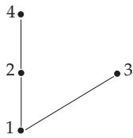

### 5.2 Set Theory

#### 5.2.1 Concept of Set, Special Sets

The founder of set theory is Georg Cantor (1845–1918). The importance of the notion introduced by him became well known only later. Set theory has a decisive role in all branches of mathematics, and today it is an essential tool of mathematics and its applications.

1. Membership Relation

1. Sets and their Elements The fundamental notion of set theory is the membership relation. A set A is a collection of certain diferent things a (objects, ideas, etc.) that belong together for certain reasons. These objects are called the elements of the set. One writes $\ " a \in A ^ {  } \ \mathrm { o r } \ \ " a \not \in A "$ to denote $^ { 6 6 } a$ is an element of $A ^ { \dag }$ or $^ { 6 6 } a$ is not an element of $A ^ { \ast }$ , respectively. Sets can be given by enumerating their elements in braces, ${ \mathrm { e . g . , } } M = \{ a , b , c \} { \mathrm { o r } } U = \{ 1 , 3 , 5 , \ldots \}$ , or by a defining property possessed exactly by the elements of the set. For instance the set U of the odd natural numbers is defined and denoted by ${ \dot { U } } = \{ x \mid x$ is an odd natural number . For number domains the following notation is generally used:

IN = 0, 1, 2, . . . set of the natural numbers,   
Z = 0, 1, 1, 2, 2, . . . set of the integers,   
$\mathbb { Q } = \left\{ { \frac { p } { q } } { \Big | } p , q \in \mathbb { Z } \wedge q \neq 0 \right\}$ set of the rational numbers,   
IR set of the real numbers,   
C set of the complex numbers.

2. Principle of Extensionality for Sets Two sets A and B are identical if and only if they have exactly the same elements, i.e.,

$$
A = B \Leftrightarrow \forall x ( x \in A \Leftrightarrow x \in B ) .\tag{5.36}
$$

The sets 3, 1, 3, 7, 2 and $\{ 1 , 2 , 3 , 7 \}$ are the same.

A set contains every element only “once”, even if it is enumerated several times.

2. Subsets

1. Subset If A and B are sets and

$$
\forall x ( x \in A \Rightarrow x \in B )\tag{5.37}
$$

holds, then A is called a subset of B, and this is denoted by $A \subseteq B$ . In other words: A is a subset of B, if all elements of A also belong to B. If for $A \subseteq B$ there are some further elements in B such that they are not in A, then A is called a proper subset of B, and it is denoted by $A \subset B ( \mathbf { F i g . 5 . 1 } )$ . Obviously, every set is a subset of itself $A \subseteq A$

Suppose $A = \{ 2 , 4 , 6 , 8 , 1 0 \}$ is a set of even numbers and $B = \{ 1 , 2 , 3 , \ldots , 1 0 \}$ is a set of natural numbers. Since the set A does not contain odd numbers, A is a proper subset of B.

2. Empty Set or Void Set It is important and useful to introduce the notion of empty set or void set, , which has no element. Because of the principle of extensionality, there exists only one empty set.

A: The set $\{ x | x \in \mathbb { R } \land x ^ { 2 } + 2 x + 2 = 0 \}$ is empty.

B: $\emptyset \subseteq M$ for every set M, i.e., the empty set is a subset of every set M.

For a set A the empty set and A itself are called the trivial subsets of A.

3. Equality of Sets Two sets are equal if and only if both are subsets of each other:

$$
A = B \Leftrightarrow A \subseteq B \land B \subseteq A .\tag{5.38}
$$

This fact is very often used to prove that two sets are identical.

4. Power Set The set of all subsets A of a set M is called the power set of M and it is denoted by $\mathbb { P } ( M ) , \mathrm { i . e . , } \mathbb { P } ( M ) = \{ A \mid A \subseteq M \}$

For the set $M = \{ a , b , c \}$ the power set is

$$
{ \bf P } ( M ) = \{ \emptyset , \{ a \} , \{ b \} , \{ c \} , \{ a , b \} , \{ a , c \} , \{ b , c \} , \{ a , b , c \} \} .
$$

It is true that:

a) If a set M has m elements, its power set $\mathbb { P } ( M )$ has $2 ^ { m }$ elements.

b) For every set M there are $M , \varnothing \in \mathbb { P } ( M ) , { \mathrm { i . e . } }$ , M itself and the empty set are elements of the power set of M.

5. Cardinal number The number of elements of a finite set M is called the cardinal number of M and it is denoted by card M or sometimes by M .

For the the cardinal number of sets with infinitely many elements see 5.2.5, p. 335.

#### 5.2.2 Operations with Sets

1. Venn diagram

The graphical representations of sets and set operations are the so-called Venn diagrams, when representing sets by plane figures. So, Fig. 5.1, represents the subset relation $A \subseteq B$

2. Union, Intersection, Complement

By set operations new sets can be formed from the given sets in diferent ways:

  
Figure 5.1  
Figure 5.2  
Figure 5.3

$$
A \cup B = \{ x \mid x \in A \lor x \in B \} ,\tag{5.39}
$$

in words $^ { 6 6 } A$ union $B ^ { \prime \prime } \ \mathrm { o r } \ ^ { \ast } A$ cup $B ^ { \ast }$ . If A and B are given by the properties $E _ { 1 }$ and $E _ { 2 }$ respectively, the union set A B has the elements possessing at least one of these properties, i.e., the elements belonging to at least one of the sets. In Fig. 5.2 the union set is represented by the shaded region.

1, 2, 3 2, 3, 5, 6 = 1, 2, 3, 5, 6 .

2. Intersection Let A and B be two sets. The intersection set, intersection, cut or cut set (denoted by A B) is defined by

$$
A \cap B = \{ x \mid x \in A \land x \in B \} ,\tag{5.40}
$$

in words “A intersected by $B ^ { \ast }$ or $^ { 6 6 } A$ cap $B ^ { \ast }$ . If A and B are given by the properties $E _ { 1 }$ and $E _ { 2 }$ respectively, the intersection A B has the elements possessing both properties $E _ { 1 }$ and $E _ { 2 }$ , i.e., the elements belonging to both sets. In Fig. 5.3 the intersection is represented by the shaded region.

With the intersection of the sets of divisors $T ( a )$ and $T ( b )$ of two numbers a and b one can define the greatest common divisor (see 5.4.1.4, p. 373). For a = 12 and b = 18 holds $T ( a ) = \{ 1 , 2 , 3 , 4 , 6 , 1 2 \}$ and $\breve { T } ( b ) = \{ 1 , 2 , 3 , 6 , 9 , 1 8 \}$ , so T(12)  T(18) contains the common divisors, and the greatest common divisor is g.c.d. (12, 18) = 6.

3. Disjoint Sets Two sets A and B are called disjoint if they have no common element; for them A B = (5.41)

holds, i.e., their intersection is the empty set.

The set of odd numbers and the set of even numbers are disjoint; their intersection is the empty set, i.e.,

$$
\mathrm { \{ o d d ~ n u m b e r s \} \cap \{ e v e n ~ n u m b e r s \} = \emptyset . }
$$

4. Complement Considering only the subsets of a given set M, then the complementary set or the complement $C _ { M } ( A )$ of A with respect to M contains all the elements of M not belonging to A:

$$
C _ { M } ( { \cal { A } } ) = \{ x \mid x \in M \land x \notin { \cal { A } } \} ,\tag{5.42}
$$

in words “complement of A with respect to $M ^ { \ast }$ , and M is called the fundamental set or sometimes the universal set. If the fundamental set M is obvious from the considered problem, then the notation A is also used for the complementary set. In Fig. 5.4 the complement A is represented by the shaded region.

  
Figure 5.4

  
Figure 5.5

  
Figure 5.6

3. Fundamental Laws of Set Algebra

These set operations have analoguous properties to the operations in logic. The fundamental laws of set algebra are:

1. Associative Laws

$$
( A \cap B ) \cap C = A \cap ( B \cap C ) ,\tag{5.43}
$$

$$
( A \cup B ) \cup C = A \cup ( B \cup C ) .\tag{5.44}
$$

2. Commutative Laws

$$
A \cap B = B \cap A ,\tag{5.45}
$$

$$
A \cup B = B \cup A .\tag{5.46}
$$

3. Distributive Laws

$$
( A \cup B ) \cap C = ( A \cap C ) \cup ( B \cap C ) ,\tag{5.47}
$$

$$
( A \cap B ) \cup C = ( A \cup C ) \cap ( B \cup C ) .\tag{5.48}
$$

4. Absorption Laws

$$
A \cap ( A \cup B ) = A ,\tag{5.49}
$$

$$
A \cup ( A \cap B ) = A .\tag{5.50}
$$

5. Idempotence Laws

$$
A \cap A = A ,\tag{5.51}
$$

$$
A \cup A = A .\tag{5.52}
$$

6. De Morgan Laws

$$
{ \overline { { A \cap B } } } = { \overline { { A } } } \cup { \overline { { B } } } ,\tag{5.53}
$$

$$
{ \overline { { A \cup B } } } = { \overline { { A } } } \cap { \overline { { B } } } .\tag{5.54}
$$

7. Some Further Laws

$$
A \cap { \overline { { A } } } = \varnothing ,\tag{5.55}
$$

$$
A \cup { \overline { { A } } } = M ( M { \mathrm { ~ f u n d a m e n t a l ~ s e t } } ) , ( 5 . 5 6 )
$$

$$
A \cap M = A ,\tag{5.57}
$$

$$
A \cup \varnothing = A ,\tag{5.58}
$$

$$
A \cap \varnothing = \varnothing ,\tag{5.59}
$$

$$
A \cup M = M ,\tag{5.60}
$$

$$
{ \overline { { M } } } = \emptyset ,\tag{5.61}
$$

$$
{ \overline { { \varnothing } } } = M .\tag{5.62}
$$

$$
{ \overline { { \overline { { A } } } } } = A .\tag{5.63}
$$

This table can also be obtained from the fundamental laws of propositional calculus (see 5.1.1, p. 323) using the following substitutions: by , by , T by M, and F by . This coincidence is not accidental; it will be discussed in 5.7, p. 395.

4. Further Set Operations

In addition to the operations defined above there are defined some further operations between two sets A and B: the diference set or diference A B, the symmetric diference $A \triangle B$ and the Cartesian product $A \times B$

1. Diference of Two Sets The set of the elements of A, not belonging to B is the diference set or diference of A and B:

$$
A \setminus B = \{ x \mid x \in A \land x \not \in B \} .\tag{5.64a}
$$

If A is defined by the property $E _ { 1 }$ and B by the property $E _ { 2 }$ , then $A \backslash B$ contains the elements having the property $E _ { 1 }$ but not having property $E _ { 2 }$

In Fig. 5.5 the diference is represented by the shaded region.

1, 2, 3, 4 3, 4, 5 = 1, 2 .

2. Symmetric Diference of Two Sets The symmetric diference $A \triangle B$ is the set of all elements belonging to exactly one of the sets A and B:

$$
A \triangle B = \{ x \mid ( x \in A \land x \notin B ) \lor ( x \in B \land x \notin A ) \} .\tag{5.64b}
$$

It follows from the definition that

$$
A \triangle B = ( A \setminus B ) \cup ( B \setminus A ) = ( A \cup B ) \setminus ( A \cap B ) ,\tag{5.64c}
$$

i.e., the symmetric diference contains the elements which have exactly one of the defining properties $E _ { 1 } \ ( \mathrm { f o r } \ A )$ and $E _ { 2 } \ ( \mathrm { f o r } \ B )$

In Fig. 5.6 the symmetric diference is represented by the shaded region.

$$
\begin{array} { r l } { { } } & { { } \{ 1 , 2 , 3 , 4 \} \triangle \{ 3 , 4 , 5 \} = \{ 1 , 2 , 5 \} . } \end{array}
$$

3. Cartesian Product of Two Sets The Cartesian product of two sets $A \times B$ is defined by

$$
A \times B = \{ ( a , b ) \mid a \in A \land b \in B \} .\tag{5.65a}
$$

The elements $( a , b )$ of $A \times B$ are called ordered pairs and they are characterized by

$$
( a , b ) = ( c , d ) \Leftrightarrow a = c \wedge b = d .\tag{5.65b}
$$

The number of the elements of a Cartesian product of two finite sets is equal to

$$
\operatorname { c a r d } ( A \times B ) = ( \operatorname { c a r d } A ) ( \operatorname { c a r d } B ) .\tag{5.65c}
$$

A: For $A = \{ 1 , 2 , 3 \}$ and $B = \{ 2 , 3 \}$ one gets $A \times B = \{ ( 1 , 2 ) , ( 1 , 3 ) , ( 2 , 2 ) , ( 2 , 3 ) , ( 3 , 2 ) , ( 3 , 3 ) \}$ and $B \times A = \{ ( \hat { 2 } , 1 ) , ( \hat { 2 } , 2 ) , ( 2 , 3 ) , ( \hat { 3 } , 1 ) , ( 3 , 2 ) , ( 3 , 3 ) \}$ with card $A = 3$ , card $B = 2$ , card $( A \times B ) =$ card $( B \times A ) = { \overrightarrow { 6 } }$

B: Every point of the $x , y$ plane can be defined with the Cartesian product $\mathbb { R } \times \mathbb { R }$ (IR is the set of real numbers). The set of the coordinates x, y is represented by $\mathbb { R } \times \mathbb { R } ,$ so:

$$
\mathbb { R } ^ { 2 } = \mathbb { R } \times \mathbb { R } = \{ ( x , y ) \mid x \in \mathbb { R } , y \in \mathbb { R } \} .
$$

4. Cartesian Product of n Sets

From n elements, by fixing an order of sequence (first element, second element, . . . , n-th element) an ordered n tuple is defined. If $a _ { i } \in A _ { i } ( i = 1 , 2 , \ldots , n )$ are the elements, the n tuple is denoted by $( a _ { 1 } , a _ { 2 } , \ldots , a _ { n } )$ , where $a _ { i }$ is called the i-th component.

For $n = 3 , 4 , 5$ these n tuples are called triples, quadruples, and quintuples.

The Cartesian product of n terms $A _ { 1 } \times A _ { 2 } \times \cdots \times A _ { n }$ is the set of all ordered n tuples $( a _ { 1 } , a _ { 2 } , \ldots , a _ { n } )$ with $a _ { i } \in A _ { i }$

$$
A _ { 1 } \times \ldots \times A _ { n } = \{ ( a _ { 1 } , \ldots , a _ { n } ) \mid a _ { i } \in A _ { i } ( i = 1 , \ldots , n ) \} .\tag{5.66a}
$$

If every $A _ { i }$ is a finite set, the number of ordered n tuples is

$$
\operatorname { c a r d } ( A _ { 1 } \times A _ { 2 } \times \cdots \times A _ { n } ) = \operatorname { c a r d } A _ { 1 } \operatorname { c a r d } A _ { 2 } \cdot \cdot \cdot \operatorname { c a r d } A _ { n } .\tag{5.66b}
$$

Remark: The n times Cartesian product of a set A with itself is denoted by $A ^ { n }$

#### 5.2.3 Relations and Mappings

1. n ary Relations

Relations define correspondences between the elements of one or diferent sets. An n ary relation or n-place relation R between the sets $A _ { 1 } , \ldots , A _ { n }$ is a subset of the Cartesian product of these sets, $\mathrm { i . e . , }$ $R \subseteq A _ { 1 } \times \ldots \times A _ { n }$ . If the sets $A _ { i } , i = 1 , \dotsc , n$ , are all the same set A, then $R \subseteq A ^ { n }$ holds and it is called an n ary relation in the set A.

2. Binary Relations

1. Notion of Binary Relations of a Set The two-place (binary) relations in a set have special importance.

In the case of a binary relation the notation aRb is also very common instead of $( a , b ) \in R$

As an example, the divisibility relation in the set $A = \{ 1 , 2 , 3 , 4 \}$ is considered, i.e., the binary relation

$$
\begin{array} { r l } & { T = \{ ( a , b ) \mid a , b \in A \land \ a \mathrm { ~ i s ~ a ~ d i v i s o r ~ o f ~ } b \} } \\ & { \quad = \{ ( 1 , 1 ) , ( 1 , 2 ) , ( 1 , 3 ) , ( 1 , 4 ) , ( 2 , 2 ) , ( 2 , 4 ) , ( 3 , 3 ) , ( 4 , 4 ) \} . } \end{array}\tag{5.67a}
$$

(5.67b)

2. Arrow Diagram or Mapping Function Finite binary relations R in a set A can be represented by arrow functions or arrow diagrams or by relation matrices. The elements of A are represented as points of the plane and an arrow goes from a to b if aRb holds.

Fig. 5.7 shows the arrow diagram of the relation $T$ in $A = \{ 1 , 2 , 3 , 4 \}$

  
Figure 5.7

  
Scheme: Relation matrix

3. Relation Matrix The elements of A are used as row and column entries of a matrix (see 4.1.1, 1., p. 269). At the intersection point of the row of $a \in A$ with the column of $b \in B$ there is an entry 1 if aRb holds, otherwise there is an entry 0. The above scheme shows the relation matrix for T in $A = \{ 1 , 2 , 3 , 4 \}$

3. Relation Product, Inverse Relation

Relations are special sets, so the usual set operations (see 5.2.2, p. 328) can be performed between relations. Besides them, for binary relations, the relation product and the inverse relation also have special importance.

Let $R \subseteq A \times B$ and $S \subseteq B \times C$ be two binary relations. The product $R \circ S$ of the relations R, S is defined by

$$
R \circ S = \{ ( a , c ) \mid \exists b ( b \in B \land a R b \land b S c ) \} .\tag{5.68}
$$

The relation product is associative, but not commutative.

The inverse relation $R ^ { - 1 }$ of a relation R is defined by

$$
R ^ { - 1 } = \{ ( b , a ) \mid ( a , b ) \in R \} .\tag{5.69}
$$

For binary relations in a set A the following relations are valid:

$$
( R \cup S ) \circ T = ( R \circ T ) \cup ( S \circ T ) , \quad ( 5 . 7 0 \mathrm { a } ) \qquad \qquad ( R \cap S ) \circ T \subseteq ( R \circ T ) \cap ( S \circ T ) ,\tag{5.70b}
$$

$$
( R \cup S ) ^ { - 1 } = R ^ { - 1 } \cup S ^ { - 1 } ,\tag{5.70c}
$$

$$
( R \cap S ) ^ { - 1 } = R ^ { - 1 } \cap S ^ { - 1 } ,\tag{5.70d}
$$

$$
( R \circ S ) ^ { - 1 } = S ^ { - 1 } \circ R ^ { - 1 } .\tag{5.70e}
$$

4. Properties of Binary Relations

A binary relation in a set A can have special important properties:

R is called

$$
r e f l e x i v e , \mathrm { i f } \forall a \in A a R a ,\tag{5.71a}
$$

$$
i r r e f l e x i v e , \mathrm { i f } \forall a \in A \neg a R a ,\tag{5.71b}
$$

$$
s y m m e t r i c , \mathrm { i f } \forall a , b \in A ( a R b \Rightarrow b R a ) ,\tag{5.71c}
$$

$$
a n t i s y m m e t r i c , \enspace \mathrm { i f } \enspace \forall a , b \in A ( a R b \wedge b R a \Rightarrow a = b ) ,\tag{5.71d}
$$

$$
t r a n s i t i v e , \mathrm { i f } \forall a , b , c \in A ( a R b \land b R c \Rightarrow a R c ) ,\tag{5.71e}
$$

$$
l i n e a r , \mathrm { i f } \forall a , b \in A ( a R b \lor b R a ) .\tag{5.71f}
$$

These relations can also be described by the relation product. For instance: a binary relation is transitive if $R \circ R \subseteq R$ holds. Especially interesting is the transitive closure tra(R) of a relation R. It is the smallest (with respect to the subset relation) transitive relation which contains R. In fact

$$
\operatorname { t r a } ( R ) = \bigcup _ { n \geq 1 } R ^ { n } = R ^ { 1 } \cup R ^ { 2 } \cup R ^ { 3 } \cup \cdots ,\tag{5.72}
$$

where $R ^ { n }$ is the n times relation product of R with itself.

Let a binary relation R on the set 1, 2, 3, 4, 5 be given by its relation matrix M:

<table><tr><td>M</td><td>1</td><td>2</td><td>3</td><td></td><td>4 5</td><td></td><td> $M ^ { 2 }$ </td><td>1</td><td>2</td><td>3</td><td>4</td><td>5</td><td>M3</td><td>1</td><td>2</td><td>3</td><td>4</td><td>5</td></tr><tr><td></td><td></td><td></td><td></td><td>00</td><td>11</td><td></td><td>1</td><td>10</td><td>1</td><td>0</td><td>1</td><td>1</td><td></td><td></td><td>1</td><td>0</td><td>1</td><td>1</td></tr><tr><td></td><td>100</td><td>00</td><td></td><td></td><td>00</td><td></td><td>2345</td><td>1</td><td></td><td>0</td><td>0 1</td><td></td><td></td><td>10</td><td>1</td><td>0</td><td></td><td></td></tr><tr><td></td><td></td><td>0</td><td>1</td><td>0</td><td>1</td><td></td><td>0</td><td>1</td><td>1</td><td>0</td><td>1</td><td></td><td>12345</td><td>0</td><td>1</td><td></td><td></td><td></td></tr><tr><td>12345</td><td>00</td><td>1</td><td>0</td><td>0</td><td>1</td><td></td><td></td><td>1</td><td></td><td>0</td><td>0</td><td></td><td></td><td>00</td><td></td><td>0</td><td></td><td></td></tr><tr><td></td><td></td><td>1</td><td>0</td><td>0</td><td>0</td><td></td><td>00</td><td>0</td><td>0</td><td>1</td><td>0</td><td></td><td></td><td></td><td>1</td><td>0</td><td>0</td><td>1</td></tr></table>

Calculating $M ^ { 2 }$ by matrix multiplication where the values 0 and 1 are treated as truth values and instead of multiplication and addition one performs the logical operations conjunction and disjunction, then, $M ^ { 2 }$ is the relation matrix belonging to $R ^ { 2 }$ . The relation matrices of $R ^ { 3 } , R ^ { 4 }$ etc. can be calculated similarly.

<table><tr><td> $M \vee M ^ { 2 } \vee M ^ { 3 }$ </td><td>1 2</td><td>3</td><td>4</td><td>5</td></tr><tr><td></td><td>11</td><td></td><td>1</td><td>1</td></tr><tr><td></td><td>10000</td><td>00</td><td></td><td></td></tr><tr><td></td><td></td><td></td><td></td><td></td></tr><tr><td></td><td></td><td></td><td></td><td></td></tr><tr><td></td><td></td><td></td><td></td><td></td></tr></table>

The relation matrix of $R \cup R ^ { 2 } \cup R ^ { 3 }$ (the matrix on the left) can be get by calculating the disjunction elementwise of the matrices $M , { \dot { M } } ^ { 2 }$ and $M ^ { 3 }$ . Since the higher powers of M contains no new 1-s, this matrix already coincides with the relation matrix of tra(R).

The relation matrix and relation product have important applications in search of path length in graph theory (see 5.8.2.1, p. 404).

In the case of finite binary relations, one can easily recognize the above properties from the arrow diagrams or from the relation matrices. For instance one can recognize the reflexivity from “self-loops” in the arrow diagram, and from the main diagonal elements 1 in the relation matrix. Symmetry is obvious in the arrow diagram if to every arrow there belongs another one in the opposite direction, or if the relation matrix is a symmetric matrix (see 5.2.3, 2., p. 331). Easy to see from the arrow diagram or from the relation matrix that the divisibility T is a reflexive but not symmetric relation.

5. Mappings

A mapping or function f (see 2.1.1.1, p. 48) from a set A to a set B with the notation $f \colon A  B$ is a rule to assign to every element $a \in A$ exactly one element $b \in B$ , which is called $f ( a )$ A mapping f can be considered as a subset of $A \times B$ and so as a binary relation:

$$
f = \{ ( a , f ( a ) ) | a \in A \} \ \subseteq A \times B .\tag{5.73}
$$

a) f is called a injective or one to one mapping, if to every $b \in B$ at most one $a \in A$ with $f ( a ) = b$ exists.

b) f is called a surjective mapping from A to B, if to every $b \in B$ at least one $a \in A$ with $f ( a ) = b$ exists.

c) f is called bijective, if f is both injective and surjective.

If A and B are finite sets, between which exists a bijective mapping, then A and B possess the same number of elements (see also 5.2.5, p. 335).

For a bijective mapping $f \colon A \  \ B$ exists the inverse relation $f ^ { - 1 } \colon B \to A$ , the so-called inverse mapping of $f .$

The relation product of mappings is used for the one after the other composition of mappings: If f: $A  B$ and $g \colon B \to C$ are mappings, then $f \circ g$ is also a mapping from A to C, and is defined by

$$
( f \circ g ) ( a ) = g ( f ( a ) ) .\tag{5.74}
$$

Remark: Be careful with the order of f and g in this equation (it is treated diferently in the literature!).

#### 5.2.4 Equivalence and Order Relations

The most important classes of binary relations with respect to a set A are the equivalence and order relations.

1. Equivalence Relations

A binary relation R with respect to a set A is called an equivalence relation if R is reflexive, symmetric, and transitive. For aRb also the notations $a \sim R$ b or $a \sim b$ are used, if the equivalence relation R is already known, in words a is equivalent to b (with respect to R).

Examples of Equivalence Relations:

A: $A = \mathbb { Z } , m \in \mathbb { N } \setminus \{ 0 \} . \ a \sim _ { R } \cup$ b holds exactly if a and b have the same remainder when divided by m (they are congruent modulo m).

B: Equality relation in diferent domains, e.g., in the set Q of rational numbers: $\frac { p _ { 1 } } { q _ { 1 } } = \frac { p _ { 2 } } { q _ { 2 } } \Leftrightarrow p _ { 1 } q _ { 2 } =$

p2q1 $( p _ { 1 } , p _ { 2 } , q _ { 1 } , q _ { 2 }$ integer; $q _ { 1 } , q _ { 2 } \neq 0 )$ , where the first equality sign defines an equality in $\mathbb { Q }$ while the second one denotes an equality in Z.

C: Similarity or congruence of geometric figures.

D: Logical equivalence of expressions of propositional calculus (see 5.1.1, 6., p. 324).

2. Equivalence Classes, Partitions

1. Equivalence Classes An equivalence relation in a set A defines a partition of A into non-empty pairwise disjoint subsets, into equivalence classes.

$$
[ a ] _ { R } : = \{ b \mid b \in A \land a \sim _ { R } b \}\tag{5.75}
$$

is called an equivalence class of a with respect to R. For equivalence classes the following is valid:

$$
[ a ] _ { R } \neq \emptyset , \ a \sim _ { R } b \Leftrightarrow [ a ] _ { R } = [ b ] _ { R } , \quad \mathrm { a n d } \quad a \ \nearrow _ { R } b \Leftrightarrow [ a ] _ { R } \cap [ b ] _ { R } = \emptyset .\tag{5.76}
$$

These equivalence classes form a new set, the quotient set A/R:

$$
A / R = \{ [ a ] _ { R } \mid a \in A \} .\tag{5.77}
$$

A subset $Z \subseteq \mathbb { P } ( A )$ of the power set $\mathbb { P } ( A )$ is called a partition of A if

$$
\varnothing \notin Z , \quad X , Y \in Z \land X \neq Y \Rightarrow X \cap Y = \varnothing , \quad \bigcup X = A .\tag{5.78}
$$

2. Decomposition Theorem Every equivalence relation R in a set A defines a partition Z of A, namely $Z = { \bar { A } } / R$ . Conversely, every partition Z of a set A defines an equivalence relation R in A:

$$
a \sim _ { R } b \Leftrightarrow \exists X \in Z ( a \in X \land b \in X ) .\tag{5.79}
$$

An equivalence relation in a set A can be considered as a generalization of the equality, where “ insignificant ” properties of the elements of A are neglected, and the elements, which do not difer with respect to a certain property, belong to the same equivalence class.

3. Ordering Relations

A binary relation R in a set A is called a partial ordering if R is reflexive, antisymmetric, and transitive. If in addition R is linear, then R is called a linear ordering or a chain. The set A is called ordered or linearly ordered by R. In a linearly ordered set any two elements are comparable. Instead of aRb also the notation $a \le _ { R }$ b or $a \leq b$ is used, if the ordering relation R is known from the problem.

Examples of Ordering Relations:

A: The sets of numbers IN, Z, Q, IR are completely ordered by the usual $\leq$ relation.

B: The subset relation is also an ordering, but only a partial ordering.

C: The lexicographical order of the English words is a chain.

Remark: If $Z = \{ A , B \}$ is a partition of Q with the property $a \in A \land b \in B \Rightarrow a < b$ , then $( A , B )$ is called a Dedekind cut. If neither A has a greatest element nor B has a smallest element, so an irrational number is uniquely determined by this cut. Besides the nest of intervals (see 1.1.1.2, p. 2) the notion of Dedekind cuts is another way to introduce irrational numbers.

4. Hasse Diagram

Finite ordered sets can be represented by the Hasse diagram: Let an ordering relation be given on a finite set A. The elements of A are represented as points of the plane, where the point $b \in A$ is placed above the point $a \in A$ if $a < b$ holds. If there is no $c \in A$ for which $a < c < b$ , one says a and b are neighbors or consecutive members. Then one connects a and b by a line segment.

A Hasse diagram is a “simplified” arrow diagram, where all the loops, arrowheads, and the arrows following from the transitivity of the relation are eliminated. The arrow diagram of the divisibility relation $\check { T }$ of the set $A = \{ 1 , 2 , 3 , 4 \}$ is given in Fig. 5.7. T also denotes an ordering relation, which is represented by the Hasse diagram in Fig. 5.8.

#### 5.2.5 Cardinality of Sets

In 5.2.1, p. 327 the number of elements of a finite set was called the cardinality of the set. This notion of cardinality can be extended to infinite sets.

Figure 5.8

1. Cardinal Numbers

Two sets A and B are called equinumerous if there is a bijective mapping between them. To every set A a cardinal number $| A |$ or card A is assigned, so that equinumerous sets have the same cardinal number. A set and its power set are never equinumerous, so no “ greatest ” cardinal number exists.

2. Infinite Sets

Infinite sets can be characterized by the property that they have proper subsets equinumerous to the set itself. The “smallest” infinite cardinal number is the cardinal number of the set IN of the natural numbers. This is denoted by $\aleph _ { 0 } \ ( \mathrm { a l e p h } \ 0 )$

A set is called enumerable or countable if it is equinumerous to IN. This means that its elements can be enumerated or written as an infinite sequence $a _ { 1 } , a _ { 2 } , \dotsc$

A set is called non-countable if it is infinite but it is not equinumerous to IN. Consequently every infinite set which is not enumerable is non-countable.

A: The set Z of integers and the set Q of the rational numbers are countable sets.

B: The set IR of the real numbers and the set C of the complex numbers are non-countable sets. These sets are equinumerous to $\mathbb { P } ( \mathbb { N } )$ , the power set of the natural numbers, and their cardinality is called the continuum.
