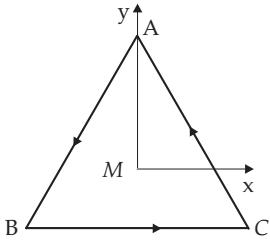
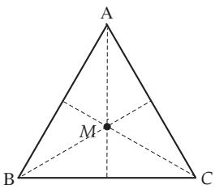
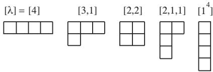

#### 5.3.4 Group Representations

##### 5.3.4.1 Definitions

1. Representation

A representation $D ( G )$ of the group G is a map (homomorphism) of G onto the group of non-singular linear transformations D on an n-dimensional (real or complex) vector space $\mathrm { v } _ { n }$

$$
D ( G ) : a  D ( a ) , \quad a \in G .\tag{5.93}
$$

The vector space $\mathrm { v } _ { n }$ is called the representation space; n is the dimension of the representation (see also 12.1.3, 2., p. 657). Introducing the basis $\{ { \underline { { \mathbf { e } } } } _ { i } \} ~ ( i = 1 , 2 , \dots , n )$ in $\mathrm { V } _ { n }$ every vector x can be written as a linear combination of the basis vectors:

$$
\underline { { \mathbf { x } } } = \sum _ { i = 1 } ^ { n } x _ { i } \underline { { \mathbf { e } } } _ { i } , \quad \underline { { \mathbf { x } } } \in \mathbb { V } _ { n } .\tag{5.94}
$$

The action of the linear transformation $D ( a ) , a \in G$ , on x can be defined by the quadratic matrix ${ \bf D } ( a ) = ( D _ { i k } ( a ) ) ( i , k = 1 , 2 , \ldots , n )$ , which provides the coordinates of the transformed vector $\underline { { \mathbf { x } } } ^ { \prime }$ within the basis $\{ \underline { { \mathbf { e } } } _ { i } \}$

$$
\underline { { \mathbf { x } } } ^ { \prime } = \mathbf { D } ( a ) \underline { { \mathbf { x } } } = \sum _ { i = 1 } ^ { n } x _ { i } ^ { \prime } \underline { { \mathbf { e } } } _ { i } , \qquad x _ { i } ^ { \prime } = \sum _ { k = 1 } ^ { n } D _ { i k } ( a ) x _ { k } .\tag{5.95}
$$

This transformation may also be considered as a transformation of the basis $\{ \underline { { \mathbf { e } } } _ { i } \} \to \{ \underline { { \mathbf { e } } } _ { i } ^ { \prime } \}$ :

$$
\underline { { \mathbf { e } } } _ { i } ^ { \prime } = \underline { { \mathbf { e } } } _ { i } \mathbf { D } ( a ) = \sum _ { k = 1 } ^ { n } D _ { k i } ( a ) \underline { { \mathbf { e } } } _ { k } .\tag{5.96}
$$

Thus, every element a of the group is assigned to the representation matrix $\mathbf { D } = \left( D _ { i k } ( a ) \right)$

$$
D ( G ) : a \to \mathbf { D } = ( D _ { i k } ( a ) ) \quad ( i , k = 1 , 2 , \ldots , n ) , a \in G .\tag{5.97}
$$

The representation matrix depends on the choice of basis.

A: Abelian Point Group $C _ { n }$ . A regular polygon (see 3.1.5, p. 138) with n sides has a symmetry

such that rotating it around an axis, which is perpendicular to the plane of the figure and goes through its center M (Fig.5.9) by an angle $\varphi _ { k } = 2 \pi k / n , k = 0 , 1 , \ldots , n - 1$ the resulted polygon is identical to the original one (invariance of the system under certain rotations). The rotations $R _ { k } ( \dot { \varphi } _ { k } )$ form the Abelian group of points $C _ { n } . \ C _ { n }$ is a cyclic group (see 5.3.3.2, p. 337), i.e. every element of the group can be represented as a power of a single element $R _ { 1 }$ , whose n-th power is the unit element $e = R _ { 0 }$

$$
C _ { n } = \{ e , R _ { 1 } , R _ { 1 } ^ { 2 } , \ldots , R _ { 1 } ^ { n - 1 } \} , R _ { 1 } ^ { n } = e .\tag{5.98a}
$$

Let the center of an equilateral triangle $( n = 3 )$ be the origin (see Fig.5.9), then the angles of rotations and the rotations are in accor-

  
Figure 5.9

dance with (5.98b).

$$
\begin{array} { l } { k = 0 , \varphi _ { 0 } = 0 \mathrm { ~ o r ~ } 2 \pi , } \\ { k = 1 , \varphi _ { 1 } = 2 \pi / 3 , } \\ { k = 2 , \varphi _ { 2 } = 4 \pi / 3 . } \end{array}\tag{5.98b}
$$

$$
R _ { 0 } : A \to A , B \to B , C \to C ,
$$

$$
R _ { 1 } : A \to B , B \to C , C \to A ,
$$

$$
R _ { 2 } : A  C , B  A , C  B .\tag{5.98c}
$$

The rotations (5.98c) satisfy the relations

$$
R _ { 2 } = R _ { 1 } ^ { 2 } , R _ { 1 } \cdot R _ { 2 } = R _ { 1 } ^ { 3 } = R _ { 0 } = e .\tag{5.98d}
$$

They form the cyclic group $C _ { 3 }$

The matrix of rotation (see (3.432), p. 230)

$$
\mathbf { R } ( \varphi ) = { \binom { \cos \varphi - \sin \varphi } { \sin \varphi } } \quad { \cos \varphi } \quad\tag{5.98e}
$$

of a geometric transformation of this triangle (for rotation of this figure in a fixed coordinate system see 3.5.3.3,3., p. 213) gives the representation of group $C _ { 3 }$ if $\varphi$ is substituted by the angles given in (5.98b):

$$
\mathbf { D } ( e ) = \mathbf { R } ( 0 ) = { \binom { 1 } { 0 } } , \ \mathbf { D } ( R _ { 1 } ) = \mathbf { R } ( 2 \pi / 3 ) = { \binom { - 1 / 2 } { { \sqrt { 3 } } / { 2 } } } \ - { \sqrt { 3 } } / 2 \Biggr ) ,\tag{5.98f}
$$

$$
{ \bf D } ( R _ { 2 } ) = { \bf R } ( 4 \pi / 3 ) = \left( \begin{array} { c c } { { - 1 / 2 \sqrt { 3 } / 2 } } \\ { { - \sqrt { 3 } / 2 - 1 / 2 } } \end{array} \right) .\tag{5.98g}
$$

The same relations hold for the matrices of this representation given in (5.98f) and (5.98g) as for the group elements $R _ { k } \ ( 5 . 9 8 \mathrm { d } )$ :

$$
\mathbf D ( R _ { 2 } ) = \mathbf D ( R _ { 1 } R _ { 1 } ) = \mathbf D ( R _ { 1 } ) \mathbf D ( R _ { 1 } ) , \ \mathbf D ( R _ { 1 } ) \mathbf D ( R _ { 2 } ) = \mathbf D ( e ) .\tag{5.98h}
$$

B: Dihedral Group $D _ { 3 }$ . The equilateral triangle is invariant with respect to rotations by angle $\pi$ about its bisectors (see Fig.5.10). These rotations correspond to reflections $S _ { A } , S _ { B } , S _ { C }$ with respect to a plane being perpendicular to the plane of the triangle and containing one of the rotation axes.

$$
S _ { A } : { \mathrm { ~ R o t a t i o n s ~ } } A  A , B  C , C  B ;
$$

$$
S _ { B } : \mathrm { R o t a t i o n s } A  C , B  B , C  A ;
$$

$$
S _ { C } : { \mathrm { ~ R o t a t i o n s ~ } } A  B , B  A , C  C .\tag{5.99a}
$$

For the reflections there is:

$$
\begin{array} { r } { S _ { \sigma } S _ { \sigma } = e \quad ( \sigma = A , B , C ) . } \end{array}\tag{5.99b}
$$

Figure 5.10

The product $S _ { \sigma } S _ { \tau } \ ( \sigma \neq \tau )$ results in one of the rotations $R _ { 1 } , R _ { 2 } , \mathrm { e . g } ,$ using $S _ { A } S _ { B }$ for the triangle $\Delta A \bar { B } C$

$$
S _ { A } S _ { B } ( \Delta A B C ) = S _ { A } ( \Delta C B A ) = \Delta C A B = R _ { 1 } ( \Delta A B C ) ,\tag{5.99c}
$$

consequently $S _ { A } S _ { B } = R _ { 1 }$ . Here $S _ { A } , S _ { B } , S _ { C }$ correspond to the outcomes on Fig.5.10.

The cyclic group $C _ { 3 }$ and the reflections $S _ { A } , S _ { B } , S _ { C }$ together form the dihedral group $D _ { 3 }$ . The reflections do not form a subgroup because of (5.99c). A summary of relations is represented in group-table (5.99d).

Only the signs of the x-coordinates of points $B$ and $C$ are changed at reflection $S _ { A }$ (see Fig.5.9). This coordinate transformation is given by the matrix

$$
R _ { 1 }
$$

$$
R _ { 2 }
$$

$$
\mathbf { D } ( S _ { A } ) = \left( \begin{array} { c c } { - 1 0 } \\ { 0 1 } \end{array} \right) .
$$

$$
S _ { A }
$$

$$
\overline { { { R _ { 1 } ~ R _ { 2 } ~ S _ { A } ~ S _ { B } ~ S _ { C } } } }
$$

$$
R _ { 1 }\tag{5.99d}
$$

$$
R _ { 1 } \ R _ { 2 } \textit { \textbf { e } } \ S _ { C } \ S _ { A } \ S _ { B }
$$

$$
R _ { 2 } | R _ { 2 } { \textbf { \em e } } R _ { 1 } S _ { B } S _ { C } S _ { A }
$$

$$
S _ { A } | S _ { A } \ S _ { B } \ S _ { C } \ e \ R _ { 1 } \ R _ { 2 }
$$

$$
S _ { B } | S _ { B } \ S _ { C } \ S _ { A } \ R _ { 2 } \ e \ R _ { 1 }
$$

$$
S _ { C } { \vert } S _ { C } \ S _ { A } \ S _ { B } \ R _ { 1 } \ R _ { 2 } \ e\tag{5.99e}
$$

The matrices representing reflections $S _ { B }$ and $S _ { C }$ can be found in the group-table (5.99d) and from the matrices of representation in (5.98f) and (5.98g)

$$
\mathbf { D } ( S _ { B } ) = \mathbf { D } ( R _ { 2 } ) \mathbf { D } ( S _ { A } ) = \left( { \sqrt { 3 } } / 2 { \sqrt { 3 } } / 2 \right) { \binom { - 1 } { 0 } } = { \binom { - 1 / 2 { \sqrt { 3 } } / 2 } { { \sqrt { 3 } } / 2 - 1 / 2 } } ,\tag{5.99f}
$$

$$
\mathbf { D } ( S _ { C } ) = \mathbf { D } ( R _ { 1 } ) \mathbf { D } ( S _ { A } ) = { \binom { - 1 / 2 ~ { \sqrt { 3 } } / 2 } { { \sqrt { 3 } } / 2 ~ - 1 / 2 } } { \binom { - 1 ~ 0 } { ~ 0 ~ 1 } } = { \binom { 1 / 2 ~ - { \sqrt { 3 } } / 2 } { - { \sqrt { 3 } } / 2 ~ - 1 / 2 } } .\tag{5.99g}
$$

Matrices (5.98f) and (5.98g) together with matrices (5.99f) and (5.99g) form a representation of the dihedral group $D _ { 3 }$

2. Faithful Representation

A representation is called faithful if $G \to D ( G )$ is an isomorphism, i.e., the assignment of the element of the group to the representation matrix is a one-to-one mapping.

3. Properties of the Representations

A representation with the representation matrices $\mathbf { D } ( a )$ has the following properties $( a , b \in G , \mathbf { I }$ unit matrix):

$$
\mathbf { D } ( a * b ) = \mathbf { D } ( a ) \cdot \mathbf { D } ( b ) , \quad \mathbf { D } ( a ^ { - 1 } ) = \mathbf { D } ^ { - 1 } ( a ) , \quad \mathbf { D } ( e ) = \mathbf { I } .\tag{5.100}
$$

##### 5.3.4.2 Particular Representations

1. Identity Representation

Any group G has a trivial one-dimensional representation (identity representation), for which every element of the group is mapped to the unit matrix I: $a \to \mathbf { I }$ for all $a \in G$

2. Adjoint Representation

The representation $D ^ { + } ( G )$ is called adjoint to $D ( G )$ if the corresponding representation matrices are related by complex conjugation and reflection in the main diagonal:

$$
\mathbf { D } ^ { + } ( G ) = \tilde { \mathbf { D } } ^ { * } ( G ) .\tag{5.101}
$$

3. Unitary Representation

For a unitary representation all representation matrices are unitary matrices:

$$
\mathbf { D } ( G ) \cdot \mathbf { D } ^ { + } ( G ) = \mathbf { I } ,\tag{5.102}
$$

where E is the unit matrix.

4. Equivalent Representations

Two representations $D ( G )$ and $D ^ { \prime } ( G )$ are called equivalent if for each element a of the group the corresponding representation matrices are related by the same similarity transformation with the nonsingular matrix $\mathbf { T } = ( T _ { i , j } )$

$$
\mathbf { D } ^ { \prime } ( a ) = \mathbf { T } ^ { - 1 } \cdot \mathbf { D } ( a ) \cdot \mathbf { T } , \quad D _ { i k } ^ { \prime } ( a ) = \sum _ { j , l = 1 } ^ { n } T _ { i j } ^ { - 1 } \cdot D _ { j l } ( a ) \cdot T _ { l k } ,\tag{5.103}
$$

where $T _ { i , j } ^ { - 1 }$ denotes the elements of the inverse matrix $\mathbf { T } ^ { - 1 }$ of T. If such a relation does not hold two representations are called non-equivalent. The transition from $D ( G )$ to $D ^ { \prime } ( G )$ corresponds to the transformation $T : \{ \mathbf { e } _ { 1 } , \mathbf { e } _ { 2 } , \ldots , \mathbf { e } _ { n } \} \to \{ \mathbf { e } _ { 1 } ^ { \prime } , \mathbf { e } _ { 2 } ^ { \prime } , \ldots , \mathbf { e } _ { n } ^ { \prime } \}$ of the basis in the representation space $\mathrm { V } _ { n }$

$$
\mathbf { e } ^ { \prime } = \mathbf { e } T , \quad \mathbf { e } _ { i } ^ { \prime } = \sum _ { k = 1 } ^ { n } T _ { k i } \mathbf { e } _ { k } \quad ( i = 1 , 2 , \ldots , n ) .\tag{5.104}
$$

Any representation of a finite group is equivalent to a unitary representation.

5. Character of a Group Element

In the representation $D ( G )$ the character $\chi ( a )$ of the group element a is defined as the trace of the representation matrix $\mathbf { D } ( a )$ (sum of the main diagonal elements of the matrix):

$$
\chi ( a ) = \mathrm { T r } \left( \mathbf { D } \right) = \sum _ { i = 1 } ^ { n } D _ { i i } ( a ) .\tag{5.105}
$$

The character of the unit element e is given by the dimension n of the representation: $\chi ( e ) = n$ . Since the trace of a matrix is invariant under similarity transformations, the group element a has the same character for equivalent representations.

Within the shell model of atomic or nuclear physics two out of three particles with space coordinates $\vec { \bf r } _ { i } ~ ( i = 1 , 2 , 3 )$ can be described by the wave function $\varphi _ { \alpha } ( \vec { \bf r } )$ while the third particle has the wave function $\varphi _ { \beta } ( \vec { \bf r } )$ (configuration $\alpha ^ { 2 } \beta ( { \vec { \mathbf { r } } } ) )$ . The wave function ψ of the system is a product of the three oneparticle wave functions: $\psi = \varphi _ { \alpha } \varphi _ { \alpha } \varphi _ { \beta }$ . In accordance with the possible distributions of the particles 1, 2, 3 to the wave functions one gets the three functions

$$
\psi _ { 1 } = \varphi _ { \alpha } ( \vec { \bf r } _ { 1 } ) \varphi _ { \alpha } ( \vec { \bf r } _ { 2 } ) \varphi _ { \beta } ( \vec { \bf r } _ { 3 } ) , \psi _ { 2 } = \varphi _ { \alpha } ( \vec { \bf r } _ { 1 } ) \varphi _ { \beta } ( \vec { \bf r } _ { 2 } ) \varphi _ { \alpha } ( \vec { \bf r } _ { 3 } ) , \psi _ { 3 } = \varphi _ { \beta } ( \vec { \bf r } _ { 1 } ) \varphi _ { \alpha } ( \vec { \bf r } _ { 2 } ) \varphi _ { \alpha } ( \vec { \bf r } _ { 3 } ) ,\tag{5.106a}
$$

which, when realizing permutations, transform among one another according to 5.3.3.1, 2., p. 337. This way one gets for the functions ψ ψ ψ a three dimensional representation of the symmetric group $S _ { 3 }$ According to (5.93) the matrix elements of the representation matrices can be found by investigating the action of the group elements (5.84) on the coordinate subscripts in the basis elements $e _ { i }$ . For example:

$$
p _ { 1 } \psi _ { 1 } = p _ { 1 } \varphi _ { \alpha } ( \vec { \bf r } _ { 1 } ) \varphi _ { \alpha } ( \vec { \bf r } _ { 2 } ) \varphi _ { \beta } ( \vec { \bf r } _ { 3 } ) = \varphi _ { \alpha } ( \vec { \bf r } _ { 1 } ) \varphi _ { \beta } ( \vec { \bf r } _ { 2 } ) \varphi _ { \alpha } ( \vec { \bf r } _ { 3 } ) = D _ { 2 1 } ( p _ { 1 } ) \psi _ { 2 } ,
$$

$$
p _ { 1 } \psi _ { 2 } = p _ { 1 } \varphi _ { \alpha } ( \vec { \bf r } _ { 1 } ) \varphi _ { \beta } ( \vec { \bf r } _ { 2 } ) \varphi _ { \alpha } ( \vec { \bf r } _ { 3 } ) = \varphi _ { \alpha } ( \vec { \bf r } _ { 1 } ) \varphi _ { \alpha } ( \vec { \bf r } _ { 2 } ) \varphi _ { \beta } ( \vec { \bf r } _ { 3 } ) = D _ { 1 2 } ( p _ { 1 } ) \psi _ { 1 } ,
$$

$$
p _ { 1 } \psi _ { 3 } = p _ { 1 } \varphi _ { \beta } ( \vec { \bf r } _ { 1 } ) \varphi _ { \alpha } ( \vec { \bf r } _ { 2 } ) \varphi _ { \alpha } ( \vec { \bf r } _ { 3 } ) = \varphi _ { \beta } ( \vec { \bf r } _ { 1 } ) \varphi _ { \alpha } ( \vec { \bf r } _ { 2 } ) \varphi _ { \alpha } ( \vec { \bf r } _ { 3 } ) = D _ { 3 3 } ( p _ { 1 } ) \psi _ { 3 } .\tag{5.106b}
$$

Altogether one finds:

$$
\begin{array} { r l r l r l } { \mathbf { D } ( e ) } & { { } = \left( { \begin{array} { l l } { 1 } & { 0 } & { 0 } \\ { 0 } & { 1 } & { 0 } \\ { 0 } & { 0 } & { 1 } \end{array} } \right) , } & { \mathbf { D } ( p _ { 1 } ) } & { = \left( { \begin{array} { l l } { 0 } & { 1 } & { 0 } \\ { 1 } & { 0 } & { 0 } \\ { 0 } & { 0 } & { 1 } \end{array} } \right) , } & { \mathbf { D } ( p _ { 2 } ) } & { = \left( { \begin{array} { l l } { 0 } & { 0 } & { 1 } \\ { 0 } & { 1 } & { 0 } \\ { 1 } & { 0 } & { 0 } \end{array} } \right) , } \end{array}\tag{5.106c}
$$

$$
\begin{array} { r l r l r l } { \mathbf { D } ( p _ { 3 } ) } & { = \left( \begin{array} { l l } { 1 } & { 0 } & { 0 } \\ { 0 } & { 0 } & { 1 } \\ { 0 } & { 1 } & { 0 } \end{array} \right) , } & { \mathbf { D } ( p _ { 4 } ) } & { = \left( \begin{array} { l l } { 0 } & { 1 } & { 0 } \\ { 0 } & { 0 } & { 1 } \\ { 1 } & { 0 } & { 0 } \end{array} \right) , } & { \mathbf { D } ( p _ { 5 } ) } & { = \left( \begin{array} { l l } { 0 } & { 0 } & { 1 } \\ { 1 } & { 0 } & { 0 } \\ { 0 } & { 1 } & { 0 } \end{array} \right) . } \end{array}
$$

For the characters one has:

$$
\chi ( e ) = 3 , \ \chi ( p _ { 1 } ) = \chi ( p _ { 2 } ) = \chi ( p _ { 3 } ) = 1 , \ \chi ( p _ { 4 } ) = \chi ( p _ { 5 } ) = 0 .\tag{5.106d}
$$

##### 5.3.4.3 Direct Sum of Representations

The representations $D ^ { ( 1 ) } ( G ) , D ^ { ( 2 ) } ( G )$ of dimension $n _ { 1 }$ and $n _ { 2 }$ can be composed to create a new representation $D ( G )$ of dimension $n = n _ { 1 } + n _ { 2 }$ by forming the direct sum of the representation matrices:

$$
\begin{array} { r } {  { \mathbf { D } } ( a ) =  { \mathbf { D } } ^ { ( 1 ) } ( a ) \oplus  { \mathbf { D } } ^ { ( 2 ) } ( a ) = \left( \begin{array} { c c } {  { \mathbf { D } } ^ { ( 1 ) } ( a ) } & { 0 } \\ {  { \mathbf { 0 } } } & {  { \mathbf { D } } ^ { ( 2 ) } ( a ) } \end{array} \right) . } \end{array}\tag{5.107}
$$

The block-diagonal form of the representation matrix implies that the representation space $\mathrm { V } _ { n }$ is the direct sum of two invariant subspaces $\mathrm { { V } } _ { n _ { 1 } } , \mathrm { { V } } _ { n _ { 2 } }$ :

$$
\mathrm { V } _ { n } = \mathrm { V } _ { n _ { 1 } } \oplus \mathrm { V } _ { n _ { 2 } } , \quad n = n _ { 1 } + n _ { 2 } .\tag{5.108}
$$

A subspace $\mathrm { V } _ { m } \ \left( m < n \right)$ of $\mathrm { v } _ { n }$ is called an invariant subspace if for any linear transformation $D ( a )$ $a \in$ $G ,$ every vector $\underline { { \mathbf { x } } } \in \mathbb { V } _ { m }$ is mapped onto an element of $\mathrm { V } _ { m }$ again:

$$
\underline { { \mathbf { x } } } ^ { \prime } = \mathbf { D } ( a ) \underline { { \mathbf { x } } } \quad \mathrm { w i t h } \quad \underline { { \mathbf { x } } } , \underline { { \mathbf { x } } } ^ { \prime } \in \mathbb { V } _ { m } .\tag{5.109}
$$

The character ofthe representation (5.107) is the sum of the characters of the single representations:

$$
\chi ( a ) = \chi ^ { ( 1 ) } ( a ) + \chi ^ { ( 2 ) } ( a ) .\tag{5.110}
$$

##### 5.3.4.4 Direct Product of Representations

If $\underline { { \mathbf { e } } } _ { i } ~ ( i = 1 , 2 , \dots , n _ { 1 } )$ and $\underline { { \mathbf { e } } } _ { k } ^ { \prime } \ ( k = 1 , 2 , \ldots , n _ { 2 } )$ are the basis vectors of the representation spaces $\mathrm { V } _ { n _ { 1 } }$ and $\mathbb { V } _ { n _ { 2 } }$ , respectively, then the tensor product

$$
\underline { { \mathbf { e } } } _ { i k } = \{ \underline { { \mathbf { e } } } _ { i } \underline { { \mathbf { e } } } _ { k } \} \quad ( i = 1 , 2 , \ldots , n _ { 1 } ; \ k = 1 , 2 , \ldots , n _ { 2 } )\tag{5.111}
$$

forms a basis in the product space $\mathrm { V } _ { n _ { 1 } } \otimes \mathrm { V } _ { n _ { 2 } }$ of dimension $n _ { 1 } \cdot n _ { 2 }$ . With the representations $D ^ { ( 1 ) } ( G )$ and $D ^ { ( 2 ) } ( G )$ in $\mathbb { V } _ { n _ { 1 } }$ and $\mathbb { V } _ { n _ { 2 } }$ , respectively an n1 n2-dimensional representation $D ( G )$ in the product space can be constructed by forming the direct or (inner) Kronecker product (see 4.1.5,9., p. 276) of the representation matrices:

$$
\begin{array} { r l } & { \mathbf { D } ( G ) = \mathbf { D } ^ { ( 1 ) } ( G ) \otimes \mathbf { D } ^ { ( 2 ) } ( G ) , \quad ( D ( G ) ) _ { i k , j l } = D _ { i k } ^ { ( 1 ) } ( a ) \cdot D _ { j l } ^ { ( 2 ) } ( a ) } \\ & { \mathrm { ~ w i t h } \quad i , k = 1 , 2 , \ldots , n _ { 1 } ; \ j , l = 1 , 2 , \ldots , n _ { 2 } . } \end{array}\tag{5.112}
$$

The character of the Kronecker product of two representations is equal to the product of the characters of the factors

$$
\chi ^ { ( 1 \times 2 ) } ( a ) = \chi ^ { ( 1 ) } ( a ) \cdot \chi ^ { ( 2 ) } ( a ) .\tag{5.113}
$$

##### 5.3.4.5 Reducible and Irreducible Representations

If the representation space $\mathrm { V } _ { n }$ possesses a subspace $\mathrm { V } _ { m } \quad ( m < n )$ invariant under the group operations the representation matrices can be decomposed according to

$$
\mathbf { T } ^ { - 1 } \cdot \mathbf { D } ( a ) \cdot \mathbf { T } = { \left( \begin{array} { l l } { \mathbf { D } _ { 1 } ( a ) } & { \mathbf { A } } \\ { \mathbf { 0 } } & { \mathbf { D } _ { 2 } ( a ) } \end{array} \right) } { \left\{ \begin{array} { l l } { m } & { \mathrm { r o w s } } \\ { n - m \ \mathrm { r o w s } } \end{array} \right. }\tag{5.114}
$$

by a suitable transformation T of the basis in $\mathrm { V } _ { n } . \mathrm { D } _ { 1 } ( a )$ and $\mathbf { D } _ { 2 } ( a )$ themselves are matrix representations of $a \in G$ of dimension m and $n - m$ , respectively.

A representation $D ( G )$ is called irreducible if there is no proper (non-trivial) invariant subspace in $\mathrm { { V } } _ { n } .$ The number of non-equivalent irreducible representations of a finite group is finite. If a transformation T of a basis can be found which makes $\mathrm { V } _ { n }$ to a direct sum of invariant subspaces, i.e.,

$$
\mathrm { V } _ { n } = \mathrm { V } _ { 1 } \oplus \cdots \oplus \mathrm { V } _ { n _ { j } } ,\tag{5.115}
$$

then for every $a \in G$ the representation matrix $\mathbf { D } ( a )$ can be transformed into the block-diagonal form $( \mathbf { A } = \mathbf { 0 }$ in (5.114)):

$$
\mathbf { T } ^ { - 1 } \cdot \mathbf { D } ( a ) \cdot \mathbf { T } = \mathbf { D } ^ { ( 1 ) } ( a ) \oplus \cdots \oplus \mathbf { D } ^ { ( n _ { j } ) } ( a ) = \left( { \begin{array} { c c } { \mathbf { D } ^ { ( 1 ) } ( a ) } & { 0 } \\ { \ddots } & { \mathbf { 0 } } \\ { 0 } & { \mathbf { D } ^ { ( n _ { j } ) } ( a ) } \end{array} } \right) .\tag{5.116}
$$

by a similarity transformation with T. Such a representation is called completely reducible.

Remark: For the application of group theory in natural sciences a fundamental task consists in the classification of all non-equivalent irreducible representations of a given group.

The representation of the symmetric group $S _ { 3 }$ given in (5.106c), p. 343, is reducible. For example, in the basis transformation $\{ { \underline { { \mathbf { e } } } } _ { 1 } , { \underline { { \mathbf { e } } } } _ { 2 } , { \underline { { \mathbf { e } } } } _ { 3 } \} \longrightarrow \{ { \underline { { \mathbf { e } } } } _ { 1 } ^ { \prime } = { \underline { { \mathbf { e } } } } _ { 1 } + { \underline { { \mathbf { e } } } } _ { 2 } + { \underline { { \mathbf { e } } } } _ { 3 } , \ { \underline { { \mathbf { e } } } } _ { 2 } ^ { \prime } = { \underline { { \mathbf { e } } } } _ { 2 } , \ { \underline { { \mathbf { e } } } } _ { 3 } ^ { \prime } = { \underline { { \mathbf { e } } } } _ { 3 } \}$ one obtains for the representation matrix of the permutation p (with $\psi _ { 1 } = \underline { { \mathbf { e } } } _ { 1 } , \psi _ { 2 } = \underline { { \mathbf { e } } } _ { 2 } , \psi _ { 3 } = \underline { { \mathbf { e } } } _ { 3 } )$

$$
\mathbf { D } ( p _ { 3 } ) = { \binom { 1 0 0 } { 0 0 1 } } = { \binom { \mathbf { D _ { 1 } } ( p _ { 3 } ) } { \mathbf { A } } } \mathbf { D _ { 2 } } ( p _ { 3 } ) \mathbf { \ }\tag{5.117}
$$

with $\mathbf { A } = { \binom { 0 } { 0 } } , \ \mathbf { D _ { 1 } } ( p _ { 3 } ) = 1$ as the identity representation of $S _ { 3 }$ and $\mathbf { D } _ { 2 } ( p _ { 3 } ) = { \binom { 0 ~ 1 } { 1 ~ 0 } }$

##### 5.3.4.6 Schur’s Lemma 1

If C is an operator commuting with all transformations of an irreducible representation D of a group $[ \mathbf { C } , \mathbf { D } ( a ) ] { \stackrel { . } { = } } \mathbf { C } \cdot \mathbf { D } ( a ) - \mathbf { D } ( a ) \cdot \mathbf { \tilde { C } } = 0 , a \in G$ , and the representation space $\bar { \mathsf { V } } _ { n }$ is an invariant subspace of C, then C is a multiple of the unit operator, i.e., a matrix $\left( c _ { i k } \right)$ which commutates with all matrices of an irreducible representation is a multiple of the matrix I, $\mathbf { C } = \lambda \cdot \mathbf { I } , \lambda \in \mathbb { C } .$

##### 5.3.4.7 Clebsch-Gordan Series

In general, the Kronecker product of two irreducible representations ${ \bf D } ^ { ( 1 ) } ( G ) , { \bf D } ^ { ( 2 ) } ( G )$ is reducible. By a suitable basis transformation in the product space ${ \bf D } ^ { ( 1 ) } ( G ) \otimes { \bf D } ^ { ( 2 ) } ( G )$ can be decomposed into the direct sum of its irreducible parts $\mathbf { D } ^ { ( \alpha ) } \ ( \alpha = 1 , 2 , \ldots , n )$ (Clebsch–Gordan theorem). This expansion is called the Clebsch–Gordan series:

$$
\mathbf { D } ^ { ( 1 ) } ( G ) \otimes \mathbf { D } ^ { ( 2 ) } ( a ) = \sum _ { \alpha = 1 } ^ { n } \oplus m _ { \alpha } \mathbf { D } ^ { ( \alpha ) } ( G ) .\tag{5.118}
$$

Here, $m _ { \alpha }$ is the multiplicity with which the irreducible representation $\mathbf { D } ^ { ( \alpha ) } ( G )$ occurs in the Clebsch– Gordan series.

The matrix elements of the basis transformation in the product space causing the reduction of the Kronecker product into its irreducible components are called Clebsch–Gordan coeficients.

##### 5.3.4.8 Irreducible Representations of the Symmetric Group

1. Symmetric Group $S _ { M }$

The non-equivalent irreducible representations of the symmetric group $S _ { M }$ are characterized uniquely by the partitions of M, i.e., by the splitting of M into integers according to

$$
[ \lambda ] = [ \lambda _ { 1 } , \lambda _ { 2 } , \ldots , \lambda _ { M } ] , \quad \lambda _ { 1 } + \lambda _ { 2 } + \cdots + \lambda _ { M } = M , \quad \lambda _ { 1 } \geq \lambda _ { 2 } \geq \cdots \geq \lambda _ { M } \geq 0 .\tag{5.119}
$$

The graphic representation of the partitions is done by arranging boxes in Young diagrams.

For the group $S _ { 4 }$ one obtains five Young diagrams

as shown in the figure.

The dimension of the representation [λ] is given by

$$
n ^ { [ \lambda ] } = M ! \frac { \underset { i < j \leq k } { \prod } ( \lambda _ { i } - \lambda _ { j } + j - i ) } { \underset { i = 1 } { \overset { k } { \prod } } ( \lambda _ { i } + k - i ) ! } .\tag{5.120}
$$

The Young diagram [λ˜] conjugated to [λ] is constructed by the interchange of rows and columns. In general, the irreducible representation of $S _ { M }$ is reducible if one restricts to one of the subgroups $S _ { M - 1 } , S _ { M - 2 } , \cdot \cdot \cdot$

In quantum mechanics for a system of identical particles the Pauli principle demands the construction of many-body wave functions that are antisymmetric with respect to the interchange of all coordinates of two arbitrary particles. Often, the wave function is given as the product of a function in space coordinates and a function in spin variables. If for such a case due to particle permutations the spatial part of the wave function transforms according to the irreducible representation [λ] of the symmetric group, then it has to be combined with a spin function transforming according to [λ˜] in order to get a total wave function which is antisymmetric if two particles are interchanged.
