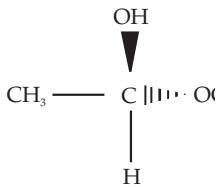
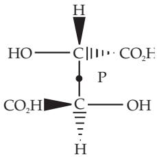
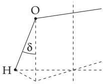
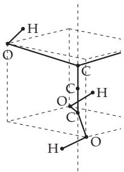
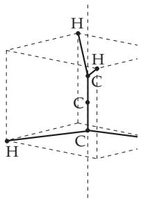
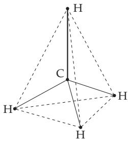
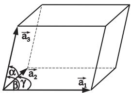

#### 5.3.5 Applications of Groups

In chemistry and in physics, groups are applied to describe the “symmetry” of the corresponding objects. Such objects are, for instance, molecules, crystals, solid structures or quantum mechanical

systems. The basic idea of these applications is the von Neumann principle:

If a system has a certain group of symmetry operations, then every physical observational quantity of this system must have the same symmetry.

##### 5.3.5.1 Symmetry Operations, Symmetry Elements

A symmetry operation s of a space object is a mapping of the space into itself such that the length of line segments remains unchanged and the object goes into a covering position to itself. The set of fixed points of the symmetry operation s is denoted by Fix s, i.e., the set of all points of space which remain unchanged for s. The set Fix s is called the symmetry element of s. The Schoenflies symbolism is used to denote the symmetry operation.

Two types of symmetry operations are distinguished: Operations without a fixed point and operations with at least one fixed point.

1. Symmetry Operations without a Fixed Point, for which no point of the space stays unchanged, cannot occur for bounded space objects, but now only such objects are considered. A symmetry operation without a fixed point is for instance a parallel translation.

2. Symmetry Operations with at least One Fixed Point are for instance rotations and reflections. The following operations belong to them.

a) Rotations Around an Axis by an Angle $\varphi :$ The axis of rotation and also the rotation itself is denoted by $C _ { n }$ for $\varphi = 2 \pi / n$ . The axis of rotation is then called of n-th order.

b) Reflection with Respect to a Plane: Both the plane of reflection and the reflection itself are denoted by σ. If additionally there is a principal rotation axis, then one draws it perpendicularly and denote the planes of reflections which are perpendicular to this axis by $\sigma _ { h }$ (h from horizontal) and the planes of reflections passing through the rotational axis are denoted by $\sigma _ { v }$ (v from vertical) or $\sigma _ { d }$ (d means dihedral, if certain angles are halved).

c) Improper Orthogonal Mappings: An operation such that after a rotation $C _ { n }$ a reflection $\sigma _ { h }$ follows, is called an improper orthogonal mapping and it is denoted by $S _ { n }$ . Rotation and reflection commute. The axis of rotation is then called an improper rotational axis of n-th order and it is also denoted by $S _ { n }$ . This axis is called the corresponding symmetry element, although only the symmetry center stays fixed under the application of the operation $S _ { n }$ . For $n = 2$ , an improper orthogonal mapping is also called a point reflection or inversion (see 4.3.5.1, p. 287) and it is denoted by i.

##### 5.3.5.2 Symmetry Groups or Point Groups

For every symmetry operation S, there is an inverse operation $S ^ { - 1 }$ , which reverses $S$ “back”, i.e.,

$$
S S ^ { - 1 } = S ^ { - 1 } S = \epsilon .\tag{5.121}
$$

Here  denotes the identity operation, which leaves the whole space unchanged. The family of symmetry operations of a space object forms a group with respect to the successive application, which is in general a non-commutative symmetry group of the objects. The following relations hold:

a) Every rotation is the product of two reflections. The intersection line of the two reflection planes is the rotation axis.

b) For two reflections σ and $\sigma ^ { \prime }$

$$
\boldsymbol { \sigma } \boldsymbol { \sigma } ^ { \prime } = \boldsymbol { \sigma } ^ { \prime } \boldsymbol { \sigma }\tag{5.122}
$$

if and only if the corresponding reflection planes are identical or they are perpendicular to each other. In the first case the product is the identity , in the second one the rotation $C _ { 2 }$

c) The product of two rotations with intersecting rotational axes is again a rotation whose axis goes through the intersection point of the given rotational axes.

d) For two rotations $C _ { 2 }$ and $C _ { 2 } ^ { \prime }$ around the same axis or around axes perpendicular to each other:

$$
C _ { 2 } C _ { 2 } ^ { \prime } = C _ { 2 } ^ { \prime } C _ { 2 } .\tag{5.123}
$$

The product is again a rotation. In the first case the corresponding rotational axis is the given one, in the second one the rotational axis is perpendicular to the given ones.

##### 5.3.5.3 Symmetry Operations with Molecules

It requires a lot of work to recognize every symmetry element of an object. In the literature, for instance in [5.10], [5.13], it is discussed in detail how to find the symmetry groups of molecules if all the symmetry elements are known. The following notation is used for the interpretation of a molecule in space: The symbols above C in Fig. 5.11 mean that the OH group lies above the plane of the drawing, the symbol to the right-hand side of C means that the group $\mathrm { \bar { O } C _ { 2 } \bar { H } _ { 5 } }$ is under C.

The determination of the symmetry group can be made by the following method.

1. No Rotational Axis

a) If no symmetry element exists, then $G = \{ \epsilon \}$ holds, i.e., the molecule does not have any symmetry operation but the identity .

The molecule hemiacetal (Fig.5.11) is not planar and it has four diferent atom groups.

b) If σ is a reflection or i is an inversion, then $G = \{ \epsilon , \sigma \} = : C _ { s } \mathrm { o r } G = \{ \epsilon , i \} = C _ { i }$ hold, and with this it is isomorphic to $Z _ { 2 }$

The molecule of tartaric acid (Fig.5.12) can be reflected in the center P (inversion).

  
Figure 5.11

  
Figure 5.12

  
Figure 5.13

2. There is Exactly One Rotational Axis C

a) If the rotation can have any angle, i.e., $C = C _ { \infty }$ , then the molecule is linear, and the symmetry group is infinite.

A: For the molecule of sodium chloride (common salt) NaCl there is no horizontal reflection. The corresponding symmetry group of all the rotations around C is denoted by $C _ { \infty v }$

B: The molecule $\mathrm { O _ { 2 } }$ has one horizontal reflection. The corresponding symmetry group is generated by the rotations and by this reflection, and it is denoted by $D _ { \infty h }$

b) The rotation axis is of n-th order, $C = C _ { n }$ , but it is not an improper rotational axis of order 2n.

If there is no further symmetry element, then G is generated by a rotation d by an angle $\pi / n$ around $C _ { n } , { \mathrm { i . e . , } } G = < d > \cong Z _ { n }$ . In this case G is also denoted by $C _ { n }$

If there is a further vertical reflection $\sigma _ { v }$ , then $G = < d , \sigma _ { v } > \cong D _ { n }$ holds (see 5.3.3.1, p. 336), and G is denoted by $C _ { n v }$

If there exists an additional horizontal reflection $\sigma _ { h }$ , then $G = < d , \sigma _ { v } > \cong Z _ { n } \times Z _ { 2 }$ holds. G is denoted by $C _ { n h }$ and it is cyclic for odd n (see 5.3.3.2, p. 337).

A: For hydrogen peroxide (Fig.5.13) these three cases occur in the order given above for $0 < \delta <$ $\pi / 2 , \delta = 0$ and $\delta \stackrel { } { = } \pi / 2$

B: The molecule of water $\mathrm { H _ { 2 } O }$ has a rotational axis of second order and a vertical plane of reflection, as symmetry elements. Consequently, the symmetry group of water is isomorphic to the group $D _ { 2 }$ which is isomorphic to the Klein four-group $\dot { V } _ { 4 }$ (see 5.3.3.2, 3., p. 338).

c) The rotational axis is of order n and at the same time it is also an improper rotational axis of order

2n. We have to distinguish two cases.

α) There is no further vertical reflection, so $G \cong Z _ { 2 n }$ holds, and G is denoted also by $S _ { 2 n }$

An example is the molecule of tetrahydroxy allene with formula $\mathrm { C _ { 3 } ( O H ) _ { 4 } \ ( F i g . 5 . 1 4 ) }$

β) If there is a vertical reflection, then G is a group of order 4n, which is denoted by $D _ { 2 n }$

■ $n = 2$ gives $G \cong D _ { 4 }$ , i.e., the dihedral group of order eight. An example is the allene molecule (Fig.5.15).

  
Figure 5.14

  
Figure 5.15

  
Figure 5.16

3. Several Rotational Axes If there are several rotational axes, then one has to distinguish further cases. In particular, if several rotational axes have an order $n \geq 3$ , then the following groups are the corresponding symmetry groups.

a) Tetrahedral group $\mathbf { \nabla } T _ { d } \mathbf { : }$ Isomorphic to $S _ { 4 }$ , ord $T _ { d } = 2 4$

b) Octahedral group $O _ { h }$ : Isomorphic to $S _ { 4 } \times Z _ { 2 }$ , ord $O _ { h } = 4 8$

c) Icosahedral group $I _ { h } { \mathrm { : } }$ : ord $I _ { h } = 1 2 0$

These groups are the symmetry groups of the regular polyhedron discussed in 3.3.3, Table 3.7, p. 155, (Fig.3.63).

The methane molecule (Fig.5.16) has the tetrahedral group $T _ { d }$ as a symmetry group.

##### 5.3.5.4 Symmetry Groups in Crystallography

  
Figure 5.17

1. Lattice Structures

In crystallography the parallelepiped represents, independently of the arrangement of specific atoms or ions, the elementary (unit) cell of the crystal lattice. It is determined by three non-coplanar basis vectors $\vec { \bf a } _ { i }$ starting from one lattice point (Fig. 5.17). The infinite geometric lattice structure is created by performing all primitive translations $\vec { \bf t } _ { n }$

$$
\vec { \bf t _ { n } } = n _ { 1 } \vec { \bf a } _ { 1 } + n _ { 2 } \vec { \bf a } _ { 2 } + n _ { 3 } \vec { \bf a } _ { 3 } , n = ( n _ { 1 } , n _ { 2 } , n _ { 3 } ) n _ { i } \in { \mathbb Z } .\tag{5.124}
$$

Here, the coeficients $n _ { i } ~ ( i = 1 , 2 , . . . )$ are integers.

All the translations $\vec { \bf t } _ { n }$ fixing the space points of the lattice $L = \{ \vec { \bf t } _ { n } \}$ in terms of lattice vectors form the translation group T with the group element $T ( { \vec { \bf t } _ { n } } )$ , the inverse element $T ^ { - 1 } ( \vec { \bf t _ { n } } ) = T ( - \vec { \bf t _ { n } } )$ , and the composition law $T ( \vec { \mathbf { t _ { n } } } ) * T ( \vec { \mathbf { t _ { m } } } ) = T ( \vec { \mathbf { t _ { n } } } + \vec { \mathbf { t _ { m } } } )$ . The application of the group element $T ( \mathbf { t _ { n } ^ {  } } )$ to the position vector r is described by:

$$
T ( \vec { \mathbf { t } _ { \mathbf { n } } } ) \vec { \mathbf { r } } = \vec { \mathbf { r } } + \vec { \mathbf { t _ { n } } } .\tag{5.125}
$$

2. Bravais Lattices

Taking into account the possible combinations of the relative lengths of the basis vectors $\vec { \bf a _ { i } }$ and the pairwise related angles between them (particularly angles $9 0 ^ { \circ }$ and 120◦) one obtains seven diferent types of elementary cells with the corresponding lattices, the Bravais lattices (see Fig. 5.17, and Table 5.4). This classification can be extended by seven non-primitive elementary cells and their corresponding lattices by adding additional lattice points at the intersection points of the face or body diagonals, preserving the symmetry of the elementary cell. In this way one may distinguish one-side face-centered lattices, body-centered lattices, and all-face centered lattices.

Tabelle 5.4 Primitive Bravais lattice
<table><tr><td>Elementary cell</td><td>Relative lengths of basis vectors</td><td>Angles between basis vectors</td></tr><tr><td>triclinic</td><td> $a _ { 1 } \neq a _ { 2 } \neq a _ { 3 }$ </td><td> $\alpha \neq \beta \neq \gamma \neq 9 0 ^ { \circ }$ </td></tr><tr><td>monoclinic</td><td> $a _ { 1 } \neq a _ { 2 } \neq a _ { 3 }$ </td><td> $\alpha = \gamma = 9 0 ^ { \circ } \neq \beta$ </td></tr><tr><td>rhombic</td><td> $a _ { 1 } \neq a _ { 2 } \neq a _ { 3 }$ </td><td> $\alpha = \beta = \gamma = 9 0 ^ { \circ }$ </td></tr><tr><td>trigonal</td><td> $a _ { 1 } = a _ { 2 } = a _ { 3 }$ </td><td> $\alpha = \beta = \gamma < 1 2 0 ^ { \circ } ( \neq 9 0 ^ { \circ } )$ </td></tr><tr><td>hexagonal</td><td> $a _ { 1 } = a _ { 2 } \neq a _ { 3 }$ </td><td> $\alpha = \beta = 9 0 ^ { \circ } , \gamma = 1 2 0 ^ { \circ }$ </td></tr><tr><td>tetragonal</td><td> $a _ { 1 } = a _ { 2 } \neq a _ { 3 }$ </td><td> $\alpha = \beta = \gamma = 9 0 ^ { \circ }$ </td></tr><tr><td>cubic</td><td> $a _ { 1 } = a _ { 2 } = a _ { 3 }$ </td><td> $\alpha = \beta = \gamma = 9 0 ^ { \circ }$ </td></tr></table>

3. Symmetry Operations in Crystal Lattice Structures

Among the symmetry operations transforming the space lattice to equivalent positions there are point group operations such as certain rotations, improper rotations, and reflections in planes or points. But not all point groups are also crystallographic point groups. The requirement that the application of a group element to a lattice vector $\vec { \mathbf { t _ { n } } }$ leads to a lattice vector $\mathbf { t } _ { \mathbf { n } } ^ { \vec { \prime } } \in L$ (L is the set of all lattice points) again restricts the allowed point groups P with the group elements ${ \dot { P ( R ) } }$ according to:

$$
P = \{ R : R \mathbf { \vec { t _ { n } } } \in L \} , \quad \vec { \mathbf { t _ { n } } } \in L .\tag{5.126}
$$

Here, R denotes a proper $( R \in \ S O ( 3 ) )$ or improper rotation operator $( R ~ = ~ I R ^ { \prime } ~ \in ~ O ( 3 ) , R ^ { \prime } ~ \in$ $S O ( 3 )$ , I is the inversion operator with $I { \vec { \mathbf { r } } } = - { \hat { \vec { \mathbf { r } } } } $ r is a position vector). For example, only n-fold rotation axes with $n = 1 , 2 , 3 ,$ , 4 or 6 are compatible with a lattice structure. Altogether, there are 32 crystallographic point groups P.

The symmetry group of a space lattice may also contain operators representing simultaneous applications of rotations and primitive translations. In this way one gets gliding reflections, i.e., reflections in a plane and translations parallel to the plane, and screws, i.e., rotations through $2 \pi / n$ and translations by $m \vec { \bf a } / n \ ( m = 1 , 2 , \ldots , n - 1$ , a are basis translations). Such operations are called non-primitive translations $\vec { \mathbf { V } } ( R )$ , because they correspond to “fractional” translations. For a gliding reflection R is a reflection and for a screw R is a proper rotation.

The elements of the space group $G ,$ for which the crystal lattice is invariant are composed of elements P of the crystallographic point group P, primitive translations $T ( \mathbf { t _ { n } ^ {  } } )$ and non-primitive translations $\vec { \mathbf { V } } ( R )$

$$
G = \{ \{ R | \vec { \bf V } ( R ) + \vec { \bf t _ { n } } : R \in P , \quad \vec { \bf t _ { n } } \in L \} \} .\tag{5.127}
$$

The unit element of the space group is $\{ e | 0 \}$ where e is the unit element of R. The element $\{ e | \mathbf { \vec { t } _ { n } } \}$ means a primitive translation, $\{ R | 0 \}$ represents a rotation or reflection. Applying the group element

$\{ R \vert \vec { \bf t } _ { n } \}$ to the position vector $\vec { \bf r }$ one obtains:

$$
\{ R | \vec { \mathbf { t _ { n } } } \} \vec { \mathbf { r } } = R \vec { \mathbf { r } } + \vec { \mathbf { t _ { n } } } .\tag{5.128}
$$

4. Crystal Systems (Holohedry)

From the 14 Bravais lattices, $L = \{ \mathbf { t _ { n } ^ {  } } \}$ , the 32 crystallographic point groups $P = \{ R \}$ and the allowed non-primitive translations $\vec { \mathbf { V } } ( R )$ one can construct 230 space groups $G = \{ R | \vec { \bf V } ( R ) + \vec { \bf t _ { n } } \}$ . The point groups correspond to 32 crystallographic classes. Among the point groups there are seven groups that are not a subgroup of another point group but contain further point groups as a subgroup. Each of these seven point groups form a crystal system (holohedry). The symmetry of the seven crystal systems is reflected in the symmetry of the seven Bravais lattices. The relation of the 32 crystallographic classes to the seven crystal systems is given in Table 5.5 using the notation of Schoenflies.

Remark: The space group G (5.127) is the symmetry group of the “empty” lattice. The real crystal is obtained by arranging certain atoms or ions at the lattice sites. The arrangement of these crystal constituents exhibits its own symmetry. Therefore, the symmetry group $G _ { 0 }$ of the real crystal possesses a lower symmetry than $G \ ( G \supset G _ { 0 } )$ , in general.

Table 5.5 Bravais lattice, crystal systems, and crystallographic classes  
Notation: $C _ { n }$ – rotation about an n-fold rotation axis, $D _ { n }$ – dihedral group, $T _ { n }$ – tetrahedral group, $O _ { n }$ – octahedral group, $S _ { n }$ – mirror rotations with an n-fold axis.
<table><tr><td>Lattice type</td><td>Crystal system (holohedry)</td><td>Crystallographic class</td></tr><tr><td>triclinic</td><td> $C _ { i }$ </td><td> $C _ { 1 } , C _ { i }$ </td></tr><tr><td>monoclinic</td><td> $C _ { 2 h }$ </td><td> $C _ { 2 } , C _ { h } , C _ { 2 h }$ </td></tr><tr><td>rhombic</td><td> $D _ { 2 h }$ </td><td> $C _ { 2 v } , D _ { 2 } , D _ { 2 h }$ </td></tr><tr><td>tetragonal</td><td> $D _ { 4 h }$ </td><td> $C _ { 4 } , S _ { 4 } , C _ { 4 h } , D _ { 4 } , C _ { 4 v } , D _ { 2 d } , D _ { 4 h }$ </td></tr><tr><td>hexagonal</td><td> $D _ { 6 h }$ </td><td> $C _ { 6 } , C _ { 3 h } , C _ { 6 h } , D _ { 6 } , C _ { 6 v } , D _ { 3 h } , D _ { 6 h }$ </td></tr><tr><td>trigonal</td><td> $D _ { 3 d }$ </td><td> $C _ { 3 } , S _ { 6 } , D _ { 3 } , C _ { 3 v } , D _ { 3 d }$ </td></tr><tr><td>cubic</td><td> $O _ { h }$ </td><td> $T , T _ { h } , T _ { d } , O , O _ { h }$ </td></tr></table>

##### 5.3.5.5 Symmetry Groups in Quantum Mechanics

Linear coordinate transformations that leave the Hamiltonian $\hat { H }$ of a quantum mechanical system (see 9.2.4, 2., p. 593) invariant represent a symmetry group $G ,$ whose elements $g$ commute with $\hat { H }$

$$
[ g , \hat { H } ] = g \hat { H } - \hat { H } g = 0 , \quad g \in G .\tag{5.129}
$$

The commutation property of $g$ and $\hat { H }$ implies that in the application of the product of the operators $g$ and $\hat { H }$ to a state $\varphi$ the sequence of the action of the operators is arbitrary:

$$
g ( { \hat { H } } \varphi ) = { \hat { H } } ( g \varphi ) .\tag{5.130}
$$

Hence, one has: If $\varphi _ { E \alpha } ~ ( \alpha = 1 , 2 , \dots , n )$ are the eigenstates of $\hat { H }$ with energy eigenvalue E of degeneracy n, i.e.,

$$
\hat { H } \varphi _ { E \alpha } = E \varphi _ { E \alpha } \quad ( \alpha = 1 , 2 , \ldots , n ) ,\tag{5.131}
$$

$$
g \hat { H } \varphi _ { E \alpha } = \hat { H } g \varphi _ { E \alpha } = E g \varphi _ { E \alpha } .
$$

then the transformed states $g \varphi _ { E \alpha }$ are also eigenstates belonging to the same eigenvalue $E { : }$

(5.132)

The transformed states $g \varphi _ { E \alpha }$ can be written as a linear combination of the eigenstates $\varphi _ { E \alpha }$

$$
g \varphi _ { E \alpha } = \sum _ { \beta = 1 } ^ { n } D _ { \beta \alpha } ( g ) \varphi _ { E \beta } .\tag{5.133}
$$

Hence, the eigenstates $\varphi _ { E \alpha }$ form the basis of an n-dimensional representation space for the representation $D ( G )$ of the symmetry group G of the Hamiltonian $\hat { H }$ with the representation matrices $\left( D _ { \alpha \beta } ( g ) \right)$ This representation is irreducible if there are no “hidden” symmetries. One can state that the energy eigenstates of a quantum mechanical system can be labeled by the signatures of the irreducible representations of the symmetry group of the Hamiltonian.

Thus, the representation theory of groups allows for qualitative statements on such patterns of the energy spectrum of a quantum mechanical system which are established by the outer or inner symmetries of the system only. Also the splitting of degenerate energy levels under the influence of a perturbation which breaks the symmetry or the selection rules for the matrix elements of transitions between energy eigenstates follows from the investigation of representations according to which the participating states and operators transform under group operations.

The application of group theory in quantum mechanics is presented extensively in the literature (see, e.g., [5.6], [5.7], [5.8], [5.10], [5.11]).

##### 5.3.5.6 Further Applications of Group Theory in Physics

Further examples of the application of particular continuous groups in physics can only be mentioned here (see, e.g., [5.6], [5.10]).

U(1): Gauge transformations in electrodynamics.

SU(2): Spin and isospin multiplets in particle physics.

SU(3): Classification of the baryons and mesons in particle physics. Many-body problem in nuclear physics.

SO(3): Angular momentum algebra in quantum mechanics. Atomic and nuclear many-body problems.

SO(4): Degeneracy of the hydrogen spectrum.

SU(4): Wigner super-multiplets in the nuclear shell model due to the unification of spin and isospin degrees of freedom. Description of flavor multiplets in the quark model including the charm degree of freedom.

SU(6): Multiplets in the quark model due to the combination of flavor and spin degrees of freedom.   
Nuclear structure models.

$U ( n )$ : Shell models in atomic and nuclear physics.

$S U ( n ) , S O ( n )$ : Many-body problems in nuclear physics.

$S U ( 2 ) \otimes U ( 1 )$ : Standard model of the electro weak interaction.

$S U ( 5 ) \supset S U ( 3 ) \otimes S U ( 2 ) \otimes U ( 1 )$ : Unification of fundamental interactions (GUT).

Remark: The groups $S U ( n )$ and $S O ( n )$ are Lie groups, i.e. continuous groups (see, 5.3.6, p. 351 and e.g., [5.6]).
